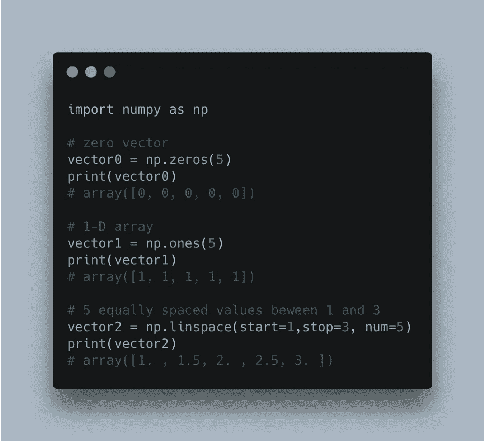
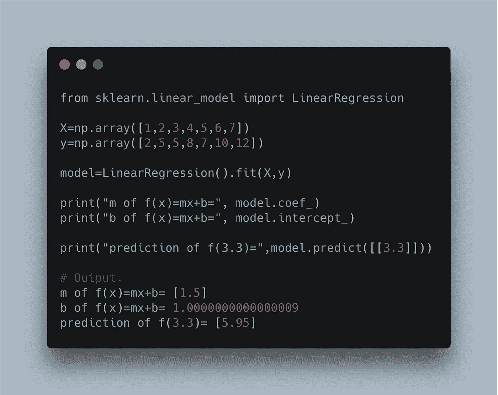
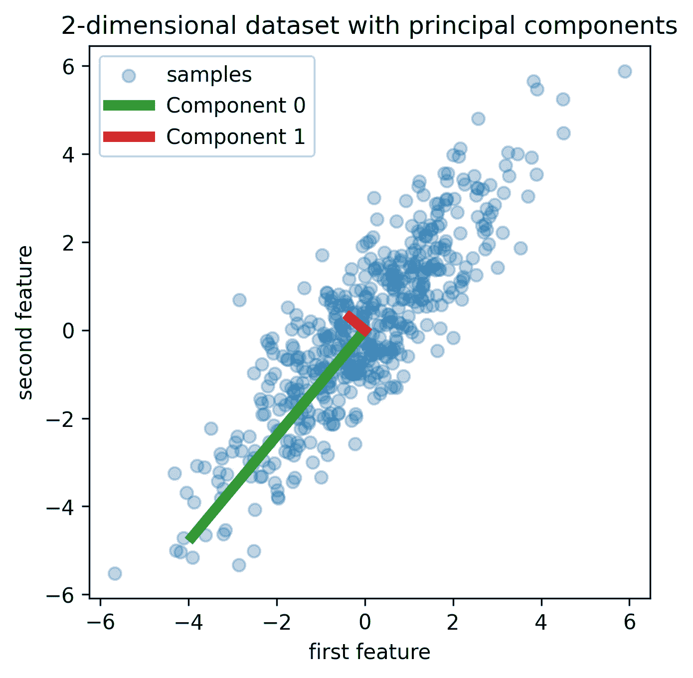
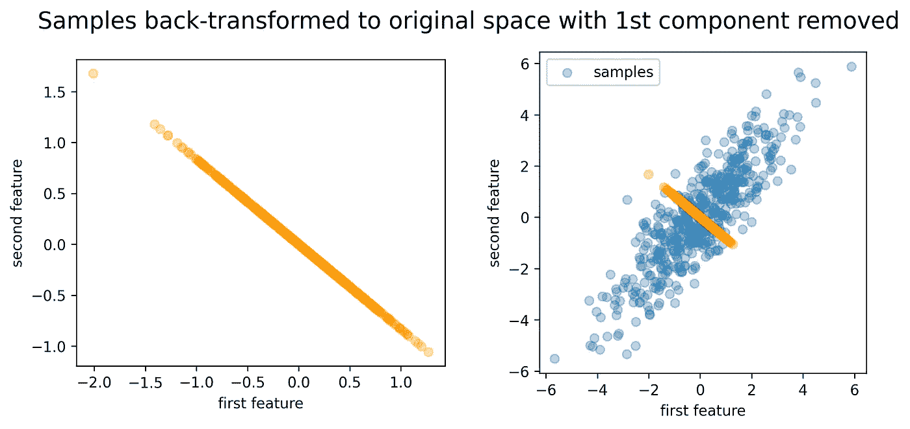
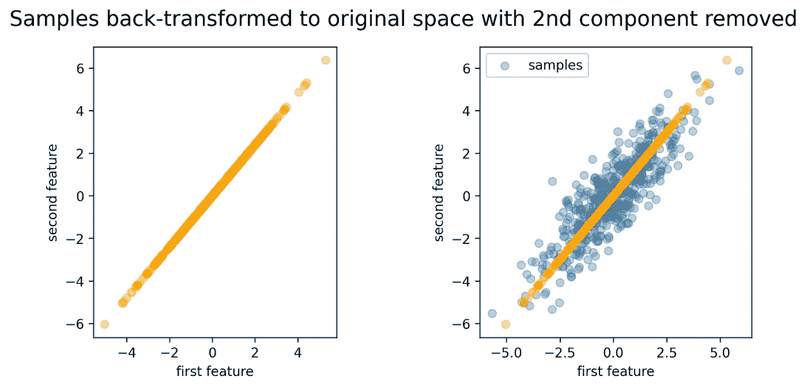
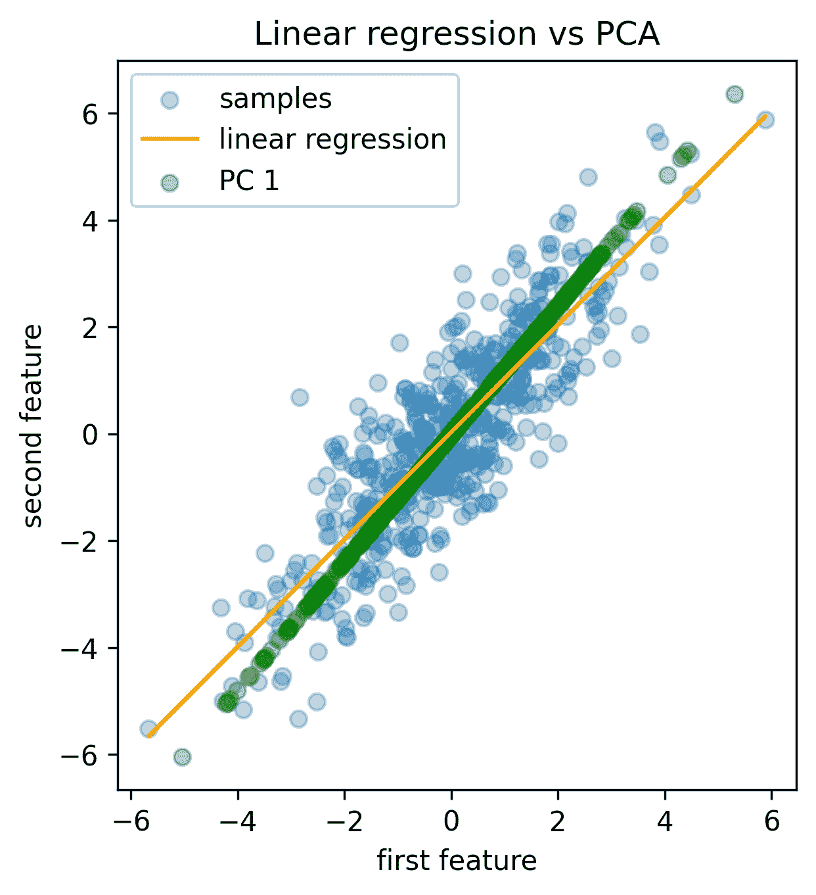

# 基于 Python 的主成分分析

> 原文：<https://towardsdatascience.com/principal-component-analysis-from-the-ground-up-with-python-754399f88923>

# 0.介绍

> 假设你有一堆数据点，你想从中找出模式。主成分分析是一个工具，可以帮助你做到这一点。它会找到数据中最重要的特征，并减少数据的维数。这意味着它需要大量的数据点，并将它们转化为更容易处理的少量数据点。

在统计学中，主成分分析(PCA)是一种用于降低数据维度的技术。这是一种线性变换形式，其中数据被变换到一个新的坐标系，使得数据在新轴上的任何投影的最大方差出现在第一个轴上，第二个最大方差出现在第二个轴上，依此类推。这种变换由数据的协方差矩阵的特征向量来定义，这些特征向量被称为主分量。换句话说，PCA 是一种找到数据变化最大的方向并将数据投射到这些方向上的方法。

PCA 是一种用于数据分析的强大工具，并被用于各种领域，例如机器学习、图像分析和信号处理。在本文中，我们将对主成分分析做一个简单的介绍，包括它背后的数学概述，以及主成分分析的一些应用。

# 1.有用的库

NumPy 是 Python 中科学计算的基础库。它用于:

1.数组

2.矩阵

3.线性代数

4.随机数生成

还有更多！

Numpy 橱窗。作者图片由 [@carbon_app](https://twitter.com/carbon_app) 创作

**Scikit-learn** 是一个免费的 Python 机器学习库。它用于:

1.分类

2.回归

3.使聚集

4.降维

5.型号选择

6.预处理

还有更多！

sci kit-学习展示。图片作者由 [@carbon_app](https://twitter.com/carbon_app) 创作

# 2.主成分分析

主成分分析(PCA)是一种用于确定数据集底层结构的统计技术。它通过识别一组相互正交(即垂直)的新轴来实现这一点，并最好地解释数据中的差异。第一个轴解释了最大的方差。第二个轴代表第二大方差，依此类推。

主成分分析常用于降维，即减少数据集中变量的数量，同时尽可能保留变量的过程。这是通过将每个数据点仅投影到前几个主成分上来实现的。

数学上，PCA 是计算数据协方差矩阵的特征向量的过程。协方差矩阵是描述数据集中每个变量的方差的矩阵。特征向量是数据中代表最大方差的方向。方差是数据点围绕平均值的变化量。

有许多不同的方法来计算数据集的主成分。一种流行的方法叫做奇异值分解(SVD)。SVD 是一种矩阵分解技术，它将一个矩阵分解为三个矩阵:

*   左奇异矩阵包含协方差矩阵的特征向量。
*   右奇异矩阵包含数据矩阵的特征向量。
*   对角矩阵包含协方差矩阵的特征值。

SVD 用于计算数据集的主成分，因为它在计算上是高效的，并且因为它可以用于解决与 PCA 相关的许多问题。

PCA 程序可总结如下:

1.  将数据居中(即，从每个数据点减去每个变量的平均值)。这是必要的，因为 PCA 是一个方差最大化的过程，并且将数据居中可以确保第一主成分解释最大可能的方差。

1.计算数据的协方差矩阵。

2.计算协方差矩阵的特征向量和特征值。

3.按特征值降序排列特征向量。

4.选择前 k 个特征向量，其中 k 是所需主成分的数量。

5.计算数据在所选特征向量上的投影。

## Python 实现

您可以将这些行复制/粘贴到您喜欢的 IDE 中。如果不知道选哪个，我推荐 PyCharm。

下面是我们在上面代码中所做工作的逐步解释:

1.  我们生成一些数据。

请注意，我们没有将数据居中，因为平均值已经是 0。

1.  **我们计算数据的实际协方差矩阵。**
2.  **我们计算协方差矩阵的特征向量和特征值。**
3.  **我们按照特征值降序排列特征向量。**
4.  **我们选择前两个特征向量，并计算数据在所选特征向量上的投影。**

看看我们如何在第 35 行计算解释的方差比。等于[ **0.93134786** ， **0.06865214** ]。这意味着第一个因素单独解释了我们数据中约 93%的方差，第二个因素仅增加了 6.9%。累积和等于 100%，这意味着两个主成分解释了我们数据中的所有方差。

在某些情况下，您可能希望只保留解释数据中大部分差异的几个组成部分，因为在现实世界的应用程序中，您通常会有太多的有噪声的要素，这些要素对模型的预测能力没有什么帮助。

6 **。我们将我们的解决方案与 scikit-learn** 进行比较

7.**我们绘制数据。**

图一。作者图片

在图 1 中，特征向量(主成分)被可视化为按照长度排序的直线。每条线都标有编号，并根据组件类型进行颜色编码。这些成分按照它们在数据中解释的差异量排序。如前所述，两者相互正交。

8.**我们从数据中去除最有价值的成分，看看数据会发生什么。**

图二。作者图片

这是不言自明的。然后所有数据点被投影到第二个轴上。

9.**我们从数据中移除第二大信息量，看看数据会发生什么。**

图 3。作者图片

因此，所有数据点都被投影到解释最大差异的第一个轴上。

10.**只是为了好玩，我们比较线性回归。**

主成分分析(PCA)和线性回归之间有一些相似之处。这两种方法都可以找到数据中的线性关系。然而，有一些重要的区别。最重要的区别是，PCA 找到的是使数据方差最大化的方向，而线性回归找到的是使模型误差最小化的方向(图 4)。

重要的是要记住，PCA 的目的不是找到线性回归模型的最佳预测变量，而是找到数据的底层结构，以降低其维数。相反，线性回归是一种从预测变量的线性组合预测定量响应变量的技术。线性方程的系数是代表每个预测变量对响应变量的影响的回归系数。

图 4。作者图片

# 4.结论

从代码中我们可以看出，PCA 是一个强大的工具，可以用来发现数据集的底层结构。这也是一种计算效率很高的降维方法。

在本文中，我们看到了如何使用主成分分析来发现数据集的底层结构。我们还看到了如何使用 PCA 进行降维，以及如何选择要保留的组件数量。最后，我们看到了 PCA 与线性回归的关系。