# 主成分分析:物理直观的数学介绍

> 原文：<https://towardsdatascience.com/principal-component-analysis-pca-8133b02f11bd>

# 主成分分析:物理直观的数学介绍

亨特·哈里特在 [Unsplash](https://unsplash.com/@hharritt?utm_source=unsplash&utm_medium=referral&utm_content=creditCopyText) 上的照片

主成分分析(PCA)涉及旋转欧几里德空间中的数据点云，使得方差沿着第一轴最大，即所谓的第一主成分。主轴定理确保数据可以以这种方式旋转。在数学术语中，PCA 涉及寻找正交线性坐标变换，或者更一般地，寻找新的基。

PCA 背后的数学在刚体转动的描述中再次被发现。这种物理解释对于理解 PCA 是有指导意义的。

这篇博客文章可以在 [github](https://github.com/lnemec/Intro2PCA) 的 [julia](https://julialang.org) 笔记本上找到。

# 定义参数以生成样本数据

首先，我们将生成一个由欧几里德空间中的 *N* 个随机分布的数据点组成的云 *ℝⁿ* ，坐标为 *{ x⃗⁽ ⁾，x⃗⁽ ⁾,…，x⃗⁽ᴺ⁾ } = X* 。我们将基于 *3* 维度数据来演示这个概念，其中 *n=3* 和 *X* ⊂ ℝ，基向量 *e⃗₁* 、 *e⃗₂* 和 *e⃗₃* 以原点 *(0，0，0)* 为中心。为简单起见，我们将沿基向量 *e⃗₃* 的所有坐标设置为零。它将允许我们在 *e⃗₁* 和 *e⃗₂* 平面上可视化数据。

在我们的例子中，我们用 *N=820* 个数据点创建了一个数据集。数据中的方差设置为 *R1=4.0* 和 *R2=8.5* ，数据在空间中旋转*角度=35.0* 。

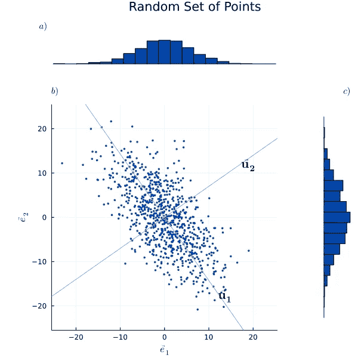

图一。a)沿 e⃗₂.分布的随机点的直方图 b)欧几里得空间ℝ中随机分布的数据点的云，具有坐标 *{ x⃗⁽ ⁾，x⃗⁽ ⁾,…，x⃗⁽ᴺ⁾ } = X* ，具有基本向量(图 b 中的轴) *e⃗₁* 和 *e⃗₂* 。b)图中的灰线表示 u⃗₁和 u⃗₂.的主轴线 c)沿 *e⃗₁* 分布的随机点的直方图。沿 e⃗₃的所有值都等于零。

# 转动惯量

刚体的转动惯量 ***J*** 也称为转动惯量，决定了围绕旋转轴的期望角加速度所需的扭矩。这取决于物体的质量分布和选定的旋转轴。转动惯量 ***J*** 较大的物体需要更大的扭矩来改变物体的转速。对于同一个刚体，不同的旋转轴会有不同的惯性矩。换句话说，它取决于身体的质量分布和选择的轴，更大的力矩需要更大的扭矩来改变身体的转速。

刚体的所有转动惯量都可以用一个矩阵来概括。一般来说，它可以相对于空间中的任何一点来确定。为了简单起见，我们将计算相对于质心的转动惯量。

物体的主轴(也称为图形轴)和主惯性矩可以通过旋转点质量云来找到。在数学术语中，PCA 涉及寻找正交线性坐标变换，或者更一般地，寻找新的基。

最大主惯性矩对应的图形轴是质点分布最大的平面的面积矢量。

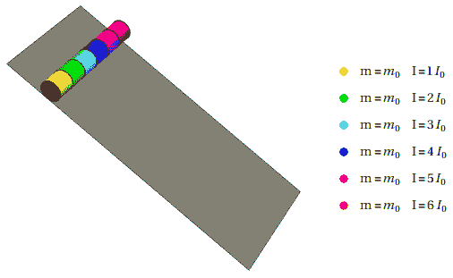

图二。六个气缸质量相同，但转动惯量不同 **J** 。当它们滚下斜坡时，转动惯量越小的圆柱体加速越快。([图片取自维基百科](https://en.wikipedia.org/wiki/File:RollingVsInertia.gif) [)](https://en.wikipedia.org/wiki/File:RollingVsInertia.gif))*)

# PCA 中主轴和惯性矩的视觉比较

在下面，我们将以两种方式解释上面的随机数据点集合。首先，我们用协方差矩阵 ***C*** 将数据点 *X* 解释为统计分布的数据。二、 *X* 用惯性矩矩阵 ***J*** 表示一个刚体的一组点质量。

图 3。a) PCA:第一主分量 u⃗₁是沿着方差最大的轴，由红色箭头指示 b)惯性矩:图轴 u⃗₂对应于由绿色箭头指示的(实际上第二)最大的主惯性矩。

借助*图 1* 和 *3* 的视觉支持，我们预计 PCA 的主轴和惯性矩是相同的。然而，最大主成分和主惯性矩的值对于大多数数据集来说是不同的。

> **注:**在物理学中，惯性矩是针对三维刚体定义的。为简单起见，我们将数据投影到 e⃗₁和 e⃗₂.之间的平面上在我们的例子中，质点分布最大的平面是由 e⃗₁和 e⃗₂.展开的对应于最大力矩的主轴指向沿 e⃗₃的平面外，并与 e⃗₁和 e⃗₂.正交

沿着 u⃗₁的线相当于方差最大的方向。在下文中，我们将通过数学上探索 PCA 和惯性矩来支持我们的视觉理解。

# 刚体转动惯量的定义

对于一个质量为 mᵢ的刚性物体 *N* 点在ℝⁿ，转动惯量**jt23】由下式给出**

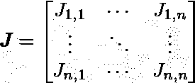

它的组成部分由等式定义。(1)作为

方程式(1)

其中 *δⱼ,ⱼ'* 是克罗内克δ，而 *M = ∑ᵢᴺ mᵢ* 是总质量。

> **注:**这里，我们用总质量来归一化转动惯量。在物理学中，惯性矩通常不会这样归一化。

走近一看，我们看到 ***J*** 与 *Jⱼ,ⱼ' = Jⱼ',ⱼ* 对称。谱定理告诉我们 ***J*** 有实特征值λ，并且可由一个正交矩阵对角化(正交可对角化)。

# 协方差矩阵的定义

欧几里德空间中以平均值为中心的点云的协方差矩阵 ***C*** 由下式给出

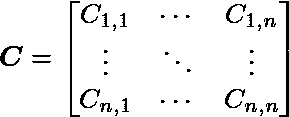

它的组成部分由等式定义。(2)作为

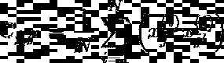

方程式(2)

# 求解特征值问题

PCA 的主轴和惯性矩可以通过旋转空间中的数据点来确定。更准确地说，通过求解特征值问题来计算主分量和轴。

一个实对称矩阵(如 ***C*** 和 ***J*** )的特征分解为一个旋转矩阵 ***R*** 和一个对角矩阵***λ***的乘积

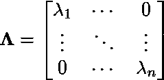

由***j****=****rλr****ᵀ给出。*旋转矩阵 ***R*** 的列定义主轴的方向，常数λ₁、…、λₙ是矩阵***λ***
的对角元素，称为主矩。

矩阵 ***J*** 和 ***C*** 的结构是相同的，除了非对角元素的符号。我们将在下面看到，对于 ***C*** 和 ***J*** ，特征向量将是相同的。另外我们会看到 ***C*** 的特征值***λ***与 ***J*** 的特征值是如何关联的。

# 显示 ***C*** 和 ***J*** 的特征向量相等

让我们改写一下由 Eq 定义的转动惯量矩阵 ***J*** 。(1)就等式中的协方差矩阵 ***C*** 而言。(2).

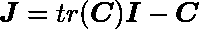

等式 3

其中 ***I*** 为单位矩阵。

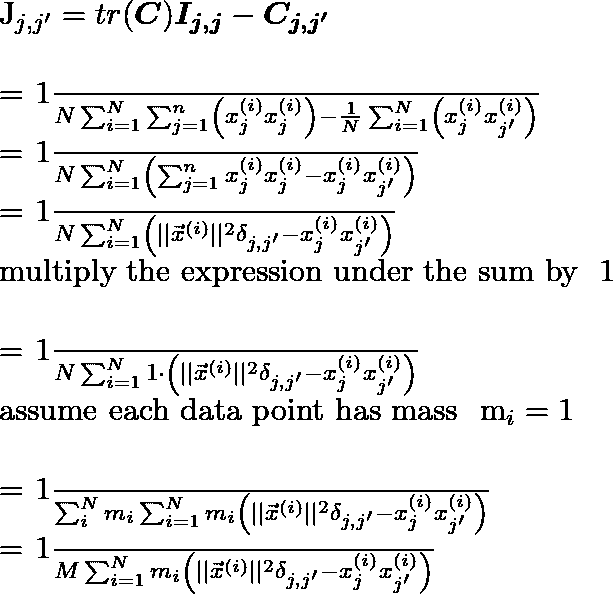

为了获得 ***C*** 的特征向量和特征值，我们通过将 ***C*** 分解为一个旋转矩阵 ***R*** 和一个对角矩阵***λ***ₒᵥ的乘积来解决特征值问题

***c***=**r*****λ***ₒᵥ***r***t115】ᵀ

其中 **R** 由特征向量 v⃗ʲ.组成在 *3* 的情况下——维空间**r**=【v⃗v⃗v⃗】

和

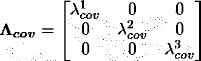

协方差矩阵 ***C*** 的 jᵗʰ特征向量 v⃗ʲ和 jᵗʰ特征值λʲₒᵥ由下式给出

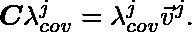

在下面，我们将删除索引$j$并将上面的公式重写为 ***C*** λₒᵥ = λₒᵥv⃗.乘法等式 Eq。(3)通过右侧的特征向量 v⃗，我们找到等式。(4).

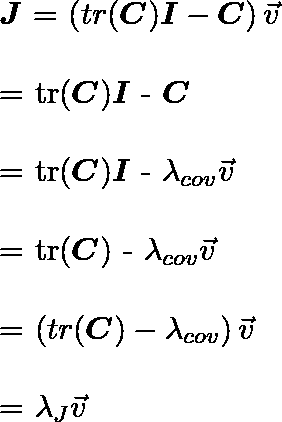

等式 4

情商。(4)暗示 ***C*** 和 ***J*** 具有相同的特征向量 v⃗.

# 计算转动惯量矩阵的特征值

***C*** 和 ***J*** 的特征向量相同，但特征值不相同。为了将它们联系起来，我们需要注意到

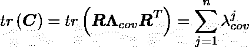

等式 5

其中我们使用了矩阵的迹在循环置换下是不变的，所以

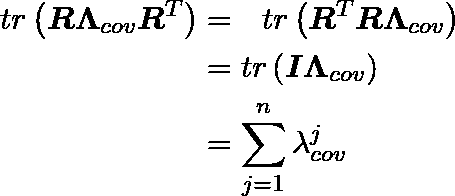

使用 Eq。(4)和情商。(5)我们可以写出特征值***λ****J*的转动惯量 ***J*** (Eq。(1))作为

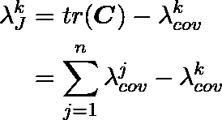

等式 6

我们看到，kᵗʰ特征值λᵏ*j*可以用特征值λₒᵥ.来表示

物理上，我们可以通过考虑沿着例如轴 v⃗的协方差特征值由数据点在 *(1)* 方向上的分量确定，而围绕轴 *(1)* 旋转的转动惯量由数据点离该轴的欧几里德距离确定，来获得对这两组特征值之间关系的直观理解。

# 使用上述数据集 X 计算特征值和特征向量

接下来，我们计算协方差矩阵元素、特征值和特征向量。数据集 *X* 的协方差矩阵**C为**

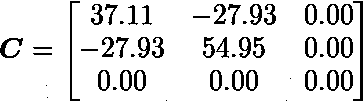

对于变异矩阵 ***C*** ，我们求出特征值

和特征向量

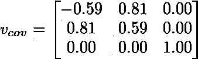

使用 Eq。(6)我们可以计算出**J*J*的特征值λ *J***

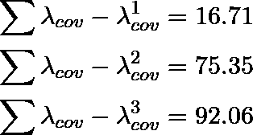

# 计算 J 的特征值和特征向量

现在，我们计算转动惯量的矩阵元素、特征值和特征向量。数据集 *X* 的惯性矩矩阵**J为**

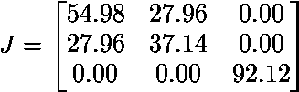

对于转动惯量矩阵 ***J*** ，我们求出特征值

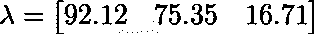

和特征向量

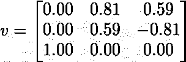

在数据点云的两种解释中——第一种是以平均值为中心的点云，第二种是围绕质心旋转的刚体——我们获得了相同的特征向量。

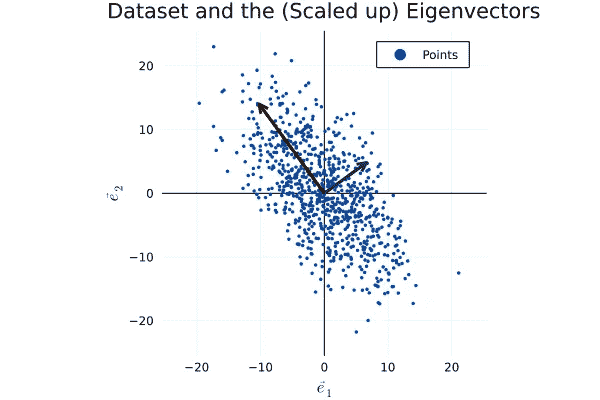

图 4。随机分布的数据点云 **X** 。覆盖的是缩放的特征向量(显示为红色和绿色箭头)。

接下来，我们使用特征向量和特征值来旋转数据，并在新的基中表示它

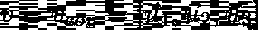

我们旋转数据集 *X*

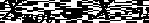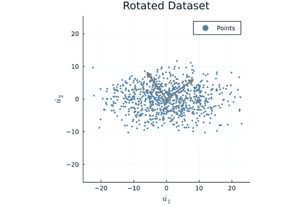

*图 5。随机分布的数据点云* ***X*** *由矢量*【u⃗₁u⃗₂u⃗₃】*所表示的基跨度。灰色箭头表示旧的基矢* e⃗₁和 e⃗₂ *在这个新的基中。*

# 最后的想法

在机器学习和数据科学中，使用 PCA 有两个原因。
首先，一些机器学习算法的准确性和数值稳定性对相关的输入数据很敏感。特别是，执行协方差矩阵反演的机器学习算法可能会遇到奇点问题——高斯混合模型浮现在脑海中。另一个不同的例子是应用随机森林算法来检测不同特征之间的相互作用，其中大的相关性可以掩盖这些相互作用。首先执行 PCA 允许我们梳理相关性的影响，这可以改进特征重要性分析。

第二，PCA 用于降低数据集的维数，例如用于数据压缩。在我们的例子中，我们使用了一个三维数据集 ***X*** ，但是 e⃗₃组件没有携带任何信息(通过构造)。我们可以使用主成分分析来证明删除第三维是正确的，因为主成分分析会显示在 e⃗₃方向上的方差是最小的。像这样使用高维数据集到低维空间的投影是处理高维数据和处理[ [维数灾难](https://en.wikipedia.org/wiki/Curse_of_dimensionality) ]的有力工具。

对 PCA 的两种应用都进行了广泛的讨论。参见下面的进一步阅读建议。

# 进一步阅读

1.  鲍克哈格、克里斯蒂安&董、天丝；[主成分分析教程第一部分:动机](https://www.researchgate.net/publication/326541038_A_Tutorial_on_Principal_Component_Analysis_Part_1_Motivation) (2018)
2.  鲍克哈格、克里斯蒂安&董、天丝；[主成分分析教程第二部分:通过惯性矩的主轴](https://www.researchgate.net/publication/326546791_A_Tutorial_on_Principal_Component_Analysis_Part_2_Principal_Axis_via_Moment_of_Inertia) (2018)
3.  洪、梁；[LOS 检测中“基于转动惯量的方法”和“基于 PCA 的方法”等价性的证明](https://www.scientific.net/AMR.945-949.2071)；先进材料研究。945–949.2071–2074 (2014)
4.  凯文·墨菲；[机器学习的概率视角](https://isbnsearch.org/isbn/9780262018029)，麻省理工学院出版社，第 12.2 章(2012 年)
5.  斯蒂芬·马斯兰德；[从算法角度看机器学习](https://isbnsearch.org/isbn/9781466583283)，第二版，Chapman and Hall/CRC (2014)
6.  [Will Badr](https://medium.com/u/551ba3f6b67d?source=post_page-----8133b02f11bd--------------------------------) [为什么特征相关性很重要…很多！](/why-feature-correlation-matters-a-lot-847e8ba439c4)博客走向数据科学(2019)