# 零数学直观解释主成分分析(PCA)

> 原文：<https://towardsdatascience.com/principal-component-analysis-pca-explained-visually-with-zero-math-1cbf392b9e7d>

主成分分析(PCA)是数据科学可视化和降维的一个不可或缺的工具，但通常被隐藏在复杂的数学中。至少可以说，我很难理解为什么会这样，这使得我很难欣赏它的全部魅力。

虽然数字对于证明一个概念的有效性很重要，但我相信分享数字背后的故事也同样重要——用一个故事。

*   [什么是 PCA？](#0226)
*   [PCA 是如何工作的？](#9b5c)
*   [逃脱的个人电脑](#8b6b)
*   [在 Python 中实现 PCA](#37f8)

# 什么是 PCA？

主成分分析(PCA)是一种将高维数据转换为低维数据，同时保留尽可能多的信息的技术。

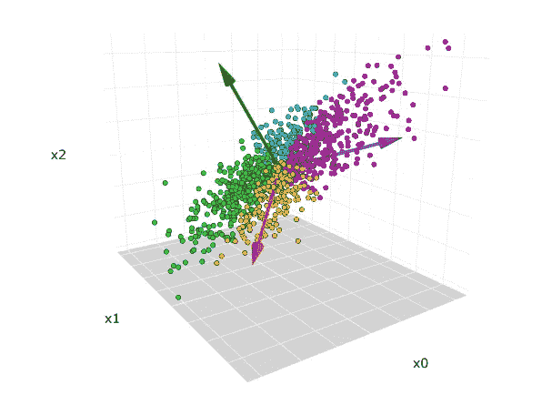

原始三维数据集。红色、蓝色、绿色箭头分别是第一、第二和第三主分量的方向。图片由作者提供。

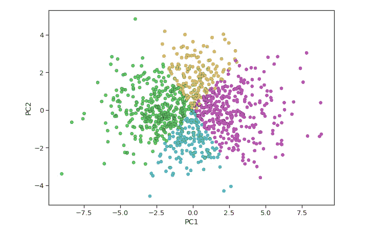

PCA 后的散点图从三维减少到二维。图片由作者提供。

在处理具有大量特征的数据集时，PCA 非常有用。图像处理、基因组研究等常见应用总是需要处理成千上万的列。

虽然拥有更多的数据总是好的，但有时它们包含了太多的信息，我们将有不可能的长模型训练时间，并且[维数灾难](/the-curse-of-dimensionality-50dc6e49aa1e)开始成为一个问题。有时候，少即是多。

我喜欢把 PCA 比作写一本书的总结。

找时间读一本 1000 页的书是一种奢侈，很少有人能负担得起。如果我们能在两三页内总结出最重要的要点，这样即使是最忙的人也能很容易地理解这些信息，这不是很好吗？在这个过程中，我们可能会丢失一些信息，但至少我们了解了全局。

# PCA 是如何工作的？

这是一个两步走的过程。如果我们没有阅读或理解书的内容，我们就不能写一个书的总结。

PCA 的工作方式是一样的——理解，然后总结。

## 用主成分分析法理解数据

人类通过使用表达性语言来理解故事书的含义。可惜 PCA 不会说英语。它必须通过自己喜欢的语言，数学，在我们的数据中寻找意义。

这个百万美元的问题是…

*   PCA 能理解我们数据的哪一部分重要吗？
*   我们能从数学上量化数据中包含的信息量吗？

嗯，*方差*可以。

方差越大，信息越多。反之亦然。

对于大多数人来说，方差并不是一个陌生的术语。我们在高中学过，方差衡量的是每个点与均值的平均差异程度。

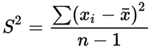

方差公式。

但是它没有把变化和信息联系起来。那么这种联想从何而来呢？为什么会有意义？

假设我们正在和朋友玩猜谜游戏。游戏很简单。我们的朋友会遮住他们的脸，我们需要仅仅根据他们的身高来猜测谁是谁。作为好朋友，我们记得每个人有多高。

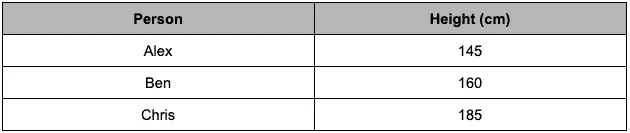

记忆中我们朋友的身高。图片由作者提供。

我先来。

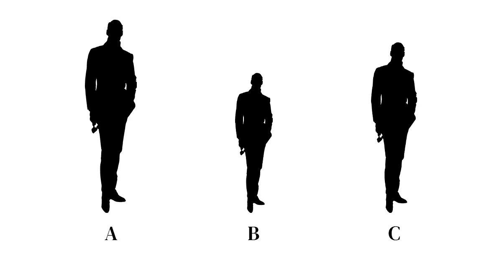

三个相同的朋友的剪影，我们需要根据他们的身高差异来识别他们。图片由 [7089643](https://pixabay.com/users/7089643-7089643/) 来自 [Pixabay](https://pixabay.com/vectors/man-silhouette-man-alone-freedom-5403280/) ，经作者许可编辑。

毫无疑问，我会说 A 是克里斯，B 是亚历克斯，C 是本。

现在，让我们试着猜一组不同的朋友。

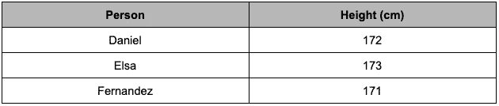

另一组我们铭记于心的朋友身高。图片由作者提供。

轮到你了。

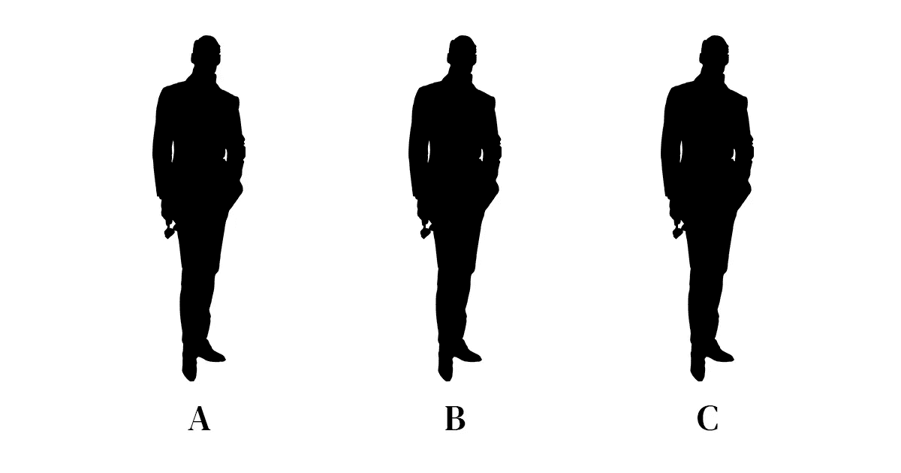

三个同样高的朋友的剪影，我们需要确认他们的身份。图片由 [7089643](https://pixabay.com/users/7089643-7089643/) 来自 [Pixabay](https://pixabay.com/vectors/man-silhouette-man-alone-freedom-5403280/) ，经作者许可编辑。

你能猜出谁是谁吗？当他们的身高非常接近时，这很难。

早些时候，我们很容易区分 185 厘米的人和 160 厘米和 145 厘米的人，因为他们的身高差异很大。

同样，当我们的数据具有较高的方差时，它包含更多的信息。这就是为什么我们在同一个句子中不断听到 PCA 和最大方差。我想引用维基百科的一个片段来正式说明这一点。

> PCA 被定义为正交线性变换，其将数据变换到新的坐标系，使得数据的某个标量投影的**最大方差**位于第一坐标(称为第一主分量)，第二最大方差位于第二坐标，依此类推。

在 PCA 看来，方差是一种客观的数学方法，可以量化我们数据中的信息量。

差异*是*信息。

为了说明这一点，我提议再进行一次猜谜游戏，只是这一次，我们要根据身高和体重来猜谁是谁。

第二回合。

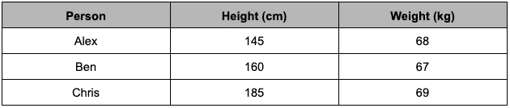

同一套朋友和各自的身高体重。图片由作者提供。

一开始，我们只有身高。现在，我们基本上已经将朋友的数据量增加了一倍。这会改变你的猜测策略吗？

这是进入下一节的一个很好的小插曲 PCA 如何总结我们的数据，或者更准确地说，如何降低维数。

## 使用 PCA 汇总数据

就我个人而言，体重差异很小(也就是一个小的方差)，这根本不能帮助我区分我们的朋友。我仍然不得不主要依靠身高来进行猜测。

直观地说，我们刚刚将数据从二维减少到一维。这个想法是，我们可以选择性地保留方差较高的变量，然后忘记方差较低的变量。

但是如果，如果身高和体重有相同的方差呢？这是否意味着我们不能再降低这个数据集的维度？我想用一个样本数据集来说明这一点。

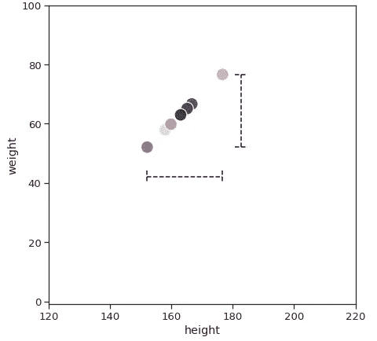

虚线代表身高和体重的差异。图片由作者提供。

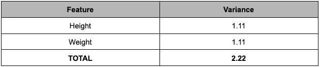

为了公平比较，所有特征都被标准化为相同的尺度。图片由作者提供。

在这种情况下，很难选择我们想要删除的变量。如果我丢弃任何一个变量，我们就丢弃了一半的信息。

我们能同时保留*和*吗？

或许，换个角度。

最好的故事书总是有隐藏的主题，这些主题没有写出来，但是*暗示了*。单独阅读每一章是没有意义的。但是如果我们全部读完，它给了我们足够的背景来拼凑这些谜题——潜在的情节出现了。

到目前为止，我们只是分别研究了身高和体重的变化。与其限制我们只能选择其中之一，为什么不把它们结合起来呢？

当我们仔细观察我们的数据时，方差的最大值不在 x 轴上，也不在 y 轴上，而是在一条对角线上。第二大方差是一条与第一个方差成 90 度的线。

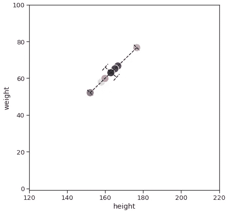

虚线表示最大方差的方向。图片由作者提供。

为了表示这两条线，PCA 结合了身高和体重来创建两个全新的变量。可能是 30%的身高和 70%的体重，或者 87.2%的身高和 13.8%的体重，或者任何其他组合，这取决于我们现有的数据。

这两个新变量被称为**第一主成分(PC1)** 和**第二主成分(PC2)** 。我们可以分别使用 PC1 和 PC2，而不是在两个轴上使用身高和体重。

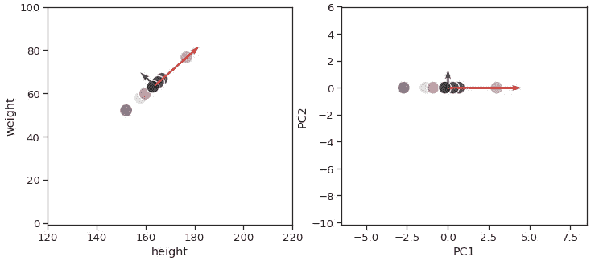

(**左**)红色和绿色箭头是原始数据中的主轴。图片由作者提供。| ( **右**)主轴的方向已经旋转成为新的 x 轴和 y 轴。图片由作者提供。

在所有的恶作剧之后，让我们再来看看差异。

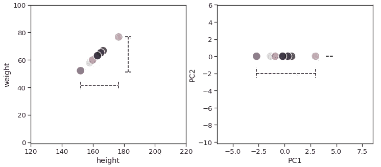

(**左**)原始数据中身高体重方差相近。图片由作者提供。| ( **右**)PCA 变换后，所有的方差都显示在 PC1 轴上。图片由作者提供。

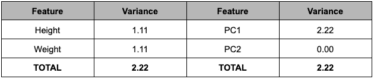

为了公平比较，所有变量都被标准化为相同的尺度。图片由作者提供。

PC1 可以单独获取身高和体重的总方差。因为 PC1 拥有所有信息，所以您已经知道了该步骤—我们可以轻松地删除 PC2，并且知道我们的新数据仍然代表原始数据。

当涉及到真实数据时，通常情况下，我们不会得到一个主成分来捕捉 100%的方差。执行 PCA 将给出 N 个主成分，其中 N 等于原始数据的维数。从这个主成分列表中，我们通常选择最少数量的主成分来解释我们原始数据的最大数量。

帮助我们做出这个决定的一个很好的视觉辅助工具是 **Scree Plot** 。

三维数据集的碎石图示例。图片由作者提供。

条形图告诉我们由每个主成分解释的方差的比例。另一方面，叠加的折线图给出了解释方差的累积和，直到第 N 个主成分。理想情况下，我们希望仅用 2 到 3 个分量就能获得至少 90%的方差，以便保留足够的信息，同时我们仍能在图表上可视化我们的数据。

看着图表，我会觉得使用 2 个主要成分很舒服。

# 逃脱的个人电脑

由于我们没有选择所有的主成分，我们不可避免地会丢失一些信息。但是我们还没有确切地描述我们正在失去什么。让我们用一个新的玩具例子来深入探讨这个问题。

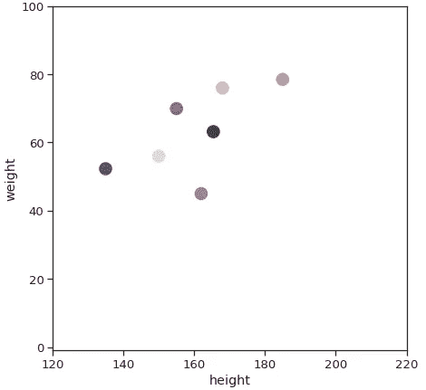

这些点是分散的，但我们仍然可以在对角线上看到一些正相关。图片由作者提供。

如果我们通过主成分分析模型输入数据，它将首先绘制第一个主成分，然后绘制第二个主成分。当我们将原始数据从二维转换到二维时，除了方向之外，一切都保持不变。我们刚刚旋转了数据，使最大方差出现在 PC1 中。这里没什么新鲜的。

(**左**)虚线是第一和第二主成分的方向。图片由作者提供。| ( **右** ) PCA 旋转数据，因此将最大方差放在 PC1 上，然后是 PC2。图片由作者提供。

然而，假设我们决定只保留第一个主成分，我们必须将所有数据点投影到第一个主成分上，因为我们不再有 y 轴。

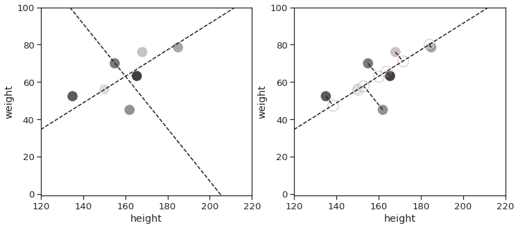

(**左**)虚线是第一和第二主成分的方向。图片由作者提供。| ( **右**)现在所有的点都在虚线上，因为我们去掉了第二个主成分。图片由作者提供。

我们会丢失第二个主成分中的距离，下面用红色线突出显示。

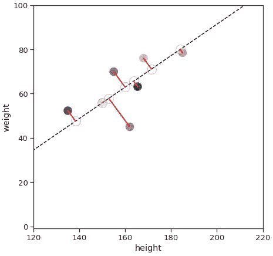

所有红线都是第二主成分中的值，它们已被移除。图片由作者提供。

这对每个数据点的感知距离有影响。如果我们查看两个特定点之间的欧几里德距离(也称为成对距离)，您会注意到原始数据中的一些点比转换数据中的要远得多。

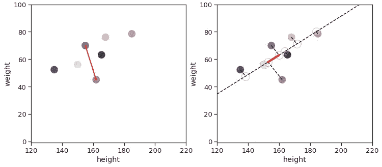

在(**左**)和(**右**)维度之前和之后的两个点之间的成对欧几里德距离的比较从 2 维减少到 1 维。图片由作者提供。

主成分分析是一种线性变换，因此它本身不会改变距离，但是当我们开始移除维度时，距离就会发生扭曲。

事情变得更棘手了——并不是所有成对距离都受到同等影响。

如果我们取最远的两个点，你会看到它们几乎平行于主轴。虽然它们的欧几里得距离仍然是扭曲的，但程度要小得多。

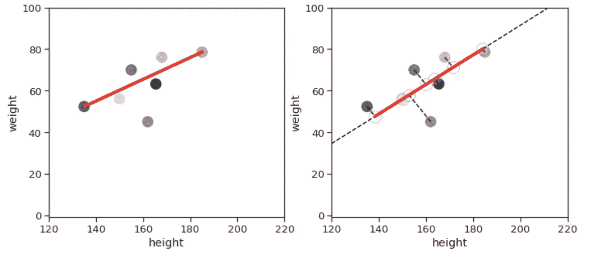

在降维之前(**左**)和之后(**右**)这两个点之间的成对欧几里德距离保持相当一致。图片由作者提供。

原因是主成分轴被画在方差最大的方向上。根据定义，当数据点相距较远时，方差会增加。因此，自然地，相距最远的点会更好地与主轴对齐。

总而言之，用 PCA 降维改变了我们数据的距离。它以一种比小的成对距离更好地保持大的成对距离的方式来做到这一点。

这是使用 PCA 降低维数的少数缺点之一，我们需要意识到这一点，尤其是在使用基于欧氏距离的算法时。

有时，在原始数据上运行您的算法可能更有好处。这就是你，一个数据科学家需要根据你的数据和用例做出决定的地方。

毕竟，数据科学既是科学，也是艺术。

# 在 Python 中实现 PCA

除了本文的前提之外，PCA 还有更多内容。真正领略 PCA 之美的唯一途径就是亲身体验。因此，我很乐意在这里分享一些代码片段给任何想动手的人。完整的代码可以通过 Google Colab 在[这里](https://colab.research.google.com/drive/1RC_XulRdrqpYRq4h8pRl22cfg9a-_FvS?usp=sharing)访问。

首先，让我们把导入的东西去掉，并生成一些我们将要使用的数据。

我们的玩具数据集有 3 个变量——x0、x1 和 x2，它们分布在 3 个不同的簇中。“cluster_label”告诉我们数据点属于哪个集群。

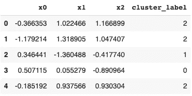

玩具示例数据集的前 5 行。图片由作者提供。

只要有可能，将它们形象化总是一个好主意。

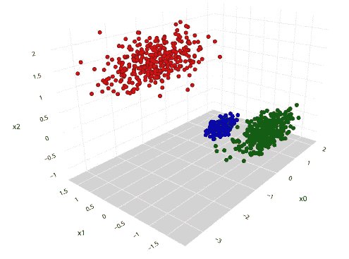

三维图表上的玩具数据。图片由作者提供。

数据似乎已准备好进行主成分分析。我们将尝试降低它的维度。幸运的是，Sklearn 使得 PCA 非常容易执行。尽管我们花了 2000 多字来解释 PCA，但我们只需要 3 行代码来运行它。

这里有几个活动部件。当我们将我们的数据拟合到 Sklearn 的 PCA 函数时，它会执行所有繁重的工作来返回 PCA 模型和转换后的数据。

该模型让我们获得了众多的属性，如特征值，特征向量，原始数据的平均值，方差解释，等等。如果我们想了解 PCA 对我们的数据做了什么，这些非常有见地。

我想强调的一个属性是`pca.explained_variance_ratio_`，它告诉我们由每个主成分解释的方差的比例。我们可以用碎石图来想象这一点。

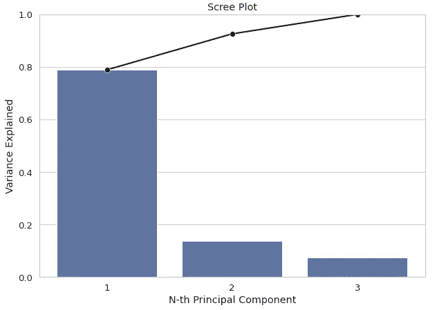

叠加在条形图上的线形图，显示每台电脑的差异比例。图片由作者提供。

图表告诉我们，使用 2 个主成分而不是 3 个主成分很好，因为它们可以捕捉 90%以上的方差。

除此之外，我们还可以看看用`pca.components_**2`创建每个主成分的变量组合。我们可以用热图来展示这一点。

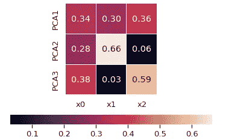

每台电脑都是由多个变量组合而成的。图片由作者提供。

在我们的示例中，我们可以看到 PCA1 由 34%的 x0、30%的 x1 和 36%的 x2 组成。PCA2 主要受 x1 支配。

Sklearn 提供了许多更有用的属性。对于感兴趣的人，我推荐看看 [Sklearn 文档](https://scikit-learn.org/stable/modules/generated/sklearn.decomposition.PCA.html)上 PCA 的属性部分。

现在我们对主成分有了更好的理解，我们可以最终决定我们想要保留的主成分的数量。在这种情况下，我觉得 2 个主成分就足够了。

因此，我们可以重新运行 PCA 模型，但是这次使用了`n_components=2`参数，它告诉 PCA 只为我们保留前 2 个主成分。

这将返回给我们一个带有前两个主要成分的数据帧。最后，我们可以绘制一个散点图来可视化我们的数据。

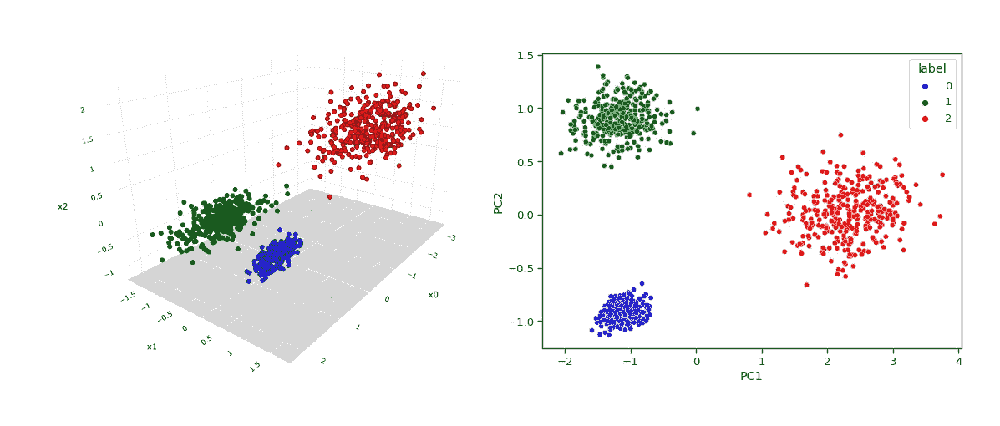

(**左**)原始数据。图片由作者提供。| ( **右**)相同的数据，但用 PCA 简化为 2-D。图片由作者提供。

# 结束语

PCA 是一个数学上美丽的概念，我希望我能够以一种随意的语气来表达它，这样就不会感到势不可挡。对于那些渴望了解本质细节的人，我在下面附上了一些有趣的讨论/资源供你阅读。

谢谢你的时间，并有一个伟大的一天。

[1]:中等，法尔哈德·马利克(2019 年 1 月 7 日)。*什么是特征值和特征向量？* [https://medium . com/fintech explained/what-are-特征值和特征向量-机器学习的必备概念-80d0fd330e47](https://medium.com/fintechexplained/what-are-eigenvalues-and-eigenvectors-a-must-know-concept-for-machine-learning-80d0fd330e47)

[2]: GitHub。*深入:主成分分析* [https://jakevdp . github . io/python datascience handbook/05.09-Principal-Component-Analysis . html](https://jakevdp.github.io/PythonDataScienceHandbook/05.09-principal-component-analysis.html)

[3]: StackExchange，whuber(2013 年 2 月 21 日)。*在进行主成分分析之前，是否应该去除高度相关的变量？* [https://stats . stack exchange . com/questions/50537/should-one-remove-high-correlated-variables-before-do-PCA](https://stats.stackexchange.com/questions/50537/should-one-remove-highly-correlated-variables-before-doing-pca)

[4]: StackExchange，ttnphns(2017 年 4 月 13 日)。 *PCA 和方差比例解释*[https://stats . stack exchange . com/questions/22569/PCA-和-方差比例解释](https://stats.stackexchange.com/questions/22569/pca-and-proportion-of-variance-explained)

[5]: StackExchange，阿米巴原虫(2017 . 04 . 13)。*PCA 仅保留大的成对距离是什么意思？* [https://stats . stack exchange . com/questions/176672/what-is-mean-by-PCA-preserving-only-large-pair-distance](https://stats.stackexchange.com/questions/176672/what-is-meant-by-pca-preserving-only-large-pairwise-distances)

[6]: StackExchange，阿米巴原虫(2015 年 3 月 6 日)。*主成分分析的意义，特征向量&特征值* [https://stats . stack exchange . com/questions/2691/Making-sense-of-main-component-analysis-特征向量-特征值/140579#140579](https://stats.stackexchange.com/questions/2691/making-sense-of-principal-component-analysis-eigenvectors-eigenvalues/140579#140579)