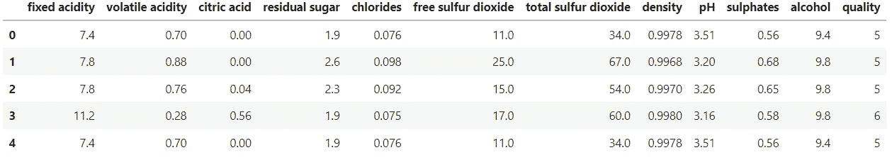
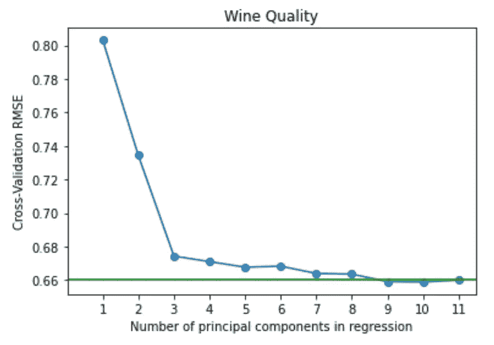
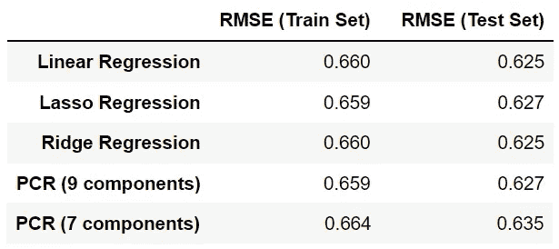

# 主成分回归——明确解释并实施

> 原文：<https://towardsdatascience.com/principal-component-regression-clearly-explained-and-implemented-608471530a2f>

## 基于主成分分析(PCA)的回归技术的概念和 Python 实现

约翰·安维克在 [Unsplash](https://unsplash.com?utm_source=medium&utm_medium=referral) 上的照片

主成分分析(PCA)是一种众所周知的**降维**技术，但是您知道吗，我们也可以在**回归分析**中应用 PCA 背后的概念？

本文提供了对**主成分回归** (PCR)的清晰解释，包括它的理论概念、好处、注意事项和 Python 实现。

## 内容

> ***(1)***[*理论概念*](#c965)
> ***(2)***[*好处和注意事项*](#3b4c)
> ***(3)***[*Python 实现*](#e6d6)

# (1)理论概念

主成分回归(PCR)是一种回归技术，其目标与标准线性回归相同，即模拟目标变量和预测变量之间的关系。

不同的是，PCR 使用**主成分作为回归分析的预测变量**，而不是原始特征。

PCR 分三步进行:

1.  **应用 PCA 从预测变量生成**主成分，主成分的数量与原始特征的数量相匹配 ***p***
2.  保留解释大部分方差的第一个 ***k*** 主成分(其中***k***<***p***)，其中 ***k*** 由交叉验证确定
3.  在这些 ***k*** 主成分上拟合线性回归模型(使用普通最小二乘法)

这个想法是，较少数量的主成分代表数据中的大部分可变性和(假定的)与目标变量的关系**。因此，我们不是使用所有的原始特征进行回归，而是仅利用主成分的子集**。

尽管与目标变量的关系的假设并不总是成立的，但它通常是产生良好结果的足够合理的近似。

由[艾伦·德拉克鲁斯](https://unsplash.com/@alandelacruz4?utm_source=medium&utm_medium=referral)在 [Unsplash](https://unsplash.com?utm_source=medium&utm_medium=referral) 上拍摄的照片

# (2)益处和注意事项

## 利益

*   PCR 在 ***k*** 主成分而不是所有原始特征上拟合线性回归模型，从而帮助**减少过拟合**。理论上，这比基于所有原始特征训练的标准线性回归模型具有更好的性能。
*   PCR 通过移除与小特征值相关的主成分来帮助**消除数据中的多重共线性**。
*   在具有许多特征(**高基数**)和**显著多重共线性**的数据中，性能提升更为显著。

## 警告

*   PCR**不**被认为是特征选择方法，因为回归中使用的结果主成分是原始特征的**线性组合。这意味着我们仍然依赖于所有的原始特性，而不是它们的子集。**
*   由于在模型中使用了主成分，与原始特征相比，这些预测器失去了它们的“**解释能力**”。
*   PCA 变换是无监督的，这意味着在确定主成分时，它不**而不是**考虑目标变量。因此，**不能保证**方差最大的主成分将是**预测目标**的最佳主成分。具有高预测能力但低方差的方向有可能被忽略，从而导致较差的模型性能。

# (3) Python 实现

现在让我们一步一步地看一下在 Python 中应用 PCR 的指南。在这个项目中，我们将使用传统的葡萄酒质量数据集 ，因为它容易获得，简单，并且是数字格式的。

目标是**预测葡萄酒质量**，作为**回归**任务的一部分，使用诸如酒精含量和酸度等葡萄酒特性。

你可以参考这个 [GitHub repo](https://github.com/kennethleungty/Principal-Component-Regression) 的 [**Jupyter 笔记本**](https://github.com/kennethleungty/Principal-Component-Regression/blob/main/notebooks/Principal_Component_Regression_Wine_Quality.ipynb) 中的代码跟随。

  

## 步骤 1 —初始设置

我们首先导入所有必要的库和数据，然后执行适当的训练测试分割。原始数据集有十个预测变量和一个目标变量(*)。*

**

*原始葡萄酒质量数据集样本|作者图片*

## *步骤 2 —标准化功能*

*在运行 PCR 之前，至关重要的是**在生成主要成分之前将**每个原始特征标准化到相同的比例。*

*原因是主成分计算是基于**方差**，方差受特征的**范围**影响。*

*如果不应用标准化，则范围较大(因此方差较大)的特征将占主导地位，并在生成的主成分中扮演不公平的重要角色。*

*我们使用 [**sklearn .预处理**](https://scikit-learn.org/stable/modules/generated/sklearn.preprocessing.scale.html) 中的`**scale()**`方法对原始特征进行标准化，即中心到均值，刻度到单位方差。*

## *步骤 3 —运行基线回归模型*

*为了评估 PCR 模型的性能，我们需要有基准来比较。因此，我们运行**三个基线模型**(标准线性回归、套索回归和岭回归)并保存 RMSE 分数。*

*特别是，我们希望保存以下内容:*

*   ***训练集**中的 10 重交叉验证 RMSE*
*   *在**测试集**上预测 RMSE*

## *步骤 4 —生成主成分*

*原始特征的主要成分可以使用`PCA()`从[**sk learn . decomposition**](https://scikit-learn.org/stable/modules/generated/sklearn.decomposition.PCA.html)中生成。*

*得到的 11 个主成分的预览如下所示，第一个主成分**(包含最多信息)位于最左栏。***

******

***主成分值预览|作者图片***

***我们还可以使用`pca.explained_variance_ratio_`查看每个主成分的**解释方差**。***

******

***解释了所有主要成分的差异|图片由作者提供***

## ***步骤 5-确定主成分的数量***

***由于我们不想使用所有的主成分，现在的问题是**我们应该使用多少**主成分进行回归分析。***

***主成分的数量( ***k*** )通常由
**交叉验证**和视觉分析确定。***

***值 ***k*** 本质上是一个我们需要调优的超参数。我们迭代越来越多的主成分，以纳入回归建模和评估结果 RMSE 评分。***

***下一个任务是检查**训练集交叉验证 RMSE** 与所用主成分数量的关系图:***

******

***RMSE 与主成分数的关系图|图片由作者提供***

***我们看到，PCR 的训练集性能随着主成分的增加而提高(即 RMSE 降低)，这与我们的预期一致。***

***绿线是使用所有原始特征的基线标准线性回归模型的 RMSE 基准。***

***该图显示，当存在 ***M=9*** 主成分时，出现**最低交叉验证 RMSE(图中的最小点)**。实际上， ***M=9*** 处的 RMSE 略低于绿线。***

****注:如果我们想要更少的元件，同时保持相对相似的性能，这里选择****M = 7****也是合理的选择。****

## ***步骤 6 —用最佳数量的主成分运行 PCR***

***在确定要使用的主成分的最佳数量(即 ***M=9*** )之后，我们继续在我们的测试数据集上运行 PCR。***

***首先，这是通过在**训练集**的前 9 个主成分上训练新的线性回归模型来完成的。然后，我们使用这个训练好的模型对**测试集**的前 9 个主成分进行预测。***

***我们也可以重复上述步骤来评估在 ***M=7*** 主成分上训练的 PCR 模型的性能。***

## ***第 7 步—评估和解释结果***

***下表显示了来自各种模型的 RMSE 结果，包括使用不同数量的主成分训练的两个 PCR 模型。***

******

***回归模型的 RMSE 结果。RMSE 越低，模型越好|作者图片***

***我们看到，具有 9 个主成分的 PCR**与基于**所有 11 个**原始特征训练的三个基线回归模型表现相当。*****

***具有 7 个成分的 PCR 的性能稍差是因为需要更多的主成分来充分模拟该数据中的目标。***

***值得记住的是，在最初的几个主成分捕获了预测因子的大部分变化以及与目标的关系的情况下，PCR 表现得更好。***

# ***包装东西***

***主成分回归被称为回归分析的**降维**方法，因为它减少了回归建模中要估计的系数数量。***

***虽然与标准线性回归相比，它可能会导致模型性能的提高，但有几个注意事项需要考虑，我们在本文中对此进行了探讨。***

***要查看这个项目的 Python 代码，欢迎你来探索这个 [**GitHub repo**](https://github.com/kennethleungty/Principal-Component-Regression) 。***

# ***在你走之前***

***欢迎您加入**我的数据科学学习之旅**。跟随此[媒体](https://kennethleungty.medium.com/)页面并查看我的 [GitHub](https://github.com/kennethleungty) 以了解实用和教育数据科学内容。同时，享受应用主成分回归的乐趣！***

***       [## 通过我的推荐链接加入媒体-梁建华

### 作为一个媒体会员，你的会员费的一部分会给你阅读的作家，你可以完全接触到每一个故事…](https://kennethleungty.medium.com/membership)***