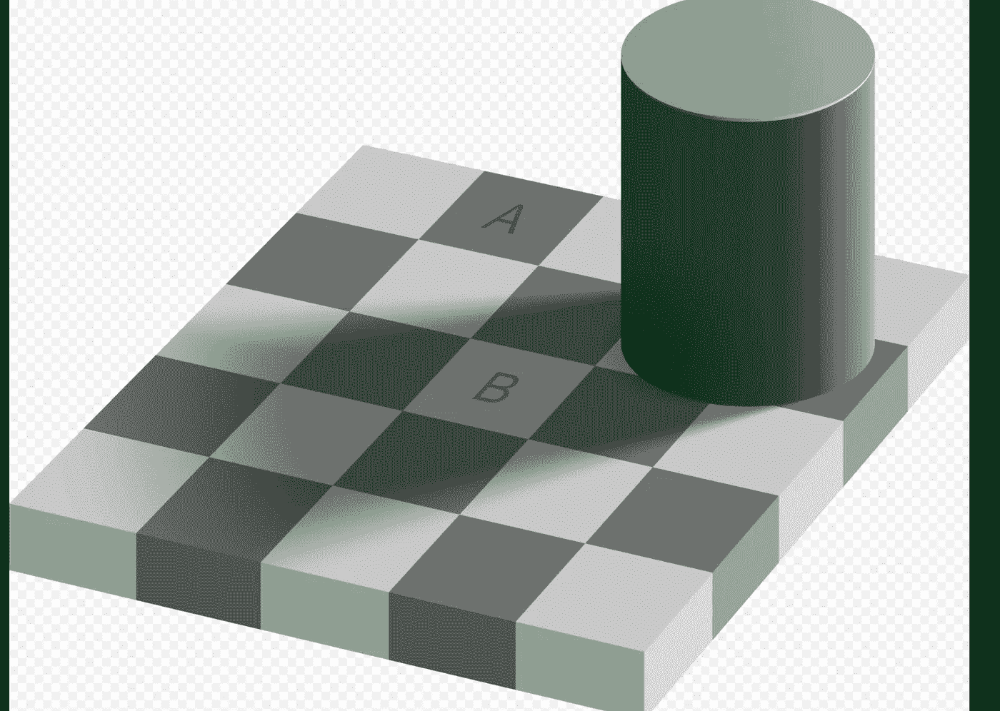
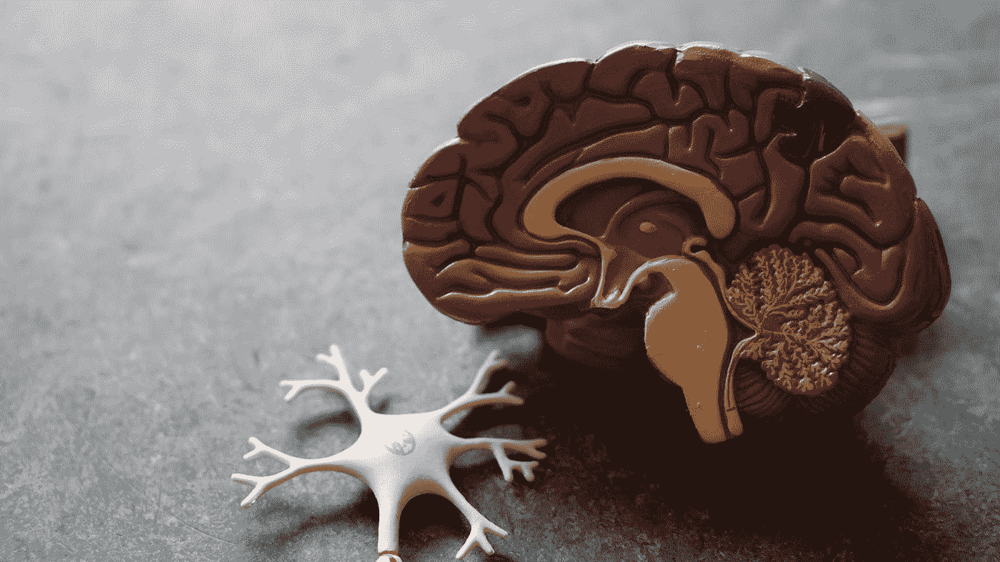

# 人工智能中的先验知识——真的是“作弊”吗？

> 原文：<https://towardsdatascience.com/prior-knowledge-in-ai-is-it-really-cheating-229604179e7f>

## 为什么先验知识对人工智能系统如此重要

让我们从一种视错觉开始:著名的灰色棋盘错觉，经常被作为愚弄我们大脑和视觉处理系统的视错觉的一个例子。我想把重点放在灰色棋盘的一个特别的错觉上，这个错觉很流行，涉及到*颜色*和*光照*。



图片鸣谢:[https://en . Wikipedia . org/wiki/Checker _ shadow _ illusion #/media/File:Checker _ shadow _ illusion . SVG](https://en.wikipedia.org/wiki/Checker_shadow_illusion#/media/File:Checker_shadow_illusion.svg)

我想问你一个简单的问题:正方形 A 和正方形 B 是同一个*色调*吗？显然不是！正方形 A 和 B 肯定是灰色的，但是 A 的色调明显比 B 暗…对吧？


图片鸣谢:[https://en . Wikipedia . org/wiki/Checker _ shadow _ illusion #/media/File:Grey _ square _ optical _ illusion _ proof 2 . SVG](https://en.wikipedia.org/wiki/Checker_shadow_illusion#/media/File:Grey_square_optical_illusion_proof2.svg)

等一下…通过用灰色的桥连接正方形来去除阴影…为什么它们现在看起来是同样的色调？到底发生了什么事？！

## 大脑是如何得出结论的？

为什么我们的大脑如此迅速地察觉到这两种色调是不同的，而去除阴影后发现色调强度值实际上是相同的？这可以归结为理解我们的大脑如何得出主要结论——我们的大脑如何推断出结论。

AGI——人工智能——至少在 20 世纪 60 年代和 70 年代，或许现在也是这样——的希望是尝试模仿人类的智能，以及我们大脑强大的推断、概括和推理能力，并将其与计算机非凡的计算能力相结合。因此，我们应该首先尝试理解我们的大脑是如何得出主要结论的。


照片由[埃琳娜·莫日维洛](https://unsplash.com/@miracleday?utm_source=medium&utm_medium=referral)在 [Unsplash](https://unsplash.com?utm_source=medium&utm_medium=referral) 上拍摄

为了理解这种错觉，我们需要意识到当我们看着棋盘错觉时，我们的大脑同时无意识地判断两种假设:

*H1:方块 B 和方块 A 真的是不同的色调——只是在阴影中看到的*

*H2:正方形 B 和正方形 A 的色调相同——只是在灯光下看。*

现在，让我们将变量 *D* 视为数据——在这种情况下，这里的“数据”是到达我们眼睛并记录在那里的两个中心方块的像素颜色强度值。原来，我们的眼睛有点下意识地“知道”两个正方形的像素强度是相同的！根据你的观察，数据同样符合 H1 和 H2 的假设。但是你的眼睛并不是全部——最终你的大脑必须理解这些测量结果。这就是幻觉发生的地方。

看看上面的两张图片:你注意到它们有什么不同吗？它不是棋盘，而是围绕在它后面的东西——圆柱体的影子。你的大脑有*先验知识*(来自日常经验，或者也许天生来自进化)关于光如何产生阴影，以及阴影如何影响颜色并使它们的表观色调变暗。

如果我们的大脑同意这种一般的阴影假设，那么正面上的正方形 B 实际上可能与正方形 A 具有相同的灰色色调的唯一方式是，如果*只有*正方形 B 被光照亮——一个被物体的阴影包围的单一细长光源。在过去的经历中，你的大脑见过影子“包围”一个细长光源的例子吗？大概…..不是。

所以最终，你的大脑判断 H1 是正确的——正方形 B 与正方形 A 的色调确实不同——因为我们的大脑在最终的决定中结合了先前阴影的三维背景。

**但是等等！两种颜色仍然是灰色的色调！**

是的，他们是——这就是为什么这是一个*错觉。*

如果没有关于阴影是如何产生并影响颜色的先验知识，H1 和H2 这两个假设都同样有效，所以你的大脑会一直困惑，因为它无法区分这两者并决定一个特定的假设。这就是幻觉发生的原因；你的眼睛无意识地将 H1 和 H2 视为同等有效，但你的大脑无意识地加入了先前的知识。只有在第二张图中的大揭示之后，你才会有意识地被掩盖的阴影所迷惑，以揭示色调强度。

**那又怎样？我们的大脑会一直欺骗我们吗？一切都是幻觉吗？**

可能吧。

事实上，这就是西蒙斯神经科学研究所的计算神经科学家奥尔森教授的观点。顺便说一下，[在这个精彩的短视频](https://www.youtube.com/watch?v=PLAZyu73tWE&t=874s)中，他带领观众通过一个非常相似的错觉，但使用了著名的魔方，并解释了我们的大脑如何根据他所谓的“一般阴影先验”结合我们眼睛的视觉测量，以一种优雅的推理来推断颜色。关键是，我们大脑的感知通常是主观的，取决于我们在经验上建立的先验，以及我们的大脑如何将先验与眼睛的视觉处理结合起来。不同的人有不同的个人经历，一些人的推理机制的工作方式与其他人不同。

好吧，但是这和人工智能有什么关系呢？这是你在标题里写的。到目前为止，你只告诉了我关于大脑的事情！肉≠电子。

(关键是推断！将数据与背景知识相结合)


照片由[媒体修改器](https://unsplash.com/@mediamodifier?utm_source=medium&utm_medium=referral)在 [Unsplash](https://unsplash.com?utm_source=medium&utm_medium=referral) 上拍摄

因为你的大脑用来推断颜色的概率推理类型类似于贝叶斯推理——当对世界建模、做出决定、行动和计划时，大脑可能在不同的抽象层次上近似这种类型的计算和推理。

贝叶斯推理可能听起来像一个新概念，因为它在数据科学和人工智能领域得到了更多的媒体报道，但在人工智能的整个历史中，它一直是人工智能领域的关键角色。事实上，艾伦·图灵——人工智能领域的创始人之一——早在 20 世纪 40 年代，就写了大量关于概率推理的文章。图灵在第二次世界大战期间的助手 I . j . Good[在 1979 年写了一本关于他与图灵的经历的传记](https://www.jstor.org/stable/2335677)，并提到图灵引入了“贝叶斯因素的想法”，并且是“使用贝叶斯推理的*顺序分析*的独立发明者”之一。

**那么你那篇关于先验知识和“欺骗”的文章的标题是怎么回事？**

嗯，与艾伦·图灵在 20 世纪 50 年代的时代不同，21 世纪的人工智能由深度学习主导——顺便说一下，深度学习是指神经网络中的层数——不一定是关于神经网络能够如何“抽象”概念和对象。

但是深度学习的一个主要问题是——这也适用于逻辑回归和许多其他算法(我只关注深度学习，因为它已经成为人工智能的“面孔”)——它通常完全由数据驱动。它通常不包含先验知识。这些类型的模型被称为“监督模型”，通常会摒弃先验知识，尝试完全从零开始学习物体识别或自然语言理解。

有没有想过为什么要从零开始训练深度学习模型(我说的不是预先训练好的模型！)如果没有专用的 GPU 芯片就在笔记本电脑上拍 forever？因为在没有关于世界的先验知识的情况下，像 GPT-3 这样的系统实际上需要数十亿的数据来训练和执行关于我们世界中自然语言的推理。

也许先验知识在人工智能中被视为“作弊”，因为否则机器就不会“通过例子学习”了？毕竟，机器学习的最初定义是关于机器通过例子学习，而不是显式编程。如果你把先验知识注入机器，那不是显式地给它编程吗？

**为什么先验知识对 AI 中的推理如此重要？**

但是自然语言处理人工智能的“国王”之一 GPT-3 的一些错误——比如 GPT-3 说铅笔比烤面包机重——表明 GPT-3 对这个世界没有先验知识。这些人工智能系统都不理解语言将我们头脑中的概念与现实世界联系起来。为了推断烤面包机更重，你需要事先了解烤面包机比铅笔更重这一事实。

凯文·拉克尔在他的博客上给 GPT-3 做了一个图灵测试，它在许多问题上表现得出奇的好！不过，最终凯文能够通过问一些人类永远不会想到的常识性问题来难倒人工智能——因为我们的大脑已经能够利用先验知识和进化给我们的多年推理技术来推断这些答案——这就是为什么这些问题看起来“显而易见”而且平淡无奇。这里有一个问题:

```
Q: How many eyes does my foot have?
A: Your foot has two eyes.
```

人类*永远不会*犯这样的错误，因为我们有关于世界和人类脚的先验知识。但是 GPT-3 没有先验知识——它只知道它被训练过的网站——一个非常奇特、复杂的统计搜索引擎。凯文尝试了更多的问题:

```
Q: How many eyes does a blade of grass have?
A: A blade of grass has one eye.Q: How many rainbows does it take to jump from Hawaii to seventeen?
A: It takes two rainbows to jump from Hawaii to seventeen.
```

他提到，这些“平凡”的问题是你在网上文档中永远看不到的——因为人们不会在网上文档中谈论这些。我们从日常知识和常识中学习和推断这些。

## 常识推理:先验知识在哪里闪耀



Robina Weermeijer 在 [Unsplash](https://unsplash.com?utm_source=medium&utm_medium=referral) 上拍摄的照片

如果你仍然认为机器学习/人工智能系统中的先验知识可能看起来像“作弊”，让我们看看最后一个问题/答案对。

我们先前的知识是夏威夷是一个地点；一块土地。GPT 3 号的记忆中可能没有这种类型的抽象层次。人类从先前的知识中也知道 17 是一个数字，而*不是*是一个位置。而且，从先前的知识——来自我们对物理世界的经验——你不能从一个地点旅行到一个数字。不是因为我们被教导使用输入-输出的例子不起作用，而是因为物理上的*，我们的先验告诉我们这是不合理的。最后，我们从以前的经验中知道，你不能站在彩虹上或跳到彩虹上——因为彩虹不是人类可以与之互动的物体。GPT-3 对此一无所知——没有前科。它对物理世界没有任何经验来回答这类问题。它不能回答:“这是一个不合理的问题！”*

***好吧，但是没有人把先验知识注入我们的大脑……？***

*啊…你，读者，说对了一半。我们的许多先验知识来自于我们的大脑和身体与物质世界的互动。但是人工智能目前还不能做到这一点！我们表面上让人工智能系统从世界学习的唯一方法是 1)创造一个机器人与我们的物理现实互动，或者 2)创造一个*虚拟现实*(类似于我们的)供人工智能互动。*

*还有一点:你说我们没有先验知识是错误的。[之后的研究科学研究](https://www.ncbi.nlm.nih.gov/pmc/articles/PMC8212428/)揭示了大脑具有光照先验假设，例如，当视觉数据不足时，帮助我们的眼睛和大脑在模糊的 3D 照明场景中做出决策。光照先验…从一开始的棋盘错觉中想起什么了吗？*

*甚至在深度学习领域，人工智能从业者已经开始向神经网络的*权重*中注入先验知识，这似乎与人类可以轻松完成的常识推理相斗争。【2018 年的这项研究提到了在深度神经网络中对权重进行先验分布如何帮助“调整”网络，防止它过度拟合数据。[另一篇来自 2020 年的文章](https://ojs.aaai.org)谈到了在为视频和音频分类而训练的深度神经网络上注入严格的先验如何帮助提供“可靠的不确定性估计”使用权重的先验假设已经开始导致更基础的深度学习理论，涉及一个称为“贝叶斯高斯过程”的主题。如果你有兴趣，可以看看[这篇来自 2017](https://arxiv.org/abs/1711.00165) 的重要研究论文。*

*我希望我已经能够让你，读者，对人工智能中的先验知识的想法感到温暖，并展示它在常识推理和对目标和计划的灵活推理等任务中是如何极其有用，这将是极其重要的——不仅仅是为了创造人工一般智能(AGI)——而是为了创造人工智能系统和机器人，以便在日常生活中与人类互动。我谦卑地相信，拥有常识性推理和灵活的推断能力将有助于人工智能系统在处理人类数据时做出更好的决定，并有助于阻止人工智能的一些歧视性判断。*

> *B iased 数据会一直存在，因为我们生活在一个不平等的世界。但是，如果我们给我们的人工智能注入先验知识，并赋予它用常识进行推理的能力，并使其目标与人类平等、公平、合作、集体正义的目标相一致——那些人工智能系统将更好地与我们的世界互动。*

***参考文献***

1.  *很好，I. J . "研究概率和统计的历史。XXXVII A. M .图灵的二战统计工作。”*《生物信息学》，第 66 卷，第 2 期，[牛津大学出版社，生物信息学信托]，1979 年，第 393-96 页，[https://doi.org/10.2307/2335677.](https://doi.org/10.2307/2335677.)**