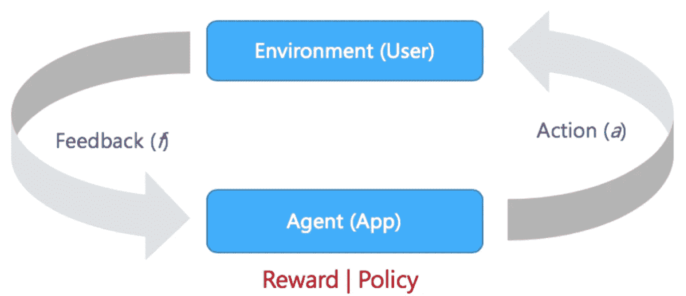
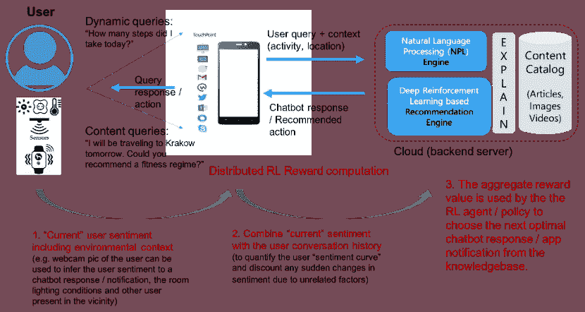
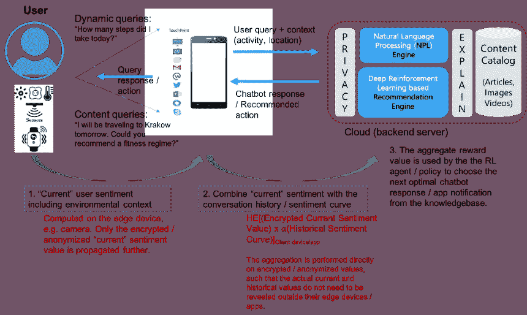
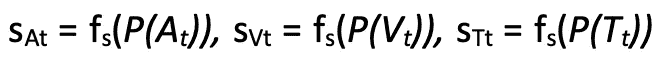
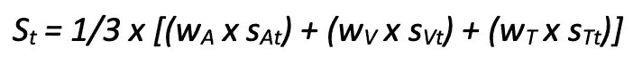
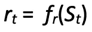

# 基于强化学习的隐私保护推荐器

> 原文：<https://towardsdatascience.com/privacy-preserving-recommenders-based-on-reinforcement-learning-13fd2bc391d3>

## 将隐私与强化学习相结合

Pic 鸣谢:探索未知，作者 Soma Biswas (Flickr: [链接](https://flic.kr/p/2neEnwZ)，经允许转载)

# 介绍

在本文中，我们主要关注在对话环境中实现推荐。更具体地说，我们考虑一个能够与用户对话的应用程序，向用户提供有趣和相关的信息；(按需)响应特定的用户查询，或者以及时和相关的警报形式主动提供。

*互动个性化*:虽然今天的聊天机器人能够根据用户情绪来个性化对话，但这种情绪通常来自用户的查询/响应——通常由用户明确提供的用户反馈。这导致了对提供这种反馈的用户的依赖，并意味着代表用户的额外努力。此外，反馈是非常个人化的，由用户特别提供，而不考虑周围环境、位置(家、办公室、市场……)、附近的其他家庭成员等。

> 这篇文章旨在通过提供基于*隐含*用户反馈、*适应历史和环境背景*的高度个性化和交互式体验来改善这一方面。

*   *隐式反馈*:基于用户提供的显式反馈(例如，用户响应、NPS 分数/评级)和隐式反馈(例如，在接收到聊天机器人响应/通知时面部表情的变化)来计算用户情绪
*   *环境背景*:第二个区别点基于我们考虑用户环境(周围)因素的事实，例如位置(家庭、办公室、市场……)、温度、照明、一天中的时间、天气、附近的其他家庭成员等等；根据用户/环境情绪调整对话的参数。
*   *对话历史*:任何用户反馈都需要与迄今为止用户对对话的反应相结合。这使得我们可以忽略用户反馈/情绪的任何突然变化，这可能是由于外部因素造成的，与应用程序/聊天机器人的交互无关。

**隐私保护交互**:捕捉用户情感，尤其是。环境方面，需要高度的知识规。用户上下文。因此，我们需要以保护隐私的方式执行此操作，以充分解决用户隐私问题，同时提供高度个性化的体验。

> 本文通过向核心聊天机器人和强化学习(RL)框架添加隐私层来实现这一点。

RL 是我们用来使对话实时适应用户/环境上下文的核心技术。

相对于当前技术水平，此处的主要优势是:

> 从聊天机器人的角度来看，我们展示了用户反馈(包括环境参数)和对话历史如何以隐私保护的方式作为参数来适应/个性化用户对话。
> 
> 从 **RL 框架**的角度，我们展示了 RL 奖励计算是如何分布的，从而在提供奖励函数的准确表示的同时保护用户隐私。

# 背景

*建议*:拥有一个由有趣的文章、事实、数据和视频组成的知识库，其中的文章根据他们最可能感兴趣的用户资料进行分类。然后向用户提供最相关文章的基于简档的提醒/通知。

*聊天机器人*:以上是一次性互动的经典例子，虽然个性化；错过互动部分。聊天机器人可以克服这个限制。今天的企业聊天机器人是基于 FAQ 的[1，8]。这种聊天机器人的核心是一个意图识别自然语言理解(NLU)引擎，它通过问题变体的硬编码示例进行训练。当没有符合 30%以上置信度的意图时，聊天机器人会返回一个后备答案。对于所有其他情况，NLU 引擎会随响应一起返回相应的可信度。高级聊天机器人还会考虑嵌入在查询/响应中的用户情绪，以相应地调整响应。

*强化学习(RL)* : RL 指的是 AI/ML 的一个分支，针对目标导向的问题。RL 算法能够通过在许多步骤上最大化奖励函数来实现复杂的目标，例如在许多步骤上在游戏中赢得的分数。奖励功能的工作原理类似于用糖果和打屁股来激励孩子，这样算法在做出错误决定时会受到惩罚，在做出正确决定时会受到奖励——这就是强化。RL 算法如下图所示——图 1。有关 RL 框架的详细介绍，感兴趣的读者可以参考[2]。

图 1:强化学习(作者图片)

# 基于 RL 的推荐解决方案架构

在这一节中，我们概述了基于隐式用户反馈实现个性化交互的解决方案架构，接下来是下一节中的隐私保护扩展。

图 2 中的架构示出了包括隐式用户反馈的用户和环境条件如何

1.使用可用的传感器收集以计算“当前”反馈，包括环境背景(例如，用户的网络摄像头照片可用于推断用户对聊天机器人响应/通知的情绪、房间照明条件和附近的其他用户)

2.其然后与用户对话历史相结合，以量化用户“情感曲线”,并忽略由于不相关因素引起的情感的任何突然变化

3.导致与提供给用户的最后聊天机器人响应/应用通知相对应的合计奖励值。

> 然后，该奖励值被反馈给 RL 代理，以便 RL 策略从知识库中选择下一个最佳聊天机器人响应/应用程序通知。

这导致了分布式 RL 奖励计算，据我们所知，这在以前的文献中还没有考虑过。

图 2:个性化架构——分布式 RL 奖励计算(图片由作者提供)

# 隐私保护交互

隐私保护保证由多种技术提供:

*   在“边缘”设备/传感器上分布情感计算，例如可以在摄像机本身上计算“当前”情感。它可以被计算和匿名化，使得只有归一化的情感分数被传播到移动设备或云以供进一步计算。不需要在任何点传播捕获的(网络摄像头)用户图像，该图像可以在“当前”情感计算之后被销毁。
*   隐私保护方案，例如秘密共享和同态加密[3]，可以用于将正/负“当前”情感值与移动设备上的历史情感曲线相加和，而移动设备上的客户端应用不知道实际的“当前”情感值。

> 这允许 RL 代理受益于非常详细和准确的奖励值，尽管是以隐私保护的方式。

隐私保护 RL 奖励计算流水线如图 3 所示。

图 3:隐私保护对话架构(图片由作者提供)

# 隐私保护强化学习

## 传感器/ **边缘设备**的隐私保护

在这种情况下，边缘设备可以是(独立的)摄像头、麦克风、恒温器、智能手表，或者是嵌入在承载应用的移动设备中的摄像头、麦克风、加速度计。

例如，我们认为用户情绪是基于边缘设备/传感器捕获的音频、视觉、文本反馈来计算的。我们进一步假设，对于每个感觉参数，用户可以提供对应于不同方面(例如位置、人、健康/活动)的隐私敏感度等级(低、中、高)。

让*在*、 *Vt* 、 *Tt* 参考在 *t* 期间捕获的音频、视觉和文本反馈。

*   例如，让 *Vt* 对应于背景中有家庭成员的用户的视频帧。在这种情况下，关于“人”的“低”、“中”和“高”隐私设置将对应于保持画面原样、模糊人的面部、裁剪图像以将人从画面中完全移除。
*   类似地，让 *Tt* 对应于用户提供的文本响应，例如“我明天要去克拉科夫出差”在这种情况下，关于“位置”的“低”、“中”和“高”隐私设置将对应于保持响应原样，在响应中将“克拉科夫”抽象为“欧洲的某个地方”，从响应中完全移除目的地:“我明天将出差”

## 通过移动应用程序保护隐私

让 *P(At)* 、 *P(Vt)* 和 *P(Tt)* 表示各自捕获的感官反馈，由边缘设备传感器应用隐私保护——根据用户指定的设置。边缘设备然后与移动应用共享 *P(At)* 、 *P(Vt)* 和 *P(Tt)* 。

让

表示基于各自的感觉反馈独立计算的用户情绪。用户情感计算可以被认为是输出在*1–10*之间的值的分类器。

下一步，也是移动应用的主要功能，是聚合上述(独立计算的)情感值，并计算合并的用户情感 *St* 。聚集函数例如可以是加权平均值:

只要它满足下面的一致性检查:如果在 3 个用户情感值之间存在显著的差异；然后可以应用不同的策略来巩固它们:

a.忽略这个反馈周期，因为不同的感官反馈之间有太多的差异。这通过将值 *0* 分配给综合用户情绪 *St* 来表示。

b.向显式反馈提供比隐式反馈更高的权重，例如，如果文本情感得分是基于用户键入的响应计算的，而视觉得分是基于背景帧计算的；然后给予基于文本的情感分数更高的权重。例如，用户可能在快照中带着他的孩子微笑，但从他的文本/语音响应来看，他似乎“有压力”——在这种情况下，我们优先考虑“有压力”的用户情绪。

> 隐私保护应用的输出是提供(合并的)用户情感 *St* ，以及由用户提供的任何明确的用户响应 *{P(At)，P(Vt)，P(Tt)}* (根据边缘设备/传感器处的用户设置匿名化)。

例如，在聊天对话的情况下，在“位置”隐私设置为“中等”的情况下，它会将 *St* 连同用户响应“我明天将去欧洲出差”一起发送到后端 RL/NLP 引擎。

## 后端隐私保护— RL 引擎

我们关注强化学习(RL)引擎的两个关键功能:奖励功能和(RL 代理)策略——它们共同调节 RL 引擎内容个性化。我们考虑一个分类内容目录，其中应用推荐/(聊天)响应被分组为与用户兴趣相关的类别，例如旅游、娱乐、健康、位置等。

我们首先概述奖励函数 *fr* ，它基于确定的用户情绪 *St* 计算对应于最后一个 RL 引擎(在的动作*)推荐/响应的奖励。*

其中函数 *fr* 逻辑如下所示:

*   如果 *(St = 0)* ，由于反馈收集过程中的不一致性，我们简单地忽略这个学习循环。
*   **历史归一化**:对于*St =[1–10]*，在将 *St* 值赋给奖励值 *rt* 之前，会根据历史上下文进一步归一化。历史背景确定如下:
    (a)在正在进行的(连续的)对话的情况下，将当前情绪与到目前为止的对话的情绪曲线进行比较，以标准化其影响。

> 例如，如果对话情绪已经变得更糟，低的当前情绪可能不仅仅是上一个动作的错误；因此，奖励需要相应地调整。
> 
> *另一方面，给定恶化的情感曲线，高情感值将暗示最后的动作对用户具有非常积极的影响；因此相应的回报需要进一步提高。*

*   在**特别推荐**的情况下，可以应用类似的归一化逻辑，其中根据先前接收到的反馈(情感值)对当前情感 *St* 进行校准，该反馈用于与上一个动作相同类别的推荐。
*   **延迟奖励**:对于连续对话和特别推荐，也可以应用“延迟奖励”的替代策略，其中最后 *m* 行动的奖励被组合并(追溯性地)应用于【在的*、*在-1* 、…、*在-m* 。例如，如果对于类别“旅行”的推荐，当前情绪 *St* 较低，已知用户过去对该推荐(对其他“旅行”推荐)反应非常积极；延迟奖励策略将简单地缓冲当前值(在*、*和*)，并向 RL 代理(策略)提供指示以尝试相同类别的另一个推荐来“验证”用户情绪——在更新在的*和在+1* 的*的奖励之前。有关 RL 延迟奖励政策的更正式描述，请参考[4]。*

# 参考

1.  Biswas，D.: *聊天机器人&自然语言搜索。*走向数据科学，2019 ( [链接](/chatbots-natural-language-search-cc097f671b2b))
2.  巴尔托，a .，萨顿，R.S.: *强化学习:导论*。麻省理工学院出版社，2018 年，[http://incompleteideas.net/book/RLbook2018.pdf](http://incompleteideas.net/book/RLbook2018.pdf)
3.  D.比斯瓦斯。保护隐私的聊天机器人对话。进行中。第 34 届 NeurIPS 隐私保护机器学习研讨会(PPML)，2020 年( [pdf](https://ppml-workshop.github.io/ppml20/pdfs/Biswas.pdf) )。也发表在《走向数据科学》([链接](/hidden-privacy-risks-of-chatbot-conversations-881dbeeb98a))
4.  基于强化学习的推荐系统。走向数据科学([链接](/reinforcement-learning-based-recommender-systems-492a2674fcc))，也发表在 2020 年 9 月第 24 届欧洲人工智能大会(ECAI)的“医疗保健人工智能进展”专题中。
5.  崔顺实，夏，黄，吴..使用双聚类技术的基于强化学习的推荐系统。arXiv:1801.05532，2018。
6.  刘，冯，唐，r，李，x，叶，y，陈，h，郭，h，张，y:*基于深度强化学习的推荐与显式用户-项目交互建模*。arXiv:1810.12027，2018
7.  Taghipour，Kardan，a .，Ghidary，S.S.: *基于使用的网络推荐:强化学习方法*。摘自:美国计算机学会推荐系统会议，第 113-120 页(2007)。
8.  Ricciardelli，e .，Biswas，D.: *基于强化学习的自我改进聊天机器人*。in:2019 年第四届强化学习与决策多学科会议。也发表在《走向数据科学》([链接](/self-improving-chatbots-based-on-reinforcement-learning-75cca62debce)