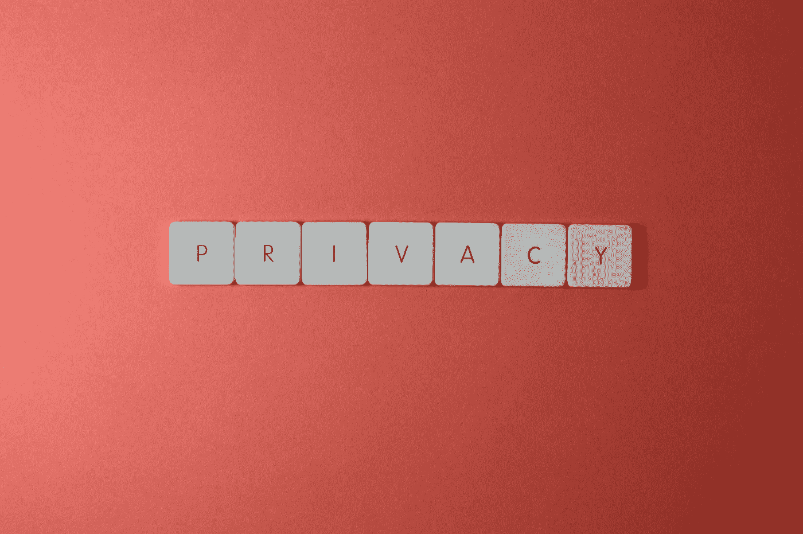

# 人工智能/人工智能应用中的隐私风险最小化

> 原文：<https://towardsdatascience.com/privacy-risk-minimization-in-ai-ml-applications-cac35c0077b6>

## 如何评估使用客户数据时的隐私风险，并利用隐私增强技术将风险降至最低

米格尔·Á拍摄的照片。帕德里纳对[派克斯](https://www.pexels.com/photo/close-up-shot-of-keyboard-buttons-2882638/)

# 隐私问题

在这个数据优先的组织时代，无论您处于哪个行业，您都很可能收集、处理和分析大量的客户数据。这可能是为了满足客户的服务请求，出于法律或监管原因，或者通过使用人工智能或机器
学习的个性化为您的客户提供更好的用户体验。然而，根据 [Statista](https://www.statista.com/statistics/273550/data-breaches-recorded-in-the-united-states-by-number-of-breaches-and-records-exposed/) 的统计，数据泄露每年都在增加，2021 年 **1862** 报告的数据泄露**比 2020 年**增加了 68%，其中 83%涉及敏感信息。由于身份盗窃、跟踪、勒索软件攻击等原因，此类敏感信息落入坏人之手可能会给客户的生活造成严重破坏。这再加上各州隐私法和立法的兴起，使得增强隐私的数据处理技术走到了前沿。

# 隐私与数据效用的权衡

对于个性化等人工智能应用，隐私和数据效用可以在光谱的相反侧可视化。不包含任何个人信息的数据，即不暴露客户的特征或特性的数据，没有个性化的价值。然而，包含个人信息的数据可以用来提供高度个性化的体验，但如果数据集最终落入任何人手中，都可能导致客户数据隐私的丢失。因此，在隐私风险和数据的实用性之间总是存在固有的权衡。

# 对组织而言，隐私至上的价值

健康保险便携性和责任法案(HIPAA)、加州消费者隐私法案(CCPA)、儿童在线隐私保护法案(COPPA)、生物识别法案只是美国众多以隐私为中心的法律和法规中的一部分。未能遵守此类法规可能会给组织带来数十亿美元的罚款。例如，最近，得克萨斯州起诉脸书的母公司 Meta，要求赔偿数十亿美元的损失，因为该公司错误处理和利用了该州数百万人的敏感生物数据。隐私第一有助于避免巨额罚款，而且不仅限于失去经营执照。此外，消费者的信任和忠诚度、品牌形象和感知也会遭受巨大损失。忽视消费者的数据隐私会破坏客户的终身价值，影响转换和更新。事实上，像苹果这样的公司已经颠倒了这个问题，事实上正在利用隐私作为竞争的护城河，作为与其他技术公司的区别。

由[像素](https://www.pexels.com/photo/person-in-white-dress-shirt-holding-pen-writing-on-white-paper-7578815/)上的 cotton bro 工作室[拍摄的照片](https://www.pexels.com/@cottonbro/)

# **组织收集的数据中的隐私风险来源**

组织内隐私风险有三个主要来源:

1.  原始客户数据及其衍生产品。原始客户数据可以是客户输入的数据，如姓名、地址、年龄、性别和其他个人资料详细信息，或者是关于客户如何使用产品的数据，如页面访问量、会话持续时间、购物车中的商品、购买历史、支付设置等。
2.  元数据和日志。元数据和日志包括客户位置、产品网站的访问位置、设备的 IP 地址、MAC 地址、服务日志、客户支持电话记录等。
3.  接受过客户数据培训的 ML 模型。ML 模型本身看起来似乎不包含任何个人信息，但 ML 模型可以记住它所训练的数据中的模式。针对关键客户数据训练的模型可以在模型中保留客户的个人数据，并呈现客户个人数据暴露风险，而不管模型是部署在云中还是边缘设备上。如果恶意行为者获得了这种模型的访问权限，即使是作为黑盒，他们也可以运行一系列攻击来恢复个人数据，从而导致隐私泄露。

ML 模型的安全分类应该基于其训练数据的数据分类来确定。ML 模型工件可以包含明文客户数据，ML 模型本身容易受到隐私攻击。如果一个组织正在运行一个市场并与外部合作伙伴共享 ML 模型，即使在 NDA 和数据共享协议下，ML 模型也存在隐私攻击的高风险。

# 识别隐私姿态中的差距

希望确保其数据隐私合规性的组织应进行差距分析，以确定任何潜在的风险和弱点。数据隐私影响评估(DPIAs)是组织运行差距分析的重要工具。该流程包括检查与隐私和数据保护相关的现有实践、政策和程序，以评估它们与当前法律要求的一致性。差距分析通常由组织内的安全和数据隐私职能部门进行，因此将由数据保护官(DPO)进行。差距分析也可以外包，但提出请求的组织仍然对其负责。

进行差距分析时，组织需要考虑数据保护的所有方面，包括物理安全措施、访问控制和数据加密技术。他们还应审查与信息处理、数据存储和共享相关的政策和程序。组织应考虑来自外部来源的潜在威胁(例如网络罪犯)，以及由人为错误或恶意意图导致的内部威胁。例如，对于 GDPR 来说，重要的是不仅要考虑哪些用户可以访问客户数据，还要评估为什么员工首先需要访问客户数据。如果用例不符合与个人数据的[处理相关的预定义原则，则应立即撤销用户权限。评估还应考虑针对受保护数据资产的各种威胁发生的可能性，以及每种威胁一旦发生对组织运营的估计影响。](https://gdpr-info.eu/art-6-gdpr/)

一旦发现任何弱点，组织就可以采取措施，通过实施必要的更改(如采用新工具或更新现有策略)来缩小差距。例如，组织可以选择实施细粒度的访问控制，如仅在短期内有效的访问(有时间限制的访问控制)、仅在预定义的地理位置内访问或仅从一组固定的设备或 IP 地址访问。此外，他们可能需要为员工创建额外的培训课程，以便员工了解最新的数据保护法规，并在处理客户数据时能够采取正确的措施。

DPIA 和差距分析不是一次性的事情，组织在考虑引入涉及个人数据的新系统或实践时，应考虑进行 DPIA。总的来说，差距分析是在组织内维护有效的数据隐私计划的重要组成部分。它有助于降低违规风险，并确保遵守适用的数据保护法。通过采取积极主动的方法进行数据隐私合规性差距分析，组织可以更好地保护其客户的敏感信息，同时确保处理个人数据所涉及的所有系统和操作的最高安全级别。

# 使用隐私增强技术来增强隐私姿态

顾名思义，宠物是组织识别、减少或消除潜在数据隐私风险的工具。通过在其系统中部署 pet，组织可以帮助最大限度地减少敏感个人信息的泄露，并证明符合适用的数据保护要求。PETs 的一些例子包括标记化、差分隐私、同态加密、联合学习和安全多方计算。

T **okenization:** 是用假名、匿名令牌或随机字符串替换敏感客户数据(如姓名或 SSN)的过程，这些数据没有任何关联意义。这可以防止任何恶意行为者在发生违规时访问有价值的客户数据。例如，零售商可以通过用随机生成的字符串或字符替换中间的 8 个数字来存储一个假设的信用卡号码*1234–5678–9011–2345*。通过这种方式，零售商仍然可以识别和使用信用卡，但如果数据库被攻破，它将永远不会暴露给任何恶意行为者。这种技术的一个缺点是，为了将来再次将信用卡用于合法用途(如自动订阅支付)，组织需要一种确定性的方法来从令牌化的值中恢复原始卡号。如果令牌化算法落入坏人之手，可能会导致数据隐私泄露。

D [**不同的隐私**](https://medium.com/georgian-impact-blog/a-brief-introduction-to-differential-privacy-eacf8722283b) **:** 是一种通过向数据中添加随机噪声来保护数据集中个人隐私的方法，这种方法在保持整体信息的同时很难识别任何个人。目标是确保不会泄露数据集中任何个人的任何信息，同时仍然允许对整体数据进行有用的分析。这种工作方式的一个例子是美国人口普查中“差别隐私”的使用。人口普查局从个人那里收集大量信息，包括收入和种族等敏感信息。为了保护个人隐私，人口普查局在向研究人员发布数据之前会在数据中加入噪声。这使得任何人都很难确定特定个人的信息，但仍允许对数据中的总体趋势和模式进行分析。添加噪声也带来了挑战，因为它很难从数据中提取准确的见解。随着数据量的增加，保证一定隐私级别所需的噪声量也会增加，这可能会降低数据对分析的有用性。差分隐私算法可能非常复杂并且难以实现，尤其是对于大型数据集或某些类型的查询。最后，实现差分隐私在计算上可能是昂贵的，并且可能需要专门的硬件或软件。

H [**同态加密:**](https://medium.com/privacy-preserving-natural-language-processing/homomorphic-encryption-for-beginners-a-practical-guide-part-1-b8f26d03a98a) 同态加密是一种允许对密文执行计算的加密类型，密文是加密的数据。计算的结果仍然是加密的，但是它可以被解密以揭示对原始明文的计算结果。这允许处理和分析敏感数据，而不必解密，从而维护数据的隐私和安全。投票系统就是一个例子。投票系统可以使用同态加密来确保投票的私密性和安全性。系统可以对投票进行加密，然后对加密的投票进行计算，以确定选举的获胜者。加密的投票可以被解密以揭示计算的结果，但是个人投票仍然是保密的。同态加密由于其计算效率低、功能有限、安全风险、密钥管理、可扩展性、缺乏标准化、复杂性和有限的商业用途而难以实现。此外，还需要更多的研究来提高同态加密算法的效率，使其在现实世界中更加实用。

F 这是通过在每个设备或团体上本地训练模型，然后通过安全通信信道聚集模型更新，而不是共享数据本身来实现的。联合学习的一个例子是在移动设备的环境中。一家移动公司可能希望训练一个模型来提高他们的键盘应用程序的性能。通过联合学习，该公司可以根据用户设备上的数据训练模型，而不必收集或共享数据。来自每个设备的更新模型可以被聚集以改进整体模型。联合学习在计算上是昂贵的，并且可能需要典型组织可能无法访问的专门基础设施。此外，来自不同方的组合数据可能具有不同的分布，这使得很难训练出适合所有方的单一模型。

随着过去 5 年取得的巨大进步，隐私增强技术正在快速发展。然而，PET 不是灵丹妙药，仍然有一些挑战需要克服。最大的一个问题是，宠物以它们自己的方式是独一无二的，每种宠物都提供不同的能力，具有不同的隐私与效用权衡。组织需要深入了解他们的用例，并评估哪种宠物最适合他们的组织。此外，一些解决方案可能需要大量的 IT 资源或技术专业知识来进行安装，这意味着并非所有组织都有能力利用这种技术。对于组织或个人来说，实施 PETs 的成本也很高。最后，这些解决方案需要定期维护，例如模型漂移校正或用最新数据重新训练模型，因此组织或个人很难跟上必要的更新以确保有效的安全措施仍然存在。

学术界、研究和创业公司的热情成员正在努力克服挑战，使宠物成为每个组织的 SaaS 工具包的一部分。我强烈鼓励任何感兴趣的人通过参加会议、阅读研究论文和加入开源社区来了解最新动态。

*Pushpak Pujari 是人工智能(AI)、计算机视觉(CV)、物联网(IoT)、数据隐私和安全领域的行业专家。他是众多会议的专题演讲人和主讲人，如* [*边缘 AI 峰会*](https://www.edgeaisummit.com/events/edge-ai-summit) *、* [*隐私增强技术峰会*](https://www.kisacoresearch.com/sites/default/files/agendas/ks221228_pets_usa_brochure_v5_-_compressed.pdf) *、以及* [*AI 硬件峰会*](https://www.aihardwaresummit.com/content/pushpak-pujari) *。他还在众多出版物中撰写文章和白皮书，如* [*【企业观点】*](https://enterpriseviewpoint.com/privacy-risk-minimization-in-ai-ml-applications/) *和* [*产品学院*](https://productschool.com/product-leaders/pushpak-pujari) *。普什帕克是领先的湾区企业安全摄像机初创公司*[*Verkada*](https://www.verkada.com/)*的安全摄像机产品负责人，拥有沃顿商学院的 MBA 学位和印度 IIT 德里大学的电气工程学士学位。* [*在 LinkedIn 上关注他*](https://www.linkedin.com/in/pushpakpujari/) *。*