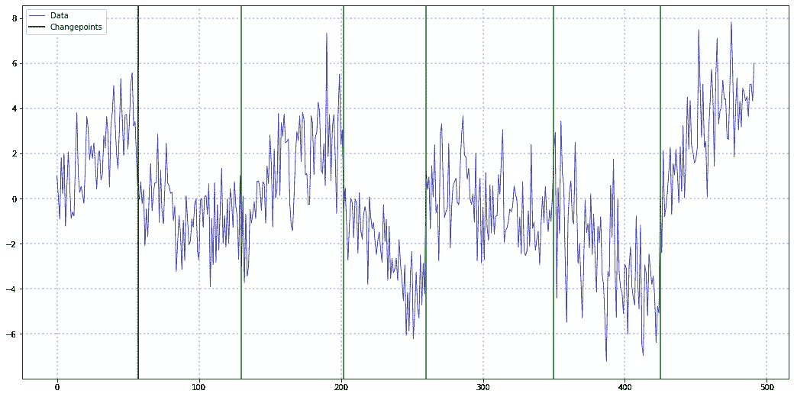
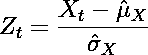
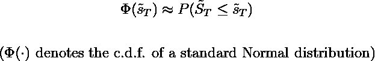
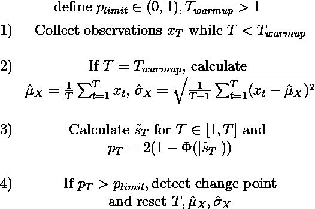
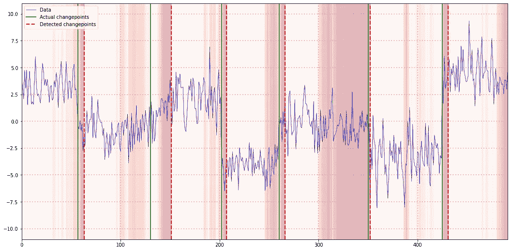
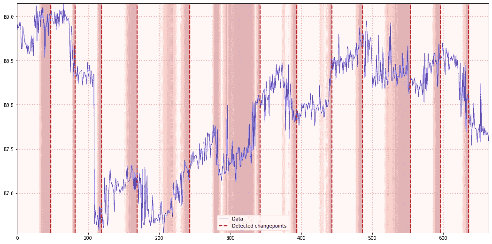

# 用于变化点检测的概率累积和

> 原文：<https://towardsdatascience.com/probabilistic-cusum-for-change-point-detection-121f793ab3a1>

## CUSUM 可以说是物联网或金融应用中最简单的变点检测算法。

克里斯·劳顿在 [Unsplash](https://unsplash.com/s/photos/changes?utm_source=unsplash&utm_medium=referral&utm_content=creditCopyText) 上的照片

# 介绍

根据著名的[奥卡姆剃刀](https://en.wikipedia.org/wiki/Occam%27s_razor)原理，较简单的模型比复杂的模型更可能接近真理。对于变化点检测问题，如在物联网或金融应用中，可以说最简单的是**Cu**mulative**Sum**(Cu Sum)算法。

尽管它很简单，但它仍然是一个强大的工具。事实上，CUSUM 只需要对潜在的时间序列做一些松散的假设。如果这些假设得到满足，就有可能证明大量有用的统计特性。

# 快速浏览 CUSUM

总之，CUSUM 检测在两个变点之间静止的时间序列的平均值的变化。考虑以下时间序列:

*具有变化点(绿色直线)的分段平稳时间序列(蓝色)示例*。CUSUM 可以处理这样的数据。(图片由作者提供)

这个例子在每对变化点之间是固定的，因此是我们的 CUSUM 算法的完美用例。对于像下一个这样的非平稳时间序列的变点检测，CUSUM 可能无法按预期工作:

两个变化点之间具有非平稳性的时间序列示例。CUSUM 无法正常处理这样的数据。(图片由作者提供)

虽然 CUSUM 可能仍然能够检测到从稳定段到非稳定段的偏移，但不能保证它能可靠地做到这一点。

总的来说，CUSUM 背后的思想可以大致概括如下:

**如果时间序列具有恒定的零均值，其实现的累积和收敛于零均值正态分布(给定一些相对宽松的技术假设)。因此，如果累积和偏离零均值正态分布，潜在的时间序列可能会出现转折点。**

我们可以从众多[中心极限定理](https://en.wikipedia.org/wiki/Central_limit_theorem) (CLTs)中的一个推导出这一点。虽然每个 CLT 都有一些额外的要求(例如，[李亚普诺夫 CLT](https://en.wikipedia.org/wiki/Central_limit_theorem#:~:text=set.%5B5%5D-,Lyapunov,-CLT%5Bedit) 的独立抽签和有限方差)，但您的特定时间序列很可能满足其中一个要求。

在实践中，我们将估计当前状态的平均值，将其从时间序列中减去，并计算累积和。这就只剩下一个问题，那就是当一个改变点发生时，该如何设置规则。

wikipedia 中的标准 CUSUM 算法建议对时间序列的 z 标准化实现求和。每当该总和超过预定义的阈值时，就会出现变化点。因此，整个过程是一个“在线”算法，即我们可以在实时数据流上使用它。

# 标准累积和算法的一些问题

您可能已经问过自己应该如何在 CUSUM 中设置变化点阈值。毕竟门槛设置太松会导致改点未被发现。另一方面，狭窄的阈值容易导致频繁的错误警报。

遗憾的是，要找到解决这个问题的明确说明并不容易。虽然经验法则或对某些设置进行试验偶尔会奏效，但这显然不是一个可靠的解决方案。此外，当我们想要对大量数据流应用 CUSUM 时，这是不可行的。

另一个问题是给定子序列的异常程度。即使没有变化点发生，发现时间序列何时出现意外行为仍然是有意义的。

幸运的是，我们可以通过稍微修改原始的 CUSUM 算法来应对这两个挑战。

# 累积和的概率版本

在这一点上，我们将最终需要一些方程。首先，我们定义时间序列的任意子序列的标准化观测值:

(图片由作者提供)

帽子符号强调，我们只能使用序列的均值和标准差的估计值。我们可以计算这些值，例如，通过使用我们估计的第一个`N`实现。

如果我们假设某些 CLT 的条件适用于我们的序列，则下列条件在极限情况下大致成立:

(图片由作者提供)

通过将累计总和除以时间范围的平方根，我们得到一个(**理论**)标准正态分布。因此，只要我们的 CLT 假设有效，以下适用于已实现时间序列的标准化累积和:

(图片由作者提供)

得到的值可以解释为理论累积和与我们观察到的值一样小的概率。这实际上相当于经典假设检验中对一个 [**p 值**的定义。](https://en.wikipedia.org/wiki/P-value)

但是请注意，上述数量目前仅在一个方向上起作用，即如果标准化总和为负。为了使这成为一个双边统计，我们可以要求标准化和的概率至少和我们的实现值一样远离均值。由于我们的和是一个标量值，我们可以简单地将从零开始的'*距离*'定义为绝对值，并简化为:

(图片由作者提供)

我们现在可以使用这个概率代替原始的标准化累积和来检测变化点。与最初的总和相反，这一措施有一个明确的，概率性的解释。对于每一个新的数据点，我们可以直接获得相应观察值的极端程度。

一旦超过“不太可能”的某个阈值，我们将相应的时间戳标记为变化点，并重新开始算法。

大致而言，算法如下所示:

(图片由作者提供)

在 Python 中，可能的实现如下所示。我使用 PyTorch 来考虑未来可能的扩展，包括自动签名功能:

# 实践中的概率累积和

让我们用两个例子来试试上面的算法。首先，我们使用简介中的模拟恒定均值数据集:

*模拟数据的概率累积和——红色阴影标记了上述定义的极端概率。(图片由作者提供)*

我们修改后的 CUSUM 版本能够检测所有的变化点，尽管在检测上有一些延迟。然而，所有的变化点都落在我们的概率度量已经检测到异常行为的区域。因此，通过一些微调，甚至可以更早地发现关键的变化点。

对于我们的第二个例子，让我们使用来自 Kaggle 的 [Skoltech 异常基准数据集的摘录。我选择时间序列时考虑了 CUSUM 背后的假设(特别是常数均值假设)。因此，结果不应作为可靠的基准，而应作为说明性的例子:](https://www.kaggle.com/datasets/yuriykatser/skoltech-anomaly-benchmark-skab?resource=download)

*现实世界数据集上的概率累积和。(图片由作者提供)*

虽然我们的 CUSUM 变量在线性趋势模式上有一些问题，但总体结果看起来是合理的。这也证明了这种算法的局限性，一旦常数均值假设被违反。然而，尽管简单，CUSUM 似乎是一个有用的选择。

# 结论

虽然 CUSUM 是一个非常简单的算法，但只要满足底层假设，它就可以非常强大。通过一个简单的概率修改，我们可以很容易地改进标准版本的 CUSUM，使其更具表现力和直观性。

然而对于更复杂的问题，更复杂的算法可能是必要的。一个特别有用的算法是[贝叶斯在线变点检测](https://gregorygundersen.com/blog/2019/08/13/bocd/),我希望能在未来涵盖它。

*原载于 2022 年 8 月 4 日*[*【https://www.sarem-seitz.com】*](https://www.sarem-seitz.com/probabilistic-cusum-for-change-point-detection/)*。*