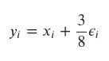
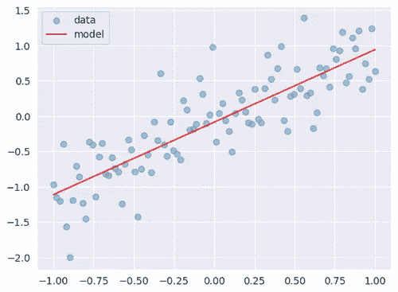
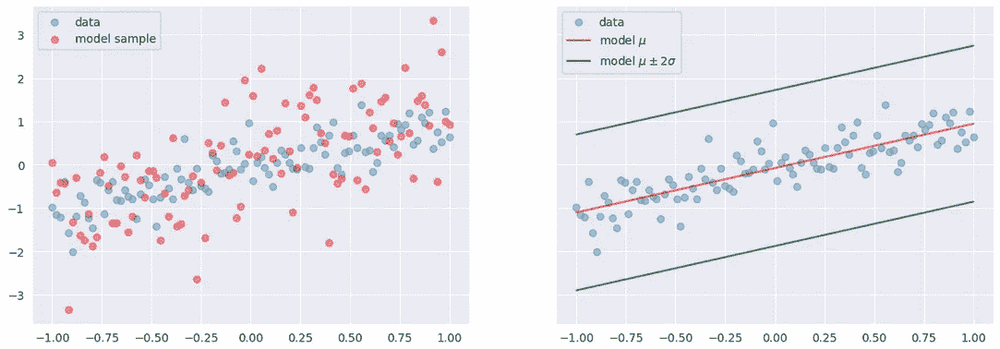
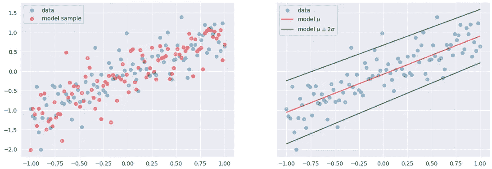

# 张量流中从头开始的概率线性回归

> 原文：<https://towardsdatascience.com/probabilistic-linear-regression-from-scratch-in-tensorflow-2eb633fffc00>

## 概率深度学习

# 介绍

本文属于“概率深度学习”系列。这个每周系列涵盖了深度学习的概率方法。主要目标是扩展深度学习模型，以量化不确定性，即知道他们不知道的东西。

我们使用张量流和张量流概率开发我们的模型。TensorFlow Probability 是一个构建在 TensorFlow 之上的 Python 库。我们将从能在张量流概率中找到的基本对象开始，并理解我们如何操纵它们。我们将在接下来的几周内逐步增加复杂性，并将我们的概率模型与现代硬件(如 GPU)上的深度学习相结合。

迄今发表的文章:

1.  [张量流概率简介:分布对象](https://medium.com/towards-data-science/gentle-introduction-to-tensorflow-probability-distribution-objects-1bb6165abee1)
2.  [张量流概率简介:可训练参数](https://medium.com/towards-data-science/gentle-introduction-to-tensorflow-probability-trainable-parameters-5098ea4fed15)
3.  [张量流概率中从零开始的最大似然估计](/maximum-likelihood-estimation-from-scratch-in-tensorflow-probability-2fc0eefdbfc2)
4.  [tensor flow 中从头开始的概率线性回归](/probabilistic-linear-regression-from-scratch-in-tensorflow-2eb633fffc00)
5.  [使用 Tensorflow 进行概率回归与确定性回归](https://medium.com/towards-data-science/probabilistic-vs-deterministic-regression-with-tensorflow-85ef791beeef)
6.  [Frequentist 与 Tensorflow 的贝叶斯统计](https://medium.com/towards-data-science/frequentist-vs-bayesian-statistics-with-tensorflow-fbba2c6c9ae5)


图 1:我们今天的口头禅:用我们的概率(和某种艺术)帽子来拟合线性模型([来源](https://unsplash.com/photos/RnCPiXixooY)

像往常一样，代码可以在我的 [GitHub](https://github.com/luisroque/probabilistic_deep_learning_with_TFP) 上找到。

# 确定性线性回归

为了使我们的过程更容易理解，让我们从创建一些遵循线性模式的数据开始。通过综合生成这些数据，我们有优势知道什么是确切的生成过程，因此，我们只需要找到一种方法，从观察结果回到生成过程。这听起来并不复杂，但一旦我们进入更复杂的生成过程，我们对它进行逆向工程的能力将变得越来越具有挑战性。

我们将使用的数据是根据以下等式人工创建的:



其中*𝜖𝑖*∽*n*(0，1)独立同分布。

```
x_train = np.linspace(-1, 1, 100)[:, np.newaxis]
y_train = x_train + (3/8)*np.random.randn(100)[:, np.newaxis]

plt.scatter(x_train, y_train, alpha=0.4)
plt.xlabel('x')
plt.ylabel('y')
plt.show()
```


图 2:遵循带有高斯噪声的线性方程人工生成的数据。

对于 TensorFlow 和 Keras，在将模型拟合到我们的数据之前，需要定义一些组件。首先，我们选择 Keras API，因为 Keras 提供了两个选项:顺序和函数 API。在这种情况下，我们将使用顺序 API，但是作为练习，您可以尝试使用函数 API 重新实现我们的算法。接下来，我们需要为简单的神经网络定义输入。您可以将此输入视为真实数据的占位符，稍后，我们将通过模型传递这些数据。它的目的是告知模型在未来某个时间点要摄取的数据的形状。请注意，我们没有明确定义输入的第一维，因为它是批量大小，模型应该能够处理任何批量大小。回想一下，批量大小是每个训练时期使用的训练样本的数量。

既然我们已经指定了输入，是时候选择损失函数了。对于线性回归情况，通常的候选值是均方误差。下一步，我们需要构建我们的神经网络架构，为此，我们将采用最简单的形式:具有 1 个单元的密集层。最后，我们可以选择我们的优化器(在这个阶段不相关)和训练时期的数量。

让我们定义一个模型，它将每个输入作为一个长度为一的向量来接收，这个向量转化为一个`input_shape=(1,)`。这意味着我们只有一个特征。该模型仅预测一个目标变量，使用上面定义的密集层。我们正在编译具有均方误差损失的模型，使用`RMSprop`优化器并训练 400 个时期。

```
model = Sequential([
    Dense(1, input_shape=(1,))
])

model.compile(loss=MeanSquaredError(), optimizer=RMSprop(learning_rate=0.005))
model.fit(x_train, y_train, epochs=400, verbose=False)
```

在上一篇文章中，我们看到了如何在 TensorFlow 中定义`Variable`对象。这些对象是在训练过程中被更新的对象。这次我们没有明确定义它们，但是 Keras 已经为我们定义了它们。让我们在拟合数据后检查训练变量的值。因为我们正在定义一个确定性线性回归，我们有两个变量，斜率和截距。在上式中，斜率等于 1，截距等于 0。我们成功地取回了它们。

```
model.weights

[<tf.Variable 'dense_11/kernel:0' shape=(1, 2) dtype=float32, numpy=array([[ 0.97764325, -0.09925082]], dtype=float32)>,
 <tf.Variable 'dense_11/bias:0' shape=(2,) dtype=float32, numpy=array([-0.08040976, -0.7941095 ], dtype=float32)>]
```

我们可以绘制我们的模型，并对照观察到的数据检查它看起来如何。除了观察到的噪声之外，它对数据建模得相当好。我们没有得到任何关于预测不确定性的参考(从蓝点和红线之间的距离可以看出，存在显著的不确定性)。确定性线性回归不能捕捉任何关于数据生成过程中不确定性的信息，我们称这种类型的不确定性为随机的。

```
plt.scatter(x_train, y_train, alpha=0.4, label='data')
plt.plot(x_train, model.predict(x_train), color='red', alpha=0.8, label='model')
plt.legend()
plt.show()
```



图 3:符合观察数据的确定性线性回归模型。

# 概率线性回归

我们现在准备戴上我们的概率帽子。我们的兴趣是扩展我们的确定性方法来模拟观测数据中的随机不确定性。为了能够实现它，我们需要利用通常的猜想:张量流概率。如果您发现需要回顾一些关于张量流概率的概念，请随意查看我在本系列中的早期文章。

为了构建我们的概率模型，我们知道需要在某处添加一个高斯分布(因为我们在人工生成的数据中添加了高斯噪声)。我们想要拟合相同的线性回归模型，但是要学习两个额外的变量。让我们从高斯噪声的平均值开始。

既然我们很满意以前的架构来建模我们的数据，那么让我们用一个单元来定义相同的密集层。回想一下，这个设置确保我们在模型中添加了两个变量，斜率和截距。为了扩展我们的模型，使其能够捕捉产生噪声的高斯分布的平均值，我们将在架构中添加一个新层。这个新层是概率性的，而不是确定性的。在 Keras 中将任何分布纳入深度学习架构的通用方法是使用 TensorFlow Probability 的`DistributionLambda`层。`DistributionLambda`层返回一个分布对象，这是我们在以前的文章中非常熟悉的东西。在这种情况下，我们指定一个高斯分布对象。

请注意，前一层的输出定义了高斯分布的平均值，我们假设标准偏差是固定的(在我们的例子中为 0.5)。换句话说，`DistributionLambda`的构造函数有一个必需的参数，即函数。由于我们处于神经网络设置中，该函数接收前一层的输出作为其输入，并输出分布对象。在这种情况下，我们使用 lambda 函数来实例化`DistributionLambda`层。lambda 函数接收一个输入`t`，它是前一个密集层的输出张量，并返回一个平均值由张量`t`定义的高斯分布。

通过这种设置，模型在被调用时会返回一个分布对象。

```
model = Sequential([
    Dense(1, input_shape=(1,)),
    tfpl.DistributionLambda(lambda t: tfd.Normal(loc=t, scale=0.5))
])

model.summary()

Model: "sequential_1"
_________________________________________________________________
 Layer (type)                Output Shape              Param #   
=================================================================
 dense_1 (Dense)             (None, 1)                 2         

 distribution_lambda (Distri  ((None, 1),              0         
 butionLambda)                (None, 1))                         

=================================================================
Total params: 2
Trainable params: 2
Non-trainable params: 0
_________________________________________________________________
```

像往常一样，我们需要指定我们的损失函数。在概率情况下，正如我们在以前的文章中已经看到的几个例子，我们需要将负对数似然定义为我们的损失函数。

```
def nll(y_true, y_pred):
    return -y_pred.log_prob(y_true)
```

最后，我们准备编译并拟合我们的模型。

```
model.compile(loss=nll, optimizer=RMSprop(learning_rate=0.005))
model.fit(x_train, y_train, epochs=400, verbose=False)
```

与我们上面看到的相反，我们可以在右边的图中看到，我们的新模型现在正在捕捉任意的不确定性，这允许我们建立置信区间。如果我们使用平均值的两个标准差的区间，我们将有 95%的样本落在这些边界内。我们很容易就能看出，下面这个情节并不是这样。我们有 100%的值在区间内。这是因为虽然我们正确地获得了平均值，但我们没有推断出标准差。我们使用手动输入的值，它与真实值相差甚远。

在左图中，我们可以看到使用概率模式的主要优势之一:可以生成遵循与观察值相同的生成过程的样本。请注意，关于我们生成的样本，我们遇到了同样的问题，它们比真实数据分散得多。

```
y_model = model(x_train)
y_sample = y_model.sample()
y_hat = y_model.mean()
y_sd = y_model.stddev()
y_hat_m2sd = y_hat -2 * y_sd
y_hat_p2sd = y_hat + 2*y_sd

fig, (ax1, ax2) =plt.subplots(1, 2, figsize=(15, 5), sharey=True)
ax1.scatter(x_train, y_train, alpha=0.4, label='data')
ax1.scatter(x_train, y_sample, alpha=0.4, color='red', label='model sample')
ax1.legend()
ax2.scatter(x_train, y_train, alpha=0.4, label='data')
ax2.plot(x_train, y_hat, color='red', alpha=0.8, label='model $\mu$')
ax2.plot(x_train, y_hat_m2sd, color='green', alpha=0.8, label='model $\mu \pm 2 \sigma$')
ax2.plot(x_train, y_hat_p2sd, color='green', alpha=0.8)
ax2.legend()
plt.show()
```



图 4:符合人工生成数据的概率线性回归模型。只有平均值是从数据中推断出来的。

我们的下一步是添加标准偏差作为模型的参数。请记住，标准偏差是严格为正的，因此我们也需要将此约束添加到我们的模型中。我们使用一个 SoftPlus 函数，它是 ReLU 函数的平滑近似，并且确实可以约束模型的输出始终为正。

```
model = Sequential([
    Dense(2, input_shape=(1,)),
    tfpl.DistributionLambda(lambda t: tfd.Normal(loc=t[...,:1], scale=tf.math.softplus(t[...,1:])))
])

model.summary()

Model: "sequential_2"
_________________________________________________________________
 Layer (type)                Output Shape              Param #   
=================================================================
 dense_2 (Dense)             (None, 2)                 4         

 distribution_lambda_1 (Dist  ((None, 1),              0         
 ributionLambda)              (None, 1))                         

=================================================================
Total params: 4
Trainable params: 4
Non-trainable params: 0
_________________________________________________________________
```

我们的损失函数和之前完全一样。

```
def nll(y_true, y_pred):
    return -y_pred.log_prob(y_true)
```

因此，我们准备编译并适应我们的新模型。

```
model.compile(loss=nll, optimizer=RMSprop(learning_rate=0.005))
model.fit(x_train, y_train, epochs=500, verbose=False)

y_model = model(x_train)
y_sample = y_model.sample()
y_hat = y_model.mean()
y_sd = y_model.stddev()
y_hat_m2sd = y_hat -2 * y_sd
y_hat_p2sd = y_hat + 2*y_sd
```

请注意，我们能够捕捉到高斯噪声的正确平均值，并且这一次，我们还能够学习到正确的标准偏差值。

```
print("True μ: ", 1)
print("Estimated μ: ", y_hat.numpy().mean())
print("True σ: ", 3/8)
print("Estimated σ: ", y_sd.numpy().mean())

True μ:  1
Estimated μ:  -0.06890577
True σ:  0.375
Estimated σ:  0.37177968
```

现在，我们终于能够正确地捕捉到任意的不确定性了！置信区间看起来不错，因为我们可以看到大约 95%的样本在它的边界内。因此，我们现在能够使用刚刚从数据中学到的相同过程来生成新样本。

```
y_model = model(x_train)
y_sample = y_model.sample()
y_hat = y_model.mean()
y_sd = y_model.stddev()
y_hat_m2sd = y_hat -2 * y_sd
y_hat_p2sd = y_hat + 2*y_sd

fig, (ax1, ax2) =plt.subplots(1, 2, figsize=(15, 5), sharey=True)
ax1.scatter(x_train, y_train, alpha=0.4, label='data')
ax1.scatter(x_train, y_sample, alpha=0.4, color='red', label='model sample')
ax1.legend()
ax2.scatter(x_train, y_train, alpha=0.4, label='data')
ax2.plot(x_train, y_hat, color='red', alpha=0.8, label='model $\mu$')
ax2.plot(x_train, y_hat_m2sd, color='green', alpha=0.8, label='model $\mu \pm 2 \sigma$')
ax2.plot(x_train, y_hat_p2sd, color='green', alpha=0.8)
ax2.legend()
plt.show()
```



图 5:符合人工生成数据的概率线性回归模型。平均值和标准偏差都是从数据中推断出来的。

# 结论

本文介绍了一种从概率角度看待线性回归的新方法。我们从拟合确定性线性回归开始，虽然我们能够正确捕捉斜率和截距，但我们发现我们对数据生成过程中的不确定性一无所知，我们称这种不确定性为随机的。然后，我们通过在我们非常简单的深度学习架构中增加一层来扩展这种方法。我们没有添加传统的层，而是添加了一个概率层，它返回一个分布对象。通过在新的概率层中定义两个附加变量来指定我们的模型，我们能够学习用于生成人工数据的高斯噪声的均值和标准差。通过使用这些参数，我们还能够建立置信区间，但更重要的是，使用我们从数据中学到的相同过程来生成新样本。

下周，我们将把这种方法扩展到非线性数据。到时候见！

保持联系: [LinkedIn](https://www.linkedin.com/in/luisbrasroque/)

# 参考资料和材料

[1] — [Coursera:深度学习专业化](https://www.coursera.org/specializations/deep-learning)

[2] — [Coursera:深度学习的 tensor flow 2](https://www.coursera.org/specializations/tensorflow2-deeplearning)专业化

[3] — [张量流概率指南和教程](https://www.tensorflow.org/probability/overview)

[4] — [TensorFlow 博客中的 TensorFlow 概率帖子](https://blog.tensorflow.org/search?label=TensorFlow+Probability&max-results=20)