# 第一数字定律的概率再现

> 原文：<https://towardsdatascience.com/probabilistic-recreations-of-the-first-digit-law-d13a55dc570>

## 大自然创造了数字模式，并规定一些人在外表上比其他人更有特权。


来自 [Unsplash](https://unsplash.com/photos/tOjIx_NyzFo) 的[附身摄影](https://unsplash.com/@possessedphotography)的照片

第一位定律、第一位现象或前导数字现象是一个现象定律。根据本福特定律，在大多数世界范围的人口普查中，前导数字 1 比其他前导数字出现得更多，频率为 30%。这就好像我们有一个精心操纵的骰子，它总是倾向于 1 比 2，2 比 3，等等。这显然不同于我们在估计从 1 到 9 的每个数字出现的比例时，直觉上认为的 9 个数字中有一个的概率。

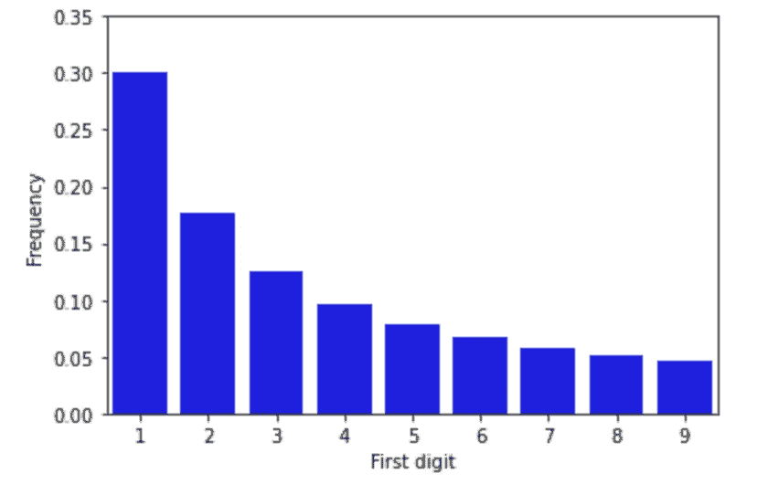

作者图片(本福德定律)

本福德定律一直被认为是一个迷人而神秘的自然法则。

它的解释范围从超自然到测量理论。与 it 相关的用例从欺诈检测到计算机磁盘空间分配。

关于这一主题的出版物近年来有所增加，其中大多数侧重于从欺诈和计算机科学应用的各种数据来源审查法律。然而，本福特定律的基本原因仍然是个谜。

本文的目的不是提供理论证据来证明这样一个法律的起源。正如你可能已经注意到的，从概率的角度来看，用来近似**有点棘手。**

不管你用什么作为基本分布，即使你从样本中取第一个数字，这个分布也远远不能接近本福特分布。

在第一步中，我们提出了三种概率方法来得到一个类似本福特的分布。在第二部分中，我们处理两个更现实的例子，本福特分布更可能出现在现实生活中。

所以让我们开始实践吧。

# 模拟本福特定律的三种方法:

## **1。对均匀样本进行 N 次幂运算**

第一种方法是从 0 到 1 之间的均匀分布中采样值，并将它们提升到`n`的幂，`n`是一个相对较大的整数:

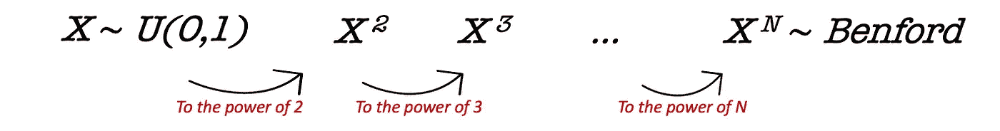

作者图片

下面是我们如何对单个采样值执行此操作的示例:

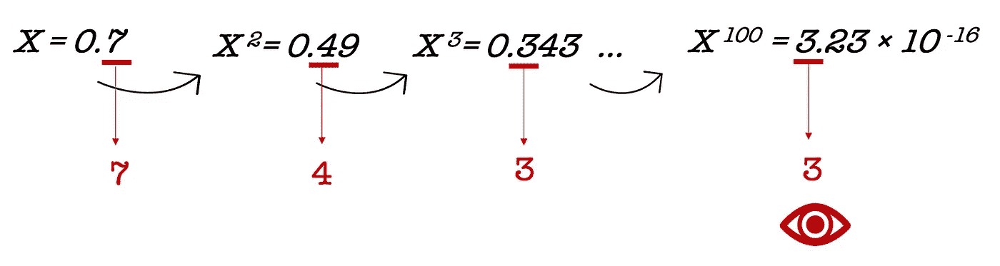

作者图片

我们写下采样函数，它将分布的边界、样本的大小以及样本中每个元素的幂作为参数。

我们写下一个`extract_first_digit`,作为取样本中每个数字最左边第一个数字的函数:

让我们第一次模拟点火:

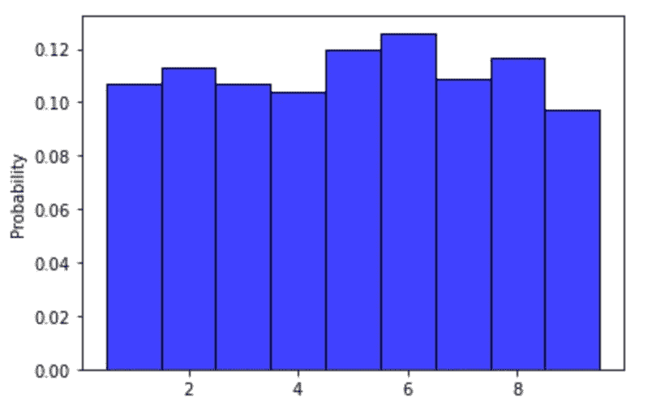

样本的 1 次方(图片由作者提供)

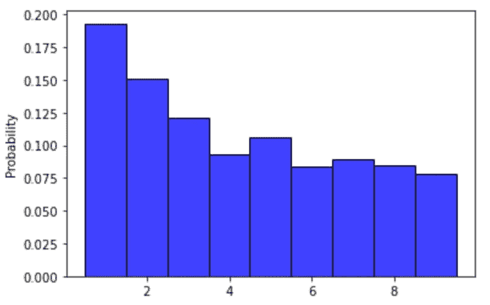

样本的 2 次方(图片由作者提供)

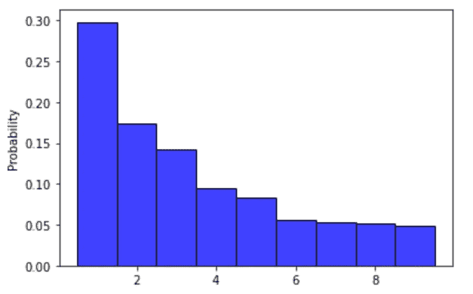

样本的 50 次方(图片由作者提供)

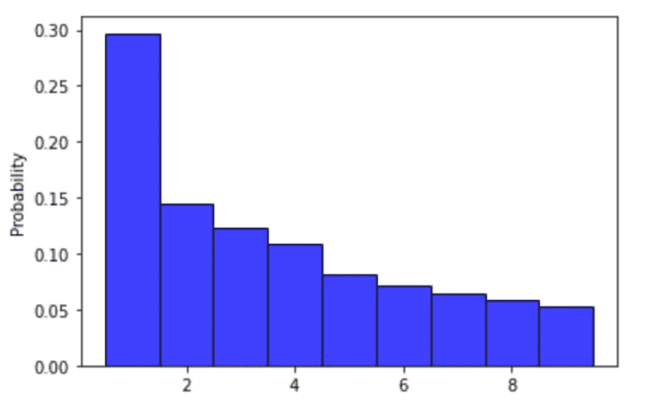

样本的 100 次方(图片由作者提供)

指数越高，分布越像本福特定律。你可以试着自己用另一个代替统一的分布。我不太确定你最终会发现同样的结果，尽管它看起来很有趣。

## 2.将一个均匀分布除以另一个均匀分布:

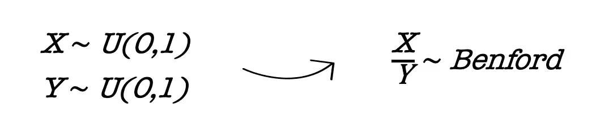

作者图片

第二种方法是将 0 到 1 之间的均匀分布样本除以另一个具有相同参数的样本:

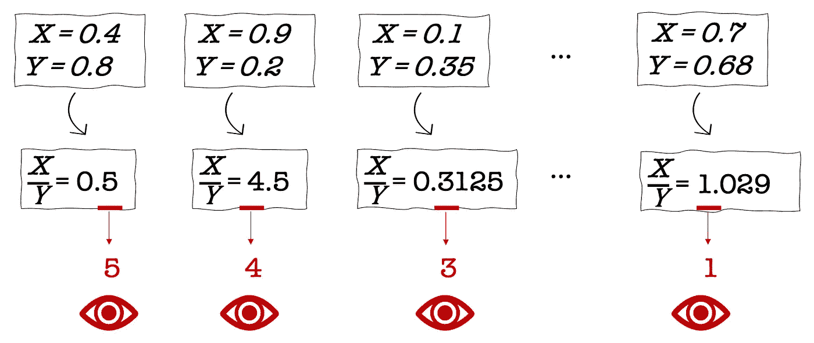

作者图片

让我们重现一下:

一个简单的情节:

```
sns.histplot(history, stat="probability", discrete = True, color = 'b')
```

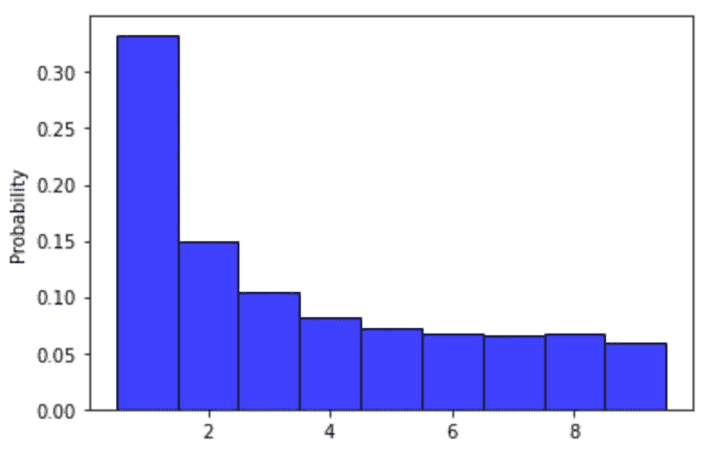

作者图片

不幸的是，就像第一个模拟技巧一样，如果没有使用均匀分布，您将无法获得相同的本福特式分布。

## 3.马尔可夫链的构造；

第三种方式在于构建马尔可夫链，该马尔可夫链以从 0 到 10 (10 优选地不包括在内)之间的均匀分布中采样的随机值开始。

然后，每个新状态由新的均匀分布形成，该均匀分布由 0 和从前一状态采样的值`mantissa`来界定。

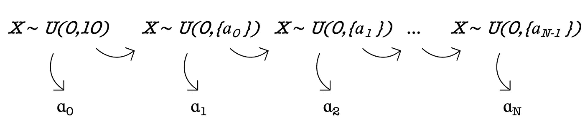

作者图片

通俗地说，一个`mantissa`就是一个数的第一个数字，用花括号表示。这里有一个更具体的例子:

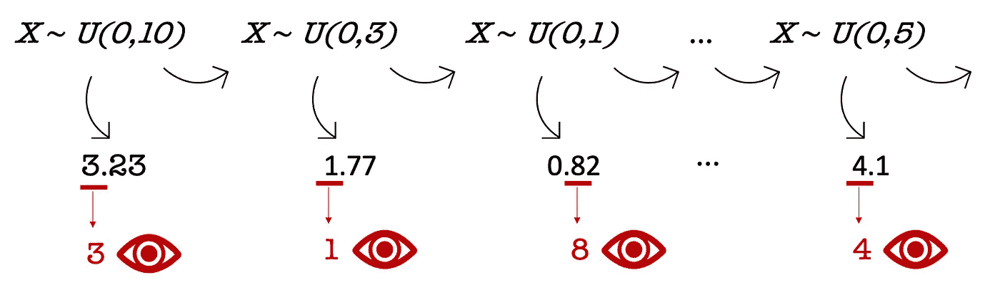

作者图片

让我们行动起来，编写一些代码:

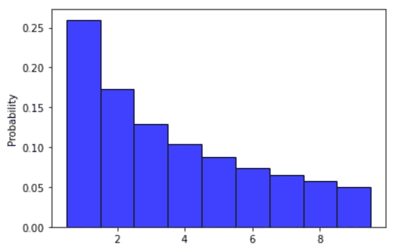

作者图片

显而易见，这些数字的不同概率与本福特的官方概率值有所不同。形状完全不变:`1 is prone to be more frequent than other digits`。

# 本福德定律可能出现的两个真实案例:

现在我们已经完成了热身，我们将处理两个具体的使用案例，本福特定律在其中发挥了它的魔力。

## 1.超市的价格分布

第一个案例涉及超市中的价格，人们发现，总体而言，数字 **1** 比数字 **2** 更频繁地出现在价格的左侧，而数字**2**本身比数字 **3** 更频繁地出现，以此类推。

我们的朋友爱丽丝又来了，带我们去她住处附近的一家超市参观。她习惯于在那里跑腿，因为她能找到她需要的任何东西。到达后，她浏览了过道，走到一个自助餐台旁边，那里有些商品打折出售。


作者图片

她不知道所有遇到的价格都来自不同的分布，这产生了一个非常特殊的概率定律。每个分销被认为是一个单一品牌的变体的价格范围。

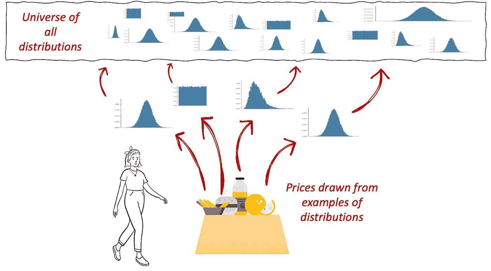

作者图片

让我们帮爱丽丝找到它。

首先，让我们定义自定义函数来绘制样本分布，从中抽取值。

例如，我们为正态分布定义了一个分布范围，这个分布范围是通过我们指定为输入参数的均值和方差范围创建的。在下一步中，我们将对平均值和方差进行采样，我们将创建一个高斯实例并从中采样一个值。

我们编写相同的机制来重新创建伽玛和均匀分布。

在下一步中，我们将运行一系列采样操作，每个操作都包括随机选择均匀分布、高斯分布或伽马分布，从中抽取样本，收集第一个数字并将其存储在一个列表中。

再一次，我们在本福特分布的前面。

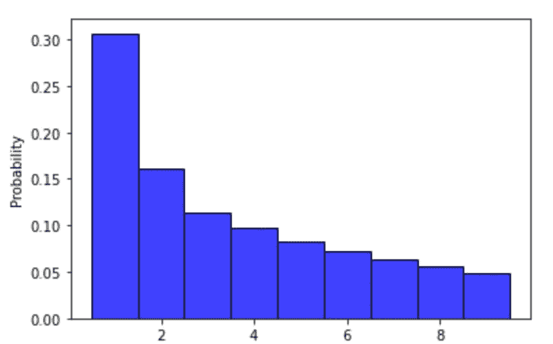

作者图片

1998 年，`Theodore P.Hill`给出了一个严格的证明，从混合分布中抽取的样本遵循本福特定律。所以这并不奇怪。

## 2.股票价格的倍增波动

让我们仔细看看股票价格的演变。

考虑到它每次都乘以从不同的正态分布中抽取的随机样本，

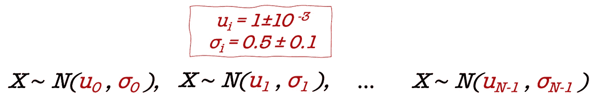

作者图片

我们将追踪每一个新价格的第一个数字，看看是否会有所收获。

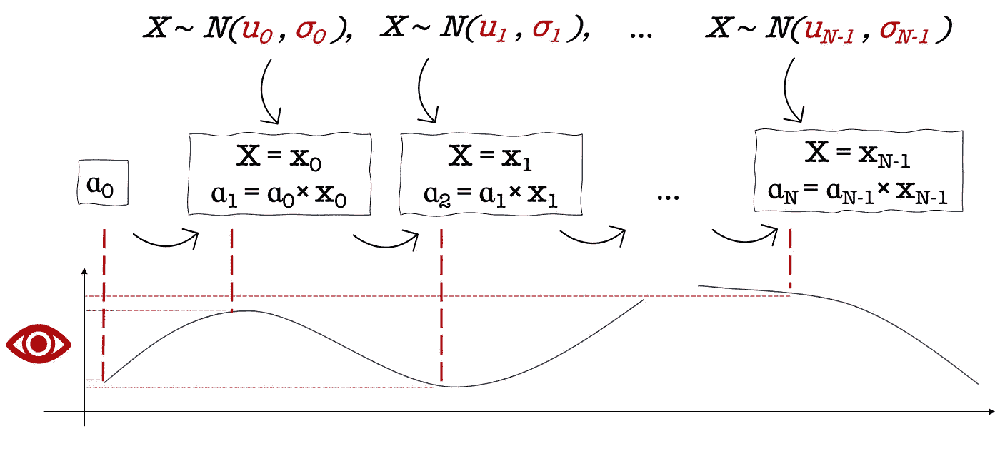

作者图片

这里有一个快速演示:

一旦我们通读了所有的价格记录并存储了所有的数字，我们就绘制分布图(交叉手指)..):

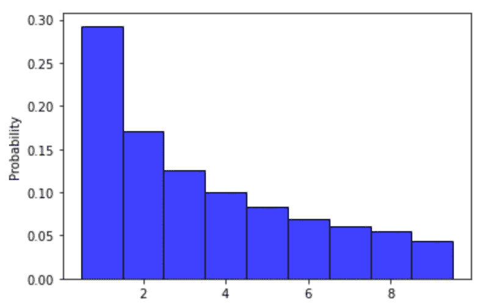

作者图片

本福德定律再次出现在我们面前。

在 2001 年，`L.Pietronero`、`E. Tosatti`、`V. Tosatti,`和`A. Vespignani`在他们题为`Explaining the uneven distribution of numbers in nature`的论文中解决了这个问题，其中作者从乘法过程的研究开始，并与中心极限定理进行类比，中心极限定理不是处理乘法，而是概括随机过程。他们声称:

> 这个练习表明，表征一些物理量或物体的数字 N 自然会遵循本福特定律，如果它们的时间演化受乘法涨落支配的话。

## 结束语:

许多数学家成功地解释了本福特定律在普通数字中的自然表现。

直到今天，这个话题引起了每个人的好奇心，尽管解释可能很透彻。从个人的角度来看，用小而有趣的模拟来检查专家的发现总是很好的，这样可以更容易地吸收这些概念。

## 参考资料:

1.  [本福德定律的简单解释](https://www.stat.auckland.ac.nz/~fewster/RFewster_Benford.pdf)
2.  [从均匀分布到本福特定律](https://web.archive.org/web/20160304125725/http://lmrs.univ-rouen.fr/Persopage/Delarue/Publis/PDF/uniform_distribution_to_Benford_law.pdf)
3.  本福德定律
4.  [解释自然界中数字的不均匀分布](https://arxiv.org/pdf/cond-mat/9808305v2.pdf)