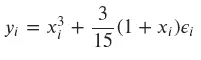
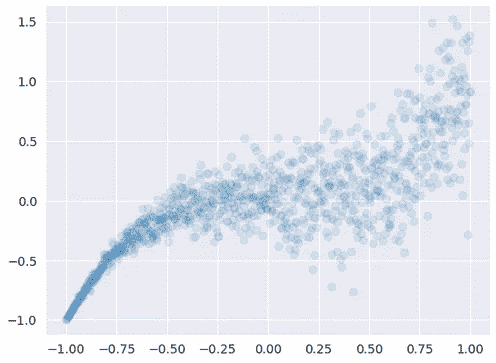
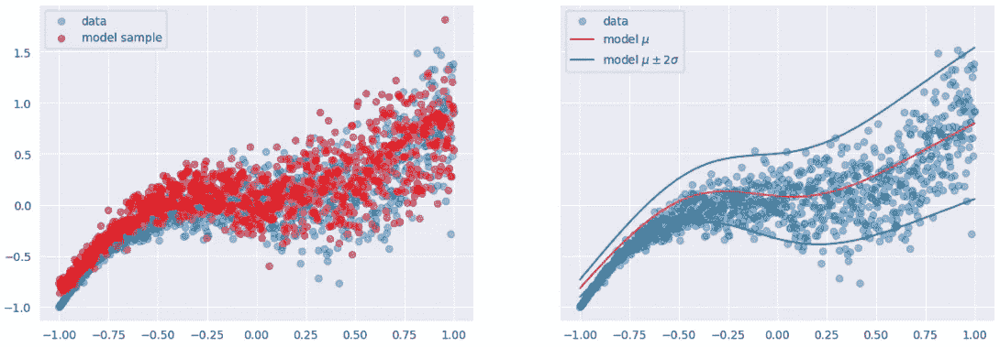

# 张量流的概率回归与确定性回归

> 原文：<https://towardsdatascience.com/probabilistic-vs-deterministic-regression-with-tensorflow-85ef791beeef>

## 概率深度学习

# 介绍

本文属于“概率深度学习”系列。这个每周系列涵盖了深度学习的概率方法。主要目标是扩展深度学习模型，以量化不确定性，即知道他们不知道的东西。

本文将探讨确定性回归和概率性回归之间的主要区别。一般来说，当自变量和因变量之间的关系很好理解并且相对稳定时，确定性回归是实用的。另一方面，当数据存在不确定性或可变性时，概率回归更合适。作为支持我们主张的练习，我们将使用张量流概率来拟合非线性数据的概率模型。

迄今发表的文章:

1.  [张量流概率简介:分布对象](https://medium.com/towards-data-science/gentle-introduction-to-tensorflow-probability-distribution-objects-1bb6165abee1)
2.  [张量流概率简介:可训练参数](https://medium.com/towards-data-science/gentle-introduction-to-tensorflow-probability-trainable-parameters-5098ea4fed15)
3.  [张量流概率中从零开始的最大似然估计](/maximum-likelihood-estimation-from-scratch-in-tensorflow-probability-2fc0eefdbfc2)
4.  [tensor flow 中从头开始的概率线性回归](/probabilistic-linear-regression-from-scratch-in-tensorflow-2eb633fffc00)
5.  [使用 Tensorflow 进行概率回归与确定性回归](https://medium.com/towards-data-science/probabilistic-vs-deterministic-regression-with-tensorflow-85ef791beeef)
6.  [Frequentist 与 Tensorflow 的贝叶斯统计](https://medium.com/towards-data-science/frequentist-vs-bayesian-statistics-with-tensorflow-fbba2c6c9ae5)


图 1:我们今天的咒语:不是所有的线都是直的([来源](https://unsplash.com/photos/j0Da0mEplnY))

我们使用张量流和张量流概率开发我们的模型。TensorFlow Probability 是一个构建在 TensorFlow 之上的 Python 库。我们将从能在张量流概率中找到的基本对象开始，并理解我们如何操纵它们。我们将在接下来的几周内逐步增加复杂性，并将我们的概率模型与现代硬件(如 GPU)上的深度学习相结合。

像往常一样，代码可以在我的 [GitHub](https://github.com/luisroque/probabilistic_deep_learning_with_TFP) 上找到。

# 概率回归与确定性回归

## 定义

确定性回归是一种回归分析，其中自变量和因变量之间的关系是已知和固定的。因此，在给定一组已知自变量的情况下，它是预测因变量的值的有用工具。换句话说，如果向确定性回归模型提供相同的输入，它将总是产生相同的输出。

如果我们考虑线性回归模型，Gauss-Markov 定理立即浮现在脑海中，因为它在某些假设下建立了普通最小二乘(OLS)估计的最优性。特别是，高斯-马尔可夫定理表明 OLS 估计量是最好的线性无偏估计量(蓝色)，这意味着它在所有线性无偏估计量中具有最小的方差。然而，高斯-马尔柯夫定理没有解决不确定性或估计中的信念的问题，这是概率方法的一个关键方面。

另一方面，概率回归将自变量和因变量的交互方式视为未知，并假设它们会因数据集而异。概率回归模型不是预测因变量的单个值，而是预测因变量的可能值的概率分布。它允许模型考虑数据中的不确定性和可变性，并且在某些情况下可以提供更准确的预测。

我们举一个简单的例子来简化理解。一名研究人员研究学生为考试而学习的时间和他们的分数之间的关系。在这种情况下，研究人员可以使用 OLS 方法来估计回归线的斜率和截距，并使用高斯-马尔可夫定理来证明该估计量的选择。然而，正如我们之前所述，高斯-马尔可夫定理并没有解决估计中的不确定性或置信问题。在概率世界中，重点是使用概率来描述模型或参数的不确定性或可信度，而不仅仅是估计量的最优性。因此，我们可以使用不同的方法来估计回归线的斜率和截距。因此，根据数据和对斜率和截距值的先验信念，我们可能会对学习时间和考试分数之间的关系得出不同的结论。

## 贝叶斯统计和偏差-方差权衡

概率回归可以被视为贝叶斯统计的一种形式。它包括将自变量和因变量之间的未知关系视为随机变量，并根据可用数据估计其概率分布。这样，我们可以把它看作是把不确定性和可变性纳入回归分析的一种方法。回想一下，贝叶斯统计是一种统计分析框架，其中所有未知量都被视为随机变量，它们的概率分布随着新数据的观察而更新。这与经典统计学相反，经典统计学通常假设未知量是固定的，但参数是未知的。

考虑这两种方法之间差异的另一种方法是考虑统计估计中的偏差和方差之间的权衡。偏差是指参数的估计值和实际值之间的差异，而方差是指估计值的分布或可变性。通过提供模型参数的分布而不是单点估计，概率回归有助于减少估计中的偏差，从而提高模型的整体准确性。此外，概率回归可以提供估计值的不确定性或置信度的度量，这有助于根据模型做出决策或预测。当处理有噪声或不完整的数据时，估计值的不确定性较高，这可能是有益的。

# 非线性概率回归

让我们跳到一个例子，让这些概念更容易理解。我们不会涵盖完全贝叶斯方法，这种方法需要估计认知的不确定性——模型的不确定性。我们将在以后的文章中研究这种不确定性。然而，我们将估计一种不同的不确定性——随机不确定性。它可以定义为数据生成过程中的不确定性。

这一次，我们将讨论更复杂的回归分析——非线性回归。与使用直线对变量之间的关系进行建模的线性回归相比，非线性回归允许对变量之间更复杂的关系进行建模。它使非线性回归成为许多机器学习应用程序的有价值的工具，在这些应用程序中，变量之间的关系可能过于复杂，无法使用线性方程精确建模。

我们首先创建一些遵循非线性模式的数据:



请注意，*噪声𝜖𝑖*∽*n*(0，1)是独立的，并且同分布。

```
x = np.linspace(-1, 1, 1000)[:, np.newaxis]
y = np.power(x, 3) + (3/15)*(1+x)*np.random.randn(1000)[:, np.newaxis]

plt.scatter(x, y, alpha=0.1)
plt.show()
```



图 2:遵循带有高斯噪声的非线性方程人工生成的数据。

像往常一样，我们将对数似然定义为损失函数。

```
def negative_log_like(y_true, y_pred):
    return -y_pred.log_prob(y_true)
```

正如我们在以前的文章中看到的，将我们的确定性深度学习方法扩展为概率性的方法是通过使用概率层，例如`DistributionLambda`。回想一下，`DistributionLambda`层返回一个分布对象。它也是 TensorFlow Probability 中实现的其他几个概率层的基类，我们将在以后的文章中使用它们。

为了建立我们的模型，我们从添加两个致密层开始。第一个有 8 个单元和一个 s 形激活函数。第二个有两个单元，没有激活功能。我们没有添加一个，因为我们想要参数化我们的高斯分布，该分布跟随具有任何真实值的第二密集层。高斯分布由`DistributionLambda`层定义。请记住，分布的规模是标准差，这应该是一个正值。如前所述，我们通过 softplus 函数传递张量分量来考虑这种约束。

请注意，线性和非线性模型之间的真正区别是添加了密集层作为模型的第一层。

```
model = Sequential([
    Dense(input_shape=(1,), units=8, activation='sigmoid'),
    Dense(2),
    tfpl.DistributionLambda(lambda p:tfd.Normal(loc=p[...,:1], scale=tf.math.softplus(p[...,1:])))
])

model.compile(loss=negative_log_like, optimizer=RMSprop(learning_rate=0.01))
model.summary()
```

我们可以检查模型的输出形状，以便更好地理解正在发生的事情。我们得到一个空的事件形状和一个批处理形状(1000，1)。1000 指的是批量大小，而额外的维度在我们的问题陈述中没有意义。我们想要表示正态分布的单个随机变量。

```
y_model = model(x)
y_sample = y_model.sample()
y_model

<tfp.distributions._TensorCoercible 'tensor_coercible' batch_shape=[1000, 1] event_shape=[] dtype=float32>
```

我们可以使用 TensorFlow Probability 提供的包装器来简化最后一层的实现，并使它更符合我们期望得到的输出形状。通过使用`IndependentNormal`层，我们可以构建一个类似于用`DistributionLambda`构建的发行版。同时，我们可以用一个静态的方法，输出概率层需要的参数个数来定义前面`Dense`层的单元个数:`tfpl.IndependentNormal.params_size`。

```
model = Sequential([
    Dense(input_shape=(1,), units=8, activation='sigmoid'),
    Dense(tfpl.IndependentNormal.params_size(event_shape=1)),
    tfpl.IndependentNormal(event_shape=1)
])

model.compile(loss=negative_log_like, optimizer=RMSprop(learning_rate=0.01))
model.summary()
```

如我们所见，该形状现在已被正确指定，因为批处理形状中的额外维度已被移动到事件形状中。

```
y_model = model(x)
y_sample = y_model.sample()
y_model

<tfp.distributions._TensorCoercible 'tensor_coercible' batch_shape=[1000, 1] event_shape=[] dtype=float32>
```

是时候让模型符合我们合成生成的数据了。

```
model.fit(x=x, y=y, epochs=500, verbose=False)
model.evaluate(x, y)
```

正如预期的那样，我们能够捕捉到数据生成过程中的任意不确定性。从下面我们可以得出的置信区间可以看出。概率模型的一个更有趣的特征是我们可以生成的样本，正如我们在下面看到的，遵循数据的原始生成过程。

```
y_hat = y_model.mean()
y_sd = y_model.stddev()
y_hat_u = y_hat -2 * y_sd
y_hat_d = y_hat + 2*y_sd

fig, (ax_0, ax_1) =plt.subplots(1, 2, figsize=(15, 5), sharey=True)
ax_0.scatter(x, y, alpha=0.4, label='data')
ax_0.scatter(x, y_sample, alpha=0.4, color='red', label='model sample')
ax_0.legend()
ax_1.scatter(x, y, alpha=0.4, label='data')
ax_1.plot(x, y_hat, color='red', alpha=0.8, label='model $\mu$')
ax_1.plot(x, y_hat_u, color='green', alpha=0.8, label='model $\mu \pm 2 \sigma$')
ax1.plot(x, y_hat_d, color='green', alpha=0.8)
ax1.legend()
plt.show()
```



图 3:从概率非线性回归模型生成的样本(左边)及其与数据的拟合(右边)。

# 结论

本文探讨了确定性回归和概率性回归之间的主要区别。我们看到，当自变量和因变量之间的关系很好理解且相对稳定时，确定性回归是实用的。另一方面，当数据存在不确定性或可变性时，概率回归更合适。作为一个练习，我们然后将一个概率模型拟合到非线性数据中。通过在我们的模型的开始添加一个具有激活函数的额外密集层，我们可以学习数据中的非线性模式。我们的最后一层是概率层，它输出一个分布对象。为了与我们的问题陈述更加一致，我们扩展了我们的方法，使用了我们在几篇文章之前探索过的`IndependentNormal`层。它允许我们将批次维度移动到事件形状。接下来，我们成功地拟合了数据，同时提供了对任意不确定性的度量。最后，我们生成了新的样本，这些样本严格遵循数据的原始生成过程。

下周，我们将探讨频繁投资者和贝叶斯方法之间的区别。到时候见！

保持联系: [LinkedIn](https://www.linkedin.com/in/luisbrasroque/)

# 参考资料和材料

[1] — [Coursera:深度学习专业化](https://www.coursera.org/specializations/deep-learning)

[2] — [Coursera:深度学习的 tensor flow 2](https://www.coursera.org/specializations/tensorflow2-deeplearning)专业化

[3] — [张量流概率指南和教程](https://www.tensorflow.org/probability/overview)

[4] — [TensorFlow 博客中的 TensorFlow 概率帖子](https://blog.tensorflow.org/search?label=TensorFlow+Probability&max-results=20)