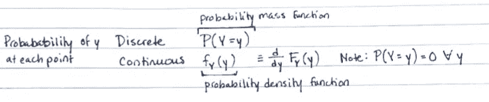
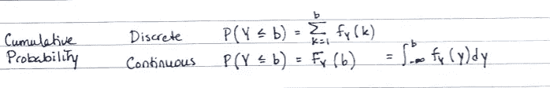
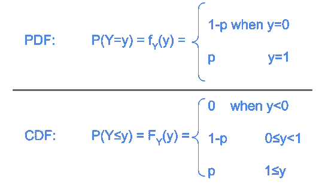
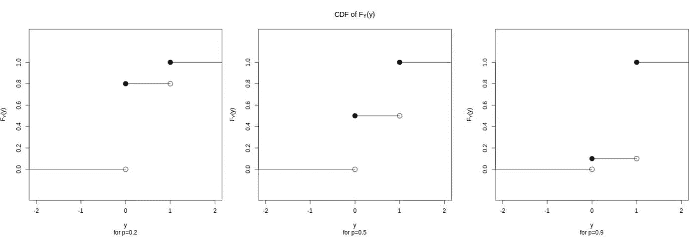

# 初学者的概率分布

> 原文：<https://towardsdatascience.com/probability-distributions-for-beginners-d14f59aba2cb>

## 理论系列

## 初级统计，基本概念，伯努利分布

埃里克·普劳泽特在 [Unsplash](https://unsplash.com/s/photos/many-paths?utm_source=unsplash&utm_medium=referral&utm_content=creditCopyText) 上拍摄的照片

如果你在数据科学/机器学习领域，你可能会决定，在某些时候，阅读学术论文或带有统计概念的软件包文档可能是有用的。这样做的时候，你可能会很快被语法和无法解释的符号表示所淹没，这可能会阻止你。它甚至会让你相信这是一个愚蠢的尝试。

> 这就是我阻止你的地方。不，这不是一个愚蠢的尝试。

数学写作中的一个关键问题是**明显缺乏象征性的传说和相关的解释。我希望这些统计概念的描述能帮助你下次再试。一定要再试一次。**

# “我失败了一次又一次。这就是我成功的原因。”—迈克尔·乔丹

# 1.先决条件

对于那些熟悉随机变量的人，跳到下一节:分布函数。

## **1.1 概率**

*   没有机会发生的事情概率为 0。
*   一定会发生的事情概率为 1。

## **1.2 随机变量:Y**

随机变量是具有内在随机性的汇总变量。把它想成一个多用途变量。它总结了许多价值观。让我们用一个抽象的例子。如果我们让随机变量 Y 表示“亚马逊购物车中的商品数量”，我们可以在计算中使用这个 Y 变量，而无需假设给定购物车中商品的实际数量。通过这样做，我们可以推导出逻辑关系，例如使用汇总变量的可能性、功效和假设检验，而不强加 y 的假定值。一旦建立了关系，我们就可以使用真实数据。

我们需要将两个东西与每个随机变量联系起来:(1)逐点分布函数和(2)累积分布函数(CDF)。

爱德华多·苏亚雷斯在 [Unsplash](https://unsplash.com/s/photos/amazon-cart?utm_source=unsplash&utm_medium=referral&utm_content=creditCopyText) 上拍摄的照片

## **1.3 逐点分布函数**

> **离散……P(Y = Y)…Y = Y 的概率**
> 
> 连续的……f(y)……Y=y 的概率密度

Y 的实现值称为小写 Y。带有下标 Y 的小写 f 表示分布函数特定于随机变量 Y，使用实现 Y 计算。

随机变量是一个函数。函数从一个值映射到另一个值。随机变量从样本空间中的输入:事件映射到输出:实数。

考虑 y=mx+b .输入:x .输出:y。

考虑购物车 Y. Input: empty cart 事件。输出:0。

一个随机变量必然与概率有关。这需要第二个函数，逐点概率分布。它将接受 y 的实现值 y 的输入。它的输出是介于 0 和 1 之间的奇异概率。

## 离散情况**……P(Y = Y)……Y = Y 的概率**

在我的亚马逊购物车中，一个常见的事件是我的购物车是空的。(饥饿的学生。)Y 把这个“事件”实现映射到一个实数:0。在某一天，y 为 0 的概率可能是 0.95。那就写成 P(Y=0)=0.95。因此，我们可以说 Y 取值的概率是由某个函数表示的。这个函数被称为概率质量函数(PMF；离散情况)或概率分布函数(PDF 连续情况)。

离散与连续的区别指的是输入中的数据类型。对于任何给定的随机变量，它的逐点概率函数要么是 PMF 要么是 PDF，不可能同时是两者。如果我们只有整数输入(如计数)，这将是离散输入的一个例子。如果我们有跨越一个范围的输入(例如，正实数(0，∞))，这将是连续输入。

## 连续案例….. **f(y)……Y=y 的概率密度**

为了提供一个连续情况的快速示例，让我们定义随机变量 W。W 可以是亚马逊订单的价格，其范围可以从 0 美元到 32.55 美元到 10，000.67 美元或更高。没有完整的基于微积分的讨论，细节变得模糊不清，但是，对于连续的情况，这里要知道的关键是连续 W 的 PDF 类似于 ***但不同于离散 y 的***PMF

Y 取给定值 Y 的概率可以是非零数字。

pr(Y = Y)= {对于某些值不为零}

然而，W 取给定值的确切概率总是零。我知道这不是直觉。对于更长的描述，尝试这个[好读](/pdf-is-not-a-probability-5a4b8a5d9531)。不过简而言之就是 ***f(x)是瞬时密度，也就是说它的权重为零，或者在任意给定值*** 的概率为零。就当是一时冲动吧。然而，在 w 范围内的积分将是非零的，正概率在 0 和 1 之间。

pr(W = W)= {所有值为零}

因为 W 是 ***恰好是*** a 的概率是 0，那么这几个表达式是等价的:

Pr(a<w pr="" class="lk jd">≤W<b)= Pr(a<W**≤**b)= Pr(a≤W≤b)</w>

Pr(a

Two cases for pointwise probability: PMF and PDF

## **1.4 累积分布函数**

> **离散………P(Y≤Y)…Y≤Y 的概率**
> 
> **连续……F(y)……..Y≤y 的概率密度**

Y 的 CDF F(y)是变量取值小于或等于特定实现值 Y 的概率。对于购物车，计算 P(Y ≤ 0)将告诉我任何购物车为空购物车的概率。

CDF 是 PMF 或 PDF 的函数。它使用 PMF 的级数或 pdf 的积分对实数范围内的逐点概率求和。

## 综合发展框架的主要特性

> 1.CDF F(y)是 y 的非减函数，这意味着 F(y)要么保持不变，要么从左向右增加，作为 y 的函数。
> 
> 2.随着 y 趋近-∞，F(y)将趋近于 0。当 y 接近∞，F(y)将接近 1。
> 
> 3.F(y)是右连续的。这意味着图上的空心圆将总是在线段的右侧。

两种情况(数学上)，都叫 CDF

对于离散情况，Y 小于或等于 b 的累积概率是从 k=1 到 k=b 的所有 PMF 概率的总和

对于连续情况，Y 小于或等于 b 的累积概率是从 y=-∞到 y=b 的所有 PDF 概率的积分。

# 2.第一次分配

## **2.1 伯努利**

*   输入:离散的二进制域{类 0，类 1}
*   输出:概率在 0 和 1 之间

我写的

我们将从最简单的概率分布开始。对于中级和高级发行职位，这些将是*即将推出的*。

伯努利分布是离散概率的基础。对于二进制输出，比如掷硬币，对于一次投掷，正面或反面的概率是多少？公平硬币还是加权硬币？这两种情况都被伯努利分布所捕获。一个结果将被命名为“成功”。这是任意的，但必须始终如一地使用。我们将称首脑会议的结果为成功。伯努利分布给了我们一次抛硬币成功的概率。

就我个人而言，虽然我经常捡硬币(我知道这很有争议)，但我很少费心去扔硬币。然而，作为 ML 实践者，我们可以用这个分布来描述一个更相关的场景:当模型预测者与结果不相关或几乎不相关时。如果我构建了一个糟糕的模型，并且如果预测因子无关紧要，则每个模型预测可能取决于某个比率 p。该模型可能预测“成功率”为 p 的类 1 和比率为 1-p 的类 0(*记住*样本空间中每个值的概率总和为 1)。然后，我们真的可以节省运行坏模型的时间。我们可以通过给定 p 的伯努利分布来预测类 1 的概率。给定数据，我们可以稍后估计比率 p。如果 20%的训练集是类 1，则通过矩法或 MLE 估计 p 将是 20%。

图由我使用[数据包装器](http://app.datawrapper.de)

分布的最后一点是参数。在 frequentists 统计中，参数是一个常数。对于任何 RV，PDF/PMFs 和 CDFs 都是参数的函数。在上面的伯努利 PDF 图中，我们可以看到 Pr(y=0|p=0.2) =0.8。给定 0.2 的成功率，获得 0 的观测值的概率为 0.8。我们可以用上面的等式来计算。

然后，我们可以对这些分布求和，得到下面的 CDF。请注意，CDF 也是参数 p 的函数，我们可以看到，CDF 从 0 开始，到 1 结束。此外，阶跃函数 CDFs 中存在不连续性。这是离散结果的特征，而不是连续结果的特征。

## **伯努利 CDF**

我用 R 算出

如果我们不进行 n 次翻转或 n 次预测，并且每次翻转/预测都不受前一次的影响，我们可以使用伯努利 n 次。在 n 次试验中，看到人头一定次数 x 次的概率有自己的分布，称为二项式分布。注意:这个特殊的发行版是对未来文章的一个试探。

结束了。

请在下面评论您希望在未来帖子中看到的统计问题或评论！

## 参考

1.  [卡塞拉，G. &伯杰，R. L. *统计推断*。(森盖奇学习，2021)。](http://paperpile.com/b/x5RNuE/5O9c)

喜欢这篇文章吗？下面更喜欢！

<https://www.linkedin.com/in/kate-wall/>  </how-to-analyze-continuous-data-from-two-groups-8d101510790f>  </professional-venn-diagrams-in-python-638abfff39cc> 