# 数据科学需要了解的概率分布(带代码)

> 原文：<https://towardsdatascience.com/probability-distributions-to-be-aware-of-for-data-science-with-code-c4a6bb8b0e9a>

## 了解数据的属性

罗伯特·斯汤普在 [Unsplash](https://unsplash.com?utm_source=medium&utm_medium=referral) 上拍摄的照片

概率统计知识是数据科学和机器学习的核心；你需要统计学和概率知识来有效地收集、回顾、分析和交流数据。这意味着你必须很好地掌握一些基本术语，它们的意思，以及如何识别它们。

你会经常听到的一个术语是“*分布*所有这些都是指数据的属性。现实世界中有几个被认为是统计性质的现象(例如，天气数据、销售数据、金融数据等)。这意味着在一些情况下，我们已经能够开发出一些方法，帮助我们通过能够描述数据特征的数学函数来模拟自然。

> “[……]概率分布是一种数学函数，它给出了实验中不同可能结果出现的概率。”
> — [维基百科](https://en.wikipedia.org/wiki/Probability_distribution)

了解数据的分布有助于我们更好地模拟我们周围的世界。它帮助我们确定各种结果的可能性，或对某一事件的可变性做出估计。所有这些都使得了解不同的概率分布在数据科学和机器学习中非常有价值。

在本文中，我们将介绍一些发行版，并分享一些 Python 代码来直观地展示它们。

# 均匀分布

你可能遇到的最直接的分布是*均匀分布；*均匀分布是一种概率分布，其中所有结果的可能性相等。例如，如果我们掷一个公平的骰子，落在任何数字上的概率是 1/6。这是一个离散的均匀分布。

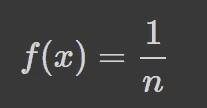

**离散均匀分布的概率质量函数(PMF)；图片作者。**

然而，并非所有的均匀分布都是离散的，它们也可以是连续的。这意味着有无限多的同样可能的可测量值，它们可以取指定范围内的任何真实值。a 和 b 之间连续均匀分布的概率密度函数(PDF)如下:

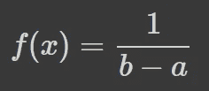

**连续均匀分布的概率密度函数；作者图片**

让我们看看如何用 Python 对它们进行编码:

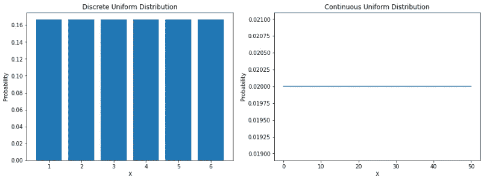

**上面代码的输出:Python 中的离散和连续均匀分布；图片作者。**

# 正态分布

高斯分布可能是你最熟悉的分布。它有几个名字:有人称它为**钟形曲线**，因为它的概率图看起来像一个钟；有人称它为**高斯分布**，以第一个描述它的德国数学家卡尔·高斯的名字命名；还有人称它为**正态分布**，因为早期的统计学家注意到它反复出现。

正态分布的概率密度函数如下:

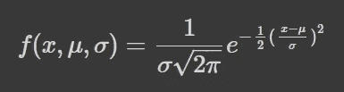

**正态分布的概率密度函数；作者图片**

σ是标准偏差，μ是分布的平均值。但是需要注意的是，在正态分布中，均值、众数和中位数都是相等的。

当我们绘制正态分布的随机变量时，曲线关于平均值是对称的，一半的值在中心的左边，另一半在中心的右边。曲线下的总面积是 1。

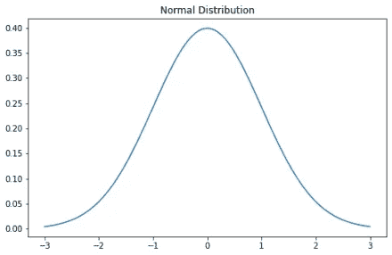

**上面代码的输出:Python 中的高斯分布；图片作者。**

关于正态分布的一些已知的东西是经验法则。经验法则告诉我们数据的百分比落在平均值的一定数量的标准偏差内。这些百分比是:

*   68%的数据在平均值的一个标准差范围内。
*   95%的数据落在平均值的两个标准偏差内。
*   99.7%的数据落在平均值的三个标准偏差内。

# 对数正态分布

> 对数正态分布是对数呈正态分布的随机变量的连续概率分布。因此，如果随机变量 *X* 是对数正态分布，那么 *Y* = ln( *X* )具有正态分布。
> [ **来源** : [维基百科](https://en.wikipedia.org/wiki/Log-normal_distribution) ]

这是对数正态分布的 PDF:

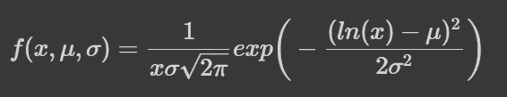

**对数正态分布的概率密度函数；作者图片**

对数正态分布的随机变量只取正的实数值。因此，对数正态分布产生右偏的曲线。

让我们用 Python 来绘制这个:

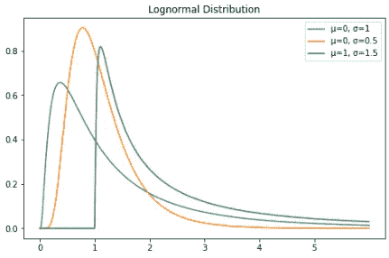

**上面代码的输出:Python 中的对数正态分布；图片作者。**

# 泊松分布

泊松分布是以法国数学家 T2 的名字命名的。这是一种离散的概率分布，这意味着它对具有有限结果的事件进行计数，换句话说，这是一种计数分布。因此，泊松分布被用来显示一个事件在特定时期内可能发生的次数。

如果一个事件以固定的速率及时发生，那么及时观察到的事件数量(n)的概率可以用泊松分布来描述。例如，顾客可能以平均每分钟 3 英镑的速度到达咖啡馆。我们可以使用泊松分布来计算 9 个客户在 2 分钟内到达的概率。

下面的概率质量函数公式有所帮助:

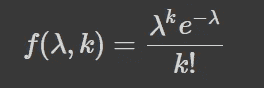

**泊松分布的概率质量函数(PMF)；作者图片**

**λ** 是单位时间内的事件率——在我们的例子中，它是 3。 ***k*** 是出现的次数——在我们的例子中，是 9。我们可以使用`Scipy`来解决我们的示例问题。

泊松分布的曲线类似于正态分布，λ表示峰值。让我们用 Python 绘制一个，看看这在视觉上是什么样子。

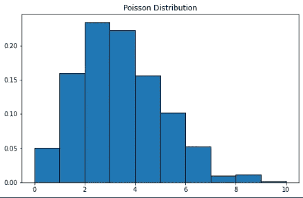

**上面代码的输出:Python 中的泊松分布；图片作者。**

# 指数分布

> 指数分布是泊松点过程中事件之间时间的概率分布。
> [ **来源** : [维基百科](https://en.wikipedia.org/wiki/Exponential_distribution)

指数分布的概率密度函数如下:

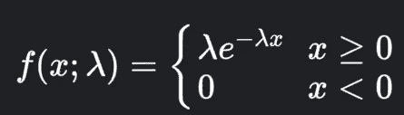

**指数分布的概率密度函数；作者图片**

**λ** 是速率参数， **x** 是随机变量。

让我们看看如何用 Python 绘制指数分布:

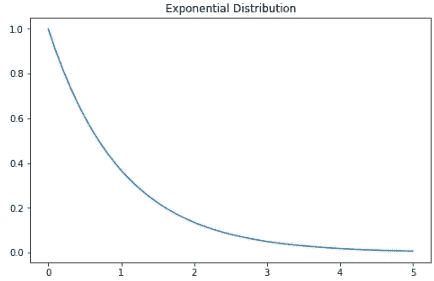

**上面代码的输出:Python 中的指数分布；图片作者。**

# 二项分布

你可以把二项分布想象成实验中成功或失败的概率。有些人也可能把它描述为抛硬币的概率。

这是维基百科的定义:

> 参数为 n 和 p 的二项分布是一系列 n 个独立实验中成功次数的离散概率分布，每个实验都提出一个是-否问题，并且每个实验都有自己的布尔值结果:成功或失败。
> [ **来源** : [维基百科](https://en.wikipedia.org/wiki/Binomial_distribution) ]

本质上，二项式分布衡量两个事件的概率。一个事件发生的概率为概率 p，另一个事件发生的概率为 1-p。

这是二项式分布的公式:

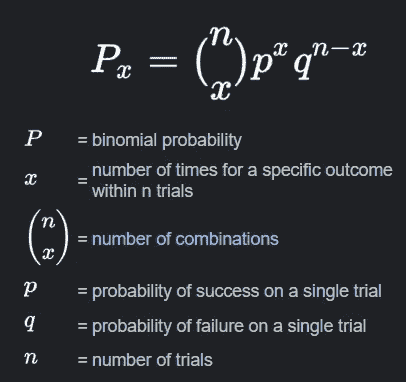

**二项分布的公式；来源:** [**谷歌页面**](https://www.google.com/search?q=what+is+binomial+distribution&rlz=1C1CHBF_en-GBGB921GB921&oq=hat+is+binomia+&aqs=chrome.1.69i57j0i13l9.7048j0j4&sourceid=chrome&ie=UTF-8)

让我们用 Python 来看看:

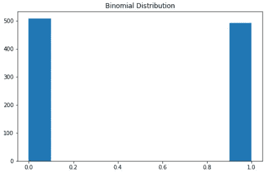

**上面代码的输出:Python 中的二项式分布；图片作者。**

# 学生 t 分布

> Student 的*t*-分布(或简称为*t*-分布)是连续概率分布族中的任何成员，在样本量较小且总体标准偏差未知的情况下估计正态分布总体的平均值时会出现这种分布。它是由英国统计学家威廉·希利·戈塞以笔名“学生”开发的
> [ **来源** : [维基百科](https://en.wikipedia.org/wiki/Student%27s_t-distribution)

PDF 如下:

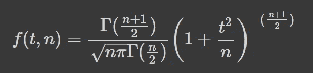

**学生 t 分布的概率密度函数(PDF)；作者图片**

**n** 是自由参数，称为“*自由度*”，但您也可以将其称为“ *d.o.f.* ”。对于高 n 值，t 分布更接近正态分布

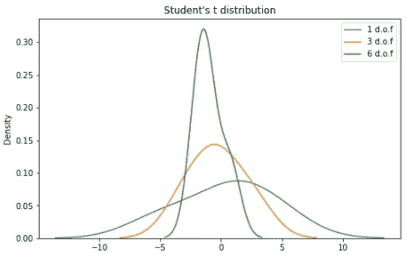

**上面代码的输出:Python 中学生的 t 分布；图片作者。**

# 卡方分布

卡方分布是伽马分布的特殊情况；以 ***k*** 为自由度，卡方分布对于某些独立的标准正态随机变量来说是*k 的平方和。*

*这是 PDF:*

*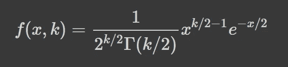*

***卡方分布的概率密度函数；作者图片***

*这是一种常见的概率分布，通常用于假设检验和构建置信区间。*

*让我们用 Python 画一些示例图:*

*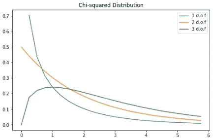*

***上面代码的输出:Python 中的卡方分布；图片作者。***

*对于数据科学来说，掌握统计学和概率是非常重要的。在本文中，我向您展示了一些您可能想要记住的发行版，因为您可能会在旅程中的某个时刻遇到它们。请随意保存和参考这篇文章，以便将来记录。反馈对我也非常有帮助。*

**感谢阅读。**

***联系我:**
[LinkedIn](https://www.linkedin.com/in/kurtispykes/)
[Twitter](https://twitter.com/KurtisPykes)*

*如果你喜欢阅读这样的故事，并希望支持我的写作，可以考虑[成为一名灵媒](https://kurtispykes.medium.com/membership)。每月支付 5 美元，你就可以无限制地阅读媒体上的故事。如果你使用[我的注册链接](https://kurtispykes.medium.com/membership)，我会收到一小笔佣金。*

*已经是会员了？[订阅](https://kurtispykes.medium.com/subscribe)在我发布时得到通知。*

* *