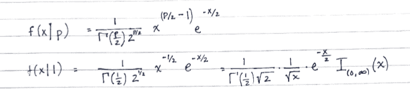
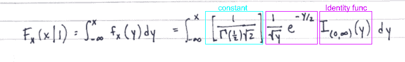
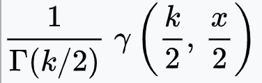
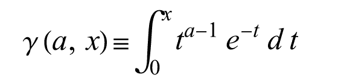
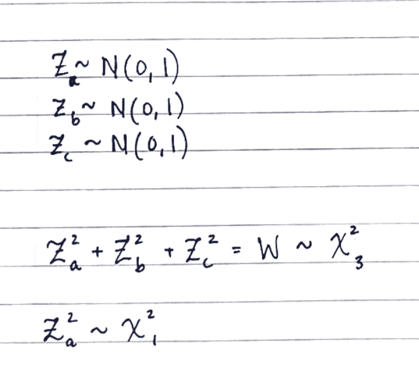
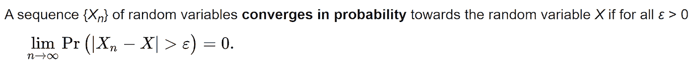
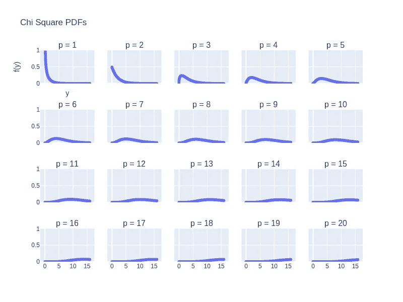
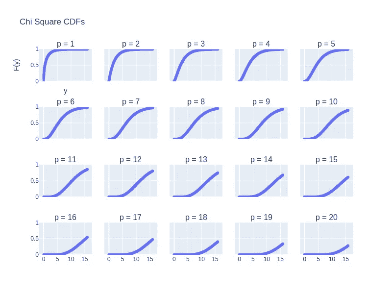
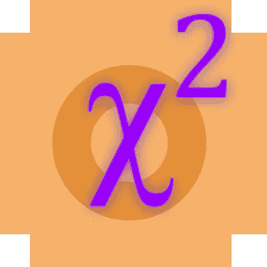

# 数据科学家的概率:有效卡方分布

> 原文：<https://towardsdatascience.com/probability-for-data-scientists-the-capable-chi-squared-distribution-abced58fa157>

## 理论系列

## 分布函数的交互式可视化

本文的目的是介绍卡方概率分布。在生成一系列关于概率的文章时，我的目标是以直观、简洁、有用的方式描述每个分布。不会有推导或证明的重点。而是希望把重点放在围绕分布的直觉上。

本文未涉及的发行版:

*   [初学者的概率分布](/probability-distributions-for-beginners-d14f59aba2cb)
*   [数据科学家的概率:伟大的几何分布](/probability-for-data-scientists-the-great-geometric-distribution-586ce424c26b)
*   数据科学家的概率:强大的泊松分布(链接即将推出)
*   更多的发行版和可视化教程在我的[页面](https://k8wall.medium.com/)

## **键**

RV =随机变量。

如果不熟悉随机变量，先决条件解释可以在[这里](/probability-distributions-for-beginners-d14f59aba2cb)找到。

## **卡方分布为什么重要？**

这种分布是一个强有力的理论模型。

它的威力来自 3 个关键的统计特性:

1.中心极限定理本质上表明，对于来自许多不同总体*的样本，随着样本量的增加，样本均值遵循正态分布。

2.通过简单的算术变换，任何遵循正态分布的随机变量都可以被“标准化”,以表示 0 和方差 1，即标准正态分布。

3.对标准正态分布的任何变量求平方都会产生一个卡方随机变量。

因此，任何正常表现的量都可以转换为卡方量！这一点非常重要。

## **什么是卡方随机变量？**

有多种不同的方法来定义卡方 RV。在这里，我将展示其中的三个。

## **方式 1**

虽然最初很可怕，但对我来说最简单的定义如下。卡方 RV 是由以下概率密度函数描述的任何 RV:

作者写的

第一个方程 f(x|p)是“给定 p 个自由度，X=x 的概率密度”。本质上，把这句话解释为“X 取已实现价值 X 的概率”是 p 的函数！

第二个等式指定 p=1 个自由度。

你会问，什么是自由度？自由度只是一个参数。参数改变函数的形状。在下面的 PDF 和 CDF 图中，您可以看到 PDF 的形状随着 p 值的变化而急剧变化。我们在许多统计问题中的目标是从我们的数据中估计 p。

重复一遍。在许多统计问题中，我们的目标是从数据(给定样本)中估计 p(人口的一个属性)。

这是数据科学和机器学习中的一个共同主题。神经网络是做什么的？它有一堆参数，这些参数是使用反向传播从数据中估计出来的。这是我们在许多问题中所做的非参数扩展。

在上面的公式中，我们还可以使用恒等函数来使其在数学上更加正确。当 x 在 0 和正无穷大之间时，identity 函数“打开”(乘以值 1)概率，对于 x 的所有其他值，“关闭”(乘以值 0)。

## **方式二**

根据定义，PDF 的积分是 CDF * *。我们也可以说，任何卡方 RV 都由以下形式的 CDF 指定:

作者写的

暂停。

有时候缩写很有用，有时候又很讨厌。在这个例子中，我想指出一种情况，缩写可能是一种麻烦，而不是一种帮助。如果您参考卡方分布的 wikipedia 页面，您可能会看到如下所示的表单:

[维基百科页面](https://en.wikipedia.org/wiki/Chi-squared_distribution)上的 CDF 表情

它指定小 doo-dad γ (gamma)表示下不完全 gamma 函数。如果您碰巧交叉引用了 wolfram alpha，您会发现一种形式的下不完全伽玛函数，如下所示:

来自 [Wolfram Alpha](https://mathworld.wolfram.com/IncompleteGammaFunction.html) 的下不完全伽玛函数

如你所见，这只是我第一次写的方程的一种(过于)复杂的写法。

## 方式 3

在不进行完全推导的情况下，我将给出指定卡方的另一种方法。

任何标准正常 RV 的平方都是具有 1 个自由度的卡方 RV。k 个**独立**的标准正态 RV 的平方之和是具有 k 个自由度的卡方 RV。这里，我们假设 Za、Zb 和 Zc 是独立的。那么，它们的平方和就是 df=3 的卡方。

作者写的

注意这些定理的含义。因为卡方来自平方值，所以它将只取 0 到无穷大之间的 x 值。这一特性有助于对与误差相关的量进行建模。

许多关于收敛或随机变量极限行为的数学证明，都依赖于包含一个误差/容差项。该公差项始终被视为大于 0 的正值。实际上它也是一个小数值。例如，简要考虑以下概率收敛的定义:

[收敛定义的例子](https://en.wikipedia.org/wiki/Convergence_of_random_variables#Convergence_in_probability)

在这个语句中，ε大于 0。我们对ε没有其他的规定，但是没有它，我们就不能定义收敛！

这很重要！！停止分区。收敛很重要，因为它允许我们观察随机变量样本的行为如何随着观察样本量的增加而变化。这意味着当我们收集大量数据时，我们可以从逻辑上量化我们正确估计参数的能力！

最后，正态分布用于模拟理想化的场景，因为它具有方便的对称性，这赋予了它良好的数学特性。它的近亲，卡方分布，同样可以用来模拟许多理想化的场景。因此，它在统计中被大量使用。

## 注* CLT 的人口需求

1.  独立样本抽取。
2.  总体均值存在。
3.  总体方差是存在的，而且是有限的。

## 注意** PDF/CDF 关系

由作者撰写，参考文献[1]

# **概率质量函数**

现在，我们可以观察参数值如何移动 PDF。PDF 描述了 y 的每个连续值的概率。单击播放并拖动该条来更改参数 p。对于卡方分布，该参数只能是正整数。这是前面提到的求和的结果。对于 p=8，Y 为 5 的概率为 0.11。

作者绘制的图形

作者对 p ={1，…，20}的 PDF 追踪

对于交互式绘图，由于宿主图像大小的限制，我减少了显示的参数(仅显示偶数值);但是，所有值都显示在矩阵图上。

## **累积分布函数**

最后，我们可以观察参数值如何改变累积分布函数(CDF)。CDF 描述了 Y 的每个离散值的概率，点击播放，拖动滚动条改变参数 p，对于 p=8，Y 小于等于 10 的概率为 0.74。

作者绘制的图形

作者对 p ={1，…，20}的 CDF 追踪

## **更多关键特性**

1.  由 1 个参数 p 指定
2.  期望值= p =变量的平均值

作者写的

3.方差=2p =值的分布

## **卡方分布的优良性质(高级)**

1.  中心性/非中心性！
2.  与 t 分布的关系
3.  与 f 分布的关系
4.  伽马分布的特例
5.  广泛用于假设检验

由作者生成

那是一个包裹。为了访问我生成的图像的代码，完整的 github [笔记本被链接到](https://github.com/katewall/medium_tutorials/blob/main/220220_Medium_ChiSquareDistribution.ipynb)。请在下面评论您希望在未来帖子中看到的统计问题或评论！

## 参考

1.  [卡塞拉，G. &伯杰，R. L. *统计推断*。(森盖奇学习，2021)。](http://paperpile.com/b/x5RNuE/5O9c)
2.  [https://en . Wikipedia . org/维基/Convergence _ of _ random _ variables # Convergence _ in _ probability](https://en.wikipedia.org/wiki/Convergence_of_random_variables#Convergence_in_probability)
3.  [https://en.wikipedia.org/wiki/Chi-squared_distribution](https://en.wikipedia.org/wiki/Chi-squared_distribution)
4.  [https://www.wolframalpha.com/](https://www.wolframalpha.com/)

喜欢这篇文章吗？更像下面的。

     