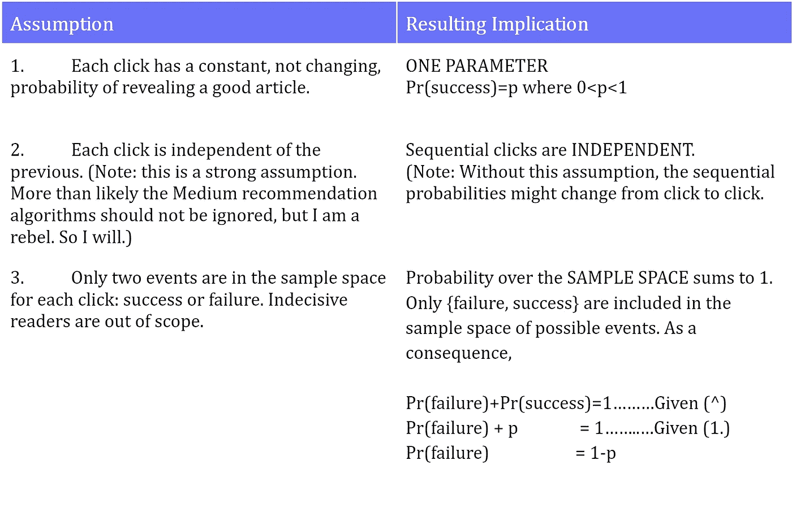
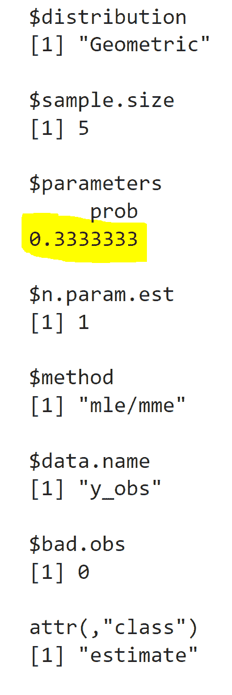
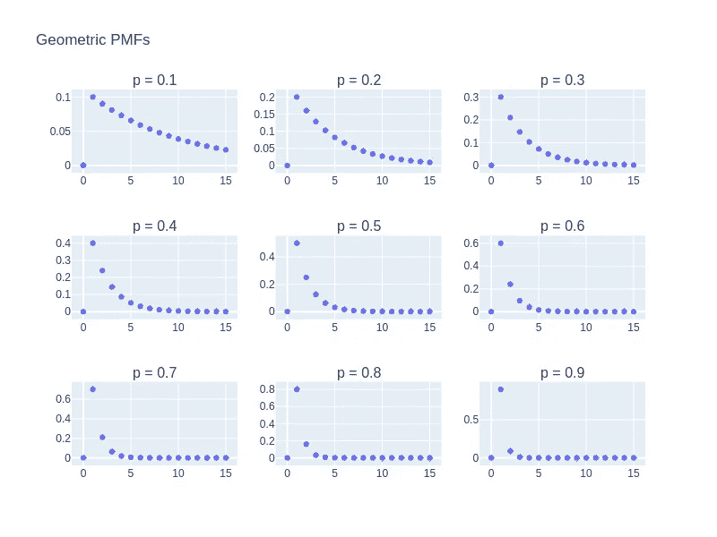
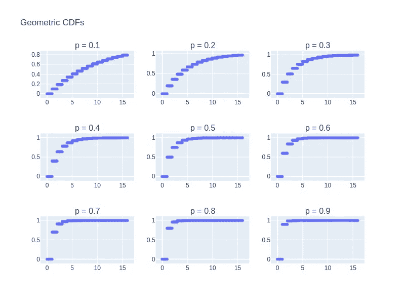
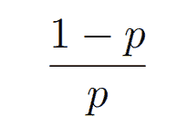
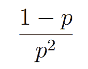

# 数据科学家的概率:伟大的几何分布

> 原文：<https://towardsdatascience.com/probability-for-data-scientists-the-great-geometric-distribution-586ce424c26b>

## 理论系列

## PMF/CDF 的交互式可视化&模拟真实数据

本文的目的是介绍几何概率分布。这是概率系列文章之一。我的目标是以直观、简洁、有用的方式描述每个发行版。不会有推导或证明的重点。相反，我希望把重点放在分布的效用上，而不是推导上。

本文未涉及的发行版:

*   [初学者的概率分布](/probability-distributions-for-beginners-d14f59aba2cb)
*   [数据科学家的概率:卡方分布](/probability-for-data-scientists-the-capable-chi-squared-distribution-abced58fa157)
*   数据科学家的概率:强大的泊松分布(链接即将推出)
*   更多的发行版和可视化教程在我的[页面](https://k8wall.medium.com/)

# **什么是几何分布？**

几何分布模拟了许多次失败，直到第一次成功。

换句话说，它是一个等待时间分布。它描述了一个场景，在这个场景中，通过 y 次失败，您一直等待，直到某个事件发生。它回答了这样一个问题，“我经历了 y 次失败才看到成功的概率是多少？”

## **例子**

想象一下，每天按顺序打开和阅读媒体文章。当你读到一篇你喜欢的文章时，你就成功了。当你读到一篇你不喜欢的文章时，就会出现失败。你一直读到写完一篇你喜欢的文章。然后，你马上结束午休，回去工作。打开应用程序。

> ***事件***
> 
> 星期一……失败，失败，失败，成功！
> 
> 星期二……失败，成功！
> 
> 星期三…失败，失败，失败，失败，失败，失败，成功！
> 
> 周四…..成功！
> 
> 星期五…..…成功！

我们收集了 5 个连续试验的观察结果。我们可以把这些观察总结如下。

> ***从样本空间映射到实现值 y1，y2，y3，y4，y5:***
> 
> 星期一……3 失败直到成功
> 
> 星期二……..一
> 
> 星期三…6。
> 
> 星期四……0
> 
> 星期五……0

但是这些只是可能的 y 值的 5 种可能的实现。暂时将这些值留在这里。我们一会儿还会用到它们。

我们如何用数学方法描述所有可能的值？

"几何分布模拟了第一次成功之前的失败次数(y). "

对于任何给定的序列，失败会发生 y 次。成功在序列结束前发生一次。因此，我们将失败的概率提高到 1 次方，将成功的概率提高到 1 次方。

其中 y 是集合{0，1，2，…,∞}中的任意值

嗯，还不算太糟。虽然在上面的等式中不明显，但是在上面的公式中做出了 3 个关键假设。

这是一个很好的表达方式。这是一组很好的观察，但是这有什么用呢？

克里斯蒂安·霍尔辛格在 [Unsplash](https://unsplash.com/s/photos/geometric?utm_source=unsplash&utm_medium=referral&utm_content=creditCopyText) 上拍摄的照片

## 发行版的使用

现在我们有了一个观测值的概率表达式，我们可以为多个观测值生成一个联合概率表达式。联合概率在数学上等同于似然性。(注:虽然联合概率和可能性在数学上包含相同的表达式，但它们没有等价的解释。)给定我们的观察，最大化似然性产生参数 p 的估计。

该分布允许我们从样本 y1，y2，y3，y4，y5 估计 p̂。这个估计 p̂是我们对总体真实参数 p 的最佳猜测。样本 y1、y2、y3、y4、y5 中的观察值来自中等用户体验人群。

我们可以手动导出最大似然估计，在许多统计课程中，我们会这样做。但是有很多关于这些细节的文章。

让我们跳到使用 R 中的 [EnvStats](https://search.r-project.org/CRAN/refmans/EnvStats/html/egeom.html) 包来分析几何分布数据并产生 MLE 估计。

按作者输出

我们从 y～geometric(p)的 5 个观测值的样本中估计任何试验都有⅓成功概率。然后，我们可以使用这个 p 估计来模拟媒体用户活动的未来观察。预测行为可能会引导未来的商业决策。

## **概率质量函数**

现在，我们可以观察参数值如何改变概率质量函数(PMF)。PMF 描述了 Y 的每个离散值的概率。单击播放并拖动该条来更改参数 p。对于 p=0.6，Y 为 1 的概率，即等待时间为 1 的故障，为 0.6。

作者精心制作的[互动图形](https://plotly.com/~k8wall/11/)

下图跟踪:

## **累积分布函数**

最后，我们可以观察参数值如何改变累积分布函数(CDF)。CDF 描述了 Y 的每个离散值的概率，点击播放，拖动滚动条改变参数 p，对于 p=0.6，Y 小于等于 1.5 的概率为 0.6。

请注意，如果不对图进行大量定制，很难显示 CDF 的步进性质。在每个整数值处，累积概率会发生变化，因为 CDF 是右连续的。1 因此，对于 p=0.6，Y 小于或等于 2 的概率为 0.84。

作者绘制的互动图形

以下所有图迹。

关于如何生成上述图形的代码，请参见下面的 [GitHub 笔记本](https://github.com/katewall/medium_tutorials/blob/main/220220_Medium_GeometricDistribution.ipynb)。

## **更多关键特性**

1.  仅由 1 个参数 p 指定！
2.  期望值——给定 p，分布的预期失败次数
3.  方差——给定 p 时，故障数量相对于平均值的分布
4.  [备选参数化](https://en.wikipedia.org/wiki/Geometric_distribution):设 y= '试验次数'(点击次数)而不是'失败次数'。这只是意味着我们让 y 为总点击次数，其中包括最后一次成功。

Y 的期望值

Y 的期望值是失败概率和成功概率的比值。

Y 的方差

Y 的分布是失败概率和成功概率的平方的比值。

## **几何分布的美好性质(高级)**

1.  无记忆！
2.  每一次试验都可以被描述为一次伯努利试验
3.  负二项分布的特例
4.  指数分布的离散模拟
5.  广泛用于随机建模

分布的高级性质在推导中非常有用。然而，它们在发行版初学者入门中没有用。需要额外的推导。如果你想知道将来如何使用这些属性，请发表评论！

那是一个包裹。

## 参考

1.  [卡塞拉，G. &伯杰，R. L. *统计推断*。(森盖奇学习，2021)。](http://paperpile.com/b/x5RNuE/5O9c)

喜欢这篇文章吗？下面更喜欢！

     