# 机器学习的概率

> 原文：<https://towardsdatascience.com/probability-for-machine-learning-b4150953df09>

## 概率在机器学习中是如何使用的？

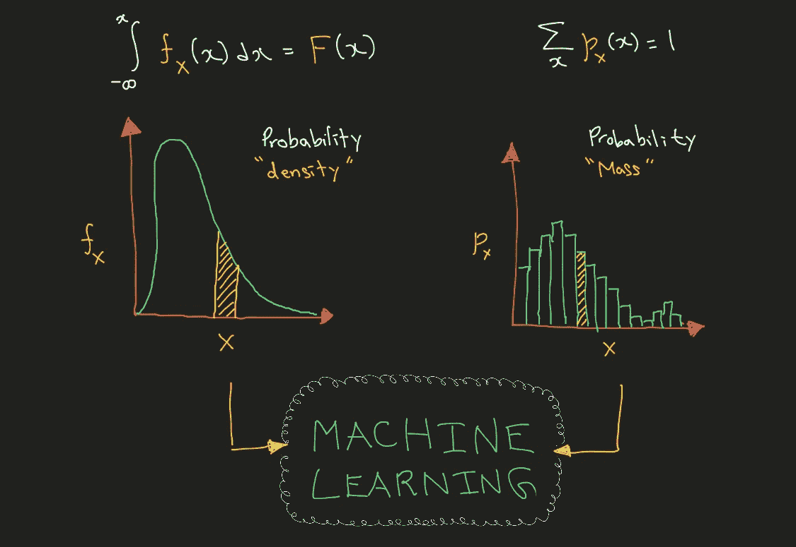

# 1.介绍

在本帖中，我们将介绍概率论的构建模块，并使用这些知识来激发机器学习的基本思想。在第一部分，我们将讨论随机变量以及它们如何帮助量化真实世界的实验。下一节将讨论概率分布函数。最后一节将讨论如何将这些数学概念结合起来解决机器学习问题。

# 2.随机变量

让我们从一个有趣的实验开始我们的旅程。拿笔和纸；走到你家门前的大街上。看着每一个从你身边走过的人，注意他们头发的颜色；以厘米为单位的高度近似值；以及其他你感兴趣的细节。这样做大约 *10* 分钟。

恭喜你！你进行了你的第一次实验！通过这个实验，你现在可以回答一些问题:有多少人从你身边走过？走过你身边的人有多少是蓝头发的？从你身边走过的人的平均身高是多少？也许在这个实验中， *10* 人从你身边走过；*这些人中有 3 人有蓝色的头发；并且他们近似身高的平均值可能是 *165.32* 厘米。对于这些问题中的每一个，我们都给它绑定了一些数字；我们把它和一些可测量的量联系在一起。*

> 随机变量是将实验结果映射到可测量数量的函数。

我们现在可以用一个随机变量来表示 3 个问题中的每一个。例如，设 *X₁* 为随机变量，代表走过你身边的人数。从定义上注意，随机变量是函数。因此，我们可以在[功能符号](https://en.wikipedia.org/wiki/Function_(mathematics))中编写以下内容。

等式 1

这意味着随机变量 *X₁* 是一个将“走过你身边的人数”(一个实验结果)映射到某个非负整数 *10* (一个可测量的量)的函数。同样，让 *X₂* 成为随机变量，代表走过你身边的蓝头发的人的数量。然后我们可以写下面。

等式 2

这意味着 *X₂* 是一个将“走过你身边的蓝头发的人的数量”(一个实验的结果)映射到一个非负整数量 *3* (一个可测量的量)的函数。同理，设 *X₃* 为随机变量，代表从你身边走过的人的平均身高。

等式 3

这意味着 *X₃* 是一个将“从你身边走过的人的平均高度”(一个实验结果)映射到一个非负实数 *165.32* (一个可测量的量)的函数。这些随机变量之所以如此有用，是因为它们能够将观察人类的有趣实验变成我们可以用来进行数学运算的数字。在下一节中，我们将看到这些随机变量是如何构成概率分布函数的核心的。

# 3.概率分布函数

随机变量为我们提供了一种量化实验结果的方法。但是这些结果(以及随机变量)到底是如何表现的呢？我们可以用概率分布函数来理解这一点。

在我们的实验中，我们看到 10 个人从我们身边经过。“10 个人”就是一个“结果”的例子。然而，我们可以有 0 个人超过我们，或者 1 个人超过我们，或者 2 个人超过我们，等等。因此，实验的所有可能结果的集合 *S* 如下。

等式 4

这组可能的结果被称为“事件”。现在让我们用正式的数学符号写出*等式 4* 。设单次实验的结果为ω *₁* 对应的随机变量为 *X₁.然后我们可以把所有这些可能的结果写成如下。*

等式 5

大括号{。}代表一个集合；冒号“:”翻译成英语短语“这样”；ℤ⁺代表了 X₁可以接受的非负整数值的集合。给定这个上下文，*等式 5* 翻译成下面的英语语句。

> ****事件*** S *是一组* ***结果*** ω₁ *使得* ***随机变量*** X₁ *可以取任何非负整数的值。**

*事件 S 发生的概率是 *100%* ，因此不太有趣。通常，我们感兴趣的事件是 *S* 的子集。例如，我们可能有兴趣回答“两个人超过我们的概率是多少？”。我们可以将另一个事件 *A* 定义为我们感兴趣的一组结果；对于我们的例子，我们只对“两个人”的结果感兴趣。*

**

*等式 6*

*我们可以用下面的数学符号更一般地写出来。*

**

*等式 7*

*在英语中，我们可以将*等式 7* 翻译成以下语句。*

> *****事件*** 一个*是一组* ***结果*** ω₁ *使得* ***随机变量*** X₁ *可以取值为 2。***

**既然我们已经了解了一个“事件”，现在让我们定义一个概率分布函数。**

> **概率分布函数是将一个事件映射到该事件发生概率的函数**

**设 *P* 为概率分布函数。根据定义， *P* 是一个函数。因此 *P* 接受一个输入并返回一个输出。这个概率分布函数的输入是一个事件，而输出是某个概率值*。*在数学记数法中，我们可以把 *P* 写成如下方式。**

****

**等式 8**

**使用来自*等式 7* 的事件 *A* 在*等式 8* 中的定义，我们得到以下符号。**

****

**等式 9**

**这个等式看起来很混乱。但是使用随机变量，我们可以用更简洁和直观的方式重写*方程 9* 。**

****

**等式 10**

**通过使用随机变量，我们可以利用*等式 10* 中显示的简明数学符号，而不是*等式 1-3* 中显示的冗长的英文陈述以及*等式 9* 中冗长的数学符号。现在让我们来谈谈概率分布函数的类型；希望随着我们继续讨论，随机变量的效用会变得更加清楚。**

## **3.1 概率质量函数**

**这是一个*离散*随机变量的概率分布函数。这个函数接受一个随机变量的值，并将它映射到一个概率值。例如，概率质量函数 *p* ₓ可以写成下面的数学符号。**

****

**等式 11**

***X* 是离散随机变量； *x* 是它可以采用的样本值。根据这个定义，在 *X=x* 的概率质量函数是随机变量 *X* 取值 *x* 的概率。你可以把这个输出看作随机变量的概率*质量*；这就像物理学中的质量。**

****

**等式 12**

> **如果一个随机变量可以取有限个值或可数无限个值，那么它就是离散的。**

**在我们的示例实验中，我们讨论了一个随机变量 *X₁* ，它代表走过你身边的人数。理论上，如果你在一个安静的农村地区，这个数字可能低至 *0* ，如果你在一个假想的世界大都市的中心，这个数字可能高达世界人口(大约 80 亿)。因此 *X₁* 可以取 80 亿个不同值中的一个: *1，2，3，…，8⨉10⁹；*这是有限数量的值。因此， *X₁* 是一个离散的随机变量。随机变量 *X₁* 的概率分布函数可能如下图所示。**

**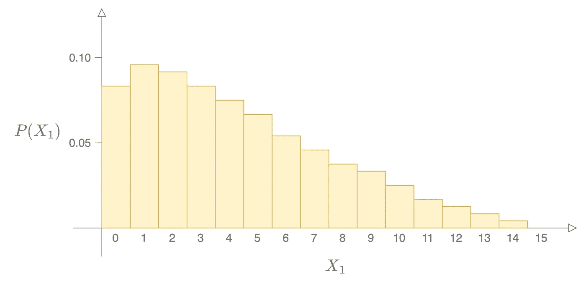**

**图 1**

***x* 轴显示 X₁ 可以取的不同整数值*。 *y* 轴显示与 *X₁* 的相应值相关的概率。从图中我们可以推断出实验过程中 *10* 人经过你的概率在 *0.03 左右。*换句话说，与 *X₁* = *10* 关联的概率*质量*为 *0.03* 。***

****

**等式 13**

**给定概率质量函数的这个定义，让我们讨论它们表现出的两个性质。**

****性质 1** :对于随机变量可以取的每一个值，概率质量函数的值都是大于等于 0 的概率数。在数学语言中，我们可以为随机变量 *X₁* 写如下。**

****

**等式 14**

**ℤ⁺代表了 X₁可以接受的非负整数值的集合。**

****属性 2** :如果我们取随机变量 *X₁* 可以假设的每一个可能的值，并确定这些值中每一个的概率质量函数，总数将是 *1* 。**

****

**等式 15**

**希望离散随机变量和概率密度函数的概念有意义。**

## **3.2.概率密度函数**

**这是一个*连续*随机变量的概率分布函数。该函数接受连续随机变量的值，并将其映射到概率值。概率密度函数 *f* ₓ可以写成以下数学符号。**

****

**等式 16**

**根据这个方程，概率密度函数是连续随机变量 *X* 在无限小的区间内取值时除以区间(体积)本身长度的概率(质量)的分数。因此这里看到的密度和物理学中的密度是一样的。**

****

**等式 17**

**为了清楚起见，我们要求在*等式 16* 中有一个极限，因为 *X* 是一个连续的随机变量，可以取实值。极限表示当δ*x*从正方向接近 *0* 时，该密度将收敛到的值。在这一节中，我们将推导出概率密度函数的一些性质，这样就清楚了为什么我们需要它们。但首先，让我们从连续随机变量的定义开始。**

> **如果一个随机变量可以取不可数的值，那么它就是连续的。**

**考虑随机变量 *X₃* ，它代表实验中走过你身边的人的平均身高。该值可以是类似于 *165 厘米*、 *170 厘米*的数字。这是我们第一次尝试绘制这些数据。**

**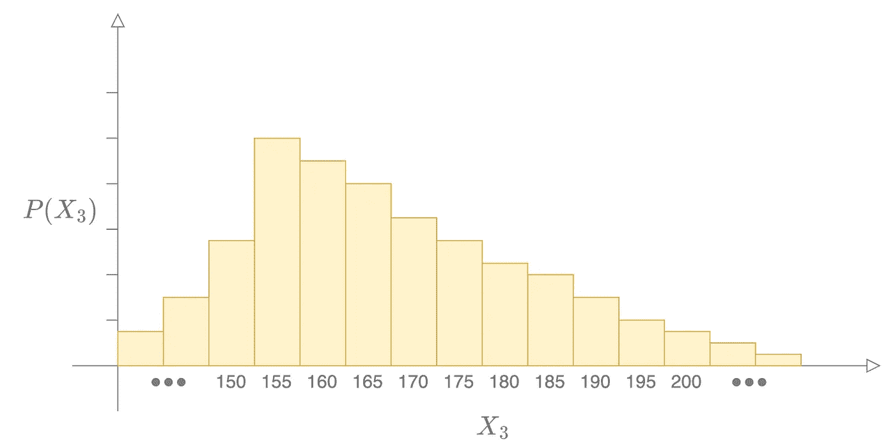**

**图 2**

**这张图表很好地概括了数据。然而，这意味着实验中测得的人的平均身高只能是相隔 5 的整数值。这不一定是真的；毕竟，我们可以看到平均身高可能接近 166 厘米的情况。所以也许，我们可以把它分解，这样每一厘米都用 x 轴表示。**

**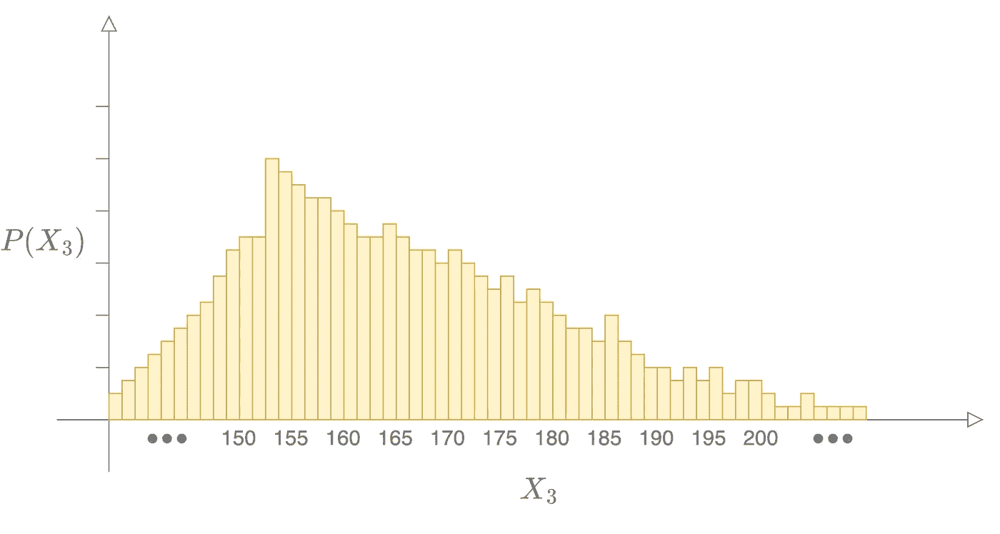**

**图 3**

**但是*图 3* 仍然不准确，因为我们可以得到平均身高值为 *165.5 厘米*或 *165.25 厘米*或 *165.25495824 厘米；X₃可以进行无数次测量。因此， *X₃* 是一个连续随机变量。为了在图上表示连续随机变量的分布，每个垂直矩形条的宽度需要变得无穷小；这导致平滑的曲线。***

****

**图 4**

****性质 1** :连续随机变量的一个核心性质是，对于随机变量可能取的任何值，它们的概率质量函数都是 *0* 。数学上，这可以用下面的等式来表示。**

****

**等式 18**

**我们将用一些微积分来说明这种情况。让我们用累积分布函数来证明这个事实。它是随机变量 *X₃* 取任何小于或等于某个值 *x* 的概率。如果我们把 *F* 表示为累积分布函数，我们可以写出下面的符号。**

****

**等式 19**

**为了计算与连续随机变量相关的概率质量，让我们取 *X₃* 的累积分布函数之间的差，当它取值为 *x* 和稍小的值时。让我们只用概率分布函数 *P* 的符号来写这个，看看发生了什么。**

****

**等式 20**

**对于连续变量，δ*x*是一个无穷小的值，收敛于 *0* 。所以我们可以用数学符号中的极限来写这个。**

**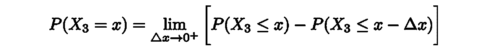**

**等式 21**

**求解这个极限，我们会看到连续随机变量 *X₃* 取任意值 *x* 的概率质量函数将会是 *0* 。**

****

**等式 22**

**直觉上，这个等式是有道理的。实验中人的平均身高恰好是**165cm*而不是 *165 + 10* ⁻ ⁰⁰或*165*-*10*⁻⁰⁰的概率会收敛到值 *0* 。这意味着在处理特定点的连续随机变量时，实际上没有概率“质量”。因此，让我们用密度的概念来代替测量质量。密度是每单位体积的质量。***

***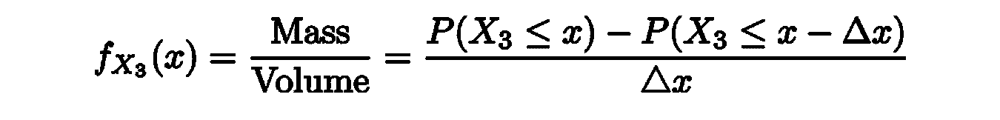***

***等式 23***

***对于像 *X₃* 这样的连续变量，delta x 是一个无穷小的值，收敛于 *0* 。数学上，我们用极限来表示。***

***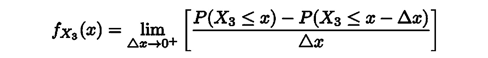***

***等式 24***

***右手边是累积分布函数的导数的正式定义。***

******

***等式 25***

*****性质 2** :因为累积分布函数可以取 0 到 1 之间的值，所以导数的行为类似。因此，概率密度函数的另一个重要性质是它大于或等于 0。***

******

***等式 26***

***我们可以两边积分，去掉导数。***

******

***等式 27***

*****性质 3** :这显示了另一个重要性质:连续随机变量所有值的概率密度函数积分为 1。***

******

***等式 28***

***要了解更多关于这些概率概念的趣闻，请查看 YouTube 上的附带视频(链接见第 6 节*)。****

## ***3.3.联合概率分布***

***现在让我们来谈谈离散和连续随机变量背景下的联合概率分布。为了激发在机器学习/现实环境中有意义的讨论，让我们进行另一个实验。在[zillow.com](http://zillow.com/)随机搜索一所房子，记下它包含的房价和卧室数量；这样做 10 个房子。现在让我们定义一些随机变量***

***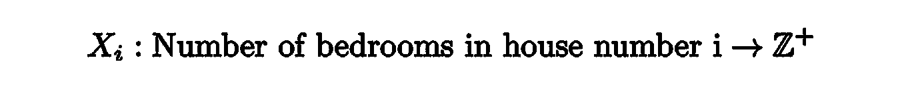***

***等式 29***

***我们定义了 *10* 离散随机变量 *X₁* 到*x₁₀*；每栋房子一个。这些随机变量中的每一个都是离散的，因为它们的取值是可数的。现在我们有了随机变量来将事件的结果映射到数字上，我们可以做一些分析了。例如，第一所房子有 *3* 间卧室的概率 *mass* 可以用下面的等式进行数学表示。***

******

***等式 30***

***记住，这是概率质量，因为我们在处理一个离散的随机变量。类似地，第三个房子的卧室数量为 9 的概率*质量*可以用这个等式表示***

******

***等式 31***

***联合概率分布将指示这两个随机变量同时呈现某些值的概率质量。第一个房子有 3 间卧室，第三个房子有 9 间卧室的联合概率可以用数学来表示。***

******

***等式 32***

***在这个实验中，我们观察了 10 所房子；如果我们写出观察到这 10 个值的联合概率，我们最终会得到下面的符号，它从每个随机变量中抽取一个值。***

***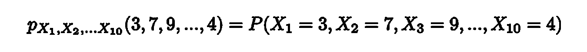***

***等式 33***

***这是针对概率质量函数的性质仍然成立的离散情况。也就是概率质量大于等于 0。在数学符号中，它看起来像下面这样。***

******

***等式 34***

***第二个属性表明，每个随机变量的所有可能值的联合概率质量总和应该为 1。***

***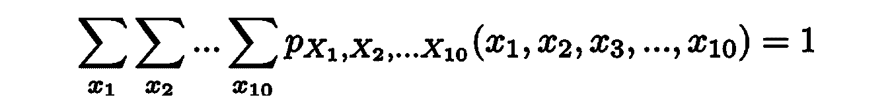***

***等式 35***

***现在让我们把这个例子推广到连续随机变量的情况。记得当我们记录这 10 所房子时，我们记下了卧室的数量和价格。让我们定义另一组 10 个随机变量。***

***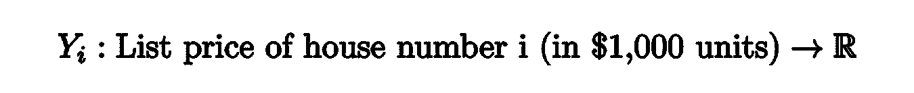***

***等式 36***

***我们定义了 10 个连续的随机变量 *Y₁* 到*y₁₀*；每栋房子一个。这些随机变量中的每一个都是连续的，因为它们可以取的值是不可数的。现在我们有了随机变量来将事件的结果映射到数字上，我们可以做一些分析了。例如，第一所房子低于 30 万美元的总概率*密度*可以用下面的等式进行数学表示。***

******

***等式 37***

***同样，第三个房子低于 70 万美元的总概率*密度*可以用下面的等式进行数学表示。***

******

***等式 38***

***联合概率密度函数的性质类似于单个随机变量的密度函数的性质。***

*****性质 1** :例如，一个连续的随机变量在任何一点的概率质量都是 0，正如我们之前所讨论的。***

******

***等式 39***

*****概率 2** :对于随机变量的任意值，联合概率密度将是一个大于 0 的数。***

******

***等式 40***

*****属性 3** :同样，每个连续随机变量的所有值的总联合概率密度总和应为 1***

***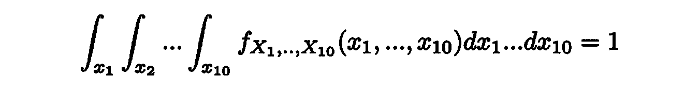***

***等式 41***

***给定概率分布的上下文，现在让我们将所有这些与机器学习中的应用联系在一起。***

# ***4.机器学习应用***

***概率在机器学习中最基本的应用之一可能是在统计模型的参数估计中。让我们继续使用查看[zillow.com](http://zillow.com/)挂牌出售的房屋信息的实验。以下是您可能会看到的一些示例清单。***

***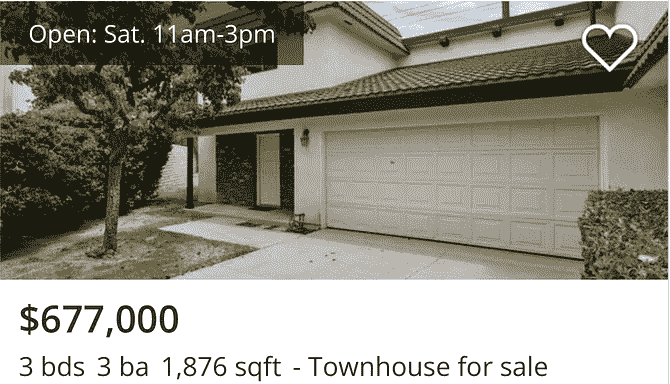***************

***图 5:来源:【www.zillow.com ***

***给定这些列表，假设我们想要构建一个统计模型，在给定房屋信息(如房屋的面积、房龄和卧室数量)的情况下，预测房屋的销售价格。***

***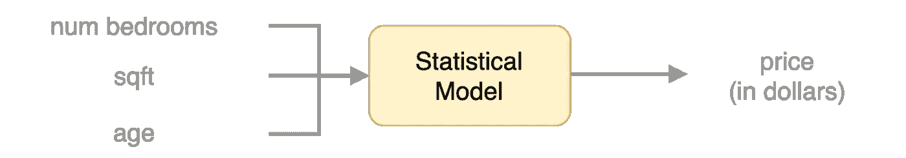***

***图 6***

***在我们的【zillow.com】实验中，让我们查看 10，000 所房子，并为每所房子收集这些信息。我们最终可以构建一个如下所示的表。***

***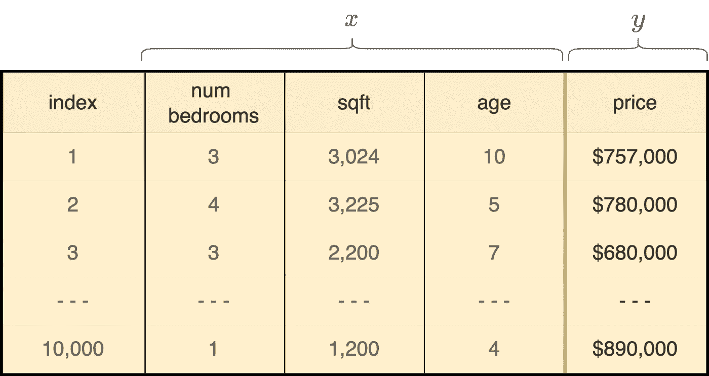***

***图 7***

***现在，让我们来谈谈数学是如何适用的。在这个实验中，我们可以将一个*事件*视为查看每栋房子并收集信息的行为。所以，我们可以得出一些随机变量如下。***

***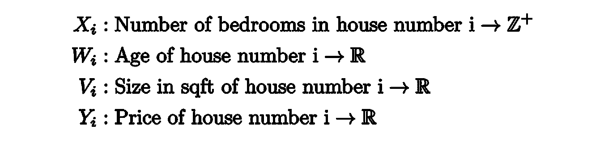***

***等式 42***

***换句话说，对于我们在 Zillow 上看到的每栋房子，我们可以创建 4 个随机变量。假设我们观察的第五宫是图 5 中的第一宫。我们可以定义 4 个随机变量如下。***

***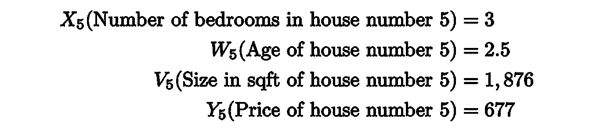***

***等式 43***

***所以对于 10000 栋房子，我们可以用同样的方法创造 40000 个随机变量。因此，我们能够将查看 zillow.com[上房屋列表的事件转化为我们可以进行数学运算的数字。](http://zillow.com/)***

***现在我们已经定义了我们的随机变量，其中哪些是离散随机变量；哪些是连续随机变量？卧室的数量是可计数的，因此所有 10，000 个 *Xᵢ* 随机变量都被作为离散随机变量进行分析。另一方面，房子的大小、年龄和价格都是可以有无数数值的衡量标准。因此，所有其他 30，000 个随机变量 *Wᵢ、Vᵢ、Yᵢ* 都作为连续随机变量进行分析。***

***现在让我们使用我们收集的数据和随机变量的概念来估计我们的统计模型的参数。但是在这样做之前，让我们给模型蓝图添加一些正式的数学知识。我希望统计模型是简单的线性回归。***

******

***等式 44***

***这是线性回归假设方程。让我们把这个方程写得更正式一点。***

******

***等式 45***

***注意这个方程中的变量 *x，y，v，w* 不是随机变量；它们是随机变量的输出可以取的特定值。 *y* 是我们要预测的房价； *x，v，w* 是我们拥有的房屋信息片段；𝜃项是我们需要估计的模型参数；ε是不可约误差。等式 *X* 中的𝜃项通常用一种称为最大似然估计的技术来计算。***

## ***4.2 最大似然估计***

***直观上，我们想确定方程 X 中最符合我们所看到的 10000 套房价的参数值；这应该是最好的模式。从数学上来说，这相当于找到最大化观测到第一套房子的房价为 y1，第二套房子的房价为 y2 等等的联合概率密度的参数值。在数学符号中，我们用下面的等式来表示。***

***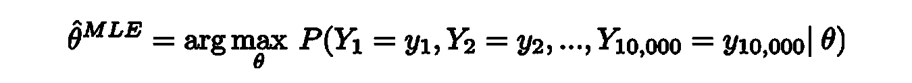***

***等式 46***

***注意单词*密度*的使用，因为我们正在处理连续的随机变量。 *arg max* 用于表示“最大化*该*功能的参数值”；这个函数是联合概率密度函数。我们在机器学习中做的一个假设是，房价独立同分布；我们会打破这一点。“独立分布”意味着房屋 1 的房价不影响我们的 10，000 房屋数据集中的任何其他房屋的价格，也不受其影响；这是一个合理的假设。从数学上讲，这意味着联合概率密度与其组成部分的乘积相同。***

***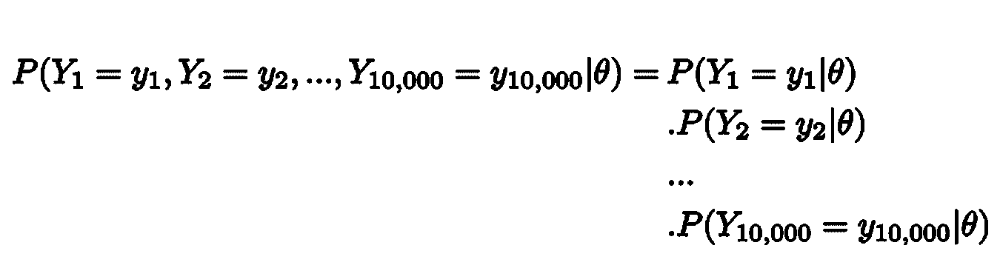***

***等式 47***

***因为我们知道每个 Y *ᵢ* 是一个连续的随机变量，我们可以使用我们学习过的概率密度函数的符号。结果是概率密度函数的乘积。***

***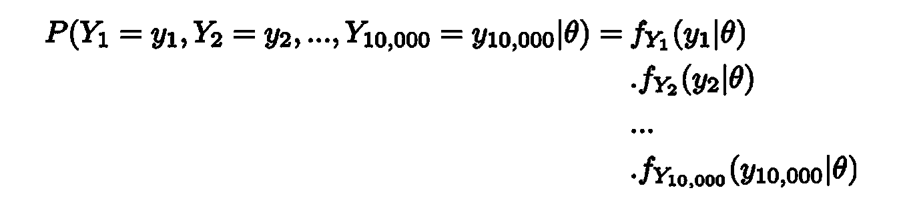***

***等式 48***

***因此，我们可以用概率密度函数的乘积来代替方程 X 的右边。***

***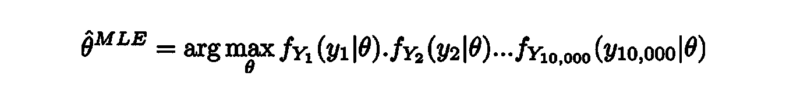***

***等式 49***

***非常好！独立同分布的第二部分是“同分布”。正如我们在连续随机变量一节中所看到的，每个随机变量的行为可能不同；因此它们有自己的分布函数。然而，我们假设第一所房子的潜在房价分布与其他 10，000 所房子相同。这意味着任何一个 *Yᵢ* 随机变量在相同点的概率密度是相同的。***

******

***方程式 50***

***这意味着我们可以重写方程 x，只使用一个随机变量 y，而不是 10，000 个 Yᵢ。***

******

***方程式 51***

***让我们用产品符号来压缩这个符号，如下所示。***

******

***等式 52***

***又漂亮了！我们有一个简洁的符号。我们在这里做什么实际上取决于我们正在构建的统计模型的类型。在我们的例子中，我们试图建立一个线性回归模型；所以假设概率密度函数遵循正态分布。完成此数学运算后，一个有趣的发现是，在线性回归情况下，𝜃的最佳值将是使[残差平方和方程](https://en.wikipedia.org/wiki/Residual_sum_of_squares)最大化的值，这是机器学习中的一个基本方程。如果您对这个推导过程感兴趣，下面是参考资料的链接。此外，如果你对可能性及其与概率的联系的数学讨论感兴趣，请查看我在 YouTube 频道“代码商场”上的另一篇[媒体博客文章](/likelihood-probability-and-the-math-you-should-know-9bf66db5241b)和[视频](https://www.youtube.com/watch?v=-eGJuwQ5A2o)。***

# ***5.结论***

***在这篇文章中，我们讨论了随机变量如何让我们量化实验的结果。然后，我们使用概率分布函数来理解这些随机变量的行为。根据所测量的随机变量是离散的还是连续的，我们可以画出不同类型的概率分布函数；离散随机变量的概率质量函数，以及研究连续随机变量的概率密度函数。通过理解如何使用最大似然估计来估计统计模型的参数，我们最终使用机器学习将所有这些概念联系在一起。***

***谢谢你一直读到最后！关于数学概念以及它们如何与机器学习结合的详细讨论，请查看我的 YouTube 频道“代码商场”和下面的其他资源。***

****所有未注明出处的图片均由作者创作****

# ***6.资源***

***[1] Code Emporium，[机器学习的概率论](https://www.youtube.com/playlist?list=PLTl9hO2Oobd9bPcq0fj91Jgk_-h1H_W3V) (2022)， *YouTube* 。***

***[2]伦敦帝国理工学院，[机器学习的数学](http://imp.i384100.net/MathML)， *Coursera****

***[3]约翰·霍普金斯大学，[数据科学高级统计学](http://imp.i384100.net/AdvancedStatistics)， *Coursera****

***[4]悉尼大学，[微积分入门](http://imp.i384100.net/Calculus)， *Coursera****

***[5] Ajay Halthor，[可能性、概率和你应该知道的数学](/likelihood-probability-and-the-math-you-should-know-9bf66db5241b) (2022)，*走向数据科学****

***[6]丹尼斯·孙，[概率导论](https://dlsun.github.io/probability/) (2020)***

***[7] Joram Soch，[简单线性回归的最大似然估计](https://statproofbook.github.io/P/slr-mle) (2021)，*统计证明之书****