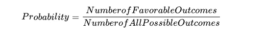
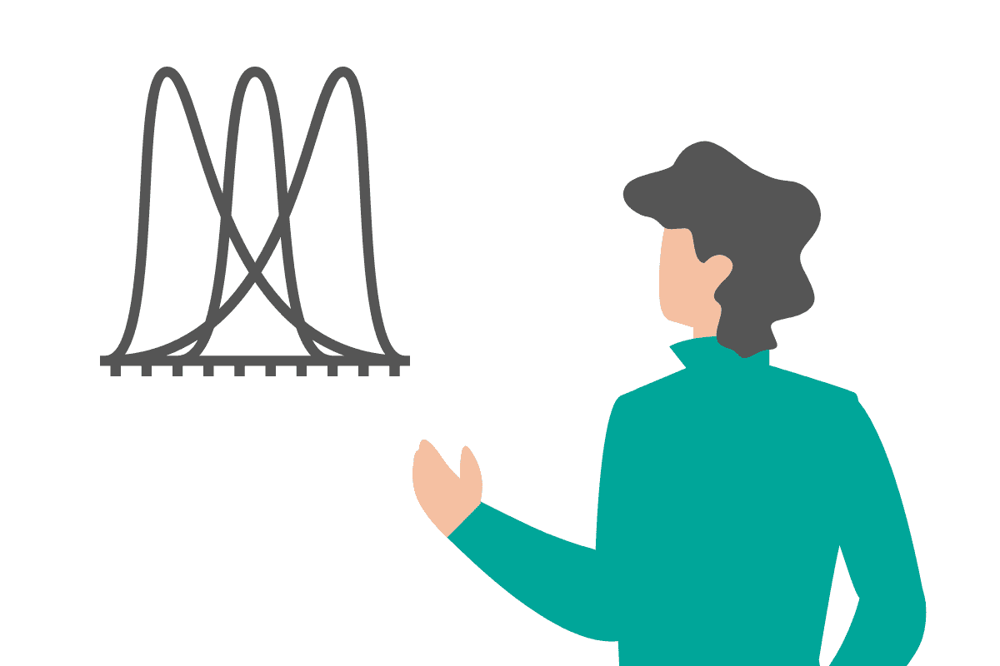
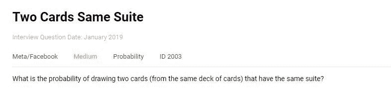
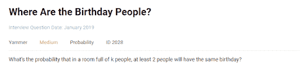
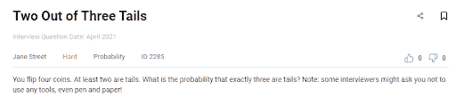
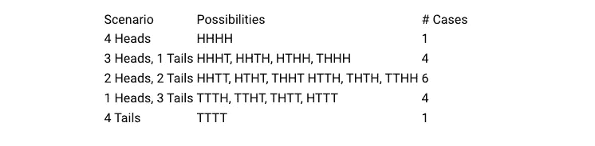

# 数据科学家的概率面试问题

> 原文：<https://towardsdatascience.com/probability-interview-questions-for-data-scientists-ef71b1747ec2>

在本文中，我们将从顶级公司的数据科学面试中了解一些概率问题，并概述各种解决方法。

作者在 [Canva](https://canva.com/) 上创建的图片

概率统计是机器学习和数据科学的基础。虽然深奥的算法可能是城里最新的闪亮事物，但大多数有抱负的数据科学家很少关注基础。概率面试问题显得过于简单，同时又具有挑战性。每个涉及概率的问题最终都归结为一个简单的关系。

概率问题在数据科学面试中非常受欢迎。面试官最喜欢的话题包括-

*   机会游戏
*   组合学
*   概率分布
*   期望值
*   贝叶斯定理

在本文中，我们将查看 Meta 等顶级公司的数据科学面试中的一些概率问题，并概述各种解决方法。

# 概率面试问题

作者在 [Canva](https://canva.com/) 上创建的图像

让我们从一个简单的问题开始。这个问题出现在 Meta /脸书数据科学的一次采访中。

## 两张相同花色的牌

*从同一花色中抽两张牌的概率有多大？(假设从一副牌中抽完牌后没有放回原处)*

截图来自 [StrataScratch](https://platform.stratascratch.com/technical/2003-two-cards-same-suite?utm_source=blog&utm_medium=click&utm_campaign=medium)

你可以在这里的 StrataScratch 平台上解决这个问题:[https://platform . StrataScratch . com/technical/2003-two-cards-same-suite](https://platform.stratascratch.com/technical/2003-two-cards-same-suite?utm_source=blog&utm_medium=click&utm_campaign=medium)

解决这个问题的一种方法是使用组合学。

**从 52 张牌中找出任意两张牌的抽牌方式数，就可以找到所有可能的情况**。这可以用 52C2 或 52.51/2 = 1326 种方式来实现。

**有利案例**同样可以找到。首先，我们从想要配对的四套西装中挑选一套。这在四个方面是可能的。然后，我们以与上面类似的方式进行。从特定花色的 13 张可能的牌中选择两张。这是 13C2 或 78 路。总的来说，从同一套牌中选择任意两张牌的方法有 4×78 = 312 种。我们现在可以简单地找到概率

**注意:**你也可以在这里用置换(有排列的选择)来代替组合。只要确保你在有利的和所有可能的情况下保持过程的一致性。

让我们试试解决这个问题的另一种方法。要做到这一点，让我们把问题分解一下。我们被要求从同一花色中找出两张牌。第二张牌决定了我们是否匹配了花色。抽完第一张牌后，这副牌还有 51 张。

比如说我们画了红心皇后。剩下的 51 张牌中，只有 12 张来自红心(回忆一下，我们已经抽到了红心皇后)。因此，我们的概率和前面一样:

这种分解概率问题的方式对于解决看起来复杂的概率问题非常有帮助。让我们增加一点难度。这个问题是在 Yammer Data Science 的一次采访中提出的。

## 过生日的人在哪里？

找出在一个有 k 个人的房间里，至少有两个人生日相同的概率。(假设一年有 365 天，k≤ 365)

截图来自 [StrataScratch](https://platform.stratascratch.com/technical/2028-where-are-the-birthday-people?utm_source=blog&utm_medium=click&utm_campaign=medium)

你可以在这里回答问题。[https://platform . strata scratch . com/technical/2028-生日的人在哪里](https://platform.stratascratch.com/technical/2028-where-are-the-birthday-people?utm_source=blog&utm_medium=click&utm_campaign=medium)

让我们把这个问题分解一下。所有可能的情况都很容易找到。这 k 个人的生日可以是一年 365 天中的任何一天。因此，所有可能情况的数量将是:

365 x 365 x 365 x 365 … k 次

或者

找到**个有利案例**有点复杂。我们可以让 k 个人中的两个人同一天生日，或者 k 个人中的三个人同一天生日，以此类推，直到所有 k 个人同一天生日。为了解决这个问题，我们可以按照下面的方式将所有可能的情况分成不同的场景。我们可以:

**场景**

**A)没有一个 k 人共享任何生日**

**B)共享生日的 k 人中的 2 人**

共享生日的 k 人中的 3 人

**…..**

k 个人中的所有 k 个人分享他们的生日。

如果仔细观察，除了第一种情景(情景 A)，其他所有情景都构成有利案例。因此，只有第一种情况是不利的。因此，我们可以通过找出不利情况的数量，然后从所有可能的情况中减去这些情况来找到有利情况，从而相对容易地解决这个问题。

**不利情况**是 k 人都不共享生日。这与指定 365 天中的 k 个生日没有重复是一样的。这可以通过以下方式实现:

因此，有利的情况是:

因此，所需的概率是，

让我们以一个涉及条件概率的问题来结束我们的课程。

## 三条尾巴中的两条

*同时掷四枚公平硬币，恰好得到三条反面的概率是多少？已知至少出现两条尾巴。*

截图来自 [StrataScratch](https://platform.stratascratch.com/technical/2285-two-out-of-three-tails?utm_source=blog&utm_medium=click&utm_campaign=medium)

你可以在这里回答问题[https://platform . stratascratch . com/technical/2285-two-out-of-three-tails](https://platform.stratascratch.com/technical/2285-two-out-of-three-tails?utm_source=blog&utm_medium=click&utm_campaign=medium)

虽然这个问题可以使用条件概率关系来解决，但我们将把它留给稍微复杂的情况。让我们通过分解问题来解决这个问题。如果不考虑额外的信息(至少两次掷硬币是反面)，那么我们可以很容易地找到有利的情况和所有可能的情况。

**所有可能的情况**都是正面或反面(两种结果),四次翻转或 24 次或 16 次场景。

**有利案例**正好是四翻的三尾。这可以简单地通过选择四个翻转中的哪一个是正面或四种可能性来找到。我们也可以轻松列举案例。TTTH，TTHT，HTTT。

这个问题的不同之处和潜在的棘手之处在于，它给出了至少有两条尾巴出现。这减少了可能情况的数量，而不影响仍然只有四个的有利情况。为了帮助说明这一点，让我们列出所有可能的情况。

截图来自 [StrataScratch](https://platform.stratascratch.com/technical/2285-two-out-of-three-tails?utm_source=blog&utm_medium=click&utm_campaign=medium)

因此，我们可以简单地减去那些不可能的情况，即没有尾巴出现和只有一个尾巴出现的情况。(以上斜体)。让我们来计算这些。

*没有出现反面:只有一种可能——四枚硬币都出现正面。*

****只有一条尾巴出现:*** 这有四种可能(我们有利的例子的另一面，只有一个头出现)。*

*所有可能的情况现在减少到 11 个(16 个，减去上面的 5 个)或 11 个。*

*因此，所需的概率是:4 / 11*

# *结论*

*在本文中，我们查看了基于概率的数据科学家访谈中提问类型的示例。涉及概率的问题涉及数学，但它们也可以通过将问题分解为基础来解决。和其他技能一样，一个人可以通过坚持和练习来提高他或她在这方面的熟练程度。此外，查看我们的帖子“ [*数据科学家的 30 个概率和统计面试问题*](https://www.stratascratch.com/blog/30-probability-and-statistics-interview-questions-for-data-scientists/?utm_source=blog&utm_medium=click&utm_campaign=medium) ”，找到更多这样的问题，可以帮助你提高技能，赢得数据科学面试。*