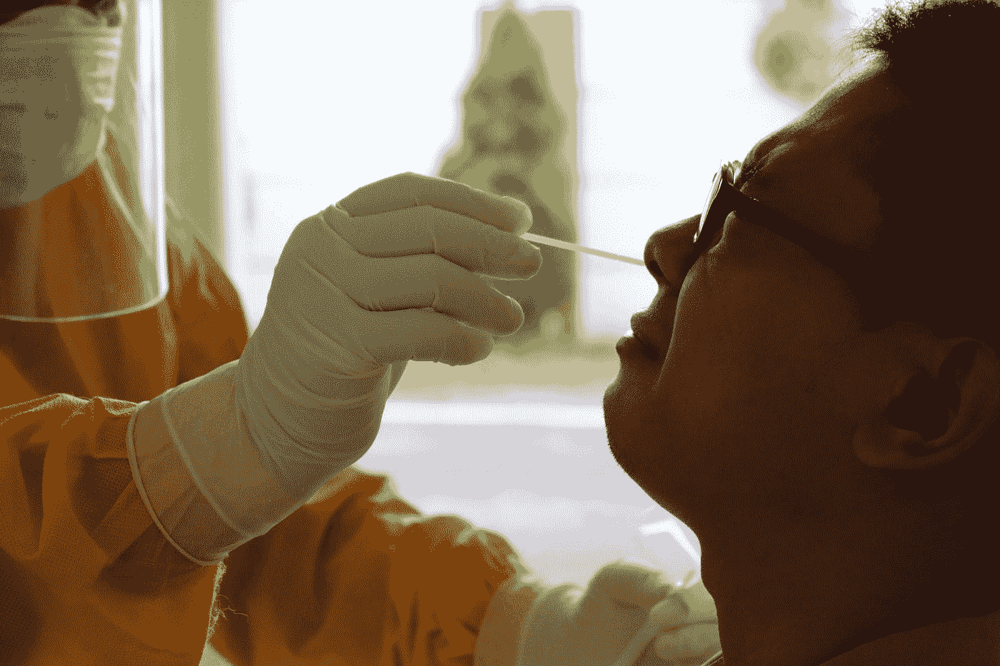
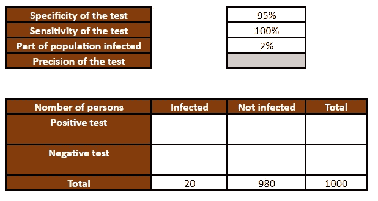
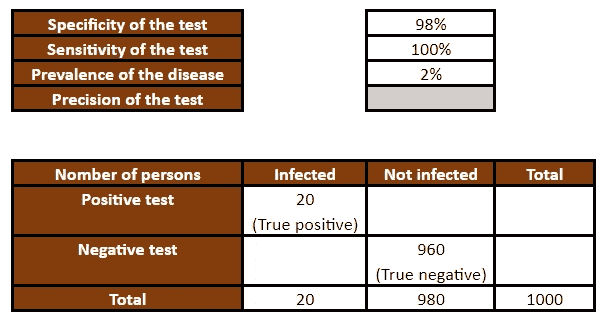
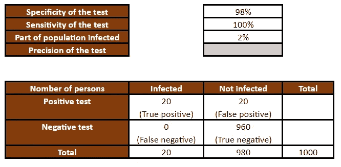
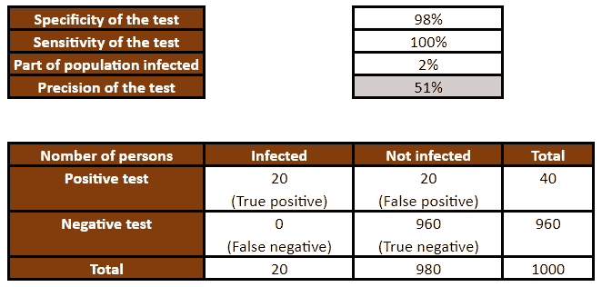
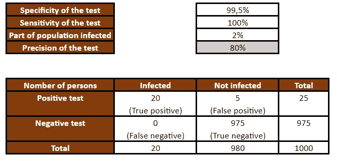
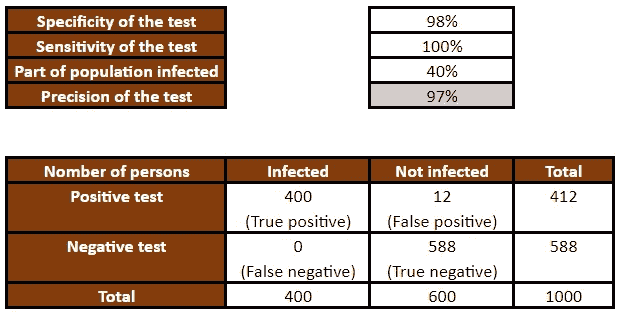
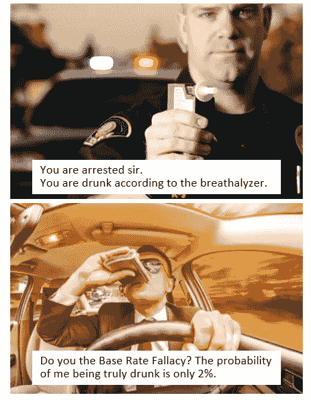

# 测试呈阳性时受影响的概率

> 原文：<https://towardsdatascience.com/probability-of-being-affected-while-the-test-is-positive-e62ac19311fa>

## 用 Excel 计算，以减少对假阳性悖论的混淆

我们对统计数据的直觉可能是错误的，统计悖论可能无处不在。当我们意识到这一点时，我们可以对我们的直觉如何误导我们得出的结论持更加批判的态度。

在这篇文章中，我将谈论假阳性悖论。对于一直知道这个悖论的人，你也可以看看我对它和机器学习关系的思考。

# 悖论

想象一下，有一个疫情，政府试图为每个人组织测试。

通常给出测试的以下特征:

*   测试的**灵敏度**表示该测试正确识别受感染人群的性能。它也被称为**真阳性率**或**回忆**。最高值为 100%,意味着所有**感染者**都被正确识别。
*   测试的**特异性**表明测试的性能能够正确识别未被感染的人。最高值也是 100%，意味着所有未受感染的人都被正确识别。在我们的例子中，假设测试的特异性为 98%。现在，你认为它已经很高了吗？我们将改变这个值，看看它将如何影响结果。

受影响的人口估计为 2%。我们也称这个指标为疾病的患病率。

现在想象你做了一个测试，它是阳性的。你真正被感染的概率有多大？该指标也被称为测试的**精度**。

> 凭直觉，你觉得有什么价值？90 %左右？如果告诉你是相当于 50%呢！是的，测试是阳性的，但是你只有 50%的机会被真正感染。

为了清楚地说明计算过程，我创建了一个**[**Google Sheet**](https://docs.google.com/spreadsheets/d/1xVsMiXV1dxJ6KtXlp-1DeX4zPlbicyND2My0mSr1KBc/edit?usp=sharing)**来完成所有的计算。我们开始吧！****

********

****在 [Unsplash](https://unsplash.com?utm_source=medium&utm_medium=referral) 上 [Mufid Majnun](https://unsplash.com/@mufidpwt?utm_source=medium&utm_medium=referral) 拍摄的照片****

# ****低患病率的混淆矩阵****

## ****真正的积极和真正的消极****

****让我们从真正感染和未感染的人数开始。考虑到总人口是 1000 人，由于患病率是 2%，我们只有 20 人感染。****

********

****作者图片****

****现在，给定**特异性**和**敏感性**，我们可以计算真阳性和真阴性的数量。****

*   ****由于检测是**高度特异性**，所有感染者都被识别出来。****
*   ****特异性还不完善，我们在 980 人中鉴定了 960 人。****

********

****作者图片****

## ******假阴性**和**假阳性******

****为了完成表格，我们可以做一些减法，我们有了**假阴性**和**假阳性的数量。******

********

****作者图片****

## ****测试的精确度****

****完成混淆矩阵后，我们现在可以通过将真阳性的数量除以测试阳性的总数来计算测试的精确度。****

****由于低流行率导致真阳性的数量很低，即使测试非常特异(98%)，假阳性的数量与真阳性相比相对较高。****

****所以测试的精度相当低，51%左右！****

********

****作者图片****

****我们可以对测试的特征做一些改变，更高的特异性会增加测试的精确度。****

********

****作者图片****

# ****假阳性悖论****

> ****统计学上的**悖论**是虽然特异性很高，但由于患病率非常低，精确度很低。这被称为**假阳性悖论**，因为尽管事实上测试是阳性的，我们仍然有相对高的几率成为**假阳性**。****

****这也是一种基本比率谬误，因为我们忽略了一个事实，即相对于总人口而言，受感染的人数很低。****

## ****高患病率的混淆矩阵****

****有了 Excel 文件，如果你增加流行度，那么我们就不会看到这个悖论。****

********

****作者图片****

## ****真实世界的数据****

****我搜索了一些关于 Covid 测试的真实数据。你可以阅读这个关于测试特性的[文件](https://ec.europa.eu/health/system/files/2022-01/covid-19_rat_common-list_en.pdf)。我们可以看到特异性通常高于 99.8%。有时候，甚至是 100%。****

# ****与机器学习的联系****

## ****性能赋值****

****混淆矩阵用于**医疗诊断**，也用于**信息检索**和机器学习**分类任务**。****

****用机器学习的术语来说，低流行率意味着**不平衡的训练数据**。在这种情况下，评估一款车型的性能，少不了既看**精度**又看**召回**。然后我们就可以计算出 **F1-score** ，这是精度和召回率的调和平均值。****

> ****我们可能知道，在建立模型时，不可能同时获得高精度和高召回率。所以我们要选择强调其中的一个。对于医学诊断的情况，你决定强调哪一个？****

## ****欠拟合****

****如果我们考虑到混淆矩阵是为一个机器学习模型计算的，那么这个模型**只有一个变量**(测试的结果)，是一种**欠拟合**。在实践中，我们有更多的变量可以是不同的**症状**。所以把它们结合起来，我们应该能提高精度。当然，如果疾病是**无症状的**，我们就无法获得更多的信息，所以我们会在高缺失值的情况下。****

****比如[基础谬误率](https://en.wikipedia.org/wiki/Base_rate_fallacy#Example_2:_Drunk_drivers)的维基百科页面上，我们有一个酒驾的例子。悖论是可以应用的，但是在实践中，通常还有其他的符号来增加精度。如果司机不能直线驾驶，或者他不能清楚地说话，那么，在现实中，我们在我们的“**模型**中有更多的变量来确定司机是否喝醉。****

********

****作者图片****

# ****结论****

****对于这个悖论和其他我也想写的悖论，我们能说些什么呢？一方面，重要的是要有一种统计文化，让我们知道有时我们的直觉可能会误导我们得出错误的结论。另一方面，现实世界要复杂得多，我们不应该停留在简单的统计数字上。****

****<https://medium.com/@angela.shi/membership> ****