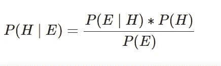
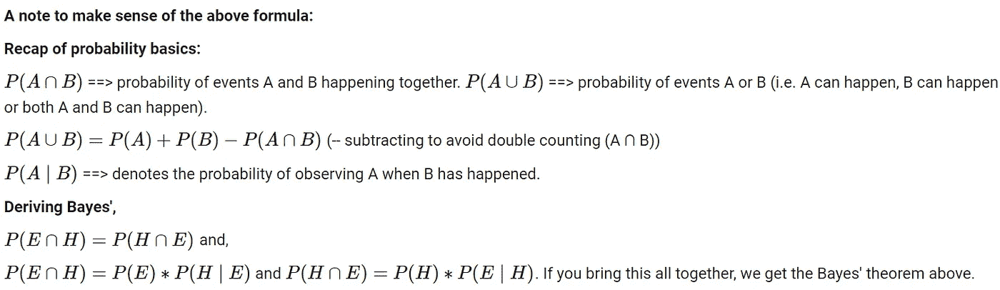
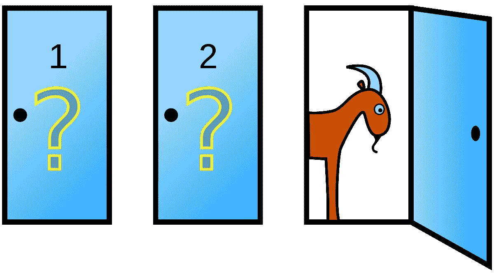
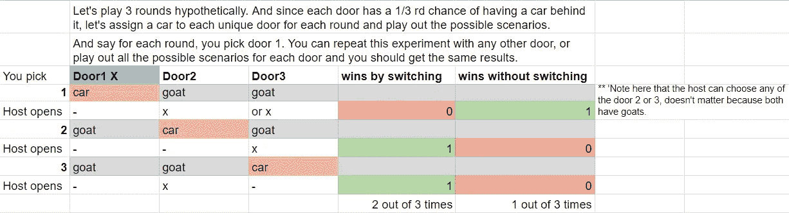
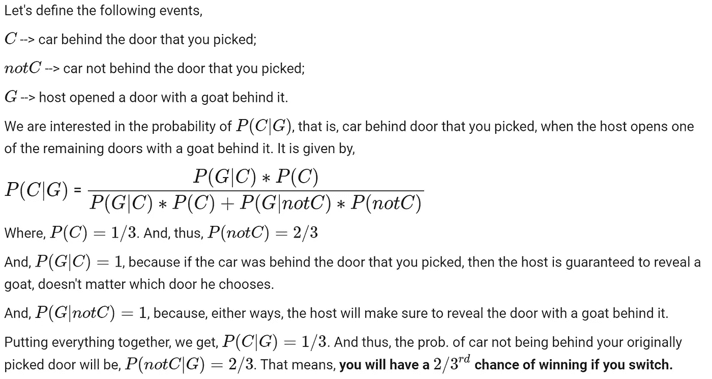
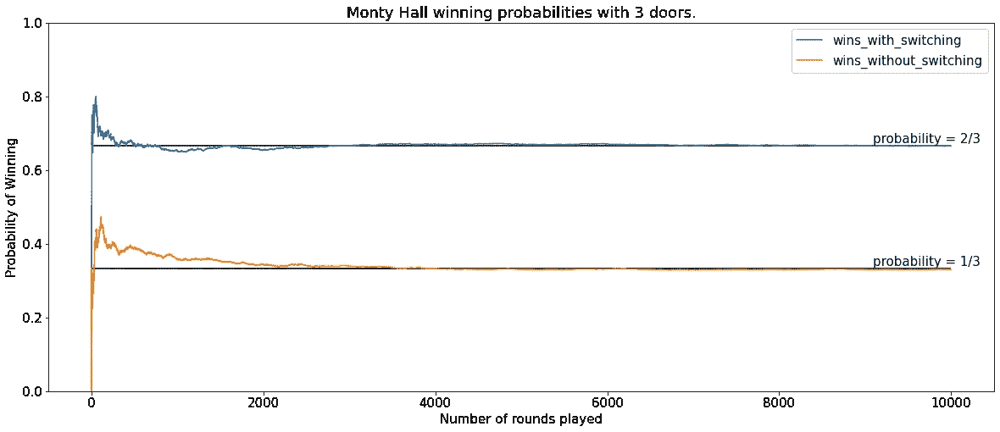
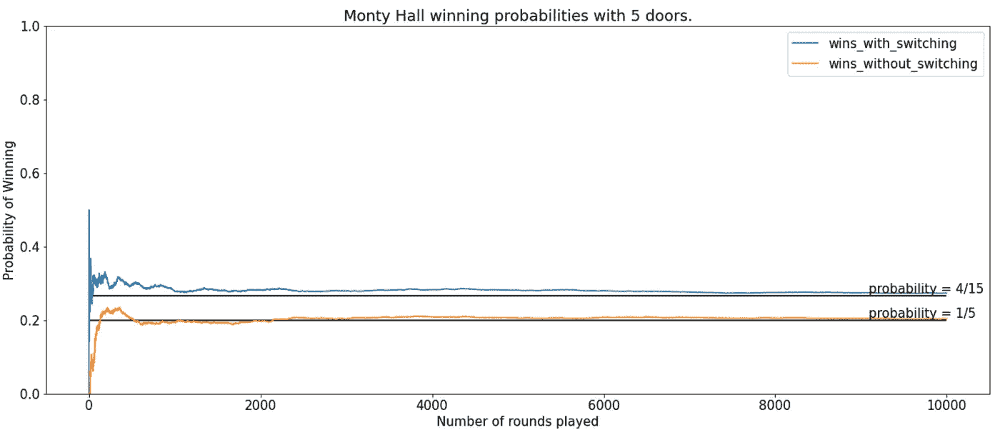
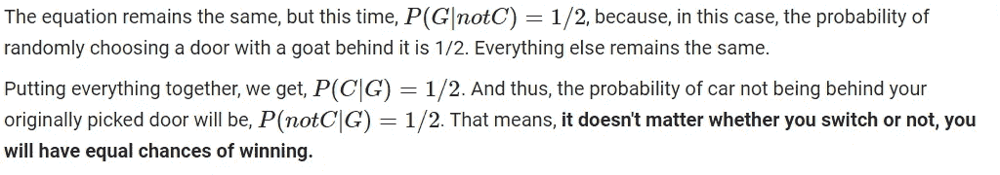
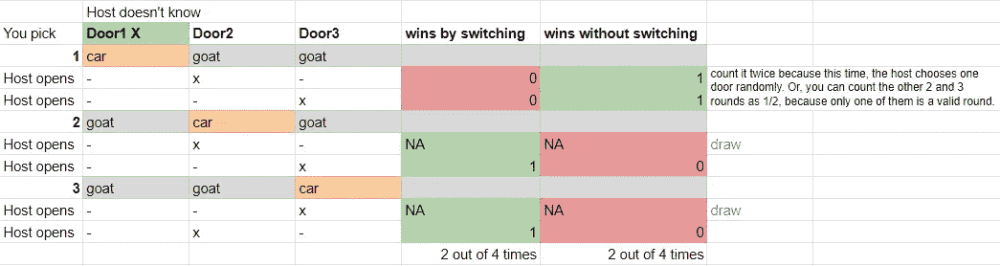
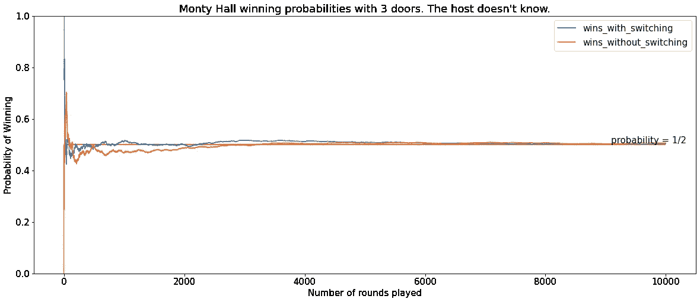

# 概率模拟:利用随机性解决复杂的概率问题:第 1 部分

> 原文：<https://towardsdatascience.com/probability-simulations-solve-complex-probability-problems-using-randomness-part-1-6010026d4f49>

## 通过设计实验并在虚拟世界中重复几次来估计有利结果的概率。

在我们的生活中，我们都和概率打过交道。无论是在需要掷骰子或处理纸牌的游戏中，还是在估计我们在体育赌博中获胜的机会中，或者是在计算疫苗的有效性中。在所有可能的结果中，当你想估计一个有利(或不利)结果的“机会”时，概率无处不在。

***注意*** *这篇文章不是介绍性的，需要一些关于概率的基础先验知识，包括贝叶斯定理。*

纳赛尔·塔米米在 [Unsplash](https://unsplash.com?utm_source=medium&utm_medium=referral) 上拍摄的照片

# 快速介绍

> 简单来说，概率就是给定事件发生的几率。或者用技术术语来说，根据 [merriam-webster](https://www.merriam-webster.com/dictionary/probability#:~:text=Definition%20of%20probability,total%20number%20of%20possible%20outcomes) ，它是产生一个给定事件的一组完全相同的可能结果中的结果数与可能结果总数的比率。

即(事件的)P =(有利结果的数量)/(总的可能结果)

*   举一个快速且非常熟悉的例子，让我们来看一枚公平硬币。两个可能的结果是正面(H)和反面(T)，每一个都有相等的发生几率。

因此，P(H) = 1/2，P(T) = 1/2，因为在每种情况下，结果的总数是 2 → {H，T}，正面的有利结果是 1 {H}，反面的有利结果是 1 {T}。因此，每种情况的概率是 1/2。请注意，**所有可能的**结果的概率总和应为 1。即 P(正面或反面)= P(正面)+ P(反面)- P(正面和反面)= 1/2 + 1/2 - 0 = 1。注意，在这里，硬币同时落在 H 和 T 上是不可能的。这些被称为互斥事件(它们不能同时发生)。

**快速回顾一下贝叶斯定理**

给定一个假设 H 和证据 E，贝叶斯定理建立了得到证据 E 之前假设 P(H)的概率与得到证据 P(H | E)之后假设的概率之间的关系。这是一个非常重要的概念，如果你不熟悉条件概率和贝叶斯定理，请随时参考这些链接[[1](https://en.wikipedia.org/wiki/Bayes%27_theorem)][[2](https://www.youtube.com/watch?v=HZGCoVF3YvM&ab_channel=3Blue1Brown)[[3](https://machinelearningmastery.com/bayes-theorem-for-machine-learning/)]。

贝叶斯定理

解释上述贝叶斯公式的一个注释

如果你想做一个更详细的概率回顾，请参考[这个](https://en.wikipedia.org/wiki/Probability)维基链接。

# 模拟概率:为什么？

现在大部分概率问题都可以在纸上解决了。但有时，问题会变得复杂和耗时。即使你成功地解决了它，也可能没有一个参考来检查你计算的答案是否正确，特别是如果你是一个在现实生活中使用概率的人——因为问题很可能是独特的。因此，模拟一个问题或实验来计算感兴趣事件的概率对于以下方面很有用:

*   通过实际进行虚拟实验，对问题有更深入的了解。
*   验证您计算的答案。
*   学习如何使用代码模拟简单到复杂的真实生活实验和场景；例如，对一个地区的经济稳定性建模，或者对一个国家的 COVID 扩展建模，等等。

# 模拟概率:设计步骤

*   **设计实验**。这来自于**问题陈述**或你试图计算其概率的场景。
*   **重复实验 N 次**。N 越大，你估计的概率数字就越准确。(大数定律)
*   计算**有利结果与全部可能结果的比率**以计算概率。

**注意:**我们将使用 [Python 内置的*随机*模块](https://docs.python.org/3/library/random.html)来生成“随机”样本。简单地说，如果你让 *random* 模块从一个正面和反面中挑选，每个正面和反面的概率都是 0.5，那么它将随机挑选一个。但是如果你重复很多次，平均来说，大约 50%的时候会选择正面，另外大约 50%的时候会选择反面。(我们也可以使用 *numpy 的随机*模块，它对于数组来说更快)。

*关于随机模块的一个旁注:随机模块生成伪随机数，也就是说，这些数字可能看起来是随机的，但它们实际上并不是真正科学意义上的完全随机[* [*来源*](https://realpython.com/python-random/#:~:text=Most%20random%20data%20generated%20with,random%20but%20still%20reproducible%20data.) ] *。话虽如此，对于我们的大多数日常用例来说，使用这个模块应该足够了。但不建议将此模块用于任何加密或类似的风险和隐私相关应用。*

*详情请参考这些[*[*4*](https://docs.python.org/3/library/random.html#notes-on-reproducibility)*]和[*[*5*](https://realpython.com/python-random/#:~:text=Most%20random%20data%20generated%20with,random%20but%20still%20reproducible%20data.)*]链接。*

让我们通过一个例子来看看这个过程。

*   **假设你在尝试回答这个问题:**当你掷两枚公平硬币或掷一枚公平硬币两次，得到 2 个头(H)的概率是多少？
*   因为得到一次掷硬币独立于另一次掷硬币或自己先前的掷硬币，所以 P(2H)= P(H)* P(H)= 0.5 * 0.5 = 0.25 = 1/4。你也可以直观地这么说→两次投掷的四种可能结果是{HH，HT，TH，TT}。在这 4 个中，只有 1 个符合我们对两个头的预期{HH}。所以，答案是 1/4。
*   让我们模拟这个实验，看看我们会发现什么..

简单的抛硬币示例(在 N 次抛硬币中观察 X 个头)

函数 ***coin_flip*** 是我们的单模块实验，它模仿了翻转 ***n_flips*** *数量的*公平币或翻转一个公平币 ***n_flips*** *次数*。我们使用了 [*随机选择*](https://docs.python.org/3/library/random.html#functions-for-sequences) *来模拟翻转。****人口*** 参数是结果列表， ***权重*** 是每个结果的概率列表(如果没有通过，将假设每个结果的概率相等)，而 ***k*** 是替换抽取的样本数。请注意，我们选择“替换”，因为第二次获得正面或反面不取决于第一次翻转的结果，它们是独立的事件。你也可以使用[*random . choice*](https://docs.python.org/3/library/random.html#functions-for-sequences)*进行单次翻转，并将其放入 for 循环中进行 n 次翻转，然后计算这些结果的总和，但那样会更慢，结果也不会有太大不同。*

我们的“实验”函数的设计结果是 n 次翻转的**和**，其中，对于单次翻转，H 和 T 分别被赋值为 1 和 0。因此，对于一个掷两枚硬币的实验，我们寻找的是 sum = 2 的结果(即两个正面)。*(注意，如果我们对获得 1H 和 1T 的场景感兴趣，我们的 sum 滤波器应该是 sum = 1。如果我们对 2T 感兴趣，我们可以使用 sum = 0 的滤波器。)*

然后，我们重复实验 N 次(越高越好)，然后将结果汇总到熊猫数据框架中。

概率计算为有利结果(总和为 2)与总可能结果的比率。正如你所看到的，这是 0.25，更接近我们计算的已知概率 1/4。

你准备好了吗？我们将使用相同的方法来计算一些简单到复杂问题的概率和/或期望值(在本帖以及第 2 部分中)。还有什么比著名的蒙蒂霍尔问题更好的开始呢？这个问题在 20 世纪晚期困扰了一些最聪明的统计学家。

# 蒙蒂·霍尔

## 原始问题

来源:https://en.wikipedia.org/wiki/Monty_Hall_problem

> 你在一个游戏节目中。主持人给你看了三扇门，告诉你一扇门后有一辆汽车，另外两扇门后有山羊。** *主人确切地知道哪扇门后是什么。*

*   他让你选一扇门。假设你选了 1 号门。
*   然后他打开 3 号门，门后有一只山羊。注意，主持人保证打开一扇门，门后面有一只山羊，因为他知道。
*   然后，他会问你是继续之前选择的 1 号门，还是切换到 2 号门？

**你应该怎么做才能最大化你的胜算？**

让我们先在纸上解决这个问题。最初，当你选择一扇门时，有 1/3 的机会你会选择一扇后面有车的门。因此，门 1 有 1/3 的机会是正确的选择，门 2 和门 3 加起来有 2/3 的机会有一辆车在其中任何一个后面。当主持人打开 3 号门显示后面有一只山羊时，P(3 号门后面的车)变成 0，P(2 号门后面的车)变成 2/3。P(门 1 后面的汽车)保持不变(1/3 ),因为你没有获得关于门 1 的新信息。**所以，回答这个问题，如果你切换到门 2，你将以 2/3 的概率获胜。**

这是另一种看待蒙蒂·霍尔问题的方式。* *注意:无论您构建什么场景，都要确保每个车门上车的次数相同。例如，如果您播放 30 个场景，其中 10 个应该是汽车在门 1 后面，10 个是汽车在门 2 后面，10 个是汽车在门 3 后面。因为汽车在门后的初始概率总是从 1/3 开始。

你也可以使用贝叶斯定理来解决这个问题，如下所示。

图片和方程式由作者提供

让我们模拟这个场景，看看结果是否符合我们的计算值。

蒙蒂霍尔问题模拟(主持人知道的地方)

图片由作者提供

> 可以看到，随着 n_rounds 的增加，模拟概率接近理论概率。也就是说，在玩的 10，000 场游戏中，你通过切换赢得了几乎 2/3 的游戏。
> 
> 你也可以增加门的数量，玩同样的游戏(主持人在剩下的一扇门后展示一只山羊)。**切换的概率仍然较高，但是随着门数量的增加，切换和不切换之间的差异减小并接近于 0。见下文。这是因为随着 n_doors 的增加，其他门的优势越来越小。如果主人打开不止一扇门，这种情况将会改变。请随意使用这个场景，看看您会得到什么。 **)****

图片由作者提供

## 宿主不知道的变异

> 和上面的游戏完全一样，但是这次主人不知道哪扇门后面有什么，他随机选择了一扇门(不包括你选择的那扇门)来打开。所以他可能不小心打开了后面有车的门，在这种情况下，游戏要么结束，要么重新开始，要么你自动获胜。

*   主人让你选一扇门。假设你选了 1 号门。
*   然后他打开 3 号门，发现门后有一只山羊。
*   然后，他会问你是继续之前选择的 1 号门，还是切换到 2 号门？

**你应该怎么做才能最大化你的胜算？**

现在，这可能看起来与前一个完全一样，但在这种情况下，要注意的主要区别是主机不知道。主人缺乏知识会改变一切。

图片和方程式由作者提供

这是另一种想象这种变化的方式。* *注意:无论您构建什么场景，都要确保每个门进入汽车的次数相同。例如，如果您播放 30 个场景，其中 10 个应该是汽车在门 1 后面，10 个是汽车在门 2 后面，10 个是汽车在门 3 后面。因为汽车在门后的初始概率总是从 1/3 开始。

**注意**在上面的计算和下面的模拟中，我们只考虑那些“出现了山羊”的回合。

让我们模拟这个场景，看看结果是否符合我们的计算值。

蒙蒂霍尔问题模拟(主持人不知道的地方)

图片由作者提供

如您所见，模拟结果与计算结果相符。

**万岁！！到现在为止，你一定已经掌握了如何设计概率问题模拟的要点。**

我们将在本帖的第二部分**中查看更多的例子。在第 2 部分之后，我还会分享整个 Jupyter 笔记本的链接。**

感谢阅读。请随时留下评论、问题或建议。此外，欢迎对下一篇文章提出任何新的想法。

PS:这篇文章的动机是我最近和我的数据科学同事讨论了一个她试图解决的概率分布问题。