# 这可能是制作 Python 图动画的最简单的方法

> 原文：<https://towardsdatascience.com/probably-the-easiest-way-to-animate-your-python-plots-f5194ebed75f>


图片由 [u_w8477gyh9u](https://pixabay.com/users/u_w8477gyh9u-26845752/?utm_source=link-attribution&utm_medium=referral&utm_campaign=image&utm_content=7141482) 来自 [Pixabay](https://pixabay.com/?utm_source=link-attribution&utm_medium=referral&utm_campaign=image&utm_content=7141482)

## 生成绘图帧，并将其合并为 GIF

可视化一直是 Python 在数据科学和数据分析中的重要用途。有时，我们想让我们的情节移动，以获得更高级的展示和见解。然而，大多数动画可视化库需要一些额外的努力来学习，如`matplotlib.animation`。当我们只是想快速简单地生成一些动画图形时，这可能不是最好的方法。

在本文中，我将介绍一种可扩展性相对较差但更容易的方法来制作 Python 绘图动画，这就是使用 ImageIO 库。这个库通常用于在 Python 中操作图像，以及组合多个图像来生成 gif。它非常容易使用。

在我们可以使用 ImageIO 库之前，我们需要使用`pip`安装它，如下所示。

```
pip install imageio
```

# 1.折线图的一个例子


来自 [Pixabay](https://pixabay.com/?utm_source=link-attribution&utm_medium=referral&utm_campaign=image&utm_content=1853262) 的[像素](https://pixabay.com/users/pexels-2286921/?utm_source=link-attribution&utm_medium=referral&utm_campaign=image&utm_content=1853262)图像

让我们从这个演示的基本折线图开始。为了简化它，我想用 50 个整数生成一个 NumPy 数组。然后，这些整数可以绘制成折线图。

```
import numpy as np
import matplotlib.pyplot as plt
import imageionp.random.seed(0)
SIZE = 50
y = np.random.randint(-5, 5, SIZE)
plt.plot(y)
plt.ylim(-10, 10)plt.show()
```

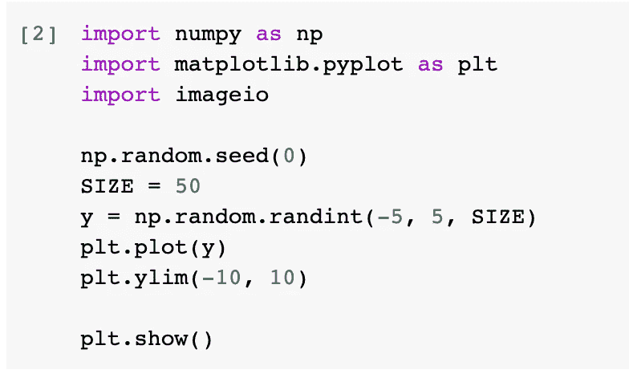

在上面的代码中，我设置了随机种子，这样如果你愿意的话，你可以复制出和我完全一样的结果。`SIZE`被定义为一个常量，因此您可以根据自己的喜好对其进行更改。

整数在[-5，5]范围内生成。此外，为了使图表更容易阅读，我想添加`ylim(-10, 10)`，这样所有的点都在图表的中间部分。

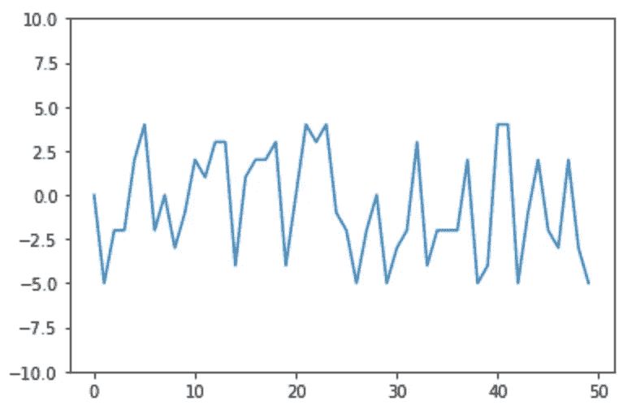

现在，我们有了这个静态的基本折线图。比方说，我们希望通过逐个绘制点来制作折线图。最好是把结果做成 GIF 格式，这样我们就可以把它嵌入到任何我们想嵌入的地方。

当然，合适的方法是使用`matplotlib.animation`模块。然而，我将介绍的快速简单的方法是将帧生成为单独的 PNG 图像。然后，我们可以使用 ImageIO 将它们组合成一个 GIF。

## 1.1 生成帧

事实上，生成帧并不十分困难。这个想法是用 2 点，3 点，…和 50 点来绘制折线图。每个图都应该保存到单独的图像中。

代码如下所示

```
for i in range(2, SIZE+1):
    plt.plot(y[0:i])
    plt.ylim(-10, 10)
    plt.savefig(f'line-{i}.png')
    plt.close()
```

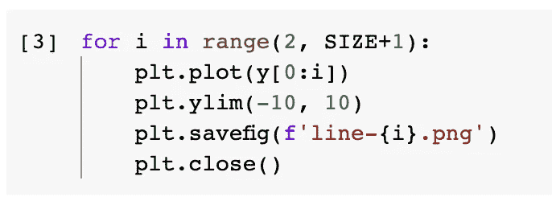

for 循环从 2 个点开始，因为单个点无法生成有效的折线图。它将在`SIZE+1`处停止，这样`range()`将在精确的点数处终止。换句话说，在我们的例子中，最后一个`i`是 50。

在每一帧中定义`ylim`很重要。否则，y 轴将被自动确定，因此它在帧中是不同的。

配置绘图后，我们可以用预定义的文件名模式将图形保存为 PNG 图像。稍后将使用这个文件名模式来填充这些帧。最后，我们需要通过调用`plt.close()`来结束这个情节。这样，下一个循环中的下一帧才能正确生成。

运行这段代码后，当前工作目录下将生成 49 个 PNG 文件。

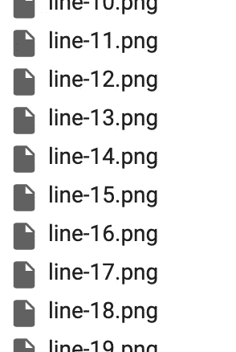

## 1.2 生成 GIF

下一步是将它们组合成一个 GIF。ImageIO 库提供了一个“编写器”,我们可以很容易地将图像附加到框架中。

```
with imageio.get_writer('line.gif', mode='i') as writer:
    for i in range(2, SIZE+1):
        image = imageio.imread(f'line-{i}.png')
        writer.append_data(image)
```

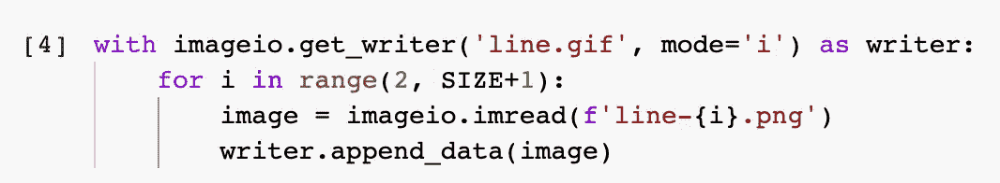

我们可以使用 with 语句，这样就不需要担心流的关闭。GIF 文件的名称将被称为`line.gif`。标志`mode='i'`是一个提示，告诉 ImageIO 输入将是图像。

然后，我们可以进行另一个 for 循环来获取索引。因此，我们可以使用索引来获取帧的文件名。一旦我们有了文件名，只需将它附加到当前的 writer。

在我们运行上面的代码之后，GIF 文件`line.gif`应该已经生成了。

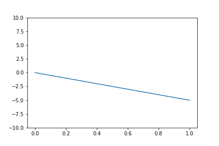

顺便说一句，如果框架不再有用，我们可以使用下面的代码删除它们。

```
import osfor i in range(2, SIZE+1):
    os.remove(f'line-{i}.png')
```

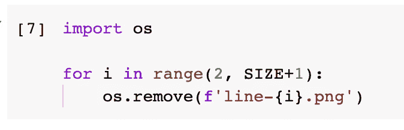

## 1.3 一个小小的改进

上面显示的 GIF 可能并不完美。具体来说，x 轴也随着帧移动。这可能取决于我们想要实现的目标，但假设我们想要固定 GIF 中的 x 轴，我们肯定可以做到。

这个例子还表明，这里介绍的方法非常灵活。基本上，当我们想要在我们的动画图表中有一些特性时，我们不依赖于库的任何 API，而是依赖于帧是如何生成的。

在这种情况下，我们只需要在原始代码中添加`xlim()`配置，就可以生成 x 轴固定的帧。

```
for i in range(2, SIZE+1):
    plt.plot(y[0:i])
    plt.ylim(-10, 10)
    plt.xlim(0, 50)
    plt.savefig(f'line-{i}.png')
    plt.close()
```

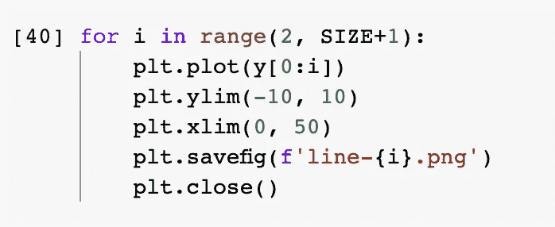

之后，用于生成 GIF 的 ImageIO 代码甚至不需要更改，因为我们已经更新了帧的内容，但是图像的数量仍然相同。

最后，新的 GIF 看起来如下。

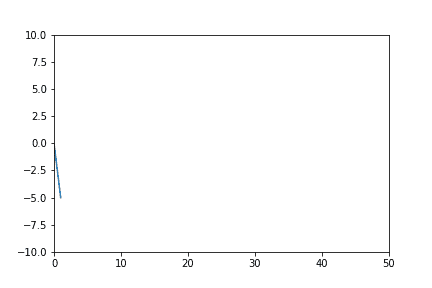

# 2.条形图的一个更好的例子


图片来自 [Pixabay](https://pixabay.com/?utm_source=link-attribution&utm_medium=referral&utm_campaign=image&utm_content=3809537) 的[西奥·克雷佐拉拉](https://pixabay.com/users/theocrazzolara-10197635/?utm_source=link-attribution&utm_medium=referral&utm_campaign=image&utm_content=3809537)

该方法已在上面的折线图示例中得到了很好的介绍。然而，我只是想说明该方法有更大的潜力。这一次，让我们制作一个条形图。

在演示开始之前，我们需要定义一个 x 轴和一个 y 轴列表。我们之所以需要一个 y 轴值的列表，是因为我们想让 GIF 显示多个帧，每个帧都是一个条形图。换句话说，它们的 x 轴相同，但 y 值不同。

```
x_axis = [1, 2, 3]
y_axis_list = [
    [0, 0, 0],
    [1, 2, 3],
    [3, 2, 1],
    [5, 5, 5],
    [7, 7, 7],
    [9, 2, 9],
    [2, 9, 2],
    [1, 1, 1],
    [9, 9, 9],
    [0, 0, 0]
]
```

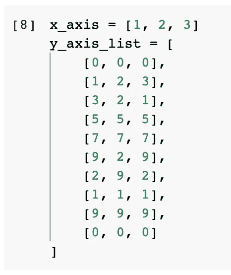

上面的代码只是一个例子。没有模式，只是编出来的:)

## 2.1 生成条形图 GIF

然后，让我们生成框架条形图。

```
png_files = []for i, y_axis in enumerate(y_axis_list):
    # Create Plot
    plt.bar(x_axis, y_axis)
    plt.ylim(0,10) # Create PNG file
    filename = f'bar-{i}.png'
    png_files.append(filename) # Save Figure
    plt.savefig(filename)
    plt.close()with imageio.get_writer('bar.gif', mode='i') as writer:
    for filename in png_files:
        image = imageio.imread(filename)
        writer.append_data(image)
```

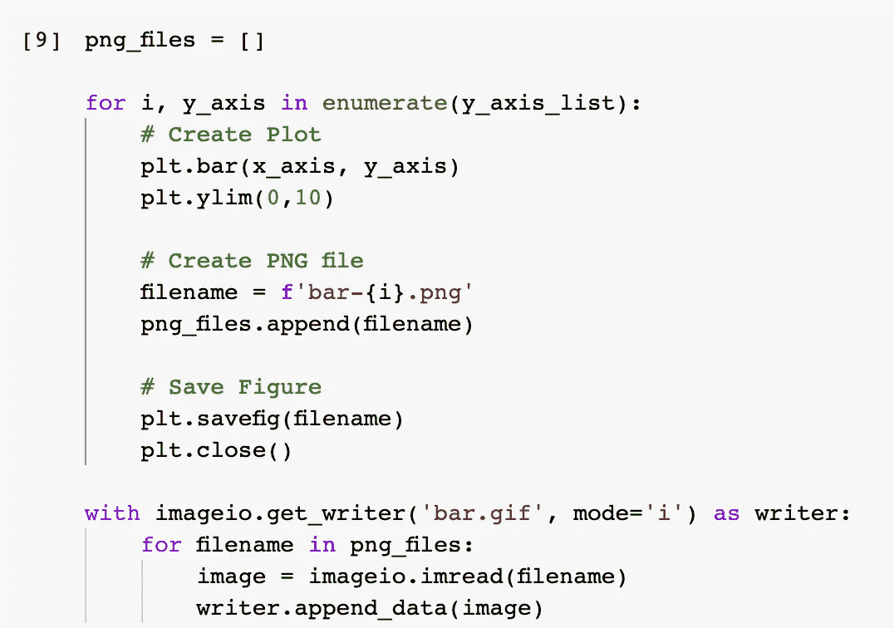

这次我不想被 for 循环中的`range()`方法所困扰。我们可以定义一个列表`png_files`来包含所有帧的文件名。因此，稍后，当我们想要从 PNG 图像生成 GIF 时，我们只需要从这个列表中获取文件名。

生成 GIF 的代码与前面的例子没有什么不同。这也说明该方法相当通用。

生成的 GIF 如下。

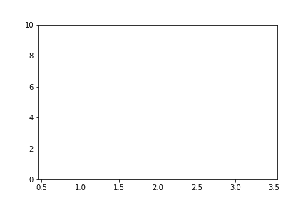

嗯，可以，但不理想。其实根本看不懂。

## 2.2 生成平滑过渡的 GIF

从动画的角度思考。好看的动画无非就是 FPS 多，过渡流畅。基本思想是在两个状态之间添加更多的过渡帧。

因此，我们可以做到以下几点。

```
smooth_coef = 10
png_files = []for i in range(0, len(y_axis_list)-1):
    # Get Current & Next Frame
    y_axis_curr = y_axis_list[i]
    y_axis_next = y_axis_list[i+1]# Generate Middle Frames
    y_diff = np.array(y_axis_next) - np.array(y_axis_curr)
    for j in range(0, smooth_coef+1):
        y_axis = (y_axis_curr + (y_diff / smooth_coef) * j)
        # Create Plot
        plt.bar(x_axis, y_axis)
        plt.ylim(0,10)  
        # Create PNG file
        filename = f'bar-{i}-{j}.png'
        png_files.append(filename)
        # Stretch the last frame
        if j == smooth_coef:
            for _ in range(5):
                png_files.append(filename)
        # Save Figure
        plt.savefig(filename)
        plt.close()
```

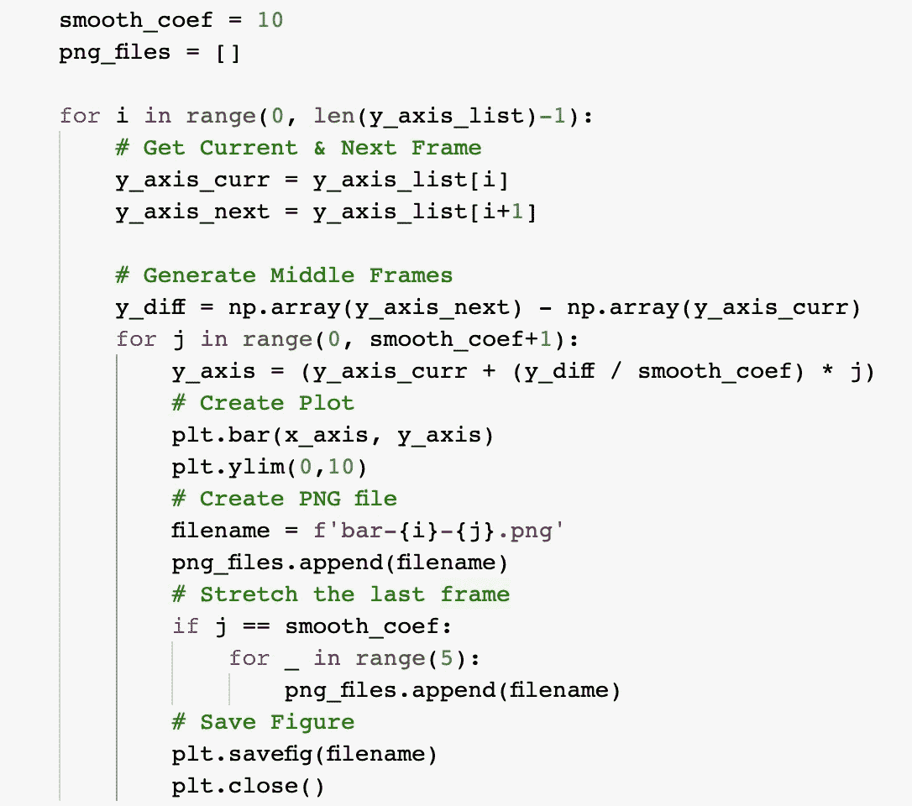

我来解释一下。`smooth_coef`代表“平滑系数”。这意味着我们要在每两个主帧之间添加 10 个过渡帧。主帧正好是演示数据集中的 y 轴。

在 for 循环中，我们将获得当前的 y 轴和下一个。之后，我们可以用下一个 y 值减去当前值。所以，结果将是这两个主要框架之间的“差异”。那么，如果我们让“差”除以平滑系数，就会得到阶梯式的差。总之，我们可以计算每个过渡帧之间的差异。所有过渡帧相加将把当前帧变成下一帧。

```
y_axis = (y_axis_curr + (y_diff / smooth_coef) * j)
```

另一个技巧是让 GIF 在关键帧处“停留”一会儿，这样我们可以看得更久一点。这可以通过在特定时间重复文件名来实现，这样帧就会重复。在生成的 GIF 中，我们将多次看到该帧，这也意味着更长的时间。

让我们看看结果。


那就好多了！

# 3.该方法是通用的


图片由 [Julius Silver](https://pixabay.com/users/julius_silver-4371822/?utm_source=link-attribution&utm_medium=referral&utm_campaign=image&utm_content=3021072) 从 [Pixabay](https://pixabay.com/?utm_source=link-attribution&utm_medium=referral&utm_campaign=image&utm_content=3021072) 拍摄

不同于任何特定的绘图库，如`matplotlib.animation`，ImageIO-GIF 方法更加通用。也就是说，我们甚至不受使用什么库的限制。只要图形可以保存成图像文件，我们就可以用这种方法让它移动。

下面是一个简单的例子。我们可以使用 Seaborn 来生成条形图。

```
import seaborn as snssns.set_style('darkgrid')
```

Seaborn 模块被导入，样式被设置。然后，我们需要修改的代码部分如下。

```
sns.barplot(x_axis, y_axis)
```

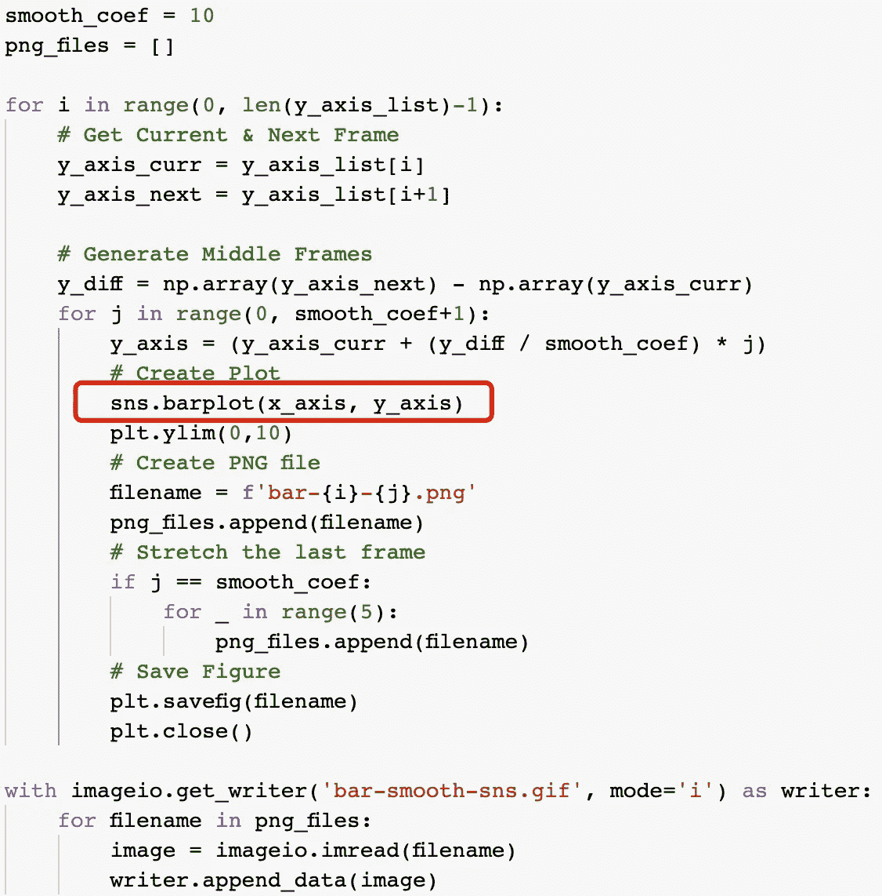

生成的 GIF 如下所示。

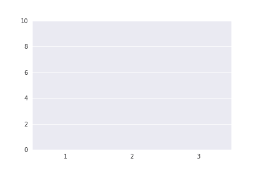

# 摘要


图片来自 [Pixabay](https://pixabay.com/?utm_source=link-attribution&utm_medium=referral&utm_campaign=image&utm_content=7139263) 的 [Miguel Barrera](https://pixabay.com/users/miguelbarrera3-17639641/?utm_source=link-attribution&utm_medium=referral&utm_campaign=image&utm_content=7139263)

在本文中，我介绍了一种不使用任何专门构建的绘图动画库将 Python 可视化制作成 GIF 的方法。这个想法是逐帧生成图像文件的情节。然后，可以使用 ImageIO 模块将这些图像文件组合成一个 GIF。

该方法也非常通用。我们不需要学习任何特定动画风格的 API 或方法。我们需要做的就是生成不同的帧来达到要求。此外，它甚至不局限于任何可视化库，因为它依赖于作为帧生成的图像。

请注意，这种方法可能不是绘图的常规方法。其中一个问题可能是可扩展性，因为我们需要生成许多单独的文件作为帧，然后才能获得 GIF。

<https://medium.com/@qiuyujx/membership>  

如果你觉得我的文章有帮助，请考虑加入 Medium 会员来支持我和成千上万的其他作者！(点击上面的链接)