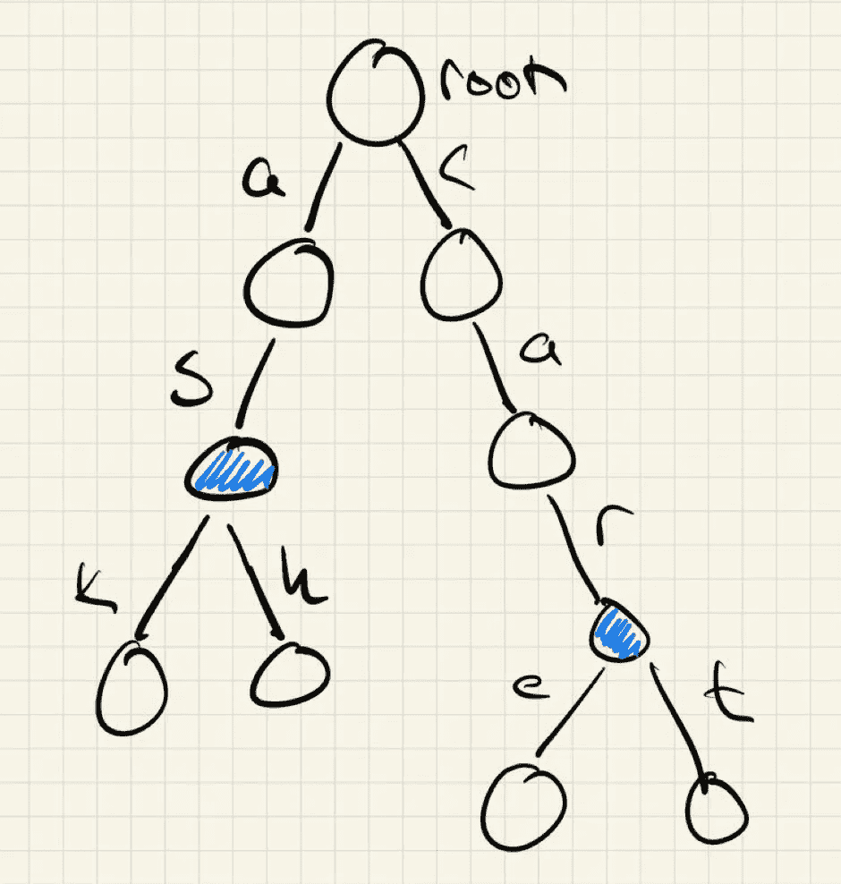

# 程序双关语和文字游戏生成与尝试和 GPT-3

> 原文：<https://towardsdatascience.com/procedural-pun-and-word-game-generation-with-tries-and-gpt-3-3661d81a4204>

## 我们能教一个人工智能按需产生源源不断的笑话吗？


埃里克·克鲁尔在 [Unsplash](https://unsplash.com?utm_source=medium&utm_medium=referral) 上的照片

> 游泳者为什么要吟诵？成为一名游泳商人！

到本文结束时，你将拥有一个点击按钮就能产生成千上万个笑话的人工智能。

我一直喜欢各种各样的双关语。有些聪明，有些笨拙可爱。我最喜欢的是同形双关语，它使用的单词书写相似，但具有不同的意思或声音。海盗可能会大喊“我的裤子！”，而通勤者可能会抱怨地铁用户数量的增加。以一种巧妙的方式将这些联系起来，创造了一个令人愉快的脑海形象:一个海盗在地铁里被偷了裤子。想出这些本身就是一件有趣的事情，但是作为一名计算机科学家，我开始怀疑我们是否可以完全自动化这种类型的幽默。幽默被认为是将我们与机器区分开来的独特的人类特征。笑话吐机会是什么样子？

这篇文章探讨了一个简短的下午如何生成程序性笑话。它需要一些巧妙的数组结构来构建可应用的笑话基线，并利用神经网络将这些基线转化为笑话。最后，我们有了一台可以工作的笑话机器，它可以在几秒钟内产生成千上万个笑话。该程序最初是为我的母语(芬兰语)编写的，但由于流行的 NLP 模型，我将该模型改编为我们时代的*通用语*，英语。通过非常有限的调谐，同样的原理可以用于用法语、西班牙语或蒙古语讲笑话。

你可能已经猜到了，文章的第一个笑话是由一台机器生成的。

## 一个好笑话需要多少次尝试？

> 一个

从技术上来说，只需要一次尝试就能产生所有的笑话。我们的目标很简单:想出一种方法来计算英语语料库中的单词可以被划分和重新排列成新单词的所有方式。在这个挑战中，我们将看到一组非常特殊的单词，其中一个很好的例子可能是 *maples* 和 *lessons* 。枫树和课程可以排列成*地图课程*和*枫树之子*。开个玩笑，你可能会立刻想象一个多伦多曲棍球迷在研究一张地图。确切地说，我们正在寻找满足以下原则的两个词:

1.  这些单词都是标准的、可以理解的英语(或者斯瓦希里语、匈牙利语或者任何其他语言)
2.  这些单词有一个共同的部分——让我们称之为*连接器*。该部分在第一个单词的末尾和第二个单词的开头(在我们的例子中，这是 *les*
3.  即使我们去掉这个共同的部分，单词也是有意义的:*地图*和*儿子*
4.  对于我的应用程序，我想将连接器限制为英语中的单词*而不是*，并且至少有几个字符长。虽然这肯定是可能的，但我只是觉得没有那些明显的笑话，比如*梭子*和*棍子*(连接符: *s* )或*工作簿*和*书虫*(连接符:*书*)，这些笑话会更加巧妙。

最简单的方法是遍历英语中的所有单词，检查其中是否有与其他单词重叠的子串。英语有大约 170，0 00 个单词(取决于你问谁，你在哪里划分复合词)，即使通过限制更有用的单词，我们最终也能得到一个数万单词的字典。我用一本有 58109 个单词的字典找到了[这里](http://www.mieliestronk.com/wordlist.html)。遍历所有这些单词，将它们相互匹配并找出子串的复杂度是 O(m *n)，其中 n 是单词的数量，m 是单词的平均长度。我们能做得比蛮力更好吗？研究了一下之后，我决定创建一个 [Trie](https://en.wikipedia.org/wiki/Trie) 的实现，它的复杂度总是为 O( *n* )。如果您不熟悉尝试，它们是搜索树的一个子组，其中搜索字符串是一系列字符(单词)，每个字符将树分成子树。单词的最后一个字母在包含要获取的值的叶子处结束。从某种意义上说，它们是紧凑的哈希表，其中的哈希键充当字符串。在我们的应用程序中，我们对使用该结构获取数据不感兴趣，而是构建一个包含所有单词逻辑的可查询结构。下图阐明了该系统:



作者图片

蓝色节点是*问*和*灰*以及*看护*和*推车*的共同根。另外， *as* 和 *car* 都是有效的英文单词。回想一下我们的先决条件列表，如果一个节点包含子节点并且本身就是一个单词，我们可以简单地存储——这将立即满足所有三点。从以这种方式构建的 trie 中收集所有单词的复杂度是 O( *n* )。

显然，这只是解决了问题的前半部分，我们仍然需要想出一种方法来解释单词的常见结尾。但我们稍后会回到这个话题。下面是 Tries 的实现，我对它进行了修改，以便在构造期间获取元数据而不是叶值。

```
class trieNode():

  def __init__(self, letter = None):

    # Keep track of children as nodes and letters
    self.children = []
    self.children_nodes = [] 
    self.is_leaf = False
    self.letter = letter

    # Utility: store the "words" up to this point, 
    # as well as all the child strings that follow this.
    # This exhanges some memory for easier lookup later
    # Additionally, we store how many times a node has been visited 
    self.string = None
    self.child_strings = []
    self.visited = 0

class Trie():

  def __init__(self):
    self.root = trieNode()
    self.n_nodes = 0

  def insert(self, key):

    # Start at the root
    pointer = self.root

    idx = 0

    for i in key:
      if i in pointer.children: # If the child exists
        order = pointer.children.index(i) # simply move forward
        pointer = pointer.children_nodes[order]
      else: # Otherwise create and append a new node
        pointer.children.append(i)
        pointer.children_nodes.append(trieNode(i))
        self.n_nodes += 1
        pointer = pointer.children_nodes[-1]
        pointer.string = key[0:(idx + 1)]

      # Update the other values
      pointer.visited += 1

      # ...and if the node is a leaf, or if we should simply add new children
      idx += 1
      if idx == len(key):
        pointer.is_leaf = True
      else:
        pointer.child_strings.append(key[(idx):len(key)])
```

这使我们能够创建一个树模型，其中每个节点跟踪它是否是一个单词的结尾，它是否有孩子以及那些孩子是什么。作为一个额外的好处，创建这个表是一个单遍操作，之后我们可以无休止地查询结构，以获取任何以单词结尾的节点(要求 2 & 3)和具有不同长度结尾的节点(要求 3 & 4)。对于我的 80k+单词的字典来说，这导致了一个由 143 638 个节点组成的 trie，或者比单词数多 60k 多一点的节点。这只花了几秒钟。你可以把字典压缩成这样的数据结构，这真的很令人吃惊。

如果您想了解代码，可以在这里查看 Colab。我将只在这里粘贴更有趣的代码，所以继续复制您自己的游戏场以获得完整的体验。

## 文字游戏来了

还记得我说过，我们会回到如何想出词尾吗？现在是时候了。到目前为止，我们已经有了一种为许多结尾创建公共开头的方法。再想想我们如何实现相反的结果:获得许多前缀的共同结尾。

…

没错，我们可以利用现有资源。如果我们简单地翻转每个单词并创建我们的 Trie，我们将得到一个由常见词尾和首字母前缀组成的结构。有一点工作在幕后来回翻动单词，但最终我们可以把所有的东西放在一起。

```
def create_dict(trie):

  result = {}

  def crawl(trie):

    if len(trie.children_nodes) == 0:
      return

    if trie.is_leaf and len(trie.children) > 0:
      for child_string in trie.child_strings:
        if child_string not in result.keys():
          result[child_string] = []
        result[child_string].append(trie.string)

    for child in trie.children_nodes:

      crawl(child)

  crawl(trie)

  return result

def create_flipped_dict(trie):

  result = {}

  def crawl(trie):

    if len(trie.children_nodes) == 0:
      return

    if trie.is_leaf and len(trie.children) > 0:
      for child_string in trie.child_strings:
        flipped_string = child_string[::-1]
        if flipped_string not in result.keys():
          result[flipped_string] = []
        result[flipped_string].append(trie.string[::-1])

    for child in trie.children_nodes:

      crawl(child)

  crawl(trie)

  return result

class jokeGenerator():

  def __init__(self):

    self.trie = Trie()
    self.flipped_trie = Trie()
    self.words = None

    self.result = None
    self.flipped_result = None
    self.common_keys = None

    self.wordplays = None

    self.tokenizer = None
    self.model = None

  def loadWords(self, source):

    words = pd.read_csv(source, na_filter = False)
    words = words.values.tolist()
    words = [x[0] for x in words]    

    print(f'Loading {len(words)} words')

    i = 0
    n_words = len(words)
    for word in words:
      i += 1
      if i % int(n_words/10) == 0:
        print(f'{int((i+1)/n_words*100)}% ({i}/{n_words})')
      self.trie.insert(word)
      self.flipped_trie.insert(word[::-1])

    print(f'Done')

    self.words = words

  # normal: all words
  # not_short: the connector is longer than 2 characters
  # not_a_word: all words, where the connecting word is not a word in itself
  # not_a_short_word: all words, where the connecting word is not a word in itself and it is more than 2 chracters
  # not_a_short_word_or_ing: all words, where the connecting word is not a word in itself and it is more than 2 chracters and is not "ing"
  def generateWords(self, type = 'normal'):

    if self.flipped_trie == None or self.trie == None:
      print('You must load the words first: loadWords(source)')

    self.flipped_result = create_flipped_dict(self.flipped_trie.root)
    self.result = create_dict(self.trie.root)

    common_keys = list(set(self.result.keys()).intersection(self.flipped_result.keys()))

    if type == 'normal':
      self.common_keys = common_keys
    elif type == 'not_short':
      self.common_keys = [x for x in common_keys if (len(x) > 2)]
    elif type == 'not_a_word':
      self.common_keys = [x for x in common_keys if (x not in self.words and x != '-')]
    elif type == 'not_a_short_word':
      self.common_keys = [x for x in common_keys if (x not in self.words and x != '-' and len(x) > 2)]
    elif type == 'not_a_short_word_or_ing':
      self.common_keys = [x for x in common_keys if (x not in self.words and x != '-' and x != 'ing' and len(x) > 2)]

    self.wordplays = {}
    for c_key in self.common_keys:
      for r in self.result[c_key]:
        for f_r in self.flipped_result[c_key]:
          self.wordplays[f'{r}_{c_key}_{f_r}'] = [f'{r}', f'{c_key}',f'{f_r}']
```

对于我们以这种方式收集的开始-结束对，我们可以简单地搜索前缀和后缀的共同匹配(联合)，如下所示:


作者图片

哒哒，我们已经准备好了我们的同形双关语列表。事实上，10 174 817 是我们的最终分数。这些大部分都不符合我们任意的第四个要求，所以让我们把它降低一点。您可能会注意到*generate words*-方法，它有许多过滤器。这些过滤连接器的长度，删除单词并确保它不会被过度表示(例如“ing”，它的两端和开头都是一堆英语单词)。按照我们最严格的标准，我们最终会有大约 10 000 个文字游戏。你可以在这里找到完整的名单:【https://oskarniemenoja.fi/files/wordplays.txt】T4，但这里有一些我最喜欢的:

```
['absorb', 'ent', 'rapping'], or absorbent entrapping
['strut', 'ter', 'rains'], or strutter terrains
['hi', 'res', 'cued'], or hires rescued
['environ', 'ment', 'ally'], or environment mentally
['hips', 'ter', 'race'], or hipster terrace
['spa', 'res', 'ponds'], or spares responds
['for', 'mal', 'formation'], or formal malformation
['for', 'mer', 'its'], or former merits
['sit', 'com', 'posers'], or sitcom composers
['by', 'tes', 'table'], or bytes testable
```

我们可以继续下去，但这些作为一个不知疲倦的缪斯为你不同质量的双关语加油。最棒的是，它们的数量高达 1000 万。

## 听起来像是自然语言处理的工作

这一切都很好，我们有了一台机器，可以以你能想象的任何速度吐出双关语。但是想出笑话的角色还是在人类身上。我们能不能进一步自动化，并有一个真正的端到端的管道来产生幽默？我们当然可以。让我们给我们的类添加几个方法:

```
def loadModels(self, language = 'english'):

    if language == 'finnish':
      self.tokenizer = GPT2Tokenizer.from_pretrained('Finnish-NLP/gpt2-finnish') 
      self.model = GPT2LMHeadModel.from_pretrained('Finnish-NLP/gpt2-finnish')
    elif language == 'english':
      self.tokenizer = GPT2Tokenizer.from_pretrained('gpt2-large') 
      self.model = GPT2LMHeadModel.from_pretrained('gpt2-large')
    # Adding new languages is laughably easy. Search for a passable model on Huggingface, chuck it here and let the script do it's magic.

  def generateJoke(self, first_string = '', second_string = '', n = 1, length = 30):
    joke = self.wordplays[random.choice(list(self.wordplays.keys()))]
    joke_words = joke[0] + joke[1] + ' ' + joke[2]   
    joke_string = first_string + ' ' + joke_words + ' ' + second_string

    input_ids = self.tokenizer.encode(joke_string, return_tensors = 'pt')

    output = self.model.generate(input_ids, 
                        max_length = length,
                        num_beams = n, 
                        num_return_sequences = n,
                        no_repeat_ngram_size  = 3)

    result = []
    for op in output:
      result.append(self.tokenizer.decode(op))

    return result
```

这些从 [Huggingface](https://huggingface.co) 加载一个预先训练好的 transformer 模型，并使用我们预先生成的文字游戏中的提示生成一个字符串。我提供了两种语言，但是你可以自由地测试你自己的语言，并在评论中写下你的经历。可以说，同样的原则应该适用于任何语言，如果您只是将任何目标语言的字典输入到 Tries 中，并获取一个用您选择的语言训练的正确的转换器。然而，在实践中，我注意到芬兰语版本比英语版本差得多，所以你的里程可能会有所不同。

即便如此，我们离真正的人工智能幽默又近了一步。看看这个坏小子吐出什么来。

```
Prompt: Here is a funny story about environment ions and environ mentions
Result: that I found on the internet. It is a story about a man who was trying to get a job in a chemical plant. He was told that the job was for a man with a PhD in chemistry. He went to the job interview and was told he was not qualified. He then went to his supervisor and said that he was qualified.
```

以一种可爱的方式，这有点接近 20 世纪早期的幽默——与社会规范和读者的期望相矛盾。它还注意到这个笑话是关于环境化学的，甚至评论这个笑话是“在互联网上找到的”。虽然它没有赢得任何奖项，但它是可以理解的，看起来很可能像一个幽默感很差的人写的东西。谁会因为这个可爱的小机器人尽力而为而生气呢？

```
Prompt: Tell me a joke about entrainment and mentally
Result: weirdness. I'm not sure if I'm going to be able to do this. I'm not a comedian. I don't have a lot of experience with comedy. I've never done a standup show. I have no idea what I'm doing. I just want to do it. I want to be a comedian
```

尽管如此，这些都不是我们所理解的幽默。看起来变形金刚在笑话方面没有得到足够的训练，而是尽力去写散文。我花了一些时间寻找一个专门针对笑话进行训练的模型，但它并没有产生太多不同的结果。我们能做得更好吗？事实证明，我们可以。

## 请打开 GPT-3

OpenAI 的可爱的人们已经将他们的 GPT-3 模型投入了公开测试，尽管它不是免费的(产生一个笑话需要大约 0.003€，或者每 1000 个笑话需要 3€)，但它在人类语言的细微差别方面表现得相当好。你可以在这里注册你的 api 密匙。让我们修改代码来查询 API。

```
import os
import openai

words = eng_gen.wordplays[random.choice(list(eng_gen.wordplays.keys()))]
input_word = ''.join(words[0:2]) + ' ' + words[2] + ' and ' + words[0] + ' ' + ''.join(words[1:3])

openai.api_key = "api_key_here"
result = openai.Completion.create(
  engine="text-davinci-002",
  prompt=f"Write a joke containing the words '{input_word}'",
  max_tokens=60,
  temperature = 0.3,
  n = 1,
  echo = True
)

result.to_dict()['choices'][0]['text']
```

让我们看看结果如何

```
Prompt: Write a joke containing the words 'potent angle and pot entangle'
Result: What do you call a potent angle that's also good at entangling? A pot-entangle!
```

你看看那个。它不仅能理解笑话的典型措辞，还能将单词本身的细微含义联系起来。这实际上让我笑了，它是 100%程序生成的。我可以捣烂这个按钮，得到无数的笑话。实际上，在我们结束之前，让我们收拾一下，就这么做吧。

```
def create_jokes(wordplays, n, api_key):

  results = pd.DataFrame({'input' : [], 'prompt' : [], 'answer' : []})
  openai.api_key = api_key

  for i in range(n):

    words = wordplays[random.choice(list(wordplays.keys()))]
    input_word = ''.join(words[0:2]) + ' ' + words[2] + ' and ' + words[0] + ' ' + ''.join(words[1:3])
    prompt = f"Write a joke containing the words '{input_word}'"

    result = openai.Completion.create(
      engine="text-davinci-002",
      prompt=prompt,
      max_tokens=60,
      temperature = 0.3,
      n = 1
    )
    answer = [input_word, prompt, result.to_dict()['choices'][0]['text']]

    results.loc[len(results)] = answer

  return results

create_jokes(eng_gen.wordplays, 10, "an_api_key")
```

让我们看看它为我们准备了什么。

```
Why did the cables sons take cab lessons? So they could get a job as a taxi driver!

I was going to use a cleanser rated and clean serrated knife to make dinner, but then I realized that would be overkill.

What do you call a bagger who's also a manic German? A Bagger Manic Germanic!

What do you call a superintendent who's good at enticement? A superintend-ice-nt!
```

这些都出奇的不差。诚然，我必须按几次按钮才能得到一套令人尊敬的笑话，但尽管如此，这些都没有任何一个人扭曲和转折的话。你可以自己尝试一下 colab，看看你能想到什么。

## 结束语

总而言之，这比我最初预期的要好得多。我开始创建一个不错的单词对字典来激发我自己的想象力。有了一些聪明的数据结构，我们现在可以用我们想要的任何语言获得无穷无尽的数据结构。将这些插入现成的 NLP 模型，产生了令人惊讶的好结果。有没有喜剧演员因为这个 AI 而倒闭？大概不会。但我可以很容易地看到一个由一个写笑话的机器人和一个语音合成器在舞台上共同表演组成的利基之旅。或者充满程序性笑话的书。这些类型的程序可以帮助作家、喜剧演员或编剧克服白皮书综合症，或者只是作为机器人如何实现令人惊讶的逼真效果的介绍。

幽默是人类的典型特征之一。很难说机器能感觉到情感，悲伤、快乐或真正的笑声。几天前，我会认为他们缺乏语境意识，无法创造巧妙的文字游戏，将语言转换成新的含义。这个小实验是一个有趣的小练习，但却令人惊讶地深入探究了人类最终是什么。看着一个机器人写出可以理解、有时甚至是巧妙幽默的散文，感觉就像打破了一堵我不知道存在的墙。这种感觉更像是和电脑一起工作，而不是简单地命令它做什么。