# 无需闲置数据块集群即可按需处理数据

> 原文：<https://towardsdatascience.com/process-on-demand-data-without-idle-databricks-clusters-cbf0bd99d8d6>

## 在您的工作流程之前添加云功能，实现经济高效的解决方案

Databricks 是一种平台即服务产品，允许数据工程师执行数据的接收、探索和转换。最近，他们在多任务工作流平台中加入了创建数据管道的功能。此外，它们还提供了一种可配置和可扩展的数据接收功能，称为自动加载器。有了它，您可以按需和按计划接收数据。但是，如果您希望在数据到达时立即接收数据，则必须在等待文件到达时激活作业。这与工作流功能不兼容，并且会让您的计算集群无限期开启。情况就是这样，我以前工作的一家公司在一个项目上花费了数千美元，让空闲集群监听数据。

但是你一定要这样做吗？使用云功能作为您的数据传感器，您可以经济高效地触发您的 Databricks 管道。您将只使用您的集群进行实际处理。祝您身体健康

现在，云就是一切。在 [Unsplash](https://unsplash.com?utm_source=medium&utm_medium=referral) 上 [Jerry Zhang](https://unsplash.com/@z734923105?utm_source=medium&utm_medium=referral) 的照片。

# 0.预赛

你可以在这里找到我的伙伴库。微软 Azure 将是这个特定练习的云提供商，但是概念可以被翻译到其他提供商。数据集将是“*纽约黄色出租车出行数据”*，并且可以在这里找到[。但是，数据集有许多分区。下载一个 CSV 文件，并使用该数据的子集创建一个新文件，以便在测试步骤中将其上传到 Azure 容器时最大限度地减少等待。](https://www.kaggle.com/datasets/microize/newyork-yellow-taxi-trip-data-2020-2019)

# 1.文件暂存区

您将需要一个存储服务，您的数据将在这里着陆，并在稍后由数据块提取以供消费。这种服务可以是亚马逊 S3、Azure Blob 存储容器等。该条目将使用 Azure 服务和 VS 代码。

在 Azure 插件中，有一个标签页叫做 ***【资源】*** 。点击***“+”***按钮，选择 ***【创建存储账户】:***

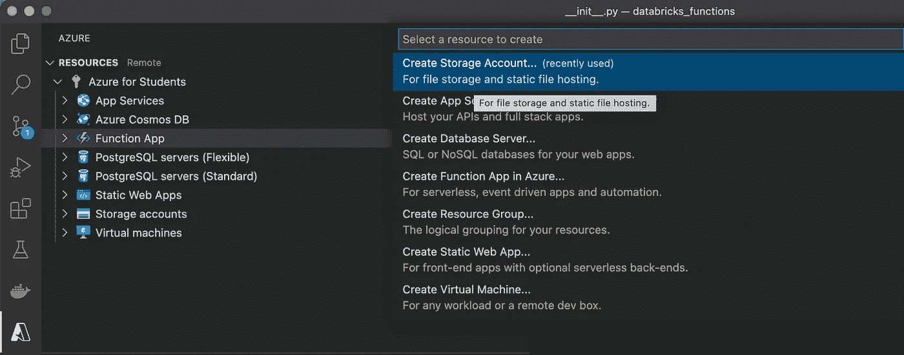

创建存储帐户。截图由作者拍摄。

给它一个独特的名字，一个蔚蓝色的区域。然后，检查终端区域中的 Azure 活动日志，直到创建了资源。在左窗格中查找资源，右键单击并创建一个新容器:

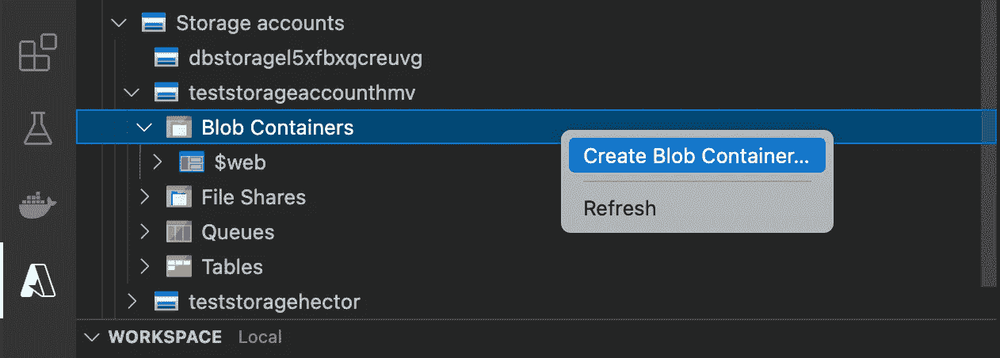

创建 blob 容器。截图由作者拍摄。

创建容器后，您需要将它挂载到 Databricks 文件系统上。为此，请在您的 Databricks 工作区内运行以下代码单元:

正在安装 blob 容器。作者创建的片段。

# 2.数据库和表格

现在，根据您的数据模型创建适当的表。在这个简单的示例中，使用了一个表:

创建数据库表。作者创建的片段。

该表将接收来自中转区文件的出租车行程数据。

# 3.自动装载机查询

这是工作量的核心！但是首先，让我们使用`dbutils`在数据块中定义所需的参数:

Dbutils 小部件。作者创建的片段。

Autoloader 查询将定义从登台区到表的 ETL。让我们回顾一下代码:

自动加载器查询。我创建的片段:)

*   `cloudFiles`:向结构化流查询指示您要使用自动加载器。
*   `cloudFiles.format`:传入数据的格式。在这种情况下，CSV。
*   `cloudFiles.schemaHints`:默认情况下，所有发现的字段都将被视为字符串。您可以在这里指定特定字段的数据类型。
*   `load()`:指定将要加载的数据的位置。在这种情况下，是已装载容器的位置。
*   `select()`:选择所有列的子集。
*   `trigger(availableNow=True)`:非常重要。它向查询指定您想要处理所有尚未使用且现在可用的数据。否则，默认情况下，该查询将每半秒运行一次。
*   `table()`:将数据存储在指定的表格中。

# 4.数据砖块的工作

既然已经定义了查询，那么就要创建实际的数据管道了。重新定义的 Databricks 工作流的优点在于，您可以定义一组任务和依赖关系。以前在这个平台上做不到的事情。对于这个简单的例子，将定义一个单一的任务。你可以在这里阅读如何创建更复杂的工作流程[。此外，请查看我的关于 Databricks 中管道编排的文章](https://docs.databricks.com/workflows/jobs/jobs-quickstart.html)[。](https://hectormrejia.medium.com/use-these-methods-to-orchestrate-your-pipelines-2b8b614285ba)

在***【Path】***里面，寻找自动加载器脚本所在的笔记本位置。此外，发出屏幕截图中描述的必需参数:

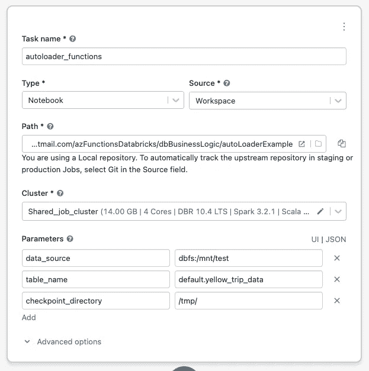

创建数据块作业。自己的作者身份截图。

有几点需要注意:

*   `dbfs:/mnt/test`是挂载的 Azure 存储容器的目录，如之前在挂载代码片段中定义的。
*   `default`是默认创建的数据库的名称。
*   ***check point _ directory***设置为`/tmp/`，该目录在每次集群重启时都会被清除。**千万不要**在真实场景中将其设置为检查点目录，这只是为了练习。

# 5.功能应用程序

这是实现预期的按需行为的关键组件。一旦数据到达临时区域，该功能将被触发，然后，它将使用 Databricks 作业 API 运行 Databricks 工作流。

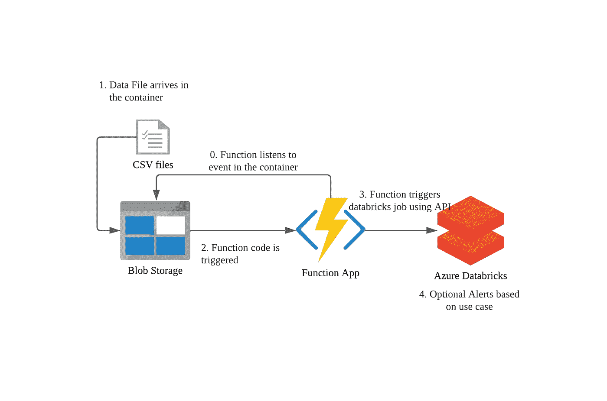

按需处理。我使用 Azure 图标创建的图片:)

要在 VS 代码中创建一个函数，寻找 Azure 插件。在工作区选项卡上选择***“+”***，点击 ***【创建功能】*** :

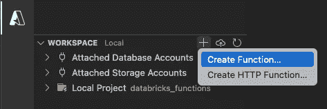

创建本地函数。截图由作者拍摄。

现在，一件很棒的事情是，我们可以为函数触发器提供多种选择。这意味着我们的 **Databricks 工作流可以通过这些方法中的任何一种来激活**。在本练习中，请遵循以下步骤:

*   点击 ***【天蓝色斑点存储】*** 触发。
*   给这个函数一个唯一的名字，然后按回车键。
*   点击 ***“创建新的本地应用设置”。***

现在，您的 VS 代码文件夹中应该填充了来自所创建函数的文件。当项目在编辑器中可用时，在`local.settings.json`中定义所需的环境变量:

函数的必需变量。作者创建的片段。

*   `<your-storage-account-name>_STORAGE`:将保存来自你的 Azure 存储帐户的连接字符串。若要获取该值，请转到 Azure 门户并选择您的存储帐户。点击左窗格中的 ***【访问键】*** ，复制连接字符串。
*   `DB_JOB_ID`:您的数据块作业的 id。创建工单后，复制与之关联的 id 并粘贴到此处。
*   `DATABRICKS_HOST`:是您的 Databricks 工作区的 URL。应该类似于*“https://ADB-xxxxxxxxx . xx . azuredatabricks . net/”*
*   `DATABRICKS_TOKEN`:您需要创建一个 Databricks 个人访问令牌，并在此处插入值。这将允许该函数与您的数据块工作空间进行交互。
*   忽略其他参数。

设置好参数后，我们将在`__init__.py`脚本中实现函数的行为:

Azure 函数行为。我和❤一起创作的片段

该脚本需要注意的事项:

*   Databricks CLI 是为 shell 设计的工具。然而，这个脚本利用了它是用 python 编写的这一事实，我们可以将这些对象用于这个函数的逻辑。在`requirements.txt`文件中包含`databricks-cli`。
*   `EnvironmentVariableConfigProvider`是 Databricks CLI 中的一个类，它使用`DATABRICKS_HOST`和`DATABRICKS_TOKEN`环境变量来初始化环境。
*   `JobsService`也是 Datbaricks CLI 中的一个类，允许您创建、运行、列出和删除作业。这是一个非常强大的工具。
*   代码的控制流旨在避免多个函数执行触发同一作业的多个并发运行。一次只能运行一次。

代码完成后，我们必须创建实际的云资源，并上传我们刚刚实现的配置。为此，在 Azure 插件下，在 ***【资源】*** 窗格中点击 ***【在 Azure 中创建功能应用】*** :

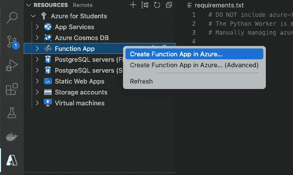

在云上创建功能。自己署名截图。

此外:

*   给这个函数一个唯一的名字，然后按回车键。
*   点击最新的 python 运行时堆栈。
*   对于本例，选择“美国东部”作为地区。在更现实的情况下，您应该选择最适合您业务案例的地区。

在创建函数时。右键点击后者，选择 ***“部署到功能 App”***:

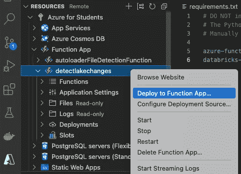

将代码部署到云功能。截图是我拍的。

这将把代码上传到云资源。要完成，在您的功能内的 ***【应用设置】*** 子菜单下点击右键，选择 ***【上传本地设置】*** :

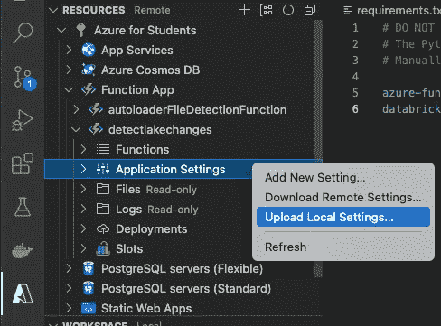

上传变量到云函数。截图由作者拍摄。

它会将`local.settings.json`内容设置为我们函数 app 的环境变量。就是这样！Databricks 工作区应该能够对存储容器中的文件上传做出反应，并运行适当的工作流。

# 6.测试项目

现在基础设施已经准备好了，是时候删除样本数据集了。初始黄行数据太重，无法快速上传。此外，选取一小部分记录样本，并将其上传到存储容器:

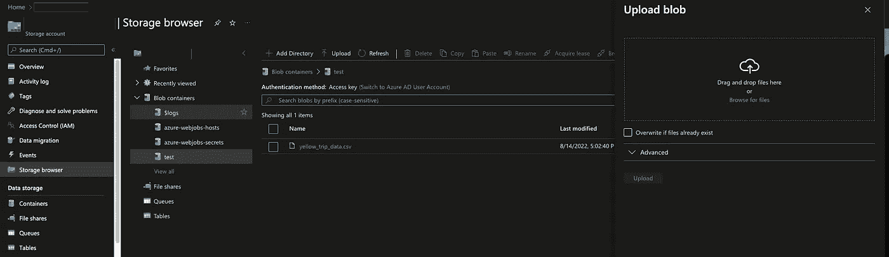

将文件上传到存储容器。截图是我拍的:)

一旦文件被加载，该函数将被触发，然后，它将向 Databricks 作业发出运行信号。这是 Azure 函数生成的日志示例:

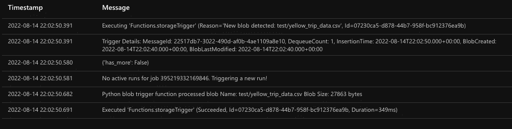

Azure 函数运行日志。截图由作者拍摄。

此外，如果您在几分钟后转到 Databricks，作业将会完成:

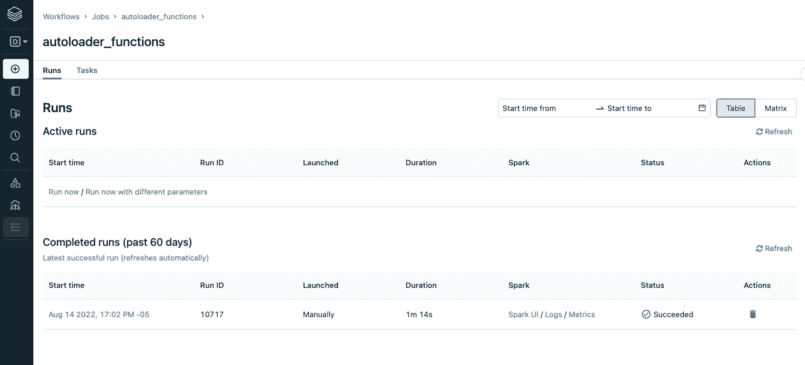

数据块作业运行。自己的作者身份截图。

表格中应填入黄色的行程数据记录:

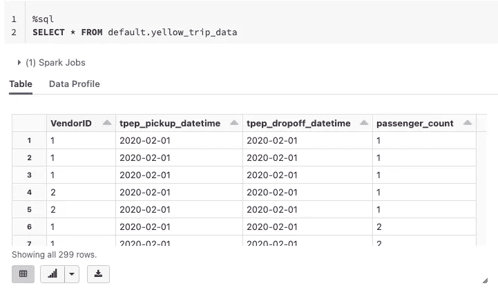

查询表中加载的数据。截图是我拍的。

它像魔法一样有效！

# 其他注意事项

这个项目的实现是在 Visual Studio 代码和 Databricks 工作空间中完成的。然而，如果你需要你的基础设施是 CI-CD 或 IaC 友好的，你总是可以使用 Azure 资源管理器模板和 Azure CLI 来创建环境。只需提取本文的核心概念，并根据您的用例进行调整。

此外，相应地测试和调整函数和数据块作业的行为。这种逻辑没有经过在很短的时间间隔内加载大量文件的实战测试。但是，它应该提供一个起点，以便您可以按需接收数据，而不需要无限期活动的群集消耗资源和资金，同时只侦听数据。

最后，作业被设置为在冷启动设置中创建集群。这将增加几分钟的执行时间。如果您需要作业尽可能快地运行，请考虑创建计算池，以便群集可以使用预热的实例。

如果你喜欢这个内容，请鼓掌并订阅，并在我的 [LinkedIn](https://www.linkedin.com/in/hectorandresmv/) 上与我联系。干杯！👾

<https://github.com/hector6298> [## 赫克托 6298

github.com](https://github.com/hector6298)