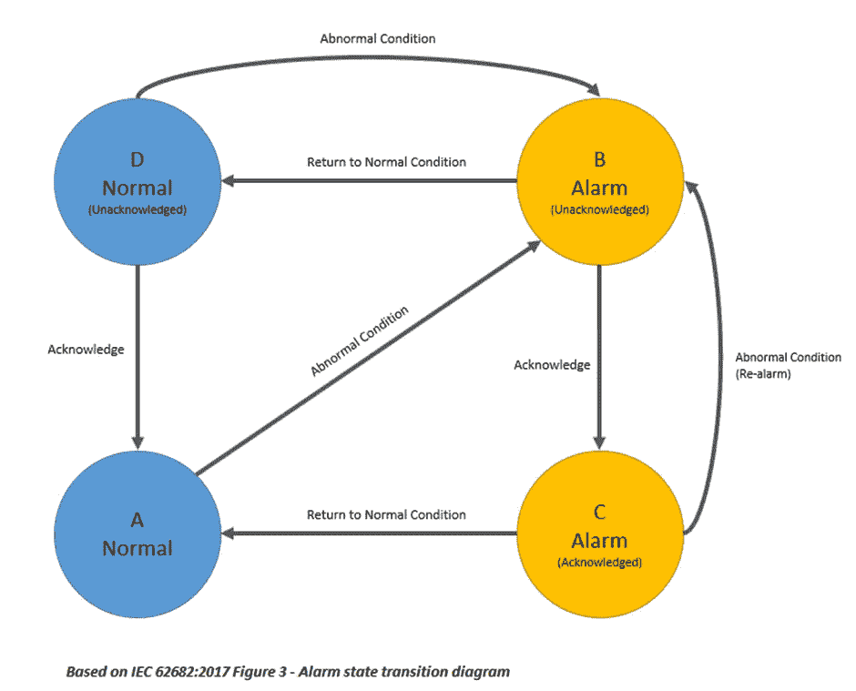
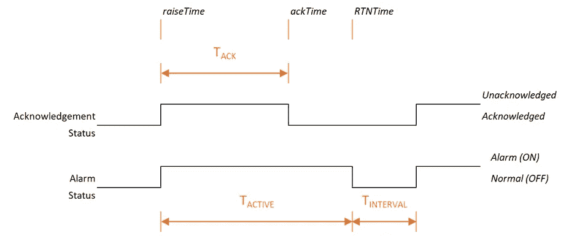
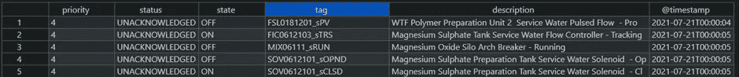
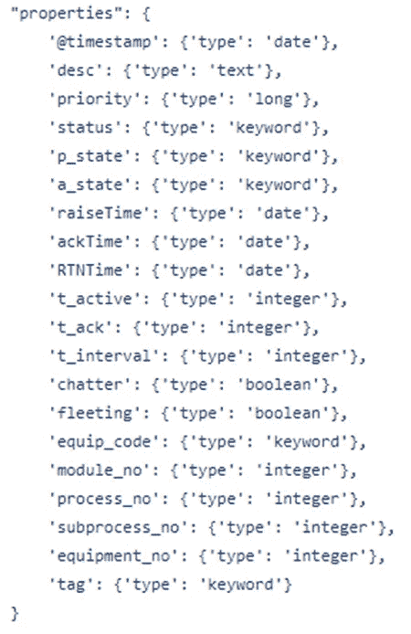
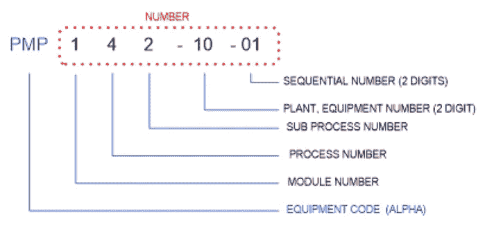
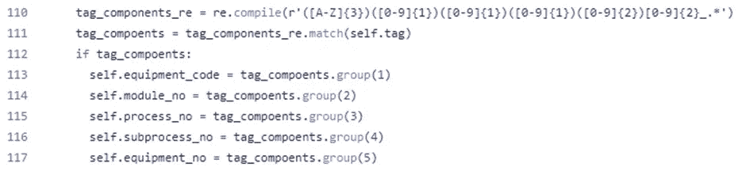
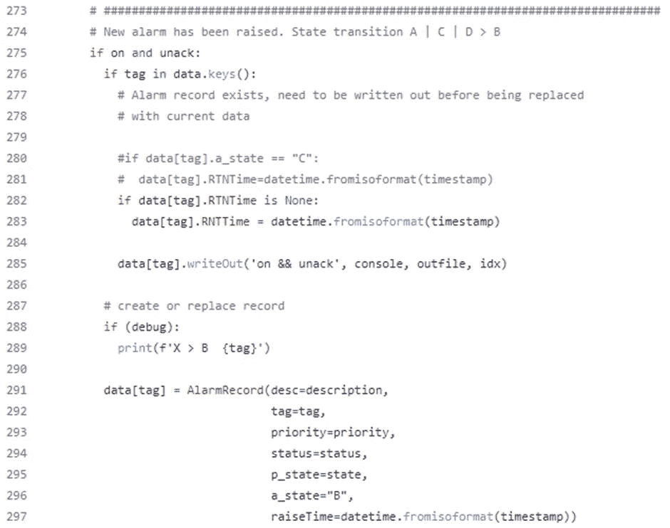
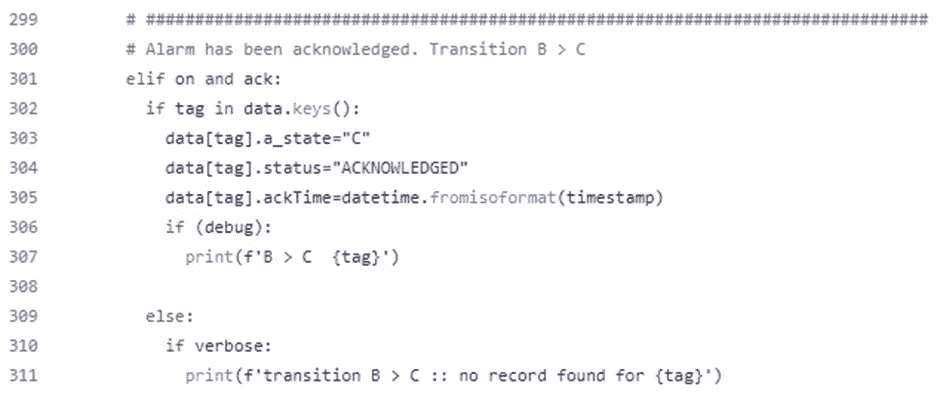

# 用 ELK 离线处理 SCADA 报警数据记录

> 原文：<https://towardsdatascience.com/processing-scada-alarm-data-records-offline-with-elk-4ad509ef97d3>

## 工业自动化的开源工具

米卡·鲍梅斯特在 [Unsplash](https://unsplash.com/s/photos/data-processing?utm_source=unsplash&utm_medium=referral&utm_content=creditCopyText) 上的照片

本文是我们使用开源数据科学工具来分析 SCADA 系统产生的警报和事件日志的系列文章的继续。

这是本系列的第三篇文章，包括以前的文章，

1.  [与 ELK 离线处理 SCADA 报警数据](/processing-scada-alarm-data-offline-with-elk-7ab9b475ffb9)
2.  [SCADA 报警标准&指标](/scada-alarm-standards-metrics-56512db128b0)

在[使用 ELK](/processing-scada-alarm-data-offline-with-elk-7ab9b475ffb9) 离线处理 SCADA 报警数据中，出现了以下内容:

*   工业控制系统(又名 SCADA 系统)、其架构和用途的介绍
*   引入并安装了[弹性搜索](https://www.elastic.co/)堆栈(ELK)
*   来自商业 SCADA 系统的警报和事件日志被清理并加载到 ELK 中
*   使用 ElasticSearch Kibana 和创建的简单仪表板完成了对原始警报事件的简单分析

在 [SCADA 报警标准&指标](/scada-alarm-standards-metrics-56512db128b0)中，涵盖了以下内容:

*   警报管理标准
*   警报生命周期
*   报警系统性能指标

这就是我们已经去过的地方，但我们要去哪里？在本文中，我们将…

*   检查警报生命周期
*   将报警事件处理成报警记录
*   用从报警标签中提取的有关过程区域和模块的信息增加报警记录
*   用有用的统计数据增加警报记录

这将使我们在后续文章中创建仪表板，使用 [SCADA 警报标准&指标](/scada-alarm-standards-metrics-56512db128b0)中描述的行业标准指标来分析警报记录。

# SCADA 系统

正如前一篇文章中所讨论的，SCADA 是基于计算机的工业控制系统的通称。SCADA(监控和数据采集)系统可用于监测和控制工业过程，包括水处理、制造、发电站、食品和饮料等。事实上，任何使用自动化制造设备的工业过程。

# 警告

## 定义

警报的目的是提醒操作员需要干预的异常或危险过程条件。

## 警报生命周期

下图展示了一个简化的警报生命周期，它符合 IEC 标准。

对于每个报警点，被监控的物理过程包含正常和异常两种状态。

因此，每个报警都有两个属性，报警状态(正常|报警)和确认状态(已确认|未确认)。由于警报有两个属性，它可以在任何时候处于四种状态之一。允许的状态转换如下图所示，

作者图片

下面的时序图显示了两个信号之间的典型相互作用，并指定了三个时序值，将在后面的分析中使用。

作者图片

# 从警报日志创建警报记录

我们的 SCADA 系统生成的日志文件描述了每个状态转换(这些在[使用 ELK](/processing-scada-alarm-data-offline-with-elk-7ab9b475ffb9) 离线处理 SCADA 报警数据中进行了分析)。为了能够执行更详细的警报分析(如 [SCADA 警报标准&指标](/scada-alarm-standards-metrics-56512db128b0)中所述),状态转换事件将被处理，我们将为每个警报的整个生命周期生成一个警报记录。

## 报警日志的格式

我手头的报警日志文件是由施耐德电气 CitectSCADA 产品生成的。这些文件最初是空格分隔的文本文件，我们之前已经将其转换为 CSV。下面是一个典型文件的前五条记录的示例，

作者图片

## 报警记录的格式

下面是我们将存储在 Elasticsearch 数据库中的警报记录的定义。

作者图片

各个字段的详细信息如下:

**时间戳:**

发出警报时的时间戳。与 ***raiseTime*** 的值相同

**desc:**

产生警报的设备的描述(如增压泵#1 电流)

**优先级:**

指示报警优先级的数值。对于此数据集，1–5。

**状态:**

警报确认状态。(这是处理报警事件的内部变量，不应写入报警记录)。

**p_state:**

“过程状态”对应于报警状态。(这是处理报警事件的内部变量，不应写入报警记录)。

**a_state:**

报警状态；a、B、C 或 D 与状态转换图对齐。(这是处理报警事件的内部变量，不应写入报警记录)。

**提出时间:**

警报激活时的时间戳。

**确认时间:**

指示报警被确认的时间的时间戳。

**RTNTime:**

指示警报何时转换回正常状态(返回正常)的时间戳。

**t_active**

警报处于活动状态的时间长度。

**t_ack:**

警报被确认之前的时间长度。

**t_interval:**

从 RTN 到标签再次进入报警状态的时间长度。

**喋喋不休:**

一个布尔值，表示这是一个振动警报(即每秒触发 2 次以上的警报)

**稍纵即逝:**

一个布尔值，表示这是一个短暂的警报(即在操作员有机会采取行动之前返回到正常状态的警报)。被认为小于 1 秒)

**装备 _ 代码**

**模块编号**

**流程编号:**

**子流程 _ 编号:**

**设备 _ 编号:**

附加的资产信息在下面的数据扩充中描述。

**标签:**

报警信号的字母数字标识符。

## 数据扩充

许多资产编号方案将资产数据嵌入到资产标识符中。如果提取资产标识符的各个组成部分并将其放入警报记录的各个字段中，则警报记录的分析会变得更容易。

下面是在这里分析的数据中使用的方案，

作者图片

一个简单的正则表达式被用来提取这些组件，

## 代码—记录创建

将 CSV 报警事件数据转换为报警记录的代码包含在 csv-2-record.py 文件中，该文件可在以下[要点](https://gist.github.com/patrickcberry/0b4b31902245561fbc462a6d13bf2c88)中找到。

## 主要功能

主要功能，

*   处理命令行输入参数
*   设置循环以迭代所有数据文件
*   将每个数据文件读入熊猫数据帧
*   使用状态机处理数据帧的每一行

## 数据结构

由于我们需要处理多个警报日志条目，然后才能将完整的警报记录条目写出到文件中，因此我们需要一个内部数据结构来存储部分处理的警报记录。

创建了一个 [AlarmRecord](https://gist.github.com/patrickcberry/0b4b31902245561fbc462a6d13bf2c88#file-csv-2-record-py-L19) 类来存储数据，该类包含一个 [**写出**](https://gist.github.com/patrickcberry/0b4b31902245561fbc462a6d13bf2c88#file-csv-2-record-py-L101) 方法来写出数据。 [AlarmRecord](https://gist.github.com/patrickcberry/0b4b31902245561fbc462a6d13bf2c88#file-csv-2-record-py-L19) 类是一个 Python [@dataclass](https://docs.python.org/3/library/dataclasses.html) 是一个用于管理主要由数据组成的类的有用库。

使用一个数据变量，它是一个报警记录的字典，使用报警标签作为关键字。

正在处理的[报警记录](https://gist.github.com/patrickcberry/0b4b31902245561fbc462a6d13bf2c88#file-csv-2-record-py-L19)存储在[数据变量](https://gist.github.com/patrickcberry/0b4b31902245561fbc462a6d13bf2c88#file-csv-2-record-py-L101)(Python[字典](https://docs.python.org/3/tutorial/datastructures.html#dictionaries))中，由报警标签(唯一标识符)索引。

## 状态机

要处理报警日志条目，需要一个状态机。

作者图片

因为只有四种状态，所以使用了 it-then-else 结构来创建状态机。这是可行的极限，如果有更多的状态，将需要使用更复杂的实现(例如 GOF 状态模式)。

我们将只研究两个转换。

如果我们处理一个报警事件，其中报警处于活动状态(on 为真)且报警未被确认(ack 为假)，那么从我们的报警状态转换图中我们知道我们应该转换到状态 b。

下面的代码描述了这一点，

如果我们处理一个报警事件，其中报警处于活动状态(on 为真)且报警被确认(ack 为真)，那么从我们的报警状态转换图中我们知道我们应该从状态 B 转换到状态 c。

下面的代码描述了这一点，

## 加载到弹性搜索

csv-record-2-es.py 文件(在[要点](https://gist.github.com/patrickcberry/0b4b31902245561fbc462a6d13bf2c88)中有)用于将报警记录 csv 文件加载到[弹性搜索](https://www.elastic.co/elastic-stack/)中。

下面的代码将所有记录读入 Pandas dataframe，然后使用 Python Elasticsearch 库中的 **bulk** upload 函数将数据加载到数据库中。

# 将来的

到目前为止，我们已经处理和分析了原始警报日志文件，并创建了警报记录。在 [SCADA 警报标准&指标](/scada-alarm-standards-metrics-56512db128b0)中，我们看到警报管理标准为警报管理系统定义了 12 项性能指标。在本系列的下一篇文章中，我们将使用 ELK 创建仪表板，根据这 12 个性能标准来评估我们的系统性能。

# 资源

完整的代码位于下面的[要点](https://gist.github.com/patrickcberry/0b4b31902245561fbc462a6d13bf2c88)。

# 进一步阅读

感谢阅读，希望你喜欢这篇文章。

为了进一步探索，

*   [订阅电子邮件通知](https://patrickberry.medium.com/subscribe)
*   阅读本系列的第 1 部分，[使用 ELK 离线处理 SCADA 报警数据](/processing-scada-alarm-data-offline-with-elk-7ab9b475ffb9)
*   阅读本系列的第 2 部分， [SCADA 报警标准&指标](/scada-alarm-standards-metrics-56512db128b0)
*   点击文章顶部的“关注”按钮
*   对于工业 4.0 的所有内容，请查看我的[工业数字化转型&工业 4.0](https://medium.com/industrial-digital-transformation-industry-4-0) 出版物
*   欢迎在 LinkedIn 上加入我的社交网络(记得提到你已经读过这篇文章)

为了支持中型作者，可以考虑[订阅](https://patrickberry.medium.com/membership)。

记得点击订阅和关注按钮，

