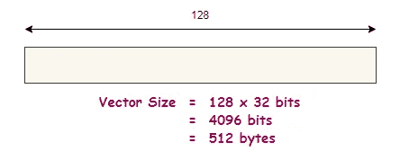
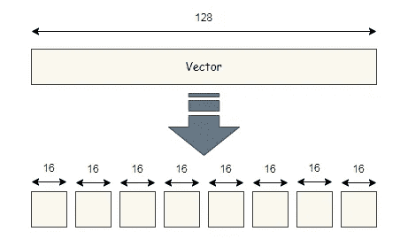
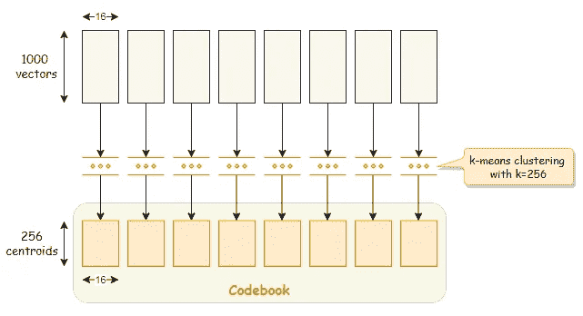
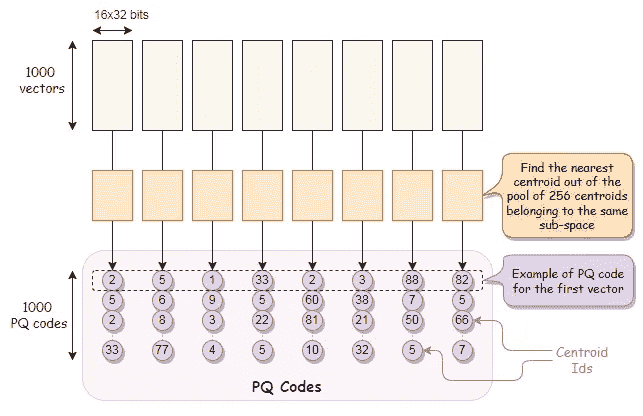
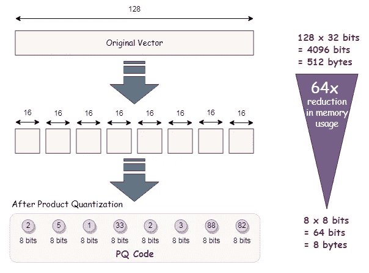
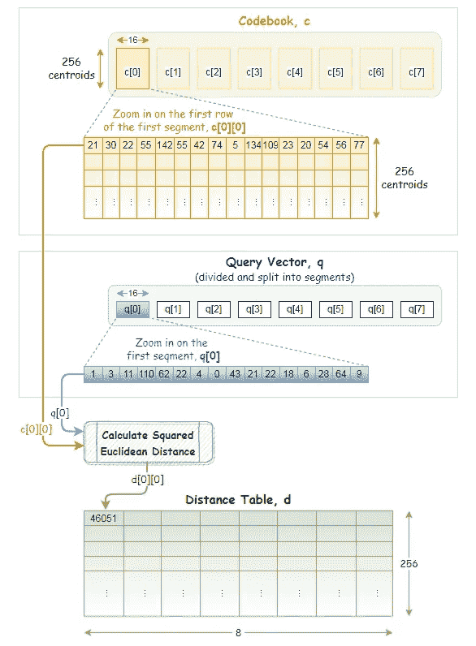
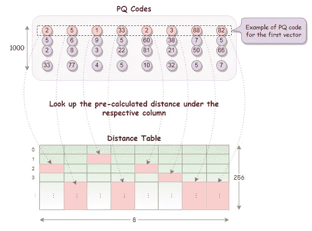
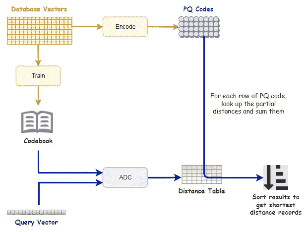

# 用于相似性搜索的产品量化

> 原文：<https://towardsdatascience.com/product-quantization-for-similarity-search-2f1f67c5fddd>

## 如何利用非对称距离计算(ADC)在内存中压缩和适应海量向量集进行相似性搜索


马库斯·温克勒在 [Unsplash](https://unsplash.com?utm_source=medium&utm_medium=referral) 上的照片

相似性搜索和最近邻搜索是非常流行的，在很多领域都有广泛的应用。它们用于推荐系统、支持产品图像搜索的在线商店和市场，或者专用于文档、媒体或对象匹配和检索的系统。

相似性搜索通常是在大量的对象嵌入集合上完成的，通常是以高维向量的形式。

在内存中拟合一组庞大的高维向量来执行相似性搜索是一个挑战，乘积量化可以通过一些权衡来帮助克服这一点。

# 什么是产品量化

乘积量化(PQ)是一种用于矢量压缩的技术。这对于压缩高维向量进行最近邻搜索是非常有效的。根据作者的 [**对最近邻搜索**](https://ieeexplore.ieee.org/document/5432202)【1】、

> 其思想是将空间分解成低维子空间的笛卡儿积，并分别量化每个子空间。
> 
> 一个向量由一个由它的子空间量化索引组成的短码来表示。两个向量之间的欧几里德距离可以从它们的代码中有效地估计出来。非对称版本提高了精度，因为它计算矢量和代码之间的近似距离”。

> 注意，产品量化不是[降维](https://en.wikipedia.org/wiki/Dimensionality_reduction)。
> 
> 在乘积量化中，它是[矢量量化](https://en.wikipedia.org/wiki/Vector_quantization)的一种形式，量化后矢量的数量将保持不变。然而，压缩向量中的值现在被转换成短代码，因此它们是符号的而不再是数字的。使用这种表示法，每个向量的大小都大大减小了。
> 
> 产品量化也是在 [Faiss](https://github.com/facebookresearch/faiss) (脸书人工智能相似性搜索)中实现的许多索引类型之一，这是一个为高效相似性搜索而高度优化的库。

# 产品量化如何工作

假设我们在数据库中有一个向量集合，每个向量的维数(或长度)是 128。这意味着一个向量的大小是 128 x 32 位= 4096 位(相当于 512 字节)。



除非另有说明，所有图片均为作者所有

首先，我们将向量分割成几段。下图显示了向量被分割成 8 段，其中每段的长度为 16。



将一个向量分割成线段

我们对每个向量都这样做，因此我们实际上是把向量分成 8 个不同的子空间。如果我们在数据库中有 1000 个向量，那么每个子空间将包含 1000 个长度为 16 的段。

## 培养

接下来，我们通过在每个子空间上运行 [k 均值聚类](https://en.wikipedia.org/wiki/K-means_clustering)来训练我们的向量。基于我们选择的`k`的值，k-means 聚类将在该子空间内生成`k`质心(即聚类中心),并且这些质心具有与片段相同的长度。

质心也称为再现值。质心的集合被称为码本，我们稍后会详细讨论它。

举个例子，如果我们选择`k=256`，我们将会得到总共 256 x 8 = 2048 个质心。



在每个子空间上运行 k-means 聚类

> 质心也称为再现值，因为它们可以用于通过连接来自每个片段的相应质心来近似重构矢量。然而，重构的矢量不会与原始矢量完全相同，因为乘积量化是一种[有损压缩](https://en.wikipedia.org/wiki/Lossy_compression)。
> 
> 对于训练，也可以使用不同的向量集或子集，只要它们具有与数据库向量相同的分布。

## 编码

在训练完成后，对于数据库中的每个向量段，我们从各自的子空间中找到最近的质心。换句话说，对于向量的每一段，我们只需要从属于同一子空间的 256 个质心中找出最近的质心。

对于每个线段，在获得最近的质心后，我们用该质心的 id 替换它。质心 id 只不过是子空间内质心的索引(一个从 0 到 255 的数)。

这就是它们，它们是矢量的压缩表示。这些就是我们前面讲过的短码，姑且称之为 PQ 码。

在这个例子中，一个 PQ 码由跨段的 8 个质心 id 组成。我们在数据库中有 1000 个向量，因此会转换成 1000 个 PQ 代码。



PQ 码，向量的压缩表示

基本上，我们所做的是用质心 id 编码我们的原始向量，其中每个片段用 8 位编码。

每个向量有 8 个段，因此每个编码的向量仅占用 8×8 比特= 8 字节的空间。与存储 512 字节的原始向量相比，这节省了大量空间。

如本例所示，我们的内存使用量减少了 64 倍(每个向量从 512 字节减少到 8 字节)，这在我们处理数十万条记录(如果不是数百万条的话)时是一个巨大的数目！



产品量化后内存使用减少


照片由 [Unsplash](https://unsplash.com?utm_source=medium&utm_medium=referral) 上的 [krakenimages](https://unsplash.com/@krakenimages?utm_source=medium&utm_medium=referral) 拍摄

> `*k*` 的值通常是 2 的幂。
> 
> 对于`M`段，一个 PQ 码的存储要求是`M*(log base 2 of k)`位。

# 量化搜索

因此，我们有效地使用 8 个质心 id 来表示一个矢量。但是这种表示对于相似性搜索究竟是如何工作的呢？

答案就在码本中，它包含了质心，即再现值。该过程解释如下。

给定一个查询向量`q`，我们的目标是从数据库中的向量集合中找到与`q`非常相似的向量。

典型的过程是计算并比较查询向量和数据库中所有向量之间的距离，并返回距离最短的前 N 条记录。

然而，我们要做一些不同的事情。我们不会用原始向量来计算距离。相反，我们将进行非对称距离计算(ADC ),并使用矢量到质心的距离来估计距离。

我们首先将查询向量分割成相同数量的片段。

对于每个查询向量段，我们使用来自码本的相同段的所有质心预先计算部分[平方欧几里德距离](https://en.wikipedia.org/wiki/Euclidean_distance#Squared_Euclidean_distance)。

这些部分平方欧几里德距离被记录在距离表`d`中。在我们的示例中，如下所示，距离表由 256 行和 8 列组成。



预计算距离表

现在我们有了距离表，只需查找部分距离并求和，就可以轻松获得 PQ 代码每行的距离。



从距离表中查找部分距离

在获得 PQ 代码的所有行的距离之后，我们按照升序对它们进行排序，并且从顶部结果(即，具有最短距离的记录)开始，从数据库中找到并返回相应的向量。

下图总结了相似性搜索的产品量化过程。



相似性搜索的产品量化过程

值得注意的是，对于乘积量化，搜索仍然是强力搜索，因为距离查找和求和是穷举的，并且需要对 PQ 码的所有行进行。

此外，因为我们比较的是矢量到质心的距离，这些距离并不是精确的矢量到矢量的距离。它们只是估计的距离，因此结果可能不太精确，并且可能不总是真正的最近邻。

可以通过调整质心的数量或分段的数量来提高搜索质量。更多的质心或段导致更高的准确度和精度，但是它们也会减慢搜索操作以及训练和编码所需的时间。除此之外，更多的质心可能会导致表示代码所需的比特数增加，从而节省更少的内存。

这里有一个简单的 Python 实现产品量化的例子，灵感来自于 [nanopq](https://github.com/matsui528/nanopq) 。

# 摘要

乘积量化将矢量分割并拆分成段，并分别量化矢量的每一段。

数据库中的每个向量都被转换成一个短码(PQ 码)，这是一种对于近似最近邻搜索来说非常节省内存的表示。

带有产品量化的相似性搜索是高度可扩展的，但是我们用一些精度来换取存储空间。

> 以较不精确的搜索为代价，产品量化使大规模搜索成为可能，否则这是不可能的。

由于产品量化本身并不是非常大规模搜索的最有效方法，我们将在下一篇文章中看到如何实现更快的非穷举搜索方法。点击下面的链接了解更多信息。

[](/similarity-search-with-ivfpq-9c6348fd4db3) [## 使用 IVFPQ 进行相似性搜索

### 了解如何实现倒排文件索引(IVF)以及产品量化(PQ ),以实现快速有效的…

towardsdatascience.com](/similarity-search-with-ivfpq-9c6348fd4db3) 

# 参考

[1] H. Jégou，M. Douze，C. Schmid，[最近邻搜索的乘积量化](https://ieeexplore.ieee.org/document/5432202) (2010)

[2] C. McCormick，[k-NN 教程第一部分](http://mccormickml.com/2017/10/13/product-quantizer-tutorial-part-1/)的产品量化器(2017)

[3] J. Briggs，[乘积量化:将高维向量压缩 97%](https://www.pinecone.io/learn/product-quantization/)

[4] [纳米乘积量子化(nanopq)](https://github.com/matsui528/nanopq)

```
***Before You Go...****Thank you for reading this post, and I hope you’ve enjoyed learning about product quantization for similarity search.**If you like my post, don’t forget to hit* [***Follow***](https://peggy1502.medium.com/) *and* [***Subscribe***](https://peggy1502.medium.com/subscribe) *to get notified via email when I publish.**Optionally, you may also* [*sign up*](https://peggy1502.medium.com/membership) *for a Medium membership to get full access to every story on Medium.*📑 *Visit this* [*GitHub repo*](https://github.com/peggy1502/Data-Science-Articles/blob/main/README.md) *for all codes and notebooks that I shared in my posts.*© 2022 All rights reserved.
```

有兴趣阅读我的其他数据科学文章吗？查看以下内容:

[](/transformers-can-you-rate-the-complexity-of-reading-passages-17c76da3403) [## 变形金刚，你能评价阅读段落的复杂程度吗？

### 用 PyTorch 微调 RoBERTa 以预测文本摘录的阅读难易程度

towardsdatascience.com](/transformers-can-you-rate-the-complexity-of-reading-passages-17c76da3403) [](/advanced-techniques-for-fine-tuning-transformers-82e4e61e16e) [## 微调变压器的先进技术

### 学习这些先进的技术，看看它们如何帮助改善结果

towardsdatascience.com](/advanced-techniques-for-fine-tuning-transformers-82e4e61e16e) [](https://pub.towardsai.net/building-a-product-recommendation-engine-with-aws-sagemaker-321a0e7c7f7b) [## 用 AWS SageMaker 构建产品推荐引擎

### 了解如何使用 Amazon SageMaker 因式分解机构建和训练个性化推荐引擎

pub.towardsai.net](https://pub.towardsai.net/building-a-product-recommendation-engine-with-aws-sagemaker-321a0e7c7f7b) [](/aws-certified-machine-learning-specialty-97eacbd1a0fe) [## AWS 认证机器学习—专业

### 关于如何准备和通过考试的提示和建议

towardsdatascience.com](/aws-certified-machine-learning-specialty-97eacbd1a0fe) 

[张佩琦](https://peggy1502.medium.com/?source=post_page-----2f1f67c5fddd--------------------------------)

## 掌握动态编程系列

[View list](https://peggy1502.medium.com/list/series-on-mastering-dynamic-programming-ce9124edda06?source=post_page-----2f1f67c5fddd--------------------------------)2 stories