# 使用 Python 进行生产规划

> 原文：<https://towardsdatascience.com/production-fixed-horizon-planning-with-python-8dd38b468e86>

## 使用 python 实现 Wagner-Whitin 算法进行生产规划，以最小化生产的总成本

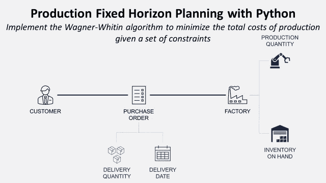

(图片由作者提供)

**目的** 使用 python 设计一个最优的生产计划，以满足客户需求并使总生产成本最小化。

**简介
T5**主生产计划**是商业团队和生产之间的主要沟通工具。**

您的客户发送**采购订单**和特定**数量**以便在**特定时间**交付。

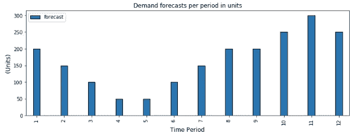

客户订单示例—(图片由作者提供)

生产计划用于**通过在**最小化库存**和**最大化**根据**设置**生产的**数量**之间找到平衡来最小化生产的总成本**。

在本文中，我们将通过 python 使用 **Wagner-Whitin 方法**实现最优生产计划。

💌新文章直接免费放入你的收件箱:[时事通讯](https://www.samirsaci.com/#/portal/signup)

如果你喜欢观看，可以看看这个教程的视频版本

# 如何用 Python 规划自己的生产？

## 方案

你是一家小型工厂的**生产计划经理**，生产服务于**本地和国际市场**的无线电设备。

客户将[采购订单(PO)](https://www.youtube.com/watch?v=EY9yt0BTr2M) 发送到您的商务团队，其中包含**数量**和**预计交付日期**。

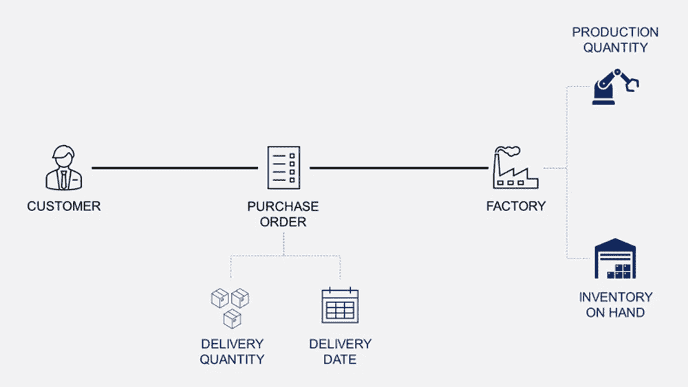

生产计划—(图片由作者提供)

您的角色是安排生产，以最小的**总生产成本**按时交付**包括**

*   安装成本:每次安装生产线的固定成本
*   生产成本:每生产单位的可变成本
*   持有成本:每单位时间的存储成本

在我们的示例中，客户订购了未来 **12 个月**的产品


客户订单—(图片由作者提供)

## **设置与库存成本**

您面临的主要挑战是

*   减少现有的平均库存，以最小化存储成本
*   最小化生产设置的数量

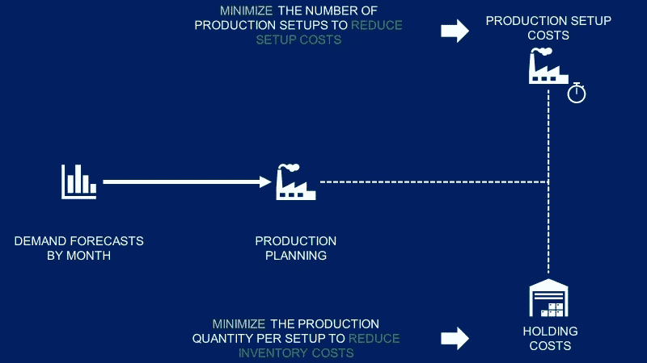

生产调度挑战—(图片由作者提供)

然而，这两个约束是对立的。所以你很难找到一个直观的方法来建立一个最优的方案。

**例 1:** 最小化库存


最小化库存解决方案—(图片由作者提供)

在本例中，您每月生产准确的需求数量

*   优点:没有多余的库存
*   缺点:你每个月的生产都有积极的需求

**示例 2:** 尽量减少生产设置的数量


将安装成本降至最低—(图片由作者提供)

在本例中，您将构建库存以最大限度地减少设置数量

*   优点:整个时期只有两个生产设置
*   缺点:大量库存会增加库存成本

## **结论**

你需要一个**优化算法**来平衡这两个约束。

# 解决办法

> *你可以在这里找到带哑数据的源代码:* [*Github*](https://github.com/samirsaci/production-planning)

## 假设

假设您收到了下一个 **12 个月**的采购订单，数量如上图所示。

*   安装成本:500 美元
*   持有成本:1 美元/单位/月
*   单位生产成本:50 美元/单位
*   m 月生产的产品可以在同一个月发货
*   库存成本从第 m+1 个月开始计算

## 瓦格纳-怀廷算法

这个问题可以被看作是**经济订货量**模型的一个推广，该模型考虑到了对产品的需求随时间而变化。

Wagner 和 Whitin 开发了一种通过动态规划寻找最优解的算法。

这样做的目的是了解每个月将当月的需求数量添加到过去几个月的订单中是否比建立新的生产周期更经济。

## 正向计算

**从周期 1 开始:**

*   计算满足第 1 个月 D(1)需求的总成本

**周期 N:**

*   计算满足 t，D(t)月需求的总成本
*   查看所有过去的订单(t=1..n)并通过将数量添加到过去的订单 D(t-1)中来计算订购 D(t)的成本
*   取最经济的选项，去 t = N+1

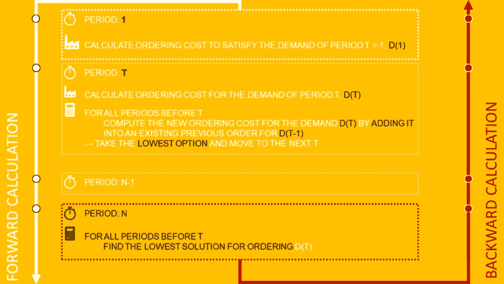

瓦格纳-怀廷算法—(图片由作者提供)

## 逆向计算

从周期 t = N 开始，反向工作，找出满足每个 D(t)需求的最低选项。

# 结果和结论

*欢迎随时关注我的 medium，获取更多与数据分析和供应链管理相关的文章*

## 正向计算

您应该使用下表导出正向计算的结果:

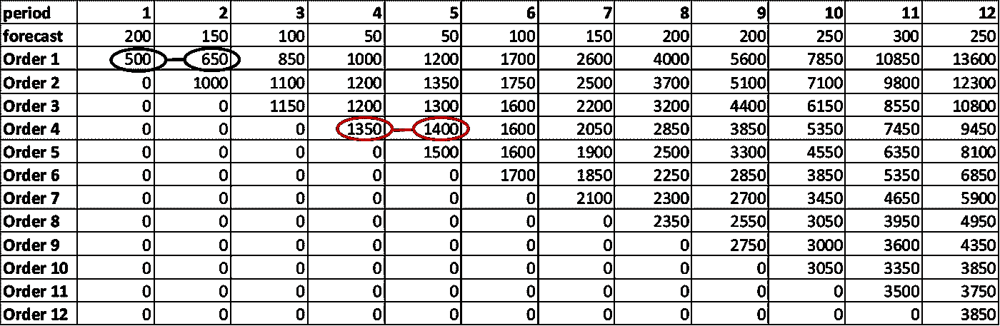

向前计算—(图片由作者提供)

让我举几个例子:

期间 1，如果您为

*   仅第一个月需求(D(1) = 200 单位):500 美元
*   头两个月(D(1) + D(2) = 350 单位):650 美元

## 逆向计算

我们可以使用上面的表格，使用前面解释的规则来进行算法的可视化解析。

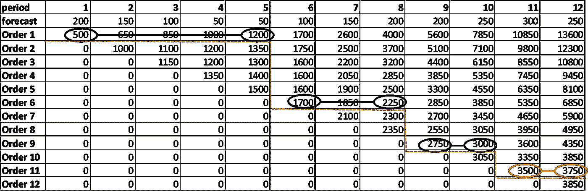

逆向计算—(图片由作者提供)

*   从 t = 12
    开始最便宜的解决方案是为 D(11) + D(12)生成**月 11**
*   继续 t = 10
    最便宜的解决方案是为 D(9) + D(10)产生**月 9**
*   继续 t = 8
    最便宜的解决方案是为 D(6) + D(7) + D(8)产生**第 6 个月**
*   继续 t = 6
    最便宜的解决方案是为 D(1) + D(2) + D(3) + D(4) + D(5) + D(6)产生第 1 个**月**

## 最终解决方案

*   第 1 个月:生产 550 台以满足前 5 个月的需求
*   第 6 个月:为第 6、7 和 8 个月生产 450 个单位
*   第 9 个月:为第 9 个月和第 10 个月生产 450 个单位
*   第 11 个月:第 11 个月和第 12 个月生产 550 件

**库存优化**

在下图中，您可以看到现有库存(IOH)可能远远高于需求预测。

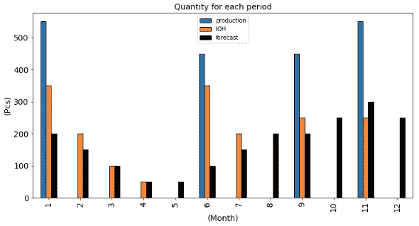

现有库存—(图片由作者提供)

这表明，在设置和库存对总成本的影响之间没有平衡。这意味着，保持高库存比增加设置数量要便宜得多。

如果持有成本更高，你可能会看到更接近预测的 IOH 和可能更多的生产月。

**库存和准备成本之间的巨大平衡**

在下图中，您可以跟踪 12 个月内的累计持有和设置成本:

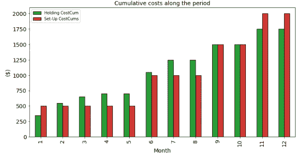

持有成本与设立成本

在这里，我们可以清楚地看到该算法如何在库存优化和减少设置数量之间取得平衡，因为保持和设置累积成本几乎相等。

这意味着，

*   如果你有非常高的单位持有成本，该算法将倾向于增加设置的数量，以尽量减少库存水平
*   如果每次设置的成本非常高，算法将更倾向于以最小的设置成本建立库存。

## 用 Python 实现

在 GitHub 存储库中，您可以使用 python 从头开始找到该方法的实现。

使用 pandas 函数来操作数据框，这种方法易于实现，适用于小型数据集。

**正向计算**

```
# Create columns
data_calc = data.copy()

for i in data_calc['period'].unique():
    data_calc['Order {}'.format(i)] = 0

# costs
set_up = 500
holding = 1

# Order 1
order = 1
for index, row in data_calc.iterrows():
    current_month = data_calc.loc[index,'period']
    cost = 0
    # 1 set up
    cost += set_up
    if current_month > 1:
        for t in range(1, current_month+1):
            cost += (t-1) * data_calc.loc[t-1,'forecast'] * holding
    data_calc.loc[index,'Order {}'.format(order)] = cost

# Order 2
for order in range(2, 13):
    for index, row in data_calc.iterrows():
        current_month = data_calc.loc[index,'period']
        if current_month >= order:
            cost = 0

            # Best option best Period 1
            values = list(data_calc.loc[order-2,
              ['Order {}'.format(i) for i in range(1, order+1)]].values)
            best = min([i for i in values if i >0])

            # Add 
            cost += best + set_up
            for t in range(order, current_month+1):
                cost += (t-order) * data_calc.loc[t-1,'forecast'] * holding
            data_calc.loc[index,'Order {}'.format(order)] = cost

data_calc = data_calc.set_index('period').drop(['forecast'], axis = 1).T
data_calc
```

由于第一个月没有以前的订单，我已将其与其他订单分开。

## 逆向计算

```
costs, initials, nexts, quantities = [], [], [], []
i = 12
while i>1:
    # Order with the minimum cost
    initial_step = i
    next_step = data_calc[data_calc[i]>0][i].idxmin()
    cost = data_calc[data_calc[i]>0][i].min()
    # Next Step 
    next_id = int(next_step.replace('Order ',''))
    i = next_id - 1
    # Quantity
    quantity = data[data['period'].isin(range(next_id, initial_step+1))]['forecast'].sum()

    costs.append(cost)
    initials.append(initial_step)
    nexts.append(next_id)
    quantities.append(quantity)

df_results = pd.DataFrame({'backward':range(1, len(initials)+1), 
                           'initial':initials, 
                           'nexts':nexts, 
                           'cost':costs,
                           'quantity':quantities}).set_index('backward')
print("Total Cost: {:,}$".format(df_results.cost.sum()))
df_results
```

*   从上个月开始，向后移动
*   不要忘记获取用于输出分析的成本

# 后续步骤

## 将您的算法包含在数字双胞胎中

数字孪生是物理对象或系统的数字复制品。

供应链数字模型是一种计算机模型，代表供应链中涉及的各种组件和流程，如仓库、运输网络和生产设施。

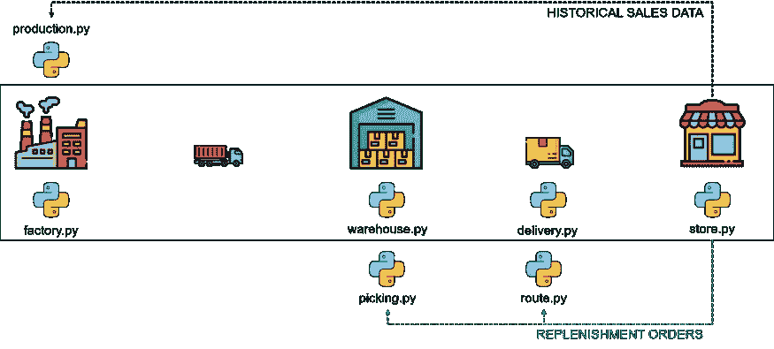

使用 Python 的数字孪生示例—(图片由作者提供)

您的核心模型将包括一个子模型来模拟您工厂的行为

*   **输入数据**:生产计划，预计生产数量和交货期
*   **输出数据**:实际生产数量和交货日期

本文中开发的算法可以集成到数字双胞胎中，以连接您的商店和工厂

*   商店的输出将提供历史销售数据来预测未来需求:算法输入
*   工厂的输入将采用 Wagner-Within 算法生成的计划作为每个时间段的生产数量

然后，您可以轻松模拟几种计划算法对仓库库存水平、总生产和交付成本或生产线利用率的影响。

欲知详情，

[](https://www.samirsaci.com/what-is-a-supply-chain-digital-twin/) [## 什么是供应链数字孪生？

### 供应链优化使用 python 创建一个代表供应链网络的模型，以优化您的…

www.samirsaci.com](https://www.samirsaci.com/what-is-a-supply-chain-digital-twin/) 

## 生产线调度

今天用的例子是从宏观的角度，我们把工厂看作一个黑箱，有生产能力，库存水平，固定或可变成本。

通过使用 python 的线性编程，生产调度可以帮助您提高生产能力。

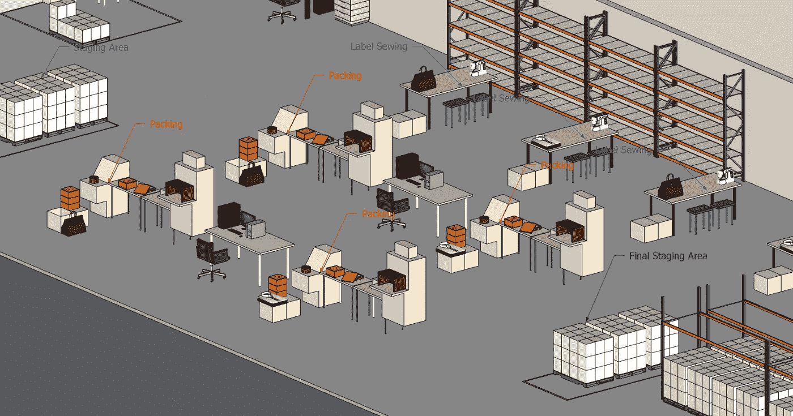

具有三种不同工作的生产线示例—(图片由作者提供)

**作业车间调度问题(JSSP)** 是一个 NP-hard 问题，由一组作业定义，每个作业必须由一组机器按照特定的顺序执行。

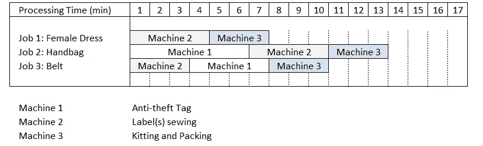

我们的例子是使用 3 台机器的 3 个作业—(图片由作者提供)

由于您的解决方案可能需要非常高的生产峰值，因此可以使用线性规划来计划作业，以便在相同的设备和资源下每小时生产更多的单位。

欲知详情，

[](https://www.samirsaci.com/optimize-warehouse-value-added-services-with-python/) [## 利用 Python | Samir Saci 优化仓库增值服务

### 仓储业务使用线性规划来增加您的豪华轿车总装的生产能力…

www.samirsaci.com](https://www.samirsaci.com/optimize-warehouse-value-added-services-with-python/) 

# 关于我

让我们在 [Linkedin](https://www.linkedin.com/in/samir-saci/) 和 [Twitter](https://twitter.com/Samir_Saci_) 上连线，我是一名供应链工程师，正在使用数据分析来改善物流运营和降低成本。

如果你对数据分析和供应链感兴趣，可以看看我的网站

[](https://samirsaci.com) [## Samir Saci |数据科学与生产力

### 专注于数据科学、个人生产力、自动化、运筹学和可持续发展的技术博客

samirsaci.com](https://samirsaci.com)