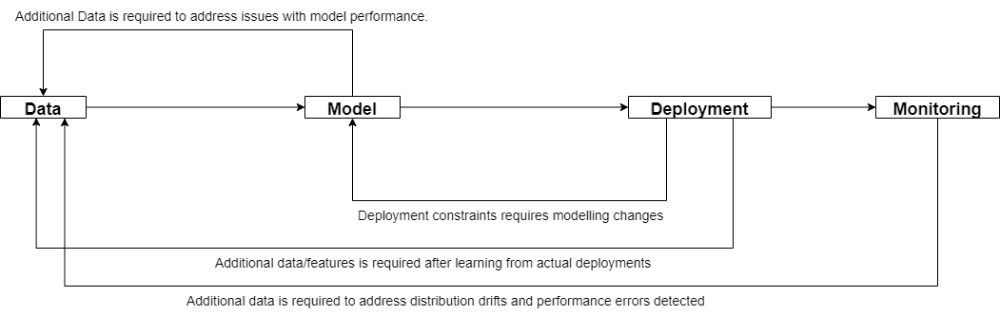

# 生产机器学习:确定 ML 技术债务

> 原文：<https://towardsdatascience.com/production-machine-learning-determining-ml-technical-debt-59a8502eb8d9>

这篇文章的目标读者是技术和非技术利益相关者，目的是确定和解释 ML 技术债务。对 ML 技术债务的理解防止了各种利益相关者，例如项目经理、ML 工程师、数据科学家、客户和投资者被当前 ML 产品的兴奋所蒙蔽，从而在几个月后才发现 ML 产品预测是无用的。更糟糕的是，预期的最终 ML 产品似乎从来没有达到部署价值的点，并且由于财务和时间的限制，ML 技术债务不能被还清。

在 [Unsplash](https://unsplash.com?utm_source=medium&utm_medium=referral) 上由 [olieman.eth](https://unsplash.com/@moneyphotos?utm_source=medium&utm_medium=referral) 拍摄的照片

机器学习(ML)技术债务是在没有开发高效迭代所需的代码、基础设施、工具和过程的情况下部署 ML 系统，加上缺乏对实际 ML 产品需求的理解和预见而产生的债务。为已部署的 ML 系统提供持续和实际的价值受到累积的 ML 技术债务的阻碍，因为已部署的 ML 系统不能对变化作出反应，并且不能一致地实现必要的性能。

在这篇文章中，我总结了两个主要问题来询问你的内部团队、外包团队或投资公司，以确定潜在的 ML 技术债务。

# 问题 1:团队能否快速迭代？

生产中成功的 ML 系统的主要要求之一是能够迭代修正、改进或保持 ML 模型性能到对利益相关者持续有价值的水平。

为了理解由迭代失败或耗时的迭代过程导致的 ML 系统的潜在技术债务，我们首先必须理解 ML 系统的典型生命周期。

简化的 ML 生命周期

展示简化的 ML 生命周期图的目的是强调一点，ML 系统需要不断的迭代，不同的模块可以有效地相互作用。只关注建模而不开发流水线对于生产 ML 是不够的。不同的运营规模需要不同的 ML 管道成熟度，因此找到对您的运营有意义的东西非常重要。

通常在概念验证(PoC)部署中，团队不会考虑 ML 系统需要任何未来更新或持续学习的事实。PoC 部署可以在静态数据集上完成，无需进行任何开发来处理在研究中非常常见的对新数据的迭代。PoC 部署可能非常具有欺骗性，因为它会欺骗利益相关者，让他们认为产品已经接近完成，但实际上还很远。

PoC 部署的定义还包括 ML 系统，这些系统只能工作很短一段时间，因为随着时间的推移，性能会下降到无用，而团队由于缺乏有效的管道而无法在降级期内解决问题。因此，这包括一些 ML 系统，它们实际上部署在生产中并为客户服务，但实时性能下降很快，最终会失去它们的价值，这可能会导致巨大的意外损失。

不要被 PoC 部署系统所花费的时间和金钱所迷惑，根据 PoC 部署推断实际生产部署是危险的。我们需要了解团队在 PoC 部署过程中产生的技术债务。ML 系统在实际生产中持续成功的原因是什么？

## 问题 1.1:常见的生产 ML 问题

*   数据和概念漂移。

数据漂移是我们训练的输入分布发生变化的地方。概念漂移是指输入和输出之间的关系发生变化。漂移会导致我们最初的成功部署性能随着时间的推移而下降。

*   附加功能要求

涉众可能会在项目中途甚至在部署之后请求额外的特性。该团队还可能意识到，需要额外的功能来解决一些部署问题。

*   数据处理和建模的变化

ML 团队可能会进行一些实验，并意识到改变一些数据处理脚本或模型架构是有益的。

*   未预见的问题

示例:需要收集一类新的数据来正确处理问题，以提供实际价值。

*   部署性能差

在实际部署过程中，团队意识到，尽管在研发阶段表现出色，但性能并不令人满意。

***应该提前考虑解决这些生产问题所需的工作量和成本！***

## 问题 1.2:提前解决生产问题

[Tine ivani](https://unsplash.com/@tine999?utm_source=medium&utm_medium=referral)在 [Unsplash](https://unsplash.com?utm_source=medium&utm_medium=referral) 上拍照

为了解决这些问题，构建一个完整的生产系统管道，在发现问题的同时对新的需求和变化做出反应，将会带来难以置信的好处。提到的每个生产问题都要求团队能够在当前进度的基础上进行迭代和改进。

从 PoC 部署到实际的 ML 生产系统需要团队确保开发的解决方案是可重复的、可扩展的和安全的；这就是迫切需要工程工作的地方。许多 ML 团队仍然试图找出什么是他们部署的 ML 系统的最佳 MLOps 实践和工具。

机器学习应用很少是静态的，因为它与之交互的外部世界是不断变化的。对于根本不考虑迭代管道的团队来说，生产就绪的 ML 系统将是一个遥不可及的目标。

ML 团队必须采取措施，通过考虑代码库模块化、干净的代码实践和易于配置来提前简化协作。通过建立适当的协作系统，团队可以更高效地工作，开发时间将大大减少。

从个人经验来看，有许多经常被忽视的生产 ML 问题会招致额外的技术债务，例如:

*   缺乏监督系统。部署中的问题发现得太晚或者根本没有发现。
*   缺乏数据运营实践的不良数据管理渠道会导致数据质量差且不一致
*   单独跟踪模型的代码。以数据为中心的方法很难进行实验和协作。这也导致再现性差。
*   在较小的精度优势上增加系统的复杂性，例如，改变到具有难以优化的复杂层的新的最先进的模型。

最后，在我看来，最容易被忽视的最有价值的 ML 问题是创建有价值的数据集。大多数 ML 团队在数据收集和采样技术方面很差；这些数据技术之所以缺失，是因为 ML 工程工作通常更重视建模而不是数据。

例如，在数据注释中，ML 团队可能最终只是随机抽取数据进行注释，而不是将精力集中在智能抽样技术上。随机抽样最终会推高成本(注释可能非常昂贵！)而不一定提高模型性能。ML 团队也可能忽略了制定全面的注释指南和与贴标机建立适当合作所需的努力。

ML 团队还必须将数据收集方法作为 ML 管道中的重中之重，因为收集的数据会直接影响模型性能和价值贡献。ML 团队必须确保收集的数据分布与生产中的传入数据分布相关，以便 ML 模型可以在部署期间潜在地提供实际价值。ML 团队不应该仅仅扮演数据消费者的角色，还应该参与到数据收集过程中，并努力引入新的想法来改进该过程。

> **总结问题 1:**
> 
> **理解技术债务可以在 ML 系统的任何部分积累。明智的做法是提前考虑问题在未来可能如何变化的潜在场景，并据此确定生产中的 ML 系统根据新的需求变化和改进的速度。这将提供一个更全面的画面，展示构建一个持续成功的产品所需的努力、时间和成本，而不是被早期的原型成功所愚弄。**

# 问题 2:模型必须表现得多好才有价值？

***我们需要定义哪些指标对我们来说是重要的，以及定义的所有指标的性能如何，该模型才会被认为对我们的利益相关者有价值。***

照片由 [Redd](https://unsplash.com/@reddalec?utm_source=medium&utm_medium=referral) 在 [Unsplash](https://unsplash.com?utm_source=medium&utm_medium=referral) 上拍摄

价值的确定应该在风险承担者之间进行讨论，以便恰当地确定项目需求的范围，从而满足期望。不同的问题需要不同的性能需求才有价值(记住，在等式中也要包括业务指标！).性能要求越高，我们可能被蒙蔽的技术债务就越多。

高失败成本和低技术成熟度的问题也会增加潜在的技术债务。产生的技术债务金额由以下因素驱动:

*   基准人员绩效/被认为有价值的绩效
*   失败的代价
*   技术成熟度

两个不同部门的简化示例:

1.  某自动驾驶公司要求交通标志分类模型达到 99.9999%的准确率才有价值。如果精度低于，则不符合安全要求，不能用于实际部署。失败的代价可能是生命的损失。为了训练一个分类模型达到 99%的性能，ML 工程师可以在几个月内完成，但是技术债务实际上是巨大的；从 99%到 99.9999%的准确率需要巨大的努力。
2.  一家制造公司要求产品缺陷分类模型达到 99%的准确率才有价值。如果准确度低于，最好雇佣多个人工来检测不良品。失败的代价将是向客户交付有缺陷的产品。为了训练一个分类模型达到 99%的性能，ML 工程师能够在几个月内完成。

对于这两种分类模型用例(自动驾驶与制造)，技术的成熟度是相同的(基于 ML 的视觉分类模型)，但故障成本和性能要求有很大不同。**从 PoC 到实际的有价值的部署，由于过高的期望和无法实现从最初的 PoC 成功到实际生产成功的必要努力，自动驾驶问题很容易使利益相关者措手不及。**

ML 团队也可能严重低估了从 99%到 99.9999%准确性(PoC 到可部署度量需求)的难度。这是一个过于简单的例子，实际的挑战要复杂得多，无法用单一的模型指标来定义。然而，这种比较的目的不是为了了解自动驾驶的实际基线要求和技术堆栈，而是为了指出提前确定适当的项目范围的重要性。如果你真的对自动驾驶需求感兴趣，这篇论文[“关于安全和可扩展自动驾驶汽车的正式模型”](https://arxiv.org/pdf/1708.06374.pdf)值得一读。引用报纸上的话:

> “首先考虑已知的每小时(人)驾驶事故造成死亡的概率为 10^−6.有理由假设，为了让社会接受机器代替人类驾驶，死亡率应该降低三个数量级，即每小时 10^−9 的概率”

**对这两个问题进行比较是为了强调需要明确定义性能被认为有价值的要求，并理解问题的范围。**

对于这两个例子，通过从完全自动驾驶到驾驶员在回路中的自动驾驶(L5 到 L3 ),或者从完全缺陷检测到工人在回路中处理不确定预测的缺陷检测，保持人在回路中，可以使问题变得更容易。

对于我们的缺陷检测问题，工程工作也可以用于修复制造工厂的环境，使其保持恒定，这本身就解决了大量的机器学习挑战。通过努力约束环境，数据复杂性降低，并且通常需要较少的技术返工。对于自动驾驶的问题来说也是如此，截至今天，许多自动驾驶汽车公司都受到某些地区和天气的限制。然而，关键是要了解什么对我们的最终用户有价值，什么对公司有利。项目范围界定阶段至关重要！

利益相关者需要意识到技术的成熟度和被认为有价值的所需性能。如果没有对此进行规划和研究，您可能最终会构建或投资一个没有生产价值的概念验证 ML 系统，并招致大量永远无法还清的技术债务。

> **总结问题 2:**
> 
> 通过适当地界定和理解需求，ML 产品的潜在技术债务可以在前期得到更准确的评估。请注意从概念验证指标性能到必要的可部署指标性能所需的工作。确保确定可部署的度量需求，并与所有利益相关者讨论它们，尤其是开发团队(例如 ML 工程师、数据工程师和数据科学家)。与利益相关者保持明确的期望是很重要的。

# 结论

伊恩·斯陶费尔在 [Unsplash](https://unsplash.com?utm_source=medium&utm_medium=referral) 上拍摄的照片

对 ML 技术债务的无知会蒙蔽利益相关者，使他们忽略了构建具有实际和持续价值的 ML 产品所需的真实成本和时间。因此，对于包括 ML 工程师或数据科学家在内的利益相关者来说，重要的是理解构建有价值的生产就绪 ML 产品所需的真正努力，而不仅仅是关注他们的利基领域。

ML 管道/系统的标准仍在不断发展，许多新公司正在开发软件工具来支持健壮的 ML 管道，可以有效地迭代。没有引入特定的解决方案来预先“偿还”ML 技术债务或保持其较低水平；这是故意保持开放的，因为本文的目的只是确定 ML 技术债务可能积累的潜在领域，并暗算利益相关者。在未来，我的计划将是为这里提出的两个问题编写技术指南。

[**在 LinkedIn**](https://www.linkedin.com/in/timothylimyonglee/) 上与我联系，愉快地聊天并就未来的项目进行合作！我希望与在 ML、MLOps、自动驾驶汽车和创业方面有相同兴趣的人联系。