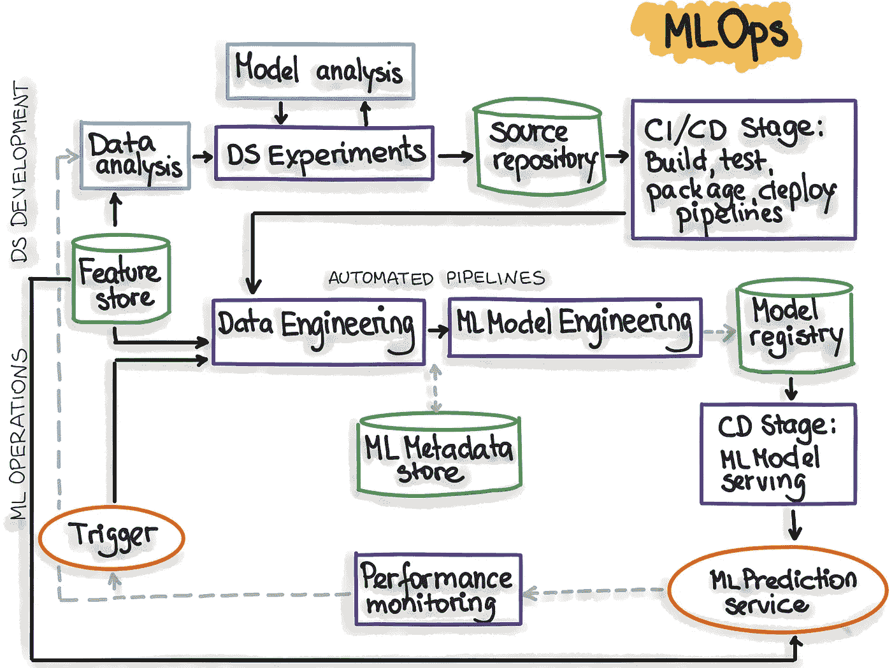

# 生产 MLOps 入门

> 原文：<https://towardsdatascience.com/production-ml-getting-started-with-mlops-4856c38b3eab>

## MLOps 如何帮助您生产您的 ML 项目？为什么您需要尽快开始采用 MLOps？

马库斯·温克勒在 [Unsplash](https://unsplash.com?utm_source=medium&utm_medium=referral) 上的照片

长期以来，持续集成和持续交付(CI/CD)问题在“经典”IT 项目中是众所周知的。这就是 DevOps 这个术语诞生的原因，它指定了促进软件开发所有阶段的自动化和监控的编程原则。

在我们的机器学习系统中，越来越多地开始工业化并集成到现有的 IT 系统中，挑战是将这些原则应用到数据科学的世界中。

构建模型很难，而将它们投入生产则更难。复制您的管道和结果，或者允许其他数据科学家这样做，也同样复杂。有多少次你不得不放弃以前的工作，因为它没有被适当地记录或太难复制？

在本文中，我们将看到 MLOps 如何解决这个问题，以及如何将这种方法集成到完整的机器学习生命周期中。

# 什么是 MLOps？

图片由作者提供—使用 [open peeps](https://www.openpeeps.com/) 库。

MLOps 往往被定义为机器学习的 DevOps 的对应物。因此，我们可以推断 MLOps 允许机器学习项目的步骤的自动化和监控。

但在进一步深入这个主题之前，让我们简单回忆一下机器学习项目的不同阶段:

*   业务需求和要求的定义，
*   数据收集和分析，
*   数据验证，
*   数据预处理，
*   模型探索、培训、选择和验证，
*   在生产中部署模型。

# 那么，MLOps 和这一切有什么关系呢？

图片由作者提供——使用 [open peeps](https://www.openpeeps.com/) 库。

嗯，理想情况下，到处都是！但是我把它分成了三个主要部分，我认为这三个部分很重要，我将在下面详述:

*   实验管理，
*   管道自动化，
*   和模型监控(尤其是功能性的)。

并非所有的原则对你的项目都是必要的。相反，它们是工具箱，您可以根据自己的需要决定是否应用。

# 实验跟踪

在某些情况下，很难跟踪一段时间内完成的所有实验(因为它们非常多，或者因为它们分散在几个月中，或者因为团队非常大，等等)。).此外，代码并不总是保留(当我们决定尝试另一种模型时，这有什么意义呢？).但是，跟踪这些运行对于审计来说非常有用，有助于调试或证明所做的选择。

这就是实验跟踪的用武之地:

实验跟踪侧重于迭代模型开发阶段，此时数据科学家尝试不同的配置以实现期望的性能。

例如，如何避免截图来记录和分享项目进展，并快速重现以前的实验？

实验跟踪可以总结为几个简单的原则:

*   在一个地方集中和组织所有的实验，
*   对比实验和分析结果来调试模型，
*   改善协作:查看每个人都在做什么，轻松共享实验结果，访问实验数据(输入、指标等。),
*   分析和管理实验。

# 从技术上来说，我们该怎么做？

每个团队可以使用其工具来管理和遵循其项目的 ML 实验的不同步骤。然而，出于效率的原因，建议考虑关于该主题的专门工具。许多开源或软件工具可以满足这种需求，并且可以轻松、安全地集成到所需的工作流程中。

根据需要，实验跟踪工具可以具有不同的功能。从本质上讲，这是一个从纯技术角度出发的专用工具可以为我们提供的服务的非详尽列表。

**创建模型:**在研究和数据探索阶段，必须能够:

*   记录、记录、显示模型元数据(数据、指标、标签等。);
*   比较几个执行:比较表，图表等。
*   创建或自动生成仪表板/摘要报告；
*   跟踪硬件消耗，包括 CPU、GPU、内存等。；
*   能够在同一个项目上合作，并分享这些新的集成；

**部署到生产:**一旦数据科学家选择了一个模型，ML 工程师就必须将它投入生产。为此，在一个好工具的帮助下，实验跟踪允许:

*   轻松快速地重现和重新执行实验；
*   跟踪实验及其元数据；
*   将模型集成到自动化和 CI/CD 链中

# 管道自动化

管道自动化的挑战是满足自动化我们的模型部署中可以自动化的东西的需求。毕竟，我们需要一个人每个月去运行 Jupyter Notebook 中的一个代码来重新培训生产中的模型吗？这个数据科学家在创建新模型时不是更有用吗？

因此，让我们来看看应该采取什么措施:

*   **代码的版本管理(*首先是模型，还有数据和预测)*** :对于这一步，建议在代码管理工具(例如 Git)中注册代码，并设置管理模型注册、ML 元数据存储和特性存储的工具。
*   **自动重新训练**:一个模型在生产中的性能会随着时间的推移而下降，所以我们必须能够用更多的数据或更新的数据来重新训练模型，以跟上最新的趋势。注意，可以根据时间表或根据触发器(例如，性能下降到阈值以下)来触发再训练
*   自动测试:测试必须像传统的开发周期一样关注代码，但也要关注数据。
*   **生产监控**能够适应模型在生产中的行为。

如果我们总结一下，就会得到下面的图表:

演职员表:[https://ml-ops.org/content/mlops-principles](https://ml-ops.org/content/mlops-principles,)(抄送-SA)

# 功能监控

机器学习模型是动态的，并且根据输入数据不断进化。因此，可以肯定地说，当数据科学家进行最后的修改时，模型在部署之前处于最佳状态。但是，如何确保这种模式随着时间的推移保持有效呢？

将监控、日志记录和警报工具与数据处理流程相结合可以防止风险。

但是什么会出错呢？

来源已更改，新数据，处理错误，数据规范化。

以下是我们可能遇到的不同步骤:

**如果数据与您的模型预期不符，很可能会影响性能。**

我们可以控制每个输入变量的类型、格式和缺失数据的数量。此外，还有各种各样的统计测试和工具来测量数据中的偏差:

对于连续变量:散度和距离检验如 Kullback-Leibler 散度、Kolmogorov-Smirnov 统计量(广泛使用)、总体稳定性指数(PSI)、Hellinger 距离等。

分类变量:卡方检验、熵、基数或模态频率。

**输入变量和目标之间的关系也会随着时间而改变。**

模型漂移可以用与上述相同的统计测试来检查。此外，度量和检查应该放在现实与早期的预测进行比较。最后，使用生产数据(当它变得可用时)，我们可以计算我们的模型的真实准确性。

可以解决的最后一点是业务 KPI 的创建，因为我们不能忘记我们的模型应该对业务问题做出响应。因此，遵循这些指标也有助于理解我们模型的性能。

现在已经发现了差距，我们应该做什么？

*   记录问题并确定它是季节性问题还是一次性异常。
*   重新训练模型，并将此模型应用于新数据。
*   记录
*   提醒:不需要经常看仪表盘；当有必要采取行动时，我们会得到提醒。

# 结论

MLOps 是机器学习模型管理的可操作化。它旨在创建一个端到端的过程，用于创建、实现和管理可重复、可测试和可扩展的机器学习模型。

重要的是要明白实践 MLOps 的方法，顾名思义，并不是固定不变的。过程、架构和工具必须适应您环境的现实。

然而，在大多数情况下，有一些工作流模型可以用作指南。这些工作流程中的每个主要步骤都可以使用特定的工具来执行。有许多工具，无论是专有的还是开源的，都有助于 MLOps 的实践。

如果要记住一件事，那就是:MLOps 是一套实践，它应该尽可能敏捷，并且应该基于 ML 应用程序的交付和持续集成过程的自动化。

**关于作者:**

Hajar 是人工智能倡导者、演讲者、顾问和认证机器学习工程师，他重视技术、创新和卓越。

她帮助任务驱动的组织利用数据科学和机器学习的力量来最大限度地发挥它们的影响。她以倾听客户需求并精心设计架构完善、创新且可扩展的 ML 解决方案来帮助客户实现目标而自豪。

可以在[LinkedIn](https://www.linkedin.com/in/hajarkhizou/)&[Twitter](https://twitter.com/HajarKhizou)上找到她。