# Python 中的专业树形图:饼图的更好替代方案

> 原文：<https://towardsdatascience.com/professional-treemaps-in-python-how-to-customize-matplotlib-squarify-efd5dc4c8755>

## 数据可视化

## 理解 rcParams & Matplotlib 色彩映射表

作为一个狂热的 python 爱好者，我最近想用 python 生成一个可供发布的 treemap。树映射通常用于使用嵌套矩形显示分层的分类数据。树形图的每一片叶子都是一个时尚的矩形饼状图，它将分类数据可视化。然而，关于如何生成树图，尤其是如何生成好看的树图的可用文档很少…

本文的目的是分享使用 [Squarify](https://github.com/laserson/squarify) 包定制树形图的技巧和诀窍。这篇文章关注的是叶子级的树图，而不是嵌套……(如果对一个关于嵌套的帖子感兴趣，在下面评论！).然而，类似于[维恩图教程](/professional-venn-diagrams-in-python-638abfff39cc)，这些技巧中的许多适用于**任何基于 Matplotlib 构建的**包(例如 Seaborn、plotnine 等。).希望本教程能帮助您有效地定制树形图，以生成可用于发布、仪表板或报告的图形。完整的笔记本托管在 [GitHub](https://github.com/katewall/medium_tutorials/blob/main/210219_Medium_Squarify_Matplotlib.ipynb) 上。

以下数据集是一个玩具数据集，用于演示如何在树形图中快速利用熊猫数据框中的数据。需要注意的是，您不需要使用数据帧。事实上，使用列表会更快。然而，我选择了广泛使用的结构，以便在更大规模的应用中高效使用。使用下面的代码，我生成了一个简单的案例:三组项目 A、B、c。

在这种情况下，组成员(如人员 1、人员 2、…)不是唯一的。例如，person1 是所有三个组[A、B 和 C]的成员，并且被多次计数。对于数据可视化练习来说，这是不相关的，但是在应用到您的数据时，请记住这一点。

由我使用[数据包装器](http://app.datawrapper.de)创建

以下代码将数据从上述格式转换为压缩的分组格式。

# 形象化

现在，我们开始将可视化应用于一个非常简单的 3 矩形案例。

使用 prep_df 表，我们使用 Squarify 对一个正方形 3x3 图形(dx x dy 图形)的计数数据进行归一化。然后，我们绘制标准化的值和标签，使用完全饱和的颜色(alpha=1)，并在矩形之间应用填充(padding=True)。

我们最终得到了一些位置很好的方块，但是没有一个头脑正常的人会把这个图给他们的老板看。

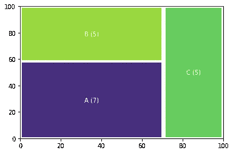

默认值，由作者生成

接下来，我们移除轴。做完那件事后，我身体上感觉平静多了。我们可以通过修改底层 Matplotlib 呈现中的 rcParams 字典来定制标签的文本颜色和文本大小。在这里，我调用 matplotlib 作为 mpl，并调整 font.size 和 font.color **键的**值**。**我还手动指定了我希望 Squarify 用来绘图的颜色列表。这个情节看起来干净多了！

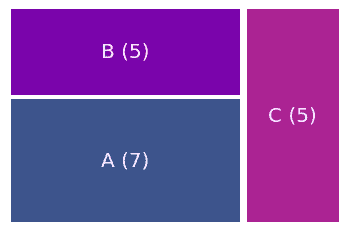

手动颜色和字体，由作者生成

现在，我们可能赶时间。如果我们不想手动选择颜色，我们可以从 Matplotlib 颜色图中随机选择一组颜色。然而，这些数字有些看起来很好，有些看起来真的很差。幸运的是，你可以尝试不同的随机种子，直到你得到你喜欢的颜色。这个还可以。

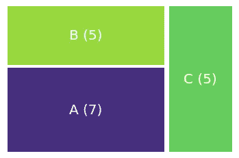

随机颜色，由作者生成

# **Matplotlib 彩色地图究竟是如何工作的？**

要了解底层色彩映射表是如何使用的，请参见下文。对于每个方块，我们可以使用 0 到 1 之间的任意数字来代替随机值。唯一的问题是列表中的数字应该是不同的。

使用 len(counts)=3 的组数，我们可以继续创建一个介于 0 和 1 之间的值的顺序列表，使用 1/3 的间距来保持每个值的不同。在 Out[9]的下面，显示出你得到一个 3 元素列表:0，0.33，0.66。

接下来，我们可以使用色图调色板将 I 的每个值映射到 RGBA 颜色值(红色、绿色、蓝色、不透明度)。Matplotlib 有许多[色彩映射表](https://matplotlib.org/stable/gallery/color/colormap_reference.html)可供选择。我使用了“等离子体”色图，这是 cmap 功能的一个参数。cmap 函数的作用是获取[0，1]之间的输入，并将其转换为 RGBA。红色、绿色、蓝色值的范围是[0，1],而不是您可能熟悉的[0，255]。这个结果产生了嵌套列表，我们称之为 mapped_list，它仍然包含 3 个顶级元素。每个元素都是一个 RGBA 元组。

最后，我们使用 mapped_list 作为 Squarify 函数中的颜色参数进行绘图。这表明我们可以使用色彩映射表，并且仍然可以对它们进行一定程度的控制。使用色彩映射表不需要猜测和检查的努力！

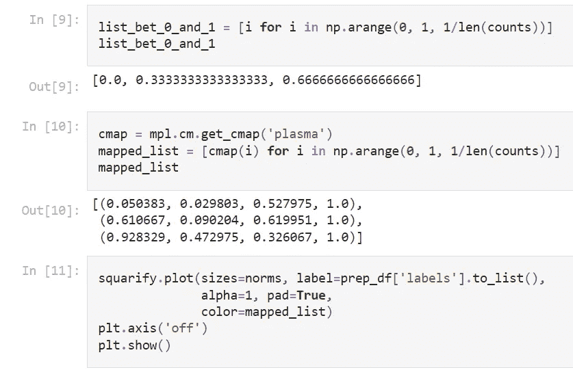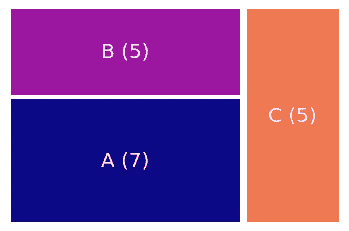

等离子色彩图，由作者生成

现在，对于任何适当的报告，我们需要添加一个标题。但是如果我们坚持使用默认选项，我们将会以这个不令人满意的占位符结束，因为图形的文本字体是白色的。如果我们改变字体颜色，我们最终会得到难看的标签文本。第二十二条军规！但是不要害怕，凯特在这里！

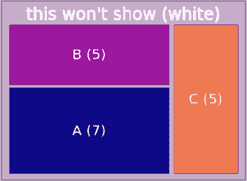

标题占位符，由作者生成

在我们在子图形中使用标题技术之前，我发现给一个单独的图形添加标题的最简单的方法是添加一个额外的文本框。我们可以定制对齐方式以使图形居中，并定制绘图顺序(zorder ),以确保它绘制在下方白色标题文本的顶部。

注意坐标。我们在位置(50，100)绘制标题框。坐标(0，0)映射到图的左下区域。(100，0)映射到图的右下区域。

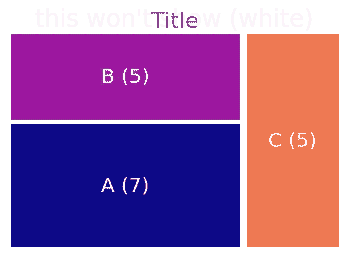

标题作为自定义文本添加，由作者生成

在我们继续进行子绘制之前，我想提醒大家注意一个事实，即有更多的定制选项可用。rcParams 在教程中不常用到，但是很容易访问！要找出可以定制的内容，只需调用 rcParams 字典的键:

```
mpl.rcParams.keys()
```

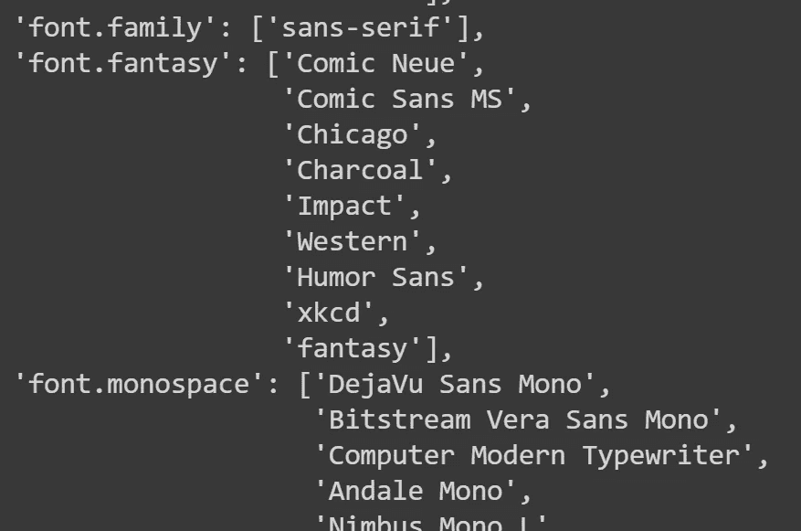

rcParams 中一些可用的自定义选项，由作者打印

# 用支线剧情升级

最后，使用 Squarify 最有用的方法是制作复杂的树形图。为了增加复杂性，通常需要将多个底层地图拼凑在一起。可以使用前面讨论的所有技术定制每个底层图形。我们将使用随机生成的 8 个矩形序列绘制 6 个单独的图。有多种方法可以自定义每个支线剧情。对于代码，点击[这里](https://gist.githubusercontent.com/katewall/df1d98801a44fb738d153eb4e23c7ea6/raw/bb3f50844ba53e877ef1dd9229404486b453839f/subplots1.py)只是这个数字，或[这里](https://github.com/katewall/medium_tutorials/blob/main/210219_Medium_Squarify_Matplotlib.ipynb)为整个笔记本。

## 图像支线剧情

1.  默认设置。
2.  手动指定颜色。这导致整个图形重复两种颜色。这对于艺术目的来说是有趣的，但是对于解释的目的来说可能是误导的。
3.  使用之前相同的技术指定颜色。
4.  按顺序添加标签。
5.  添加非标准化值。
6.  添加标签和值并更改字体大小。

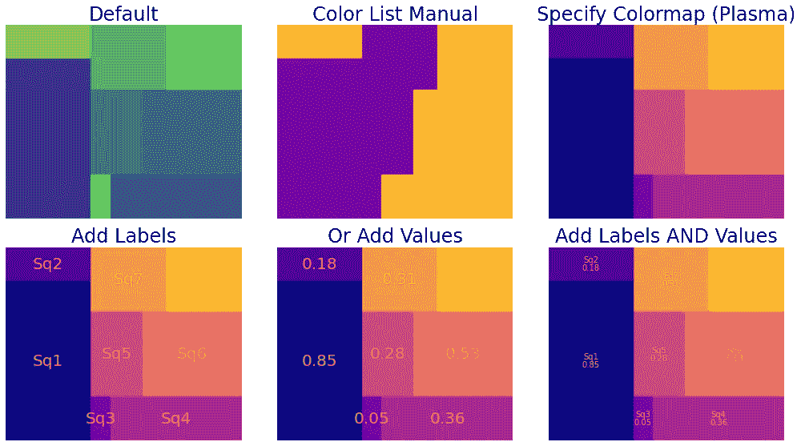

多个支线剧情使用 Squarify，由我生成

最后，你可以删除支线剧情和标题之间的空白来制作一个复合树形图！

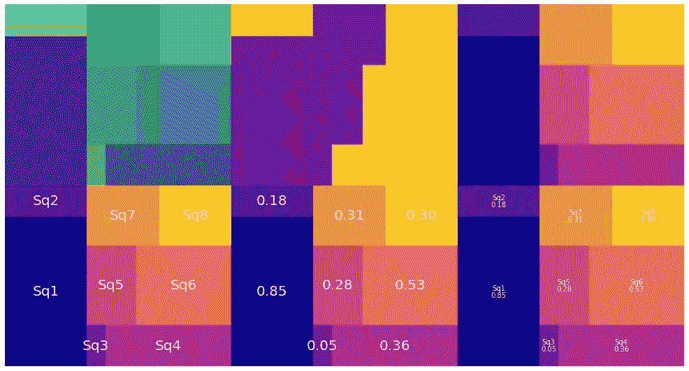

浓缩支线剧情，由我生成

作为我的最后一个技巧，女士们先生们，我使用了 [Seaborn color_palette](https://seaborn.pydata.org/generated/seaborn.color_palette.html) 而不是 [Matplotlib colormap](https://matplotlib.org/stable/gallery/color/colormap_reference.html) 来自动生成配色方案。Seaborn 通常包含比 Matplotlib 更专业的配色方案集合，我们可以使用 Squarify 轻松地使用它们！此外，我们可以通过调用颜色映射列表中的 np.flip()函数来更改颜色顺序的顺序(见第 18 行)。

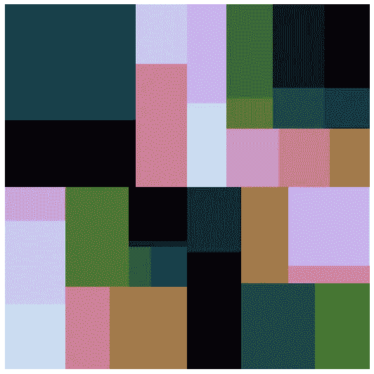

作者用 Seaborn 调色板生成的摘要图

本教程是一个练习(1)学习一个新的可视化工具和(2)使 matplotlib 不那么笨拙。如果您希望看到特定的定制，请在下面发表评论！Medium 的社区教程非常精彩，我的教程受到了像[这个](https://betterprogramming.pub/how-to-use-colormaps-with-matplotlib-to-create-colorful-plots-in-python-969b5a892f0c)这样的好例子的启发。

是时候绘制一张树状图了！

## 参考

1.  创作者[尤里·拉森](https://github.com/laserson)写了这个 Squarify 包。

喜欢这篇文章吗？下面更喜欢！

<https://www.linkedin.com/in/kate-wall/>  </professional-venn-diagrams-in-python-638abfff39cc>  </access-google-drive-using-google-colab-running-an-r-kernel-3736db7835>  </probability-distributions-for-beginners-d14f59aba2cb> 