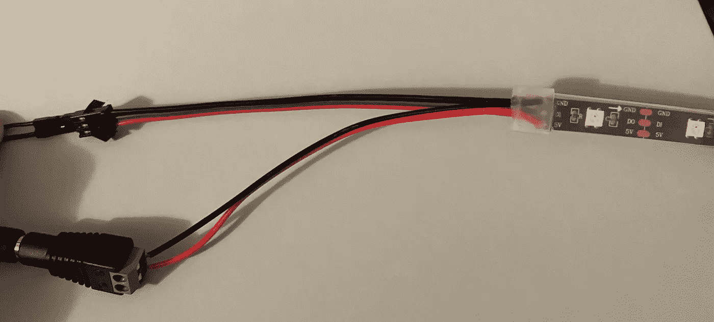
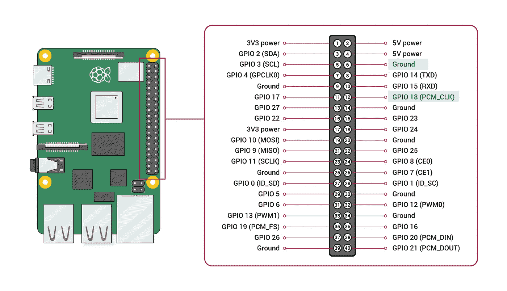

# 用 Python 编写圣诞灯程序

> 原文：<https://towardsdatascience.com/program-christmas-lights-with-python-2a6bfa243d71>

## 如何使用 Raspberry Pi 编写自定义 LED 灯光秀


照片由[塔利亚·鲁伊斯](https://unsplash.com/@thalia_s_ruiz?utm_source=medium&utm_medium=referral)在 [Unsplash](https://unsplash.com?utm_source=medium&utm_medium=referral) 上拍摄

假期已经正式开始，这意味着大量的购物、烘焙，当然还有装饰。家装商店里有许多不同形状、颜色和特殊效果的灯。但是你有没有想过用定制的颜色和动作来打造自己的节日灯呢？几行简单的 Python 代码让这一切成为可能。


图片作者。完整演示见结果部分。

这是我的第一个树莓派项目，我很高兴在假期前与你分享。我用树莓 Pi 来控制**可单独寻址的** LED 灯条。与典型的节日灯不同，这些灯条允许为每个 LED 定制输入。下面列出了这些材料的链接。

# 背景

WS2812B 发光二极管(LED)是可单独寻址的 LED，可以对单个 LED 进行编程。该条有 3 根电缆连接到每个 LED:

1.  负极电源线/地线(黑色)
2.  正极电源线(红色)
3.  数据线(绿色)

这种品牌的 LED 灯条分叉电源线(红色和黑色电缆)，以便更容易连接到单独的电源。即使最后有 5 条电缆，也只有 3 条路径。



图片作者。

该条的另一端有一个公连接器，允许串联添加其他 led 条。然而，如果没有足够的电力，添加更多的条带会导致过热。

# 材料

1.  [LED 灯](https://amzn.to/3UuMqUD)。我使用了两个 5 米长的 WS2812B 条。但是，任何 WS281X 指示灯都应该与 rpi-ws281x 库兼容。
2.  树莓派。我用的是树莓 Pi 3，但任何带有接地和 GPIO 18 引脚的树莓 Pi 都可以。
3.  [公母跳线](https://amzn.to/3B64QnW)
4.  [电源](https://amzn.to/3F2mV7n)
5.  [剥线器](https://amzn.to/3FpohdD)(可选)

# 布线方向

启动前，确保 Raspberry Pi 和外部电源均已断开。

1.  使用跨接电缆将 LED 灯条接地电缆(黑色)连接到 Raspberry Pi 上的接地引脚。下图使用引脚 6 作为接地。
2.  使用跳线将 LED 条形数据线(绿色)连接到 Raspberry Pi 上的 GPIO 18。在 Raspberry Pi 3 上，GPIO 18 是引脚 12。
3.  使用连接器将 LED 灯条连接到外部电源。你可能需要剥去电线上的一些绝缘层。
4.  打开树莓和外部电源。



图片来自[https://www . raspberry pi . com/documentation/computers/raspberry-pi . html](https://www.raspberrypi.com/documentation/computers/raspberry-pi.html)(CC BY-SA 4.0)。作者制作的亮点。

# 密码

以下说明假设 Raspberry Pi 安装了 Raspian 操作系统。在 Raspberry Pi 终端上运行代码。

我推荐使用[无头树莓 Pi 设置](https://medium.com/@thedyslexiccoder/how-to-remotely-access-a-raspberry-pi-on-a-mac-via-ssh-be285d418f54)，它将允许你远程访问树莓 Pi。然而，这不是必须的。

## 更新系统

1.  更新现有包

```
sudo apt-get update
```

2.在 Raspberry Pi 上安装 git

```
sudo apt install git
```

3.通过编辑以下文件停用音频

```
sudo nano /etc/modprobe.d/snd-blacklist.conf
```

4.将下面一行添加到打开的文件中。按 Ctrl-O 和 Ctrl-X 保存并关闭。

```
blacklist snd_bcm2835
```

5.使用 nano 编辑器打开配置文件。

```
sudo nano /boot/config.txt
```

6.使用 Ctrl-W 搜索文件。添加#来注释掉下面一行。

```
#dtparam=audio=on
```

7.重启 Raspberry Pi 以确保所有更改生效。

```
sudo reboot
```

## 安装和测试库

1.  克隆库。

```
git clone https://github.com/rpi-ws281x/rpi-ws281x-python.git
```

2.编辑测试文件中的输入参数。

```
sudo nano rpi-ws281x-python/examples/strandtest.py
```

我的设置包括两个 150 个发光二极管的条带，总共 300 个发光二极管。是我唯一需要改变的变量。

```
# LED strip configuration:
LED_COUNT = 300       # Number of LED pixels.
```

使用 Ctrl-O 和 Ctrl-X 保存并关闭文件。

3.测试设置！

```
sudo python3 rpi-ws281x-python/examples/strandtest.py
```

## 自定义灯光

为了定制我的灯，我从`rpi-ws281x-python`库中复制了`strandtest.py`来创建`xmas.py`。

```
# Change directory
cd rpi-ws281x-python/examples

# Copy strandtest.py and name copy xmas.py
cp strandtest.py xmas.py
```

这让我可以修改现有的功能并创建新的功能，而不用重写`strandtest.py`。在`xmas.py`中，我添加了一个功能，当键盘中断(Ctrl-C)或脚本运行完成时，所有的灯都将关闭。当运行完成时，脚本需要不到 4 个小时。

```
 #!/usr/bin/env python3

import time
from rpi_ws281x import PixelStrip, Color
import argparse
import numpy 

# LED strip configuration:
LED_COUNT = 300        # Number of LED pixels.
LED_PIN = 18          # GPIO pin connected to the pixels (18 uses PWM!).
# LED_PIN = 10        # GPIO pin connected to the pixels (10 uses SPI /dev/spidev0.0).
LED_FREQ_HZ = 800000  # LED signal frequency in hertz (usually 800khz)
LED_DMA = 10          # DMA channel to use for generating signal (try 10)
LED_BRIGHTNESS = 75  # Set to 0 for darkest and 255 for brightest
LED_INVERT = False    # True to invert the signal (when using NPN transistor level shift)
LED_CHANNEL = 0       # set to '1' for GPIOs 13, 19, 41, 45 or 53

# Define functions which animate LEDs in various ways.
def colorWipe(strip, color, wait_ms=50):
    """Wipe color across display a pixel at a time."""
    for i in range(strip.numPixels()):
        strip.setPixelColor(i, color)
        strip.show()
        time.sleep(wait_ms / 1000.0)

def theaterChase(strip, color, wait_ms=50, iterations=10):
    """Movie theater light style chaser animation."""
    for j in range(iterations):
        for q in range(3):
            for i in range(0, strip.numPixels(), 3):
                strip.setPixelColor(i + q, color)
            strip.show()
            time.sleep(wait_ms / 1000.0)
            for i in range(0, strip.numPixels(), 3):
                strip.setPixelColor(i + q, 0)

def candyCane(strip, red_start):
   for i in range(strip.numPixels()):
      strip.setPixelColor(i, Color(255,255,255))
   for i in range(strip.numPixels()):
      if i % 10 == red_start or i == 10:
         for j in range(i, i + 5):
            strip.setPixelColor(j, Color(255, 0, 0))
   strip.show()

def candyCaneMoving(strip, iterations):
   i = 0
   for iter in range(iterations):
      candyCane(strip,i)
      if i < 9:
         i += 1
      else: i = 0
      time.sleep(1)

# Main program logic follows:
if __name__ == '__main__':
    # Process arguments
    parser = argparse.ArgumentParser()
    parser.add_argument('-c', '--clear', action='store_true', help='clear the display on exit')
    args = parser.parse_args()

    try:
       # Create NeoPixel object with appropriate configuration.
       strip = PixelStrip(LED_COUNT, LED_PIN, LED_FREQ_HZ, LED_DMA, LED_INVERT, LED_BRIGHTNESS, LED_CHANNEL)
       # Intialize the library (must be called once before other functions).
       strip.begin()

       print('Color wipe animations.') 
       candyCaneMoving(strip, 3600) 
       colorWipe(strip, Color(127,127,127))

       LED_BRIGHTNESS = 255
       # Create NeoPixel object with appropriate configuration
       strip = PixelStrip(LED_COUNT, LED_PIN, LED_FREQ_HZ, LED_DMA, LED_INVERT, LED_BRIGHTNESS, LED_CHANNEL) 
       # Intialize the library (must be called once before other functions).
       strip.begin()
       theaterChase(strip,Color(127,0,0),1000,1000)
       theaterChase(strip,Color(0,127,0),1000,1000) 
       theaterChase(strip,Color(127,127,127),1000,1000) 
       colorWipe(strip, Color(255, 0, 0)) # Red wipe 
       time.sleep(600) 
       colorWipe(strip, Color(0, 255, 0)) # Green wipe 
       time.sleep(600) 
       colorWipe(strip, Color(0, 0, 0), 10)

    except  KeyboardInterrupt:
      colorWipe(strip, Color(0, 0, 0), 10)
```

## 计划任务

我想让我的灯每晚都亮着，不需要用户输入，所以我用 Cron 安排了一个任务。Cron 自带树莓 Pi Raspian 操作系统。

1.  在编辑器模式下打开 Cron 作业表。

```
crontab -e
```

选择一个编辑器。我推荐 nano。

2.将任务添加到文件中。

```
0 17 * * * sudo python3 ~/rpi-ws281x-pi/examples/xmas.py
```

Cron 作业遵循格式`[minute] [hour] [day of month] [month] [day of week] [command to execute]`。`*`表示任何值，因此 Cron 将对该字段中的所有值执行命令。上面的作业将在每月的每天下午 5 点(也就是 17:00)运行。

# 结果

xmas.py 中的函数演示

# 参考

"通过 Raspberry Pi 连接和控制 WS2812 RGB LED 灯."*树莓派教程。*[https://tutorials-raspberry pi . com/connect-control-raspberry-pi-ws 2812-RGB-led-strips/](https://tutorials-raspberrypi.com/connect-control-raspberry-pi-ws2812-rgb-led-strips/)

" Cron Jobs 和 Crontab 初学者指南." *PiMyLifeUp* 。[https://pimylifeup.com/cron-jobs-and-crontab/](https://pimylifeup.com/cron-jobs-and-crontab/)

# 结论

感谢您阅读我的第一个树莓 Pi 项目。如果您有任何问题，请联系我们或发表评论。我非常乐意帮忙。此外，我很想知道你希望未来的 LED 项目采用什么样的模式。

> 感谢您阅读我的文章。如果你喜欢我的内容，[关注我](https://medium.com/@katyhagerty19)或者[加入 Medium](https://medium.com/@katyhagerty19/membership) 。
> 
> 在 [LinkedIn](https://www.linkedin.com/in/katherine-katy-hagerty/) 、 [Twitter](https://twitter.com/HagertyKaty) 或 [Instagram](https://www.instagram.com/katyhagerty/) 上与我联系。
> 
> 欢迎所有反馈。我总是渴望学习新的或更好的做事方法。
> 
> 请随时留下您的评论或联系我 katyhagerty19@gmail.com。