# 项目管理的正确方式

> 原文：<https://towardsdatascience.com/project-management-the-right-way-57ce2d8b56bd>

## 使用这个现成的 Excel/Python 甘特图模板跟踪您的任务


团队合作就是一切(照片由兰迪·法特拍摄)

**背景:**

项目管理工具多如牛毛。但有时简单的解决方案就足够了，特别是如果他们将 Excel VBA 与 Python 结合起来，那么你就不必用大锤敲碎坚果(或花一大笔钱)。
项目管理工具的一个主要组成部分是根据项目的分配能力和完成情况来跟踪项目里程碑。此外，投入和评估应尽可能方便用户。在本文中，我们将看到一个简单的自行编程的解决方案是什么样子的。

**解决方案:**

首先，让我们看一下项目模板。打开文件后，我们被告知我们是当前唯一正在处理该文件的用户。

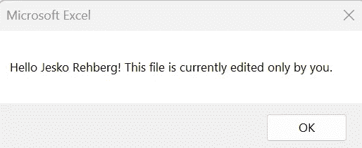

打开文件后的欢迎信息(图片由作者提供)

这一功能已通过 VBA (ThisWorkbook)实现。

```
Private Sub Workbook_Open()
Application.ScreenUpdating = False
Range(“r4”).Value = Date
If Range(“G2”).Value = “” Then
MsgBox (“Hello “ & Application.UserName & “! This file is currently edited only by you.”)
Range(“G2”).Value = Application.UserName & “ works on this file since “ & Time & “.”
Else
MsgBox (“Mrs/Mr “ & ActiveSheet.Cells(2, 7))
End If
Application.ScreenUpdating = True
End Sub
```

这个特性的原因是为了促进与同事的协作:因为这个模板还不是一个多客户机数据库应用程序，所以几个用户不能同时处理这个文件。这一需求的前景将在本文的最后提到。

首先，我们来看一下总体概况。

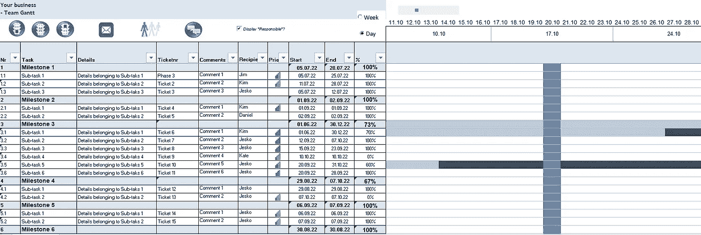

项目模板(图片由作者提供)

正如我们所看到的，模板基本上分为三个区域。

第一个是带有功能按钮的上部区域。

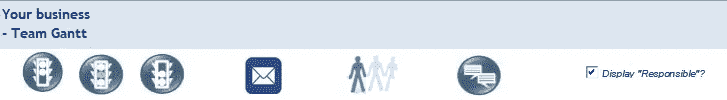

然后左边是项目概述。

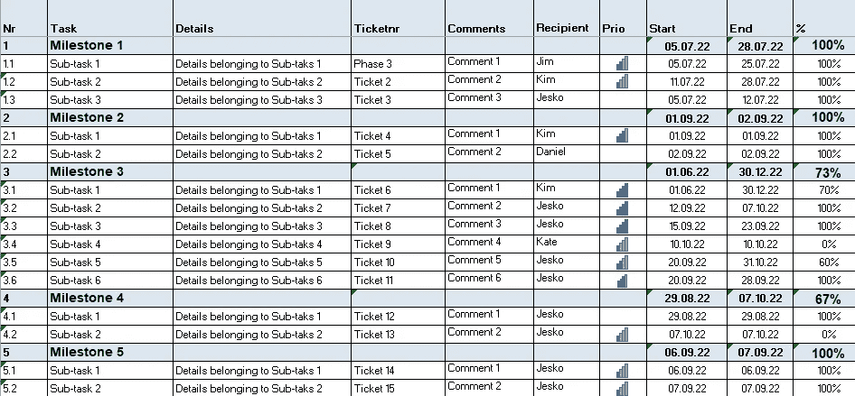

最后，右侧是相应的甘特图。


**项目概述**

此区域列出了各个里程碑，包括项目任务。除了几个自由文本注释栏，还可以通过搜索表单在 H 栏中选择项目经理。每当您单击 H 列时，就会弹出一个表单，启用字符串搜索以方便搜索和选择:

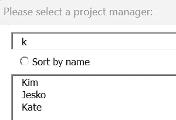

这一点已经在另一篇[文章](/high-scalable-fast-search-with-haystack-8b7bb103df8e)中详细解释过了。因此，这里不详细讨论其功能。

P 列包含存储优先级的可能性。通过双击该单元格，可以添加一个条，这样最多可以存储四个优先级条。

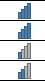

通过双击设置相关性(图片由作者提供)

这是最高优先级。再次双击或删除单元格会删除优先级栏，优先级可以从 0 再次增加。

另一个有趣的表格在 Q 和 r 列中。这表示子任务应该开始和结束的时间窗口。当您在此单元格中单击时，会出现一个日历。非常感谢 H. Ziplies，他最初创造了这个令人敬畏的日历形式。

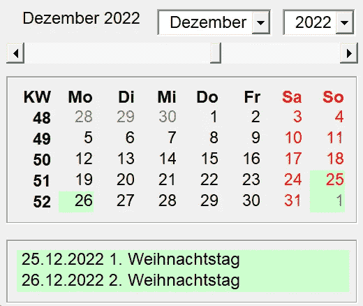

点击 Q 或 R 栏时会弹出日历表单(图片由作者提供)

日历表单背后的 VBA 代码主要由以下部分组成:

```
Private Sub UserForm_Activate() ‘ start instance
 For InI = 1900 To 2100
 Cbo_Jahr.AddItem InI ‘ Year input
 Next InI
 Cbo_Jahr.Tag = 1 ‘ so that Create at Change is not triggered
 Cbo_Jahr = Year(Date) ‘ Display of the current year
 Cbo_Jahr.Tag = “” ‘ so that create is triggered on change
 Lbl_Datum = Format(Date, “MMMM YYYY”) ‘ show current date show month and year
 For InI = 1 To 12 ‘ enter months
 Cbo_Monat.AddItem Format(DateSerial(Year(Date), _
 InI, 1), “MMMM”) ‘ enter month
 Next InI
 Cbo_Monat = Format(Date, “MMMM”) ‘ Display of the current month, the calendar is created
End SubPrivate Sub Cbo_Year_Change() ‘ Event when changing the selection
 If Cbo_Jahr.Tag = “” Then
 Erstellen DateSerial(Cbo_Jahr, _
 Cbo_Monat.ListIndex + 1, 1) ‘ create calendar
 End If
End SubPrivate Sub Cbo_Month_Change() ‘ Event when changing the selection
 If Cbo_Monat.Tag = “” Then
 Erstellen DateSerial(Cbo_Jahr, _
 Cbo_Monat.ListIndex + 1, 1) ‘ create calendar
 End If
End SubPrivate Sub Scb_Month_Change() ‘ Change event
 If Scb_Monat.Tag = “” Then
 Erstellen DateSerial(1900 + Val(Scb_Monat / 12), Scb_Monat — _
 Val(Scb_Monat / 12) * 12, 1) ‘ create calendar
 End If
End Sub
```

这款日历的突出特点之一是突出显示特定日期:

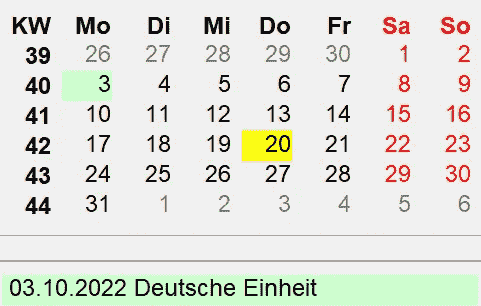

底部列出了公共假日的名称(图片由作者提供)

公共假日用绿色突出显示，当天用黄色突出显示，周末用红色突出显示。在这种情况下，假期是为德国设置的，但可以为任何国家定制:

```
Function PublicHoliday(Datum As Date) As String
 Dim J As Integer, D As Integer
 Dim O As Date
 J = Year(Datum)
 D = (((255–11 * (J Mod 19)) — 21) Mod 30) + 21 ‘ Easter calculation
 O = DateSerial(J, 3, 1) + D + (D > 48) + 6 — _
 ((J + J \ 4 + D + (D > 48) + 1) Mod 7)
 Select Case Datum
 Case DateSerial(J, 1, 1)
 PublicHoliday = “Neujahr”
 Case DateAdd(“D”, -2, O)
 PublicHoliday = “Karfreitag”
 Case O
 PublicHoliday = “Ostersonntag”
 Case DateAdd(“D”, 1, O)
 PublicHoliday = “Ostermontag”
 Case DateSerial(J, 5, 1)
 PublicHoliday = “Erster Mai”
 Case DateAdd(“D”, 39, O)
 PublicHoliday = “Christi Himmelfahrt”
 Case DateAdd(“D”, 49, O)
 PublicHoliday = “Pfingstsonntag”
 Case DateAdd(“D”, 50, O)
 PublicHoliday = “Pfingstmontag”
 Case DateSerial(J, 10, 3)
 If Datum > “01.01.1990” Then
 PublicHoliday = “Deutsche Einheit”
 Else
 PublicHoliday = “”
 End If
 Case DateSerial(J, 12, 25)
 PublicHoliday = “1\. Weihnachtstag”
 Case DateSerial(J, 12, 26)
 PublicHoliday = “2\. Weihnachtstag”
 Case Else
 PublicHoliday = “”
 End Select
End Function
```

S 列计算开始日期和结束日期之间的持续时间(以天为单位)。在 T 列中输入子项目的完成百分比，该百分比也显示在甘特图中。

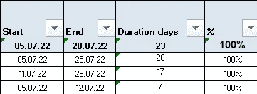

里程碑的完成——蓝色行——由存储的公式自动计算(图片由作者提供)

**甘特图**

后三列是甘特图的基本要素。该图表仅使用 Excel 格式，没有任何额外的 VBA。这里显示了从开始日期到计划结束日期的每个子项目。还显示了每个里程碑的总体完成情况。浅蓝色的区域被认为已经完成，而深蓝色反映了子项目尚未完成的百分比。垂直的蓝线表示当天。

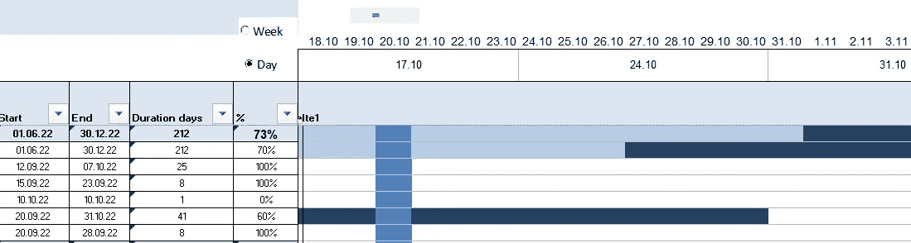

这张截图摄于 10 月 20 日(图片由作者提供)

您可以通过单选按钮在每日分组和每周分组之间切换。


日选择显示每日时间框架的甘特图。

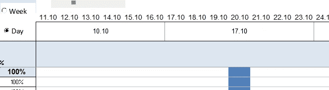

显示单日和分组周(图片由作者提供)

否则，如果您选择周，时间线将显示如下。

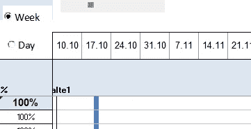

更低的粒度，仅显示周数(按作者分类的图片)

您也可以使用顶部的滑块滚动时间线。

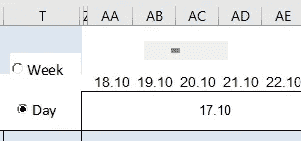

**上层丝带**

左起第一个按钮是绿色红绿灯，可以过滤不同的状态。

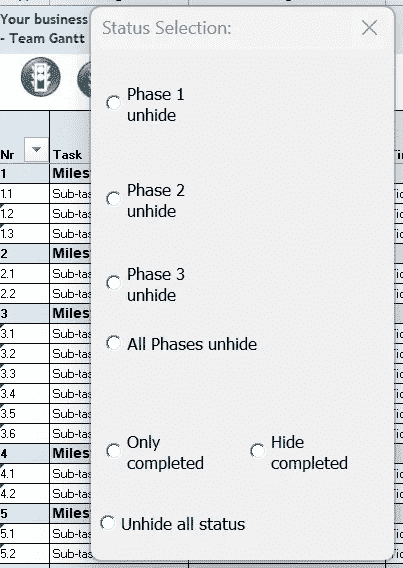

例如，如果您单击阶段 3 取消隐藏，将只显示这些状态。

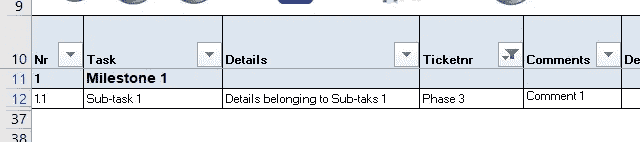

要再次显示所有内容，只需选择“所有阶段取消隐藏”。这基本上只是为了说明在与电子表格和一点点 VBA 的互动中你已经可以实现多少。

团队图标有助于查看由不同人员筛选的任务。

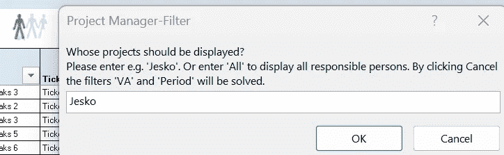

借助表格简化报告(图片由作者提供)

作为一种想法，您当然可以组合任意多的子查询。根据对评估有用的内容，额外的时间过滤器可能对您有意义。

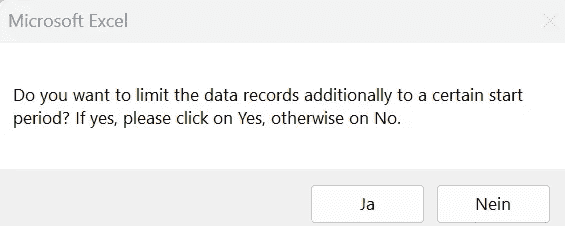

结合输入按钮的表单可以提高可用性

电子邮件按钮的想法是选择一个任务，并以方便的方式将数据发送给收件人。

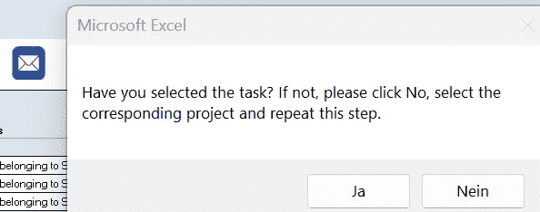

自动发送电子邮件(作者图片)

请注意，该解决方案是为 Lotus Notes 电子邮件客户端设计的。

```
Sub LotusMailSenden()
..MailDoc.body = “Hello “ & ActiveSheet.Cells(ActiveCell.Row, 7) & “,” & “<br><br>the task “ & ActiveSheet.Cells(ActiveCell.Row, 2) & “ (with the ID number: “ & ActiveSheet.Cells(ActiveCell.Row, 19) & “) starts at “ & ActiveSheet.Cells(ActiveCell.Row, 10) & “ and is due until “ & ActiveSheet.Cells(ActiveCell.Row, 11) & “.” & “<br>Priority is set to “ & ActiveSheet.Cells(ActiveCell.Row, 9) & “.” & “<br>Please …” & “<br><br>Kind regards,” & “<br>” & Application.UserName
..
```

> 如果您需要 VBA 或 Python 的 MS Office Outlook 等解决方案，请告诉我。

显示和隐藏列的复选框是用一个简单的 VBA 例程创建的。

```
Private Sub CheckBox1_Click()
If ActiveSheet.CheckBox1 = True Then
Columns(“H:H”).EntireColumn.Hidden = False
Else
Columns(“H:H”).EntireColumn.Hidden = True
End If
End Sub
```

由于团队注释可能非常重要，我们将更仔细地看一下实现。点击语音气泡图标将打开此表单。

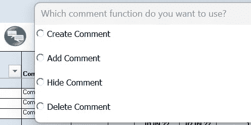

评论有助于更好地跟踪项目(图片由作者提供)

所以你可以输入评论..

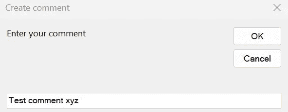

..这将自动添加用户和时间戳:

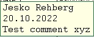

任何附加的评论也是如此，因此您可以获得所有评论的历史记录。

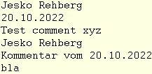

这是这些注释功能的 VBA 代码:

```
Sub KommentarErfassen()
Dim Kom As Comment
Dim S As String
S = InputBox _
 (“Enter your comment”, “Create comment”)
If S = “” Then Exit Sub
Set Kom = ActiveCell.AddComment
Kom.Text Application.UserName & Chr(10) _
 & Date & Chr(10) & S
With Kom.Shape.TextFrame
 .Characters.font.Name = “Courier”
 .Characters.font.Size = 12
 .AutoSize = True
End With
End SubSub KommentareErgänzen()
Dim sAlt As String
Dim sNeu As String
sNeu = InputBox _
(“Add a comment”, “Add comment”)
If sNeu = “” Then Exit Sub
With Selection
 On Error Resume Next
 sAlt = .Comment.Text
 If sAlt = “” Then .AddComment
 sNeu = sAlt & Chr(10) & Application.UserName _
 & Chr(10) & “Kommentar vom “ & Date & _
 Chr(10) & sNeu & Chr(10)
 .Comment.Text sNeu
 .Comment.Visible = True
 .Comment.Shape.TextFrame.AutoSize = True
End With
End Sub
```

我们看到，您已经可以从 VBA 的 Excel 中获益良多。然而，在某个时刻，你会达到极限。幸运的是，有了 Python，VBA 女士的局限性就不复存在了。在另一篇文章中，我们已经学习了如何使用 Python 充分利用电子表格。因此，在本文中，只给出了一个非常简单的使用 Python 进行扩展的例子。例如，让我们使用 Python 从 k 列创建项目类别的单词云。

```
from wordcloud import WordCloudimport matplotlib.pyplot as plttext = ‘Project Category A Project Category B Project Category A Project Category C Project Category A Project Category C Project Category B Project Category F Project Category A Project Category E Project Category A Project Category C Project Category D Project Category E Project Category E Project Category F Project Category A Project Category G’wordcloud = WordCloud().generate(text)plt.imshow(wordcloud, interpolation=”bilinear”)plt.show()
```

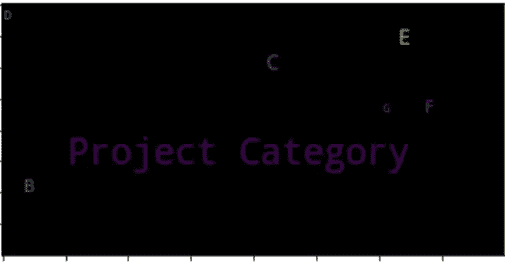

当然不是最有用的可视化，但它应该只为我们提供一个基本的想法，对不对？(图片由作者提供)

我们将使用 Python 来添加真正的数据库功能，同时在另一篇文章中仍然使用这个 Excel 模板作为前端。在那之前，你可以从我的 Github [库](https://github.com/DAR-DatenanalyseRehberg/ProjectManagementGanttVBA)下载 Excel 项目管理模板。

**结论:**

我们已经看到，如果你只懂一点点编程，你已经可以用简单的方法做非凡的事情了。在下一篇文章中，我们将借助 Python 将这个 Excel 模板扩展到一个真实的数据库应用程序。

在此之前，非常感谢您的阅读！希望这篇文章对你有帮助。请随时在 [LinkedIn](https://de.linkedin.com/in/jesko-rehberg-40653883) 、 [Twitter](https://twitter.com/DAR_Analytics) 或[工作室](https://jesko-rehberg.medium.com/virtual-reality-vr-for-education-a532aa5b6272)与我联系。

[](https://jesko-rehberg.medium.com/membership) [## 通过我的推荐链接加入 Medium-Jesko Rehberg

### 阅读杰斯科·雷伯格(以及媒体上成千上万的其他作家)的每一个故事。您的会员费直接支持…

jesko-rehberg.medium.com](https://jesko-rehberg.medium.com/membership)