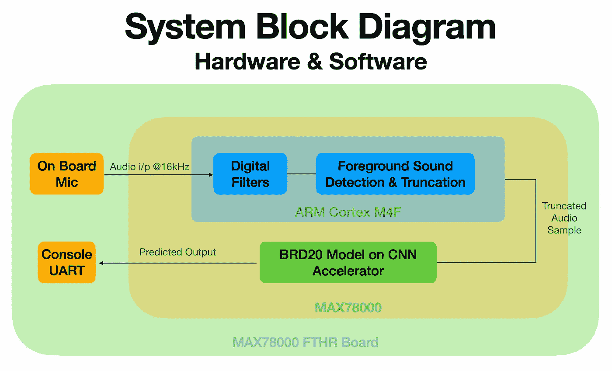
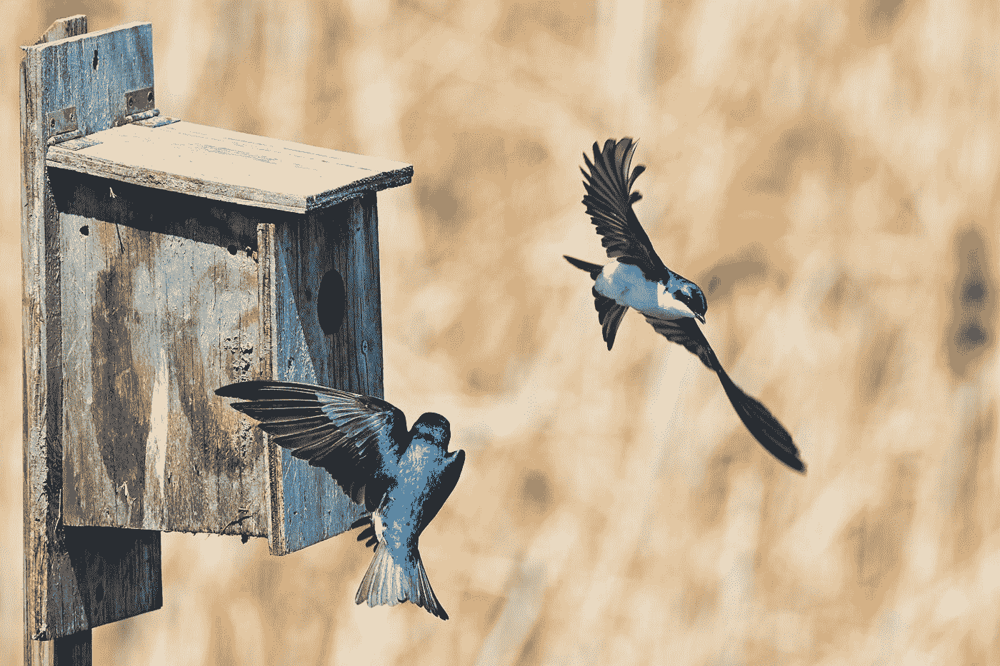
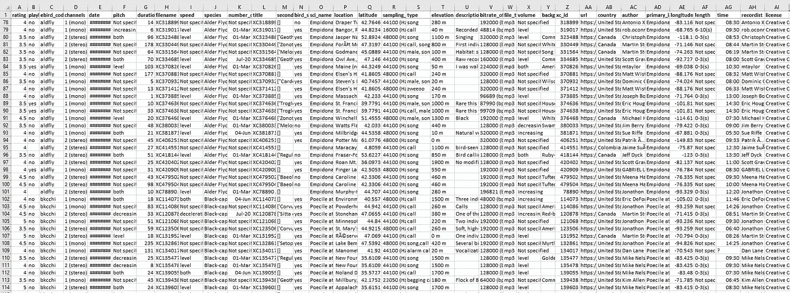
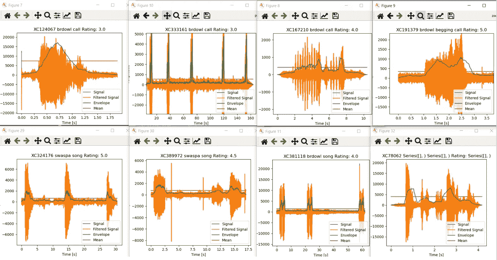

# project OrnithoWav——利用深度学习进行鸟类物种识别

> 原文：<https://towardsdatascience.com/project-ornithowav-bird-species-identification-using-deep-learning-2457f456fc22>

## 使用超低功率深度学习的可扩展的鸟类多样性遥感

**鸟类多样性是评估环境变化的常用指标，并且越来越重要。在这个项目中，我们使用** [**MAX78000**](/how-to-run-a-deep-neural-network-on-a-aa-battery-for-a-week-75ac6247198e) **根据鸟类的鸣叫声对它们进行检测和分类。从而能够遥感鸟类多样性**

由于气候变化及其对动物的生态影响，鸟类多样性监测变得越来越重要。在过去的几年里，基于深度学习的方法在减少专家劳动密集型鸟类识别过程方面显示出了希望。康奈尔大学基于 157 层 ResNet 的鸟网是目前该领域最先进的技术，可以识别近 1000 种不同的鸟类[1]。然而，该模型的实现仅限于高带宽互联网可用的区域，因为该模型需要在云中进行评估。

> 提议的解决方案是基于 [KWS-20 模型](https://www.maximintegrated.com/en/design/technical-documents/app-notes/7/7359.html)的简化 CNN，根据声音和叫声识别 20 种不同的鸟类。

系统框图(图片由 Kenneth Joel 提供)

运行在超低功耗 MAX78000 上的 PoC 可以在非常偏远的地方进行鸟类监测，而不必担心高带宽连接或大电池。它也可以被那些想要跟踪拜访他们家或农场的鸟类的观鸟者使用。

照片由 [Jongsun Lee](https://unsplash.com/ja/@sarahleejs?utm_source=medium&utm_medium=referral) 在 [Unsplash](https://unsplash.com?utm_source=medium&utm_medium=referral) 上拍摄

这里有一个项目执行的详细演练，包括 4 个阶段:
1。文献综述&开源数据集识别
2。数据工程
3。模型训练&使用 ai8x 的 C 代码合成——训练&ai8x——合成库
4。使用测试集中的音频样本对硬件进行测试。

**第一阶段:文献综述&开源数据集识别**

康奈尔鸟类学实验室是这一领域的一个活跃的研究小组，定期发表论文，并在 ka ggle(BirdCLEF 2021:[https://www.kaggle.com/c/birdclef-2021,](https://www.kaggle.com/c/birdclef-2021,)CBL 2020:【https://www.kaggle.com/c/birdsong-recognition/overview】T2 举办比赛

这些出版物和 kaggle 数据集为这个项目奠定了坚实的基础。

赢得这些竞争的网络非常庞大和复杂，对于我们的项目，我们使用了这个数据集的子集，并通过用鸟替换单词来重新训练来自 Maxim Integrated 的 [KWS-20 模型(ai85kws20)。](https://github.com/MaximIntegratedAI/ai8x-training)

然而，一个主要的限制是，所有这些数据的标签都很弱，并且没有按照不同的长度、质量和采样频率进行标准化，如下图所示:

元数据(肯尼斯·乔尔截图)

**第二阶段:数据工程**

这是最具挑战性的阶段。
前面提到的大部分数据都来自这一个资源:[https://www.xeno-canto.org/](https://www.xeno-canto.org/)(知识共享许可)
本网站上的数据是由世界各地的观鸟者收集的，因此样本的质量会有所不同。采样率没有标准化，有时鸟的声音不是很清晰。每只鸟还可以发出多种不同的叫声、声音和警报，增加了复杂性。

为了标准化数据集并使其类似于 KWS 数据集，采取了两个步骤:
1 .将 mp3 转换为 wav，并将所有数据重新采样为 16kHz(与 KWS 数据集相同，鸟类叫声的频率通常在 1-8 khz 之间，因此 16k 足够了):参考 code convert.py 和 convert16k.py
2。将音频分割成 1 秒的片段:数据集中的记录长度从 1.2 秒到 900 秒不等，一个记录中有 1 到 100 个相关的鸟类声音。编写一个处理脚本，首先过滤，然后识别并提取有用的 1 秒长的片段。请参考代码 python_slicer.py 和下图，直观了解该算法的工作原理。
注意:代码 convert16k.py 和 python_slicer.py 可以在文件夹 python-code.zip 中找到

音频分段(python_slicer.py)照片由 Kenneth Joel 拍摄

这一过程的结果是一个 79025 个独特样本的数据集，每只鸟有 1000-4000 个样本，总共 20 只独特的鸟。请注意，这些数据在分段后没有被手动清理。

**阶段 3:模型训练&使用 ai8x 的 C 代码合成——训练&ai8x——合成库**

  

一旦数据准备好了，只需要对训练脚本做一些修改来训练新数据，步骤如下:
-用新数据更新数据文件夹
-从 kws20.py (__extract_archive 函数)
-更新类数组和字典(kws20.py 中的多个位置)
参考目录/brd20 获取更新的代码。

运行脚本 train.sh，但是将历元数减少到 50。
使用的网络:ai85net-kws20.py 中的 ai85kws20net。

我们发现网络在 50 个周期后开始过度训练，因此我们停止了训练过程。
以下图像记录了训练输出:
- PNG 文件 e1、e10、e20、e30、e40 和 e50 显示了训练期间混淆矩阵的进展
- PNG 文件 eval 和 test 显示了训练后评估脚本和测试运行的结果。
-tensorboard-plots.png 显示了张量板控制台的输出

然后按照标准合成程序，使用 ai8x-合成文库合成该模型。合成代码可以在[Synthesized-C-Code.rar](https://github.com/Kenneth-Joel/Ornithowav/tree/main/Synthesized-C-Code)中找到

**阶段 4:使用测试集中的音频样本在硬件上进行测试。**

然后使用 KWS20 代码库作为参考，将代码闪存到 MAX78000 羽毛板上。对类别标签进行了适当的更改。
通过笔记本电脑扬声器播放测试音频。
相同的演示可以在下面的[视频](https://youtu.be/f-ShF_WkPHo)中找到:

项目演示视频

请参考 [brd20_demo](https://github.com/Kenneth-Joel/Ornithowav/tree/main/brd20_demo) (基于 kws20_demo)以便能够在您自己的板上运行项目。还包括视频演示中使用的[测试样本](https://github.com/Kenneth-Joel/Ornithowav/tree/main/Test%20Samples%20Used%20in%20Video%20Demo)。不需要额外的硬件来测试这个代码，因为我们已经使用了板载麦克风。

**硬件设计**

我们已经基于 MAX78000FTHR 原理图构建了[定制硬件](https://github.com/Kenneth-Joel/Ornithowav/tree/main/Hardware%20Design%20Files)。对设计的主要改变是
1。移除所有视频相关硬件。
2。增加了 32MB 闪存，用于存储收集的音频数据，并随着时间的推移提高检测精度。
3。具有成本效益的 BoM 和 PCB 设计有助于简化制造和扩大规模。

**未来范围:**
-清理数据集:生成的数据集是纯基于代码的，没有手动清理。由于 xeno-canto 数据有时会因大量背景噪音而质量不佳，人工清理和标记可以大大提高准确性。
-增强数据集:更多的鸟类，更多的样本，通过添加人类和非鸟类动物的声音来改进“未知”类别。
-更大的输入尺寸:将输入长度从 1 秒增加到 2.5 秒可以提高精确度。[3]
-神经架构搜索:由于资源限制，没有进行这么多的研究。希望在下一个
-改进硬件:这个项目不需要额外的硬件，因为板载麦克风已经足够了。然而，我们有理由相信，更好的话筒可以带来更好的效果。由于这是一个遥感解决方案，电池组和 GSM 模块也可以增加价值，使其更易于部署。

**P.S.** 这是一个爱好项目，没有商业意图，但有很大的社会影响潜力。我已经分享了我为这个项目编写和修改的所有源代码，并将非常兴奋地支持想要继续这项工作的人。随意伸手！不幸的是，重新采样和切片的数据集太大，无法上传，但我很乐意分享。

> **参考文献:**
> 【1】斯特凡·卡尔，康纳·m·伍德，马克西米利安·艾布尔，霍尔格·克林克，
> BirdNET:鸟类多样性监测的深度学习解决方案，
> 生态信息学，
> 第 61 卷，2021，101236，ISSN 1574–9541，
> https://doi.org/10.1016/j.ecoinf.2021.101236.
> (https://www . science direct . com/science/article/pii/s 157495412100021

## 概念验证的演示视频

## Github 链接

 