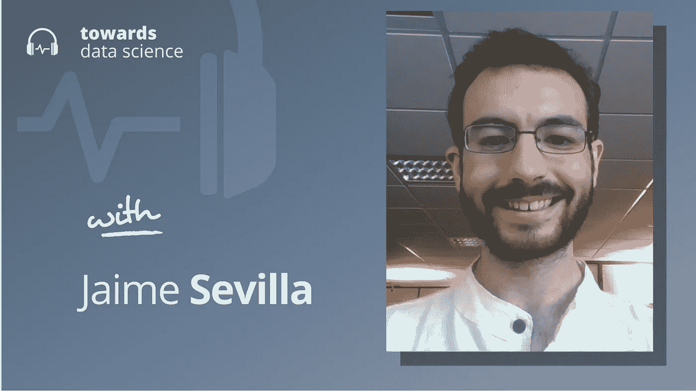

# 从计算趋势预测人工智能进展

> 原文：<https://towardsdatascience.com/projecting-ai-progress-from-compute-trends-d8c2af025d30>

## [播客](https://towardsdatascience.com/tagged/tds-podcast)

## 杰米·塞维利亚论变革性人工智能和普通智能的时间线

[苹果](https://podcasts.apple.com/ca/podcast/towards-data-science/id1470952338?mt=2) | [谷歌](https://www.google.com/podcasts?feed=aHR0cHM6Ly9hbmNob3IuZm0vcy8zNmI0ODQ0L3BvZGNhc3QvcnNz) | [SPOTIFY](https://open.spotify.com/show/63diy2DtpHzQfeNVxAPZgU) | [其他](https://anchor.fm/towardsdatascience)

*编者按:TDS 播客由杰雷米·哈里斯主持，他是人工智能安全初创公司墨丘利的联合创始人。每周，Jeremie 都会与该领域前沿的研究人员和商业领袖聊天，以解开围绕数据科学、机器学习和人工智能的最紧迫问题。*

机器学习中有一个想法，我们在 AI 中看到的大部分进步并不来自于模型架构的新算法。相反，一些人认为，进步几乎完全来自扩大计算能力、数据集和模型规模——除了这三个因素，其他什么都不重要。

透过这个镜头，人工智能的历史变成了处理能力和计算预算的历史。如果这被证明是真的，那么我们可能能够通过研究计算能力的趋势及其对人工智能发展的影响来预测人工智能的进展。

这就是为什么我想与独立研究员兼人工智能预测者 Jaime Sevilla 交谈，他是剑桥大学存在风险研究中心的附属研究员，在那里他从事技术预测，特别是理解人工智能的趋势。他的工作在很多很酷的地方被引用，包括我们的数据世界，他使用他的团队的数据整理了一份关于计算趋势的报告。在这一集的 TDS 播客中，Jaime 和我一起谈论了计算趋势和人工智能预测。

以下是我在对话中最喜欢的一些观点:

*   詹姆的工作包括预测人工智能的趋势，以估计我们何时可能达到被称为变革性人工智能(TAI)的人工智能能力水平。“太”大致是这样一个阶段，在这个阶段，人工智能非常强大，通常能够触发一个类似于工业革命的过程，而工业革命对人类文明的影响是深远的，完全不可预测的。有趣的是，TAI 的确切定义可能并不重要，因为研究人员和预测者的普遍共识是，当达到 TAI 这样的阶段时，技术进步将会如此之快，以至于即使是相当大的能力差异也会在很短的时间内被分开。因此，关于如何精确定义 TAI 的分歧很可能导致估计值只相差几年，而不是像工业革命那样相差几十年或几个世纪。
*   詹姆的工作确定了人工智能历史上的三个不同时代。首先，人工智能的进步是由预算相对固定的学术实验室推动的。尽管如此，由于摩尔定律，在此期间，计算能力每 20 个月就会变得便宜一倍，因此实验室往往每两年将计算使用量翻一番。但在 2010 年左右，事情开始发生变化:深度学习显示出解决视觉和自然语言处理中各种问题的真正潜力——但深度学习是高度计算密集型的。结果，公司开始在人工智能开发上投入越来越多的资源，因此也是在计算上。值得注意的是，詹姆认为这实际上在 AlexNet(深度学习的典型和广受欢迎的“启动”时刻)之前就开始了。这个深度学习时代给我们留下了令人印象深刻的系统，用于视觉和玩游戏等多种多样的任务，但它们仍然无法完全破解语言生成。正如 GPT-3 戏剧性地显示的那样，通往更好的语言模型的道路将是第三个扩展阶段——詹姆认为这一趋势始于 2015/2016 年的某个时候，比 GPT-3 早了五年。
*   关于计算投资将如何转化为新的人工智能能力，以及我们何时能达到 TAI，有很多争论。一种方法是观察生物智能，并尝试估计有多少计算能力用于创造人脑。有几种方法可以做到这一点:例如，你可以想象估计一个人从出生到成年需要进行的计算次数，或者估计数十亿年前大自然从无生命物质进化成人类大脑所消耗的计算量。这些被称为人工智能的“生物锚”。
*   Jaime 指出了计算趋势的两个主要驱动因素。第一个本质上是摩尔定律:计算能力正以指数方式变得越来越便宜，随着人类想出新的方法来挤压更多的处理能力或更少的物质，每 20 个月成本就会降低两倍。第二个驱动因素是企业对计算的投资:随着企业认识到人工智能的价值，以及处理能力在其发展中发挥的关键作用，他们一直在加速向计算投入越来越多的资源。
*   这第二个驱动因素目前是最重要的，肯定会导致近年来企业人工智能预算的暴力扩张，但尚不清楚这些投资是否能以目前的速度无限增长。Jaime 估计，这一预算增长阶段可能会在十年结束时结束，因为与人工智能相关的计算在企业预算中的比例非常大。也就是说，除非人工智能相关的收入增长足够快，以维持它的运行，这也是一种明显的可能性。

你可以在这里的 Twitter 上关注杰米，或者在这里关注 T2。

## 章节:

*   0:00 介绍
*   计算的两点趋势
*   4:30 变革的人工智能
*   13:00 工业应用
*   19:00 GPT 三号和缩放
*   25:00 两篇论文
*   33:00 生物锚
*   项目的时间安排
*   43:00 权衡
*   47:45 总结