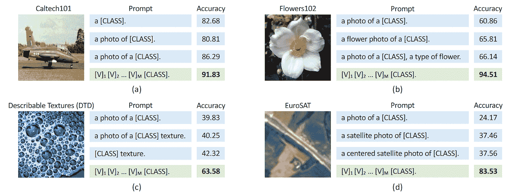
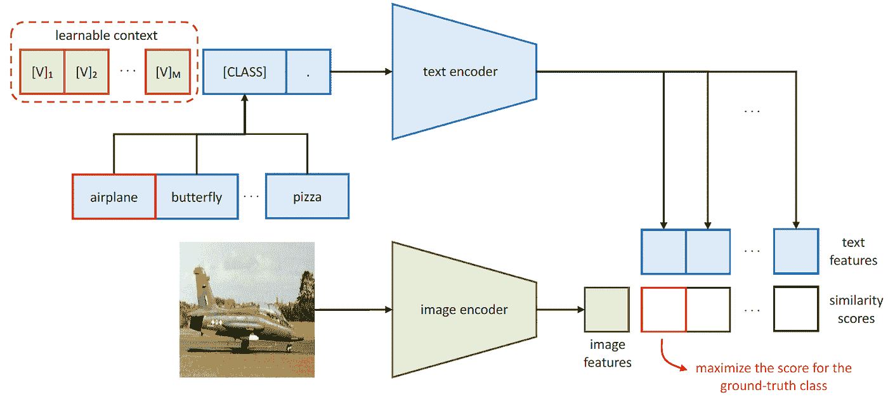
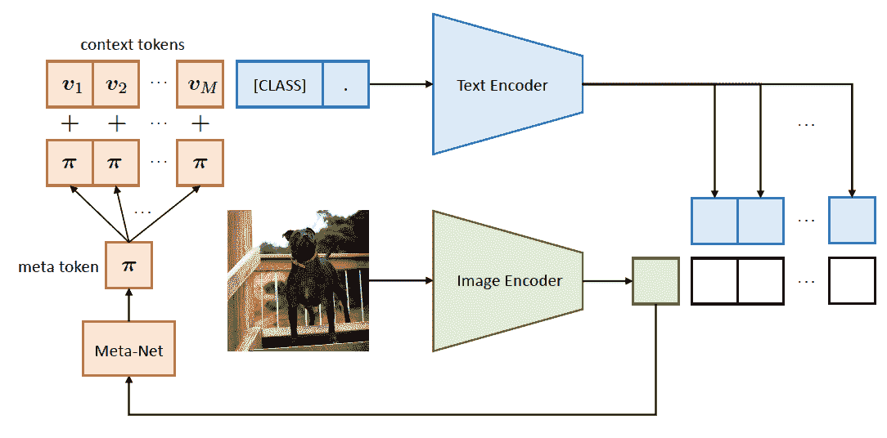
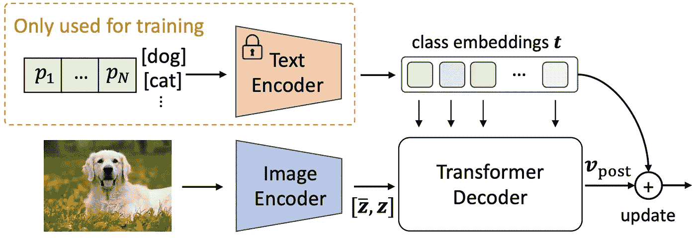
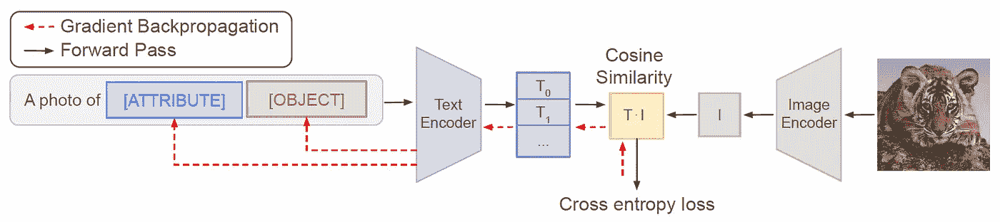
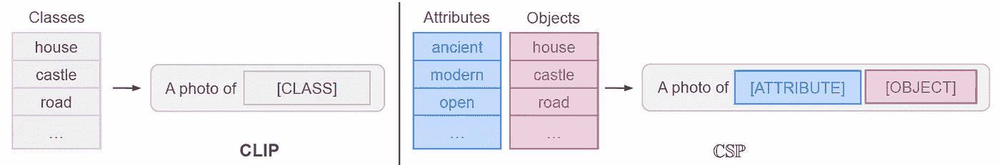
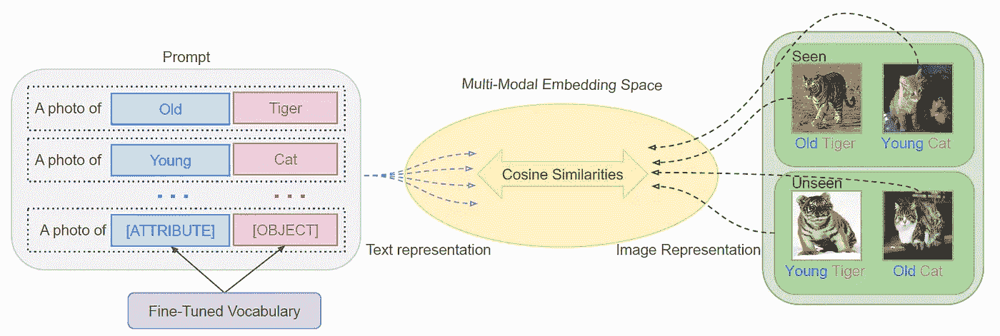
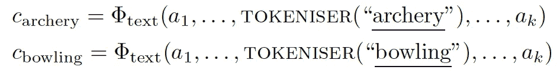
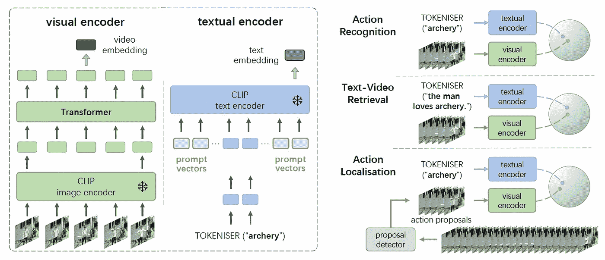

# 视觉语言微调中的即时上下文学习

> 原文：<https://towardsdatascience.com/prompt-context-learning-in-vision-language-fine-tuning-3608e39ebcaf>

## 用于有效模型适应的参数有效方法

照片由[马克西姆·伯格](https://unsplash.com/@maxberg?utm_source=medium&utm_medium=referral)在 [Unsplash](https://unsplash.com?utm_source=medium&utm_medium=referral) 拍摄

更新:

【2022 年 9 月 27 日】追加[CSP](https://arxiv.org/pdf/2204.03574.pdf)

【2022 年 9 月 29 日】追加 [*V-VL*](https://arxiv.org/pdf/2112.04478.pdf)

视觉语言模型已经在计算机视觉领域产生了影响。通过图像-文本对之间的对齐学习，训练的图像编码器能够具有少量/零镜头学习能力，这可以以数据有效的方式实现快速模型适应。感兴趣的读者可以参考我以前的文章，了解视觉语言模型和剪辑的一般介绍:

</contrastive-pre-training-of-visual-language-models-848dd94c881b>  

在下游视觉任务中仅利用图像编码器的缺点是来自文本编码器的提示信息被放弃。文本编码器提供即时嵌入，这有助于下游视觉任务的性能。因此，通过在下游任务的微调中协作两个编码器，我们可以研究图像-文本嵌入之间的交互，并理解它们在有效的模型适应中的有效性。

有效的模型适应可以通过两种方式实现:数据有效和参数有效。这两种方法都通过减少相关资源(标记数据和模型参数)来减轻模型训练负担。前者可以帮助实现少/零镜头学习，而后者可以通过只训练总参数的一小部分来实现高性能。**即时语境学习兼具两者优势**。

提示上下文学习是一种微调**提示向量**的方法，以实现视觉语言模型的高效模型适应。**如果没有学习，提示上下文是由人类创建的，并且最优性是未知的**。在这篇文章中，我将总结一些最近在即时语境学习方面的成就。

## CoOp 和 CoCoOp

([人类创建的与学习的提示上下文](https://arxiv.org/pdf/2109.01134.pdf))

让我们看看上面的图片。在即时上下文学习的帮助下，各种评估数据集的准确性都有很大提高。特别是对于一些专门的数据集，例如 EuroSAT，精确度惊人地从大约 30 增加到超过 80。结果来自于 [CoOp](https://arxiv.org/pdf/2109.01134.pdf) 论文，模型架构如下:

( [CoOp 建筑](https://arxiv.org/pdf/2109.01134.pdf)

CoOp 是最早的即时上下文学习架构。CoOp 和 CLIP 之间唯一区别是左上角的部分:**可学习上下文**。在微调过程中，只有这部分通过反向传播进行更新。很简单但是很有效！

( [CLIP vs. CoOp vs. CoCoOp](https://openaccess.thecvf.com/content/CVPR2022/papers/Zhou_Conditional_Prompt_Learning_for_Vision-Language_Models_CVPR_2022_paper.pdf) )

然而，CoOp 的一个缺点是泛化能力差，这是由于学习类的**过拟合**。如上所示，在对看不见的类(如火车铁路)进行评估时，准确度会下降。*这很有趣，因为*在 CoOp 中冻结的文本编码器，当输入句子由人类创建的提示上下文和看不见的类名组合时，具有很强的零触发泛化能力，如 [CLIP](https://arxiv.org/pdf/2103.00020.pdf) 论文所示。**但是 CLIP 的零镜头概化对于已学习的提示上下文并不保留**。

( [CoCoOp 架构](https://openaccess.thecvf.com/content/CVPR2022/papers/Zhou_Conditional_Prompt_Learning_for_Vision-Language_Models_CVPR_2022_paper.pdf))

如上所示，同一组作者提出了 [CoCoOp](https://openaccess.thecvf.com/content/CVPR2022/papers/Zhou_Conditional_Prompt_Learning_for_Vision-Language_Models_CVPR_2022_paper.pdf) 作为 CoOp 的扩展，以恢复原始剪辑的零镜头可推广性。他们通过使用每个输入图像作为即时上下文学习的条件来实现它。编码图像嵌入通过*元网*、*、*两层瓶颈子网，生成条件元令牌 *π、*，添加到每个上下文令牌中。在训练期间，只有*元网*和上下文令牌向量用反向传播进行微调。

在推理过程中，不可见类的图像嵌入与学习到的上下文标记融合，以动态生成文本嵌入**。由于这种动态文本嵌入包括来自相应的看不见的类图像的信息，所以它更有可能与相应的图像嵌入对齐，并且提高零拍摄性能。**

**与 CoCoOp 相反，CoOp 在没有图像调节的情况下学习提示上下文，这导致了**静态**提示上下文。因此，在零镜头推理过程中，由于**过度拟合**提示上下文，而提示上下文对输入的看不见的类别图像是不可知的，所以性能会大大下降。回想一下，在 CLIP 中，人为设计的提示上下文是*中性*，不能过拟合。这可能是 CLIP 具有很强的零镜头泛化能力的原因之一。**

## **DenseCLIP**

**今年 CVPR 与 CoCoOp 的一个平行作品是 [DenseCLIP](https://openaccess.thecvf.com/content/CVPR2022/papers/Rao_DenseCLIP_Language-Guided_Dense_Prediction_With_Context-Aware_Prompting_CVPR_2022_paper.pdf) 。与 CLIP 和(Co)CoOp 使用全局图像嵌入与图像分类中的相应文本嵌入对齐不同，DenseCLIP 旨在通过利用像素级图像嵌入来提高下游*密集*任务的性能。**

****

**( [DenseCLIP 架构](https://openaccess.thecvf.com/content/CVPR2022/papers/Rao_DenseCLIP_Language-Guided_Dense_Prediction_With_Context-Aware_Prompting_CVPR_2022_paper.pdf))**

**如上所示，图像编码后，我们有 2D 像素级图像嵌入。在 CLIP 和(Co)CoOp 中，这些 2D 像素级图像嵌入被汇集成 1D 嵌入向量，表示输入图像的全局特征。在 DenseCLIP 中，这些 2D 嵌入被保留用于下游密集任务的性能改进，例如语义分割。2D 嵌入的每个像素，即 1D 特征向量，也与相应的 1D 文本嵌入相乘，以获得像素-文本得分图，其中较高(较低)的得分表示较高(较低)的相似性。像素级得分图可以**连接**到 2D 图像嵌入，以提高下游微调的性能。**

**2D 嵌入通过一个转换器作为条件来生成动态*提示上下文嵌入，如在 CoCoOp 中一样。作者使用交叉注意来交互图像和文本嵌入，其中文本嵌入充当*查询*，图像嵌入充当*键和值*。在交互之后，使用原始和交叉注意编码的文本嵌入的总和。该过程如下所示:***

****

**([dense clip 中的上下文感知提示](https://openaccess.thecvf.com/content/CVPR2022/papers/Rao_DenseCLIP_Language-Guided_Dense_Prediction_With_Context-Aware_Prompting_CVPR_2022_paper.pdf)**

**要学习的参数是 transformer 解码器中的提示上下文向量和交叉注意模块。与(Co)CoOp 和 CLIP 中文本嵌入与图像级嵌入对齐不同，DenseCLIP 中的文本嵌入与像素级嵌入交叉参与。通过这种细粒度的调节，DenseCLIP 学习到的**提示上下文涉及像素级的关联性信息和相应的 2D 图像嵌入**，这有助于提高下游密集任务的性能。这种密集对齐学习也在另一个分支工作中进行研究，称为*视觉语言模型的对象级预训练*，这种训练更加复杂和棘手。我还有一篇文章详细阐述了这个话题:**

**<https://ai.plainenglish.io/object-level-vision-language-contrastive-pre-training-8f0552b4b109>  

由于在文本编码之后，文本嵌入与嵌入空间中的图像嵌入是交叉参与的，所以在推断期间，文本嵌入可以被保留，而无需从文本编码器进行推断。这不同于 CoCoOp，在 CoCoOp 中，提示标记在文本编码器之前与图像嵌入相加，因此在推断期间不能省略计算。

DenseCLIP 的另一个优点是，该架构中的图像编码器可以由任意的**图像编码器取代，而不一定是预先训练好的剪辑中的编码器。虽然图像嵌入最初没有与相应的文本嵌入对齐，但是它们可以在微调下游任务中以少量拍摄的方式有效地对齐。**在文本编码器的帮助下，少镜头学习通过对齐相应的图像和文本嵌入来工作，实现类似于多镜头单峰图像编码器的性能**。**

## 芯片尺寸封装

( [CSP 架构](https://arxiv.org/pdf/2204.03574.pdf))

提出合成软提示(CSP)作为上述方法的替代:当上下文(例如的照片)是如上所示的人类设计时，类名被调整。CSP 起源于**组合学习**的思想，其中一个类概念被**分解**为属性和对象词汇，例如蓝猫、幼虎。在训练期间，可学习的(属性，对象)向量对，具有从预训练的剪辑文本编码器初始化的值，用于替换提示模板中的[属性]和[对象]以获得文本嵌入。**在推理过程中，学习到的属性和对象词汇向量被重组以形成看不见的类别概念，从而提高零射击开放世界概括的性能**。

(【CLIP 和 CSP 的提示模板替换比较

CSP 可以被视为人类设计的提示上下文和可学习的类词汇的组合。根据 CoOp 的调查，由于可学习的提示上下文容易过度适应，**人为设计的提示上下文对于防止过度适应很重要**。虽然 CSP 不像 CoCoOp 和 DenseCLIP 那样使用图像条件提示学习，但学习的属性和对象词汇向量的重组可以生成**大量**看不见的类概念，这也大大提高了零镜头推广能力。

([使用 CSP 的组合零镜头学习概述](https://arxiv.org/pdf/2204.03574.pdf))

CSP 是 CLIP 比(Co)CoOp 和 DenseCLIP 自然得多的扩展:保留了人类设计的提示上下文；提示中的类名扩展为属性和对象，并进行微调；学习的属性和对象向量在零镜头推理期间被重组。CSP 也是参数高效的，尽管文本编码器也是微调过的。CSP 的唯一缺点是巨大的重组提示表示，在推断过程中必须计算与图像嵌入的余弦相似性。然而，**重组的提示表示可以预先计算并保存在内存中，以空间换取时间效率**。

根据作者的说法，CSP 比 CoOp 平均高出 5.8%。我对它与 CoCoOp 的比较感兴趣，**表明了图像条件和纯文本提示学习之间的普遍性**。

## 五. VL

[V-VL](https://arxiv.org/pdf/2112.04478.pdf) ，即基于视频的视觉语言预训练是 I-VL(即基于图像的视觉语言预训练)的扩展，以将文本嵌入与相应的视频嵌入对齐，从而在零/少镜头模型适应中提高性能。由于(视频，文本)对是稀缺和沉重的，而(图像，文本)对是巨大的，可以从网络上大量爬取，V-VL 的作者提出了一种基于预训练的 I-VL 模型(如 CLIP)的参数有效的模型自适应方法。

([在 V-VL](https://arxiv.org/pdf/2112.04478.pdf) 中提示设计)

在处理视频帧时，如何对时间轴进行编码至关重要。在 V-VL 中，作者使用**多头自关注来整合帧级图像特征序列**。在处理提示学习时，如何设计提示架构，即可学习的提示向量和类名标记之间的关系，是至关重要的。如上所示，作者**在类名标记**中预先计划和添加可学习向量。要预先计划和附加的可学习向量的数量(作者选择 16 个)是超参数。然而，作者声称优化可以完全学习忽略这些向量中的任何一个，因此消融研究是不必要的。

一旦计算出视频和文本嵌入，它们就通过 *NCE* 损失来对齐。V-VL 是参数有效的，因为只有可学习的提示向量和多头自我注意层被调整，其架构如下所示:

( [V-VL 架构](https://arxiv.org/pdf/2112.04478.pdf))

V-VL 是 I-VL 的一个高效和轻量级的适应，特别是对于视频中的*动作识别和定位*。总体来看，在 CoOp、CSP 和 V-VL 中，提示上下文中类名标记的数量和位置是不同的，这**表明它们是超参数，也是可学习的**。我认为类名标记的数量和位置可以以更加动态和结构化的方式与提示上下文交错，而不是像当前方法那样包含在输入序列中。

## 参考

[学习提示视觉语言模型，2022](https://arxiv.org/pdf/2109.01134.pdf)

[视觉语言模型的条件提示学习，2022](https://openaccess.thecvf.com/content/CVPR2022/papers/Zhou_Conditional_Prompt_Learning_for_Vision-Language_Models_CVPR_2022_paper.pdf)

[DenseCLIP:具有上下文感知提示的语言引导的密集预测，2022](https://openaccess.thecvf.com/content/CVPR2022/papers/Rao_DenseCLIP_Language-Guided_Dense_Prediction_With_Context-Aware_Prompting_CVPR_2022_paper.pdf)

[学习作文零投学习软提示，2022](https://arxiv.org/pdf/2204.03574.pdf)

[促进高效视频理解的视觉语言模型，2022 年](https://arxiv.org/pdf/2112.04478.pdf)

<https://dushuchen.medium.com/membership> **