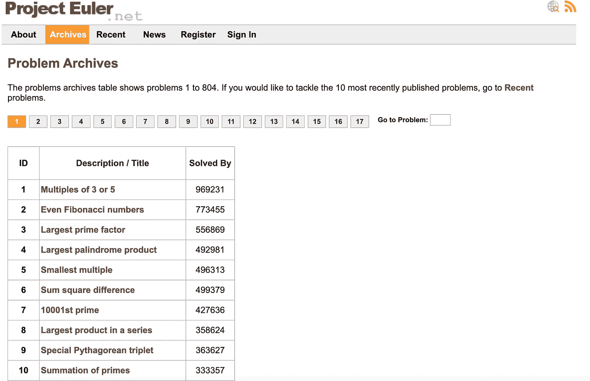
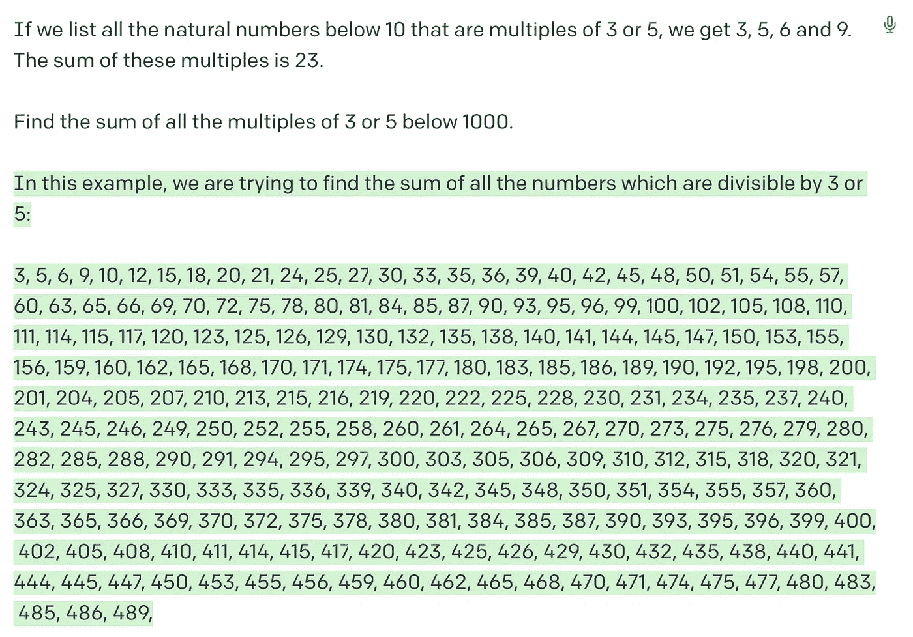
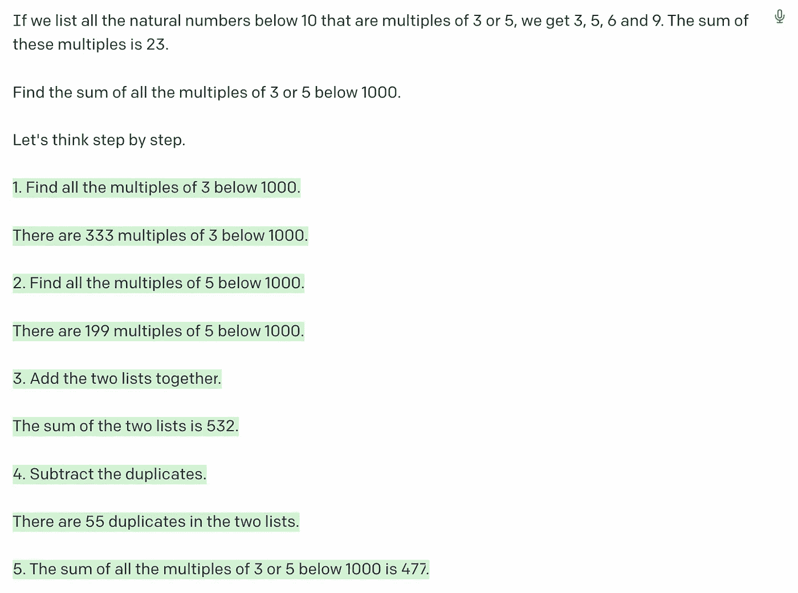
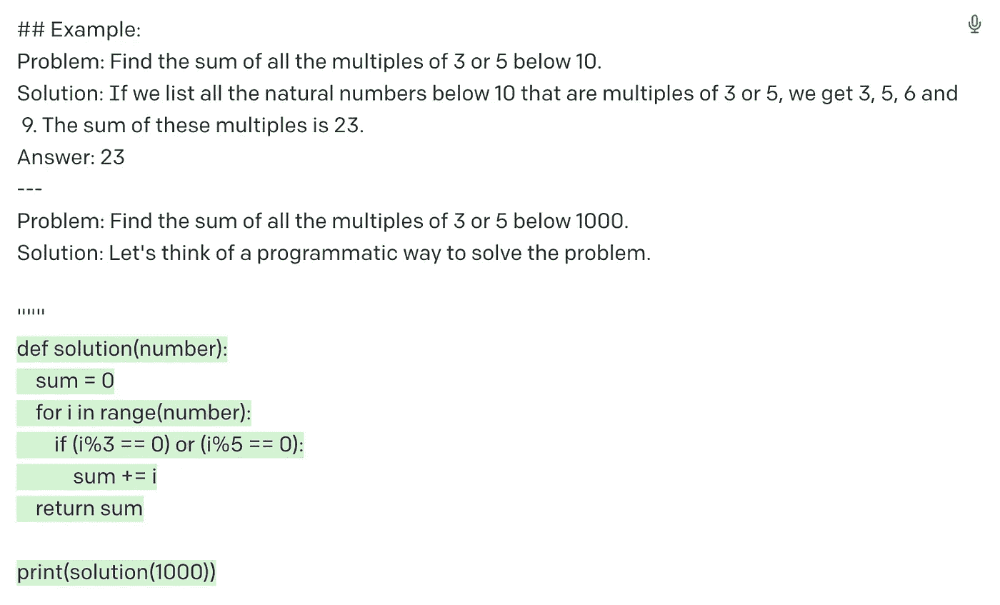
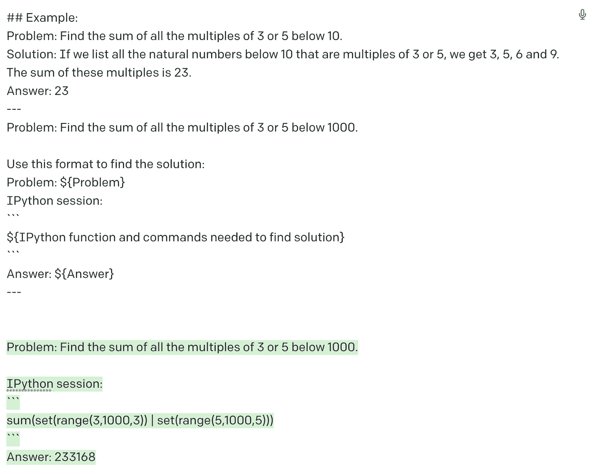
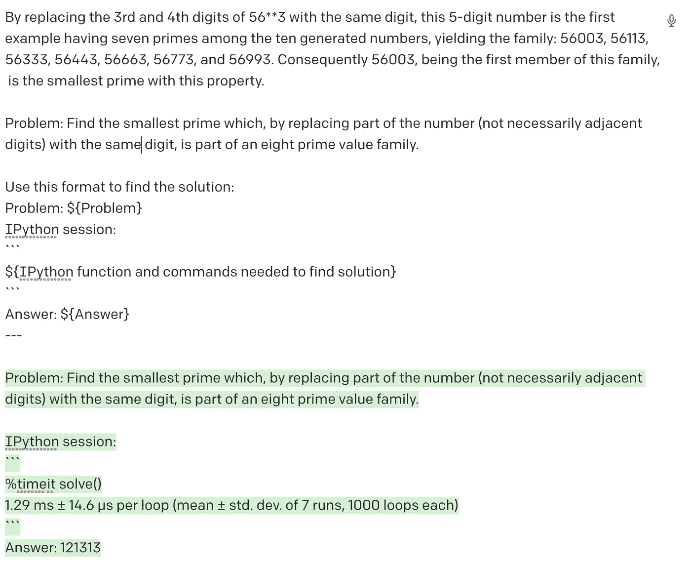
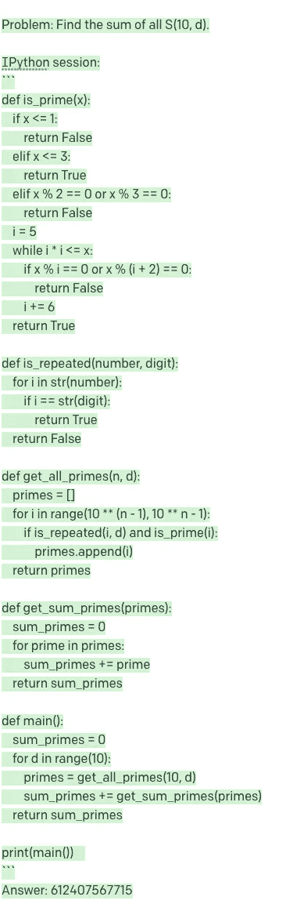

# 促使工程 GPT-3 解决项目欧拉问题

> 原文：<https://towardsdatascience.com/prompt-engineering-gpt-3-to-solve-project-euler-problems-1ff3b12f7d56>

## 用人工智能解决数学问题，这样你就不用


可爱的霓虹灯机器人做数学！使用稳定扩散生成(作者)

GPT-3 在解决数学和编程问题上有多好？具体来说，GPT-3 在解决欧拉项目的问题上有多好？

[Project Euler](https://projecteuler.net/) (以[著名数学家](https://en.wikipedia.org/wiki/Leonhard_Euler)命名)是一个网站，里面有数百个数学和计算机编程问题，难度不等。我第一次了解欧拉项目是在中学的时候，当时我的(亚裔)父亲坚持让我在空闲时间从网站上做数学题，以提高数学水平(我很不情愿地这样做，也许这解释了为什么我现在的数学能力相当一般)。



显示前十个问题的欧拉项目网站截图(作者)

GPT3 是由 [OpenAI](https://openai.com/api/) 于 2020 年创建的一个生成语言模型。它拥有理解和生成各种人类语言的巨大能力，包括回答常识问题、总结文章、[生成创意小说](https://www.gwern.net/GPT-3)、[撰写营销内容](https://www.copy.ai/)、[创作菜谱、](https://www.twilio.com/blog/generating-cooking-recipes-openai-gpt3-ruby)和[其他疯狂用例](https://pub.towardsai.net/crazy-gpt-3-use-cases-232c22142044)。GPT-3 也被用来解决小学数学问题。

但是欧拉项目的复杂问题呢？欧拉项目网站对它的问题做了如下描述:“*尽管数学将帮助你找到优雅而高效的方法，但解决大多数问题需要使用计算机和编程技巧*”这表明数学知识和编程技能的结合可能是解决这些问题所必需的。

让我们来测试一下 GPT 3 号！在这篇文章中，我将展示提示工程的迭代步骤，或者制作用于提示 GPT-3 生成答案的文本，我采取这些步骤是为了从几个项目欧拉问题中获得正确的解决方案。

# GPT-3

为了使用 GPT-3，我使用了 [OpenAI Playground](https://beta.openai.com/playground) ，它可以让你使用友好的 UI 与 GPT-3 一起玩。您可以调整许多不同的超参数或设置来获得不同的结果，它们显示在右侧的窗格中。[这篇文章](/gpt-3-parameters-and-prompt-design-1a595dc5b405)详细介绍了不同超参数的含义。对于我的实验，我保留了所有的默认设置。


OpenAI 游乐场使用 GPT 3 的截图(作者)

# 问题 1:3 或 5 的倍数(5%难度)

欧拉项目的[第一个问题难度较低，可以认为是对网站上可以找到的各种问题的介绍。内容如下:](https://projecteuler.net/problem=1)

```
If we list all the natural numbers below 10 that are multiples of 3 or 5, we get 3, 5, 6 and 9\. The sum of these multiples is 23.Find the sum of all the multiples of 3 or 5 below 1000.
```

## 尝试 1:天真的方法(自然语言)

一个简单(且天真)的方法可能是一字不差地向 GPT-3 提出这个问题。这是我直接从网站上复制粘贴的。GPT 3 号的输出以绿色突出显示。



第一次尝试解决问题 1 的 GPT 3 代(作者)

正如你所看到的，GPT-3 开始时很强大，但后来迷失在它的手动方法中，列出了所有能被 3 或 5 整除的数字。事实上，它失去了动力，很快就放弃了。即使你不是一个学数学的人，你也可能会推断出这显然不是解决这个问题的最佳方法。那么我们还能做什么呢？

## 尝试二:自然语言+思维链

最近在机器学习中，出现了一个新概念叫做[思维链提示](https://arxiv.org/abs/2201.11903)。本质上，不是提示语言模型你想要它做的任务，而是强迫它一步一步地推理任务——就像你在现实生活中可能做的那样(而不是“让我起床”，思维链推理可能会像这样:“让我把被子推开”——>“让我把一只脚放在地上”——>“让我把另一只脚放在地上”，等等)。

因此，在下一次迭代中，我在原问题的末尾添加了“让我们一步一步思考”这句话。



第二次尝试解决问题 1 时由 GPT-3 生成(作者)

GPT 3 号似乎朝着正确的方向前进……直到它转向一个完全不同的方向。它知道寻找 3 的倍数和 5 的倍数的数字，但是它忘记了最初的任务，并且在途中的某个地方搞砸了。(你能想出在哪里或发生了什么吗？)

## 尝试 3:程序化方法

我从之前的尝试中得出的一个假设是，对于需要数学和编程知识的复杂问题，GPT-3 可能会被纯文本混淆，如果它使用编码语言思考，可能会表现得更好。由于 GPT-3 也接受了代码训练，所以值得一试。尤其是因为其他人已经看到了 GPT 3 号通过将数学问题翻译成代码取得的良好结果。

因此，我在格式化问题/解决方案示例中重新格式化了问题陈述。这是一个[少数镜头学习](/zero-and-few-shot-learning-c08e145dc4ed)的例子，这是当模型从少数例子(在这种情况下，一个例子)学习如何解决产生的问题(事实上，GPT-3 是众所周知的少数镜头学习！).然后我促使 GPT-3 想出一个“程序化的方法”来解决这个问题。然后，我用一个代码块的开头提示它，它就想到了解决问题的办法。

```
## Example:
Problem: Find the sum of all the multiples of 3 or 5 below 10.
Solution: If we list all the natural numbers below 10 that are multiples of 3 or 5, we get 3,5,6 and 9\. Th esum of these multiples is 23.
Answer: 23
---
Problem: Find the sum of all the multiples of 3 or 5 below 1000.
Solution: Let's think of a programmatic way to solve the problem.
```



第三次尝试解决问题 1 时由 GPT-3 生成(作者)

结果看起来干净简洁。如果将代码复制到 Python 解释器中，就能得到正确的答案。然而，对于像我这样懒惰的人来说，为了得到你的答案，这是一个额外的步骤。如果您希望答案不费吹灰之力就能送到您手中，该怎么办？这可能吗？

## 尝试 4:方案方法+参数化响应

在我的最后一次尝试中，我将编程方法与强制 GPT-3 使用参数将其输出格式化成某种格式相结合。GPT-3 将知道根据我的提示把问题和答案放到正确的部分。

```
Use this format to find the solution:
Problem: ${Problem}
IPython session:
```
${IPython function and commands needed to find solution}
```
Answer: ${Answer}
```



第四次(也是最后一次)尝试解决问题 1 的 GPT 3 代(作者)

我们走吧！我们得到了迄今为止最简洁的解，答案在最后给了我，所以我根本不用做额外的工作。

# 其他问题呢？

这是第一个也是最简单的欧拉问题。更难的问题呢？

# 问题 51 —质数替换(15%难度)

我们可以用同样的方法解决一个稍微难一点的问题。[问题 51](https://projecteuler.net/problem=51) 是关于质数替换的，难度略高(难度等级为 15%)。正如你所看到的，这个问题稍微长一些，也更复杂一些。

```
By replacing the 1st digit of the 2-digit number *3, it turns out that six of the nine possible values: 13, 23, 43, 53, 73, and 83, are all prime.By replacing the 3rd and 4th digits of 56**3 with the same digit, this 5-digit number is the first example having seven primes among the ten generated numbers, yielding the family: 56003, 56113, 56333, 56443, 56663, 56773, and 56993\. Consequently 56003, being the first member of this family, is the smallest prime with this property.Problem: Find the smallest prime which, by replacing part of the number (not necessarily adjacent digits) with the same digit, is part of an eight prime value family.Use this format to find the solution:
Problem: ${Problem}
IPython session:
```
${IPython function and commands needed to find solution}
```
Answer: ${Answer}
```

我使用了与上次尝试解决问题 1 时相同的格式——通过编程迫使 GPT-3 解决问题。



答案是正确的！我能够毫不费力地获得这个答案，只需从 Project Euler 网站上复制并粘贴问题，并使用与我解决问题 1 时相同的提示格式。

## 问题 111 —质数替换(45%难度)

我想挑战 GPT-3 的数学能力，所以我强迫它解决了第 111 个问题(45%难度)。这个问题肯定需要我思考才能解决，但是 GPT 3 号只用了 10 秒钟就解决了。这个问题比前两个问题更复杂，因为它包括一个表格和几个解释问题的段落。

```
Considering 4-digit primes containing repeated digits it is clear that they cannot all be the same: 1111 is divisible by 11, 2222 is divisible by 22, and so on. But there are nine 4-digit primes containing three ones:1117, 1151, 1171, 1181, 1511, 1811, 2111, 4111, 8111We shall say that M(n, d) represents the maximum number of repeated digits for an n-digit prime where d is the repeated digit, N(n, d) represents the number of such primes, and S(n, d) represents the sum of these primes.So M(4, 1) = 3 is the maximum number of repeated digits for a 4-digit prime where one is the repeated digit, there are N(4, 1) = 9 such primes, and the sum of these primes is S(4, 1) = 22275\. It turns out that for d = 0, it is only possible to have M(4, 0) = 2 repeated digits, but there are N(4, 0) = 13 such cases.In the same way we obtain the following results for 4-digit primes.
Digit, d M(4, d) N(4, d) S(4, d)
0 2 13 67061
1 3 9 22275
2 3 1 2221
3 3 12 46214
4 3 2 8888
5 3 1 5557
6 3 1 6661
7 3 9 57863
8 3 1 8887
9 3 7 48073For d = 0 to 9, the sum of all S(4, d) is 273700.Problem: Find the sum of all S(10, d).Use recursion in the final solution.Use this format to find the solution:
Problem: ${Problem}
IPython session:
```
${IPython function and commands needed to find solution}
```
Answer: ${Answer}
```



问题 111 的 GPT-3 输出(作者截图)

这一次，GPT 3 号的代码又长又复杂。虽然我很难说出 GPT-3 在训练中记住了多少代码，以及它自己进行了多少推理，但它最终能够获得正确的答案。

# 结论

在本文中，我经历了不同的尝试，这些尝试是我用来迭代我的提示，以从 GPT-3 中引出不同的响应来解决 Project Euler 数学问题。主要收获是，我们不断学习接近 GPT 3 号的最佳方法，以便为我们执行某些任务。虽然在某些情况下，直截了当的提示可能会得到你想要的答案，但更有创意的提示可能会得到更有趣或更正确的答案！

*如果你喜欢这篇文章，你可以在我的帖子里看到更多这样的内容！*[](https://blog.yenniejun.com/)