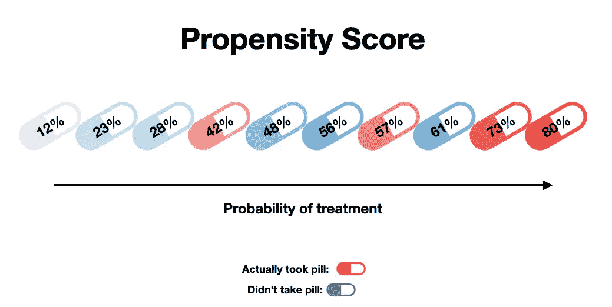
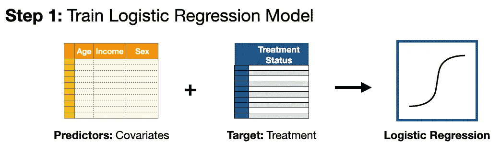
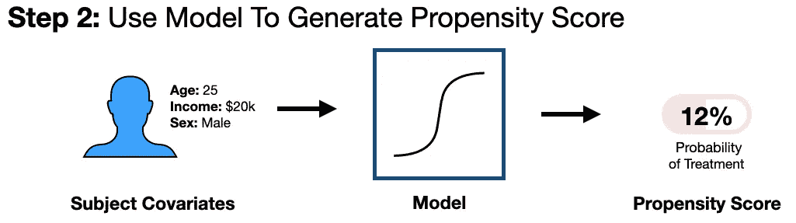
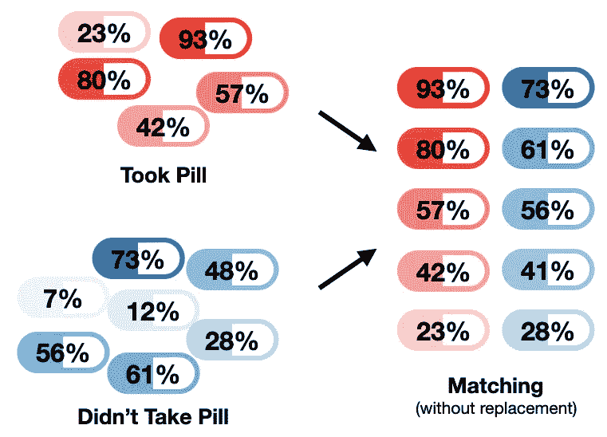
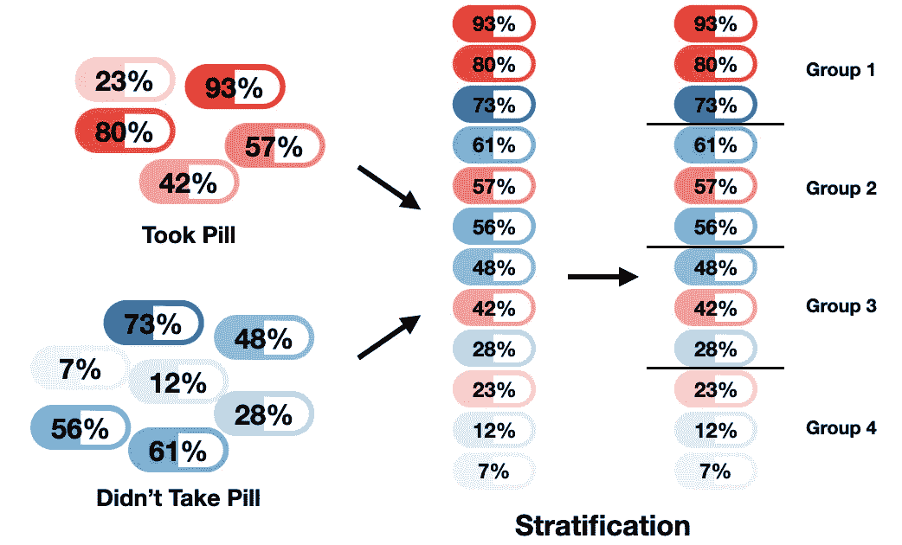
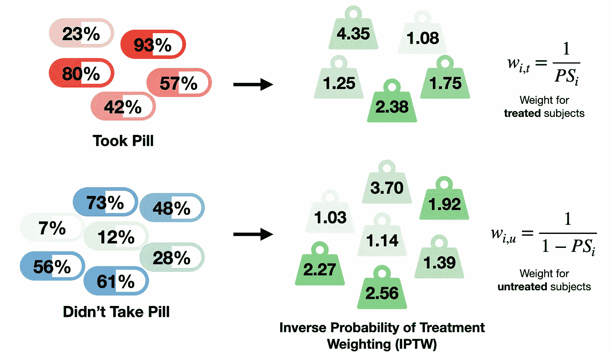
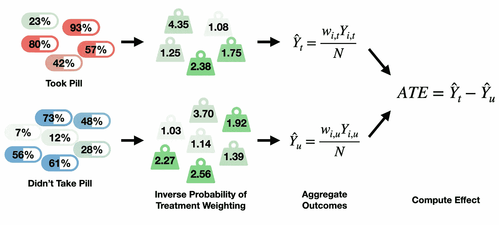
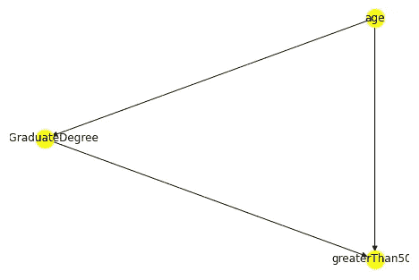

# 通过倾向得分的因果效应

> 原文：<https://towardsdatascience.com/propensity-score-5c29c480130c>

## 如何估计观测数据的影响

本文是因果效应系列文章的第二篇。在前一篇文章中，我们为[因果关系](/causal-effects-f30f962ffff3)奠定了理论基础，但仍有一些挥之不去的实际问题。也就是说，*我们如何从观测数据中计算因果关系？*在这里，我将讨论一套技术，使用一种叫做倾向得分的东西来做到这一点。在讨论之后，我们将给出使用这些技术处理真实数据的示例 Python 代码。

**要点:**

1.  倾向评分评估治疗的可能性
2.  具有相似倾向得分的受试者具有相似的基线协变量
3.  3 流行的倾向评分技术有:匹配、分层和治疗加权的逆概率



倾向评分估计治疗的可能性。图片作者。

为了估计因果关系，我们需要数据。更具体地说，我们需要包含**结果**、**治疗**和**协变量**的数据(之前的[定义为](/causal-effects-f30f962ffff3))。然而，并不是所有的数据源都是相同的。在讨论倾向得分之前，我们必须明确区分两种获取数据的方式。

# **观察性与介入性研究**

第一个**我们可以称之为**观察研究**。这包括被动地测量系统，而不干预数据生成过程。大多数数据收集都属于这一类别。**

第二种获取数据的方式我们可以称之为**介入研究**。这是我们为了一个特定的目标而故意影响数据生成过程的时候。这包括像**随机对照试验**这样的事情，其中一个群体的*随机*样本被分成两组(即对照组和治疗组)并进行比较。随机化的主要好处是，它将倾向于在**测量和未测量**协变量[ [1](https://www.ncbi.nlm.nih.gov/pmc/articles/PMC3144483/) ]方面平衡治疗和对照人群。

区分这些类型的研究有两个原因。**一**，观察数据一般不控制亚群体大小(如对照组可能比治疗组大 10 倍)，而**二**，对照组和治疗组可能存在系统差异。

例如，如果试图估计吸烟对肝脏健康的因果影响，如果吸烟者比不吸烟者倾向于喝更多的酒，比较吸烟者和不吸烟者(在野外)可能会产生有偏见的估计。

因此，如果试图从观察数据中计算出无偏的因果效应，我们可能会感到绝望。然而，你可能已经从副标题中猜到了，有一个解决方案:倾向得分。

# **倾向得分**

一个**倾向得分**估计一个受试者 **基于其他特征**(即协变量)接受特定治疗的**概率。这个分数接近平衡分数，这意味着当条件成立时，治疗组和对照组的协变量看起来相似。这使得对照人群和治疗人群的比较令人想起介入研究，但来自观察数据[ [1](https://www.ncbi.nlm.nih.gov/pmc/articles/PMC3144483/) ]。**

生成倾向得分最流行的方法是通过逻辑回归[ [1](https://www.ncbi.nlm.nih.gov/pmc/articles/PMC3144483/) ]。考虑一下[上一篇文章](/causal-effects-f30f962ffff3)中的 Tylenol 例子。在那里，我们进行了治疗(即一种药丸)，我们想测量它对结果(即头痛状态)的影响。

但假设现在我们无法获得来自 RCT 的数据，只有包含以下信息的观察数据:年龄、收入、性别、是否服药以及头痛状况的变化。

有了这个数据集，我们可以通过逻辑回归模型以一种直接的方式获得倾向得分。我们简单地将我们的协变量(即年龄、收入和性别)设置为**预测值**，将“是否服药”变量设置为**目标值**。下图对此进行了说明。



生成倾向得分的第一步。将协变量和治疗变量传递到逻辑回归模型中。图片作者。

一旦我们有了逻辑回归模型，我们就可以获得数据集中每个受试者的治疗概率(即倾向得分)。



生成倾向得分的第 2 步。将每个受试者的协变量数据输入到逻辑回归模型中，获得得分。图片作者。

# **3 种倾向评分方法**

既然我们知道了什么是倾向得分以及如何计算，我们转向如何使用倾向得分来估计因果关系。在这里，我描述了 3 种流行的方法来做到这一点。

## **1)匹配**

**匹配**包括创建具有相似倾向得分的**治疗-未治疗对**。一个简单的方法是通过以*贪婪*方式*(贪婪搜索先前描述的*[](/causal-discovery-6858f9af6dcb)**)*将每个治疗的对象与具有最接近倾向得分的未治疗的对象进行匹配。*

*换句话说，挑选一个接受治疗的受试者，将他们与倾向得分最接近的未接受治疗的受试者一一匹配。如果我们确保没有未经治疗的受试者与一个以上经治疗的受试者匹配，则称之为**无替代匹配**。*

**

*倾向评分匹配(无替换)的工作原理说明。图片作者。*

*该过程将创建所谓的**匹配样本**，其中**每个治疗对象与未治疗对象**匹配。注意，在上图中，倾向分数为 0.07 和 0.12 的受试者没有与接受治疗的受试者匹配，因此这些受试者没有进入匹配样本。*

*有了我们匹配的样本，就可以通过直接比较治疗和未治疗的人群来计算治疗效果，就像我们在[之前的博客](/causal-effects-f30f962ffff3)中所做的那样。更多匹配策略见奥斯汀的论文。*

## ***2)分层***

***倾向得分**的分层**将受试者分成具有相似倾向得分**的组，在这些组中可以计算因果关系。这通常作为**两步流程**来完成。**首先**，受试者根据其倾向得分进行排名排序(即从最小到最大 PS 排序)。**然后**，排序后的科目被拆分成大小相等的组(即分位数)。*

*基于 [Cochran (1968)](https://psycnet.apa.org/record/1968-16440-001) 的工作，一个好的经验法则是将受试者分成 5 组(即五分位数)，然而，也可以做出其他选择。例如，在下图中，这个两步过程是针对被分成 4 个大小相等的组(即四分位数)的受试者进行说明的。*

**

*对倾向评分进行分层的两步流程图。图片作者。*

*一旦我们根据 PS 对受试者进行了分层，我们就可以通过**直接比较每组**内的治疗和未治疗人群(作为前的[)来计算治疗效果。然后，我们更进一步，通过加权平均汇总组水平的治疗效果，以获得总体治疗效果。](/causal-effects-f30f962ffff3)*

## ***3)治疗权重的逆概率(IPTW)***

***治疗加权的逆概率**与我们迄今为止讨论的方法相比有着根本的不同。在匹配和分层中，我们使用倾向评分来导出*受试者组*，这些受试者组可用于计算治疗效果。然而，对于 IPTW，**我们使用倾向得分来推导每个受试者的*权重*，然后这些权重用于直接计算治疗效果**。*

**

*说明如何计算治疗加权逆概率的权重(IPTW)。图片作者。*

*为了计算效果，我们先从**开始**，我们根据上图右侧的等式给每个受试者分配一个权重。注意，治疗和未治疗受试者的体重方程是不同的。*

***接下来**，我们使用刚刚得出的权重，分别对接受治疗和未接受治疗的受试者的结果变量值进行汇总。**最后**，我们取治疗和未治疗人群的汇总结果值的差值。这种差异被视为平均处理效果(ATE)。下面给出了整个过程的直观总结。*

**

*如何使用治疗加权的逆概率计算平均治疗效果的直观总结(IPTW)。图片作者。*

## ***平衡诊断:评估倾向评分绩效***

*在理想情况下，倾向得分是一个平衡得分，也就是说，如果我们看两个得分相同的受试者，他们的潜在协变量应该是相同的。然而，在实践中，这种情况很少发生。倾向分数仅仅作为这种理想情况的近似。*

*也就是说，我们可以使用这个想法来推导策略，以评估我们的倾向得分模型的性能。例如，在匹配的情况下，我们可以在匹配的样本中选取处理组和未处理组，并比较它们的潜在协变量分布。*

*对于正态分布的变量，这可以通过简单地比较平均值和标准差来实现。对于其他类型的分布，可以使用诸如 KS 检验、KL 散度、Wasserstein 距离等技术。关于平衡诊断的进一步讨论，我建议读者参考奥斯汀[[1](https://www.ncbi.nlm.nih.gov/pmc/articles/PMC3144483/)]**T3]的精彩论文。***

## ***基于回归的技术***

*在进入示例代码之前，值得一提的是，当试图从观察数据中计算因果效应时，基于倾向得分的方法并不是我们唯一的选择。还有另外一类技术，我们可以称之为 [**基于回归的**](/causal-effects-via-regression-28cb58a2fffc) 。这包括诸如**线性回归、元学习器和双机器学习**等方法。事实上，在之前关于[因果推理](/causal-inference-962ae97cefda)的一篇文章中，我们使用了一个元学习者来估计读研对收入的影响。在这里，我们将重复这一分析，但现在使用基于倾向得分的方法。*

*[](/causal-effects-via-regression-28cb58a2fffc) [## 通过回归的因果效应

### Python 示例代码的 3 种流行技术

towardsdatascience.com](/causal-effects-via-regression-28cb58a2fffc) 

# **示例:估计研究生院对收入的治疗效果(使用倾向得分)**

在这个例子中，我们将使用前面讨论的 3 种倾向得分方法来估计研究生学位对收入的因果影响。该分析与[因果推理](/causal-inference-962ae97cefda)博客中的例子几乎相同。我们再次使用 [DoWhy](https://py-why.github.io/dowhy/v0.8/) Python 库，并且在我们的因果模型中只考虑 3 个变量:年龄、hasGraduateDegree 和大于 50k(收入)。示例代码可以在 [GitHub Repo](https://github.com/ShawhinT/YouTube-Blog/tree/main/propensity_score) 中找到。

我们从导入必要的 Python 模块开始。

```
**import** pickle

**import** dowhy
**from** dowhy **import** CausalModel
**import** numpy **as** np
```

接下来，我们加载数据集。这里我们使用同样的[美国人口普查数据](https://archive.ics.uci.edu/ml/datasets/census+income)来自[因果发现](/causal-discovery-6858f9af6dcb)例子【3】。

```
df **=** pickle**.**load( open( "df_propensity_score.p", "rb" ) )
```

使用 Python DoWhy 库估算因果效应的第一步是明确定义**因果模型**，即陈述变量之间的**因果关系。这里，我们将假设与之前的[相同的因果模型。](/causal-inference-962ae97cefda)**

```
model**=**CausalModel(
        data **=** df,
        treatment**=** "hasGraduateDegree",
        outcome**=** "greaterThan50k",
        common_causes**=**"age",
        )model**.**view_model()
```



view_model()方法的输出是我们的因果模型的图形表示。

接下来，我们生成一个 estimand，这是计算因果效应的基本方法。这确保了测量的混杂因素(即年龄)得到适当的调整。

```
identified_estimand_experiment **=** model**.**identify_effect(proceed_when_unidentifiable**=True**)
```

然后，我们最终可以使用每种倾向得分方法来估计 hasGraduateDegree 对 greaterThan50k 的因果效应。

```
*# create list of names of the propensity score methods*
ps_method_name_list **=** ["matching", "stratification", "weighting"]*# initialize dictionary to store estimates from each method and list to store ATEs*
ps_estimate_dict **=** {}
ps_estimate_val_list **=** []# estimate effect for each method
**for** ps_method_name **in** ps_method_name_list:
    ps_estimate **=** model**.**estimate_effect(identified_estimand_experiment,
                                    method_name**=**"backdoor.propensity_score_" **+** ps_method_name,
                                    confidence_intervals**=False**,
                                    method_params**=**{})
    *# add estimate to dict and ATE to list*
    ps_estimate_dict[ps_method_name] **=** ps_estimate
    ps_estimate_val_list**.**append(ps_estimate**.**value)

    print(ps_estimate)
    print("\n")
```

每种方法的平均处理效果估计如下:**匹配** — 0.136，**分层** — 0.25， **IPTW** — 0.331。给出大约 0.24 的总平均值。

## 我该如何解读这个？

我们可以把这个总比率解释为:在给定的年龄，即**读研究生，获得研究生学位的期望值的单位变化将导致某人一年挣 5 万多的概率增加大约 24%**。这些结果与我们之前使用元学习者方法看到的大致相同(我们看到 ATE = 0.20)。

## 一句警告

最后，我要提醒从业者对这些方法要有所保留。不像随机对照试验那样，随机化可以处理来自**测量的** **和**未测量的混杂因素的偏倚，倾向评分方法只帮助我们对抗**测量的**混杂因素。

例如，可以想象，还有其他一些影响学位和收入的因素没有被我们的数据集捕捉到，比如:父母的职业/收入、研究领域和职业道德。

在本系列的下一篇博客中，我们将讨论**如何应对不可测量的混杂因素**，并将 do 运算符带回我们对因果关系的讨论。

[](/causal-effects-via-the-do-operator-5415aefc834a) [## 通过 Do 运算符的因果关系

### 将观察转化为干预

towardsdatascience.com](/causal-effects-via-the-do-operator-5415aefc834a) 

# 资源

**更多关于因果关系** : [因果关系概述](https://shawhin.medium.com/understanding-causal-effects-37a054b2ec3b) | [因果关系:介绍](/causality-an-introduction-f8a3f6ac4c4a) | [因果推断](/causal-inference-962ae97cefda) | [因果发现](/causal-discovery-6858f9af6dcb)

**连接** : [我的网站](https://shawhint.github.io/) | [预定电话](https://calendly.com/shawhintalebi) | [发邮件给我](https://shawhint.github.io/connect.html)

**社交**:[YouTube](https://www.youtube.com/channel/UCa9gErQ9AE5jT2DZLjXBIdA)|[LinkedIn](https://www.linkedin.com/in/shawhintalebi/)|[Twitter](https://twitter.com/ShawhinT)

**支持** : [给我买杯咖啡](https://www.buymeacoffee.com/shawhint?source=about_page-------------------------------------) ☕️ | [成为会员](https://shawhin.medium.com/membership?source=about_page-------------------------------------) ⭐️

[](https://shawhin.medium.com/membership) [## 通过我的推荐链接加入媒体——肖文·塔莱比

### ⭐️成为会员使用我的推荐链接，并获得充分的媒体上的每一篇文章。您的会员费直接…

shawhin.medium.com](https://shawhin.medium.com/membership) 

[1] [减少观察性研究中混杂效应的倾向评分方法简介](https://www.ncbi.nlm.nih.gov/pmc/articles/PMC3144483/)作者 Peter C. Austin

[2] [保罗·r·罗森鲍姆](https://academic.oup.com/biomet/article/70/1/41/240879)唐纳德·b·鲁宾&的《倾向评分在因果效应观察研究中的核心作用》

[3] [Dua，d .和 Graff，C. (2019)。http://archive.ics.uci.edu/ml UCI 机器学习库](https://archive.ics.uci.edu/ml/datasets/census+income)。加州欧文:加州大学信息与计算机科学学院。*