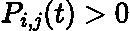
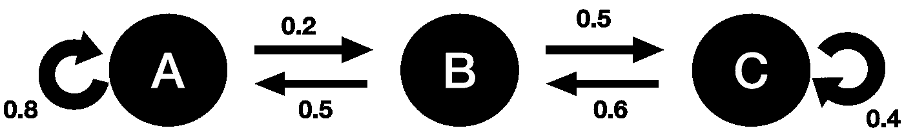
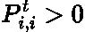
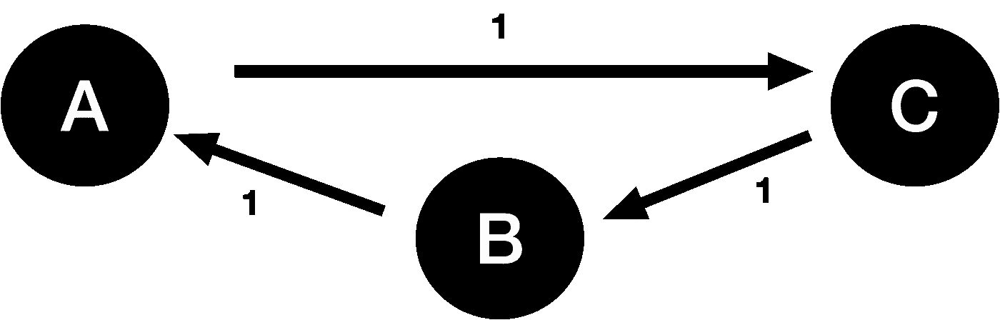
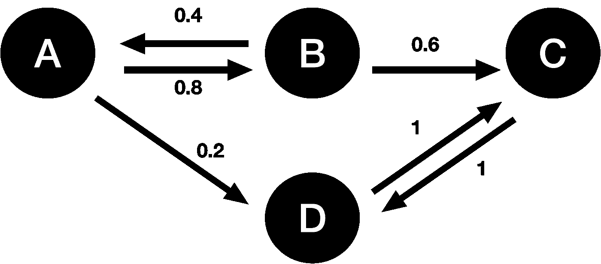

# 马氏链的性质

> 原文：<https://towardsdatascience.com/properties-of-markov-chains-79380dc0358f>

## 简单解释一下马氏链最常见的特征

亚历山大·托多夫在 [Unsplash](https://unsplash.com?utm_source=medium&utm_medium=referral) 上拍摄的照片

# 介绍

在我之前的文章中，我们一直在获得一种 [**马尔可夫链**](https://en.wikipedia.org/wiki/Markov_chain) **的直觉。**简而言之，马尔可夫链是一个**随机过程**，它在**离散状态空间**的**离散时间**中演化，其中**状态间转移的概率仅取决于当前状态。**系统完全<https://en.wikipedia.org/wiki/Memorylessness>****无记忆。要全面理解前面的句子，请参考我以前的文章:****

**</markov-chains-simply-explained-dc77836b47e3>  </markov-chains-multi-step-transitions-6772114bcc1d>  </markov-chains-stationary-distribution-bedd67140112>  

在本文中，我们将讨论马氏链的一些常见特征和性质！

# 不可约性

一个马尔可夫链被称为是 [**不可约**](https://stats.stackexchange.com/questions/186033/how-do-you-see-a-markov-chain-is-irreducible) ，如果它有可能在某个给定的时间步长内从任意给定的状态**跃迁到另一个状态**。所有状态**互相通信**。数学上，存在一些时间步长 ***t > 0*** 其中:

LaTeX 中生成的方程。

即在某个给定的时间步*I 转换到状态 ***j*** 的概率 ***P****

*下面的马尔可夫链是不可约的，因为我们可以从系统中的任何状态到任何其他状态:*

**

*由作者生成的图像。*

# *吸收态和周期性*

*一个状态被定义为 [**吸收**](https://en.wikipedia.org/wiki/Absorbing_Markov_chain) **，**如果当你到达那个状态，你**就无法离开它。**换句话说，它有 **100%的概率过渡到自身。***

*据说一个**吸收态的周期为 1，**我们知道，对于每一个随后的时间步长，我们将回到那个相同的状态。周期为 1 的状态也称为 [**非周期性**](https://www.randomservices.org/random/markov/Periodicity.html) 和**如果所有的状态都是非周期性的，**那么**马尔可夫链也是非周期性的。***

> *注意:自转移概率不一定需要为 1 才是非周期性的。它只需要大于 0。因此，所有的吸收态都是非周期性的，但不是所有的非周期性态都是吸收态。*

*一般来说，**a 状态的周期 I是**所有整数的最大公约数**为**t>0:*****

**

*LaTeX 中生成的方程。*

*例如，对于下面的马尔可夫链，每个状态的**周期为 3。**这是因为，举例来说，一旦我们在 ***t = 0*** 处离开状态***A***t = 3 处回到*。此外，由于**每个状态都是周期性的**，因此**马尔可夫链是周期为 3 的周期性的。****

****

**由作者生成的图像。**

# **瞬态和循环状态**

**一个给定的状态*被认为是<https://mpaldridge.github.io/math2750/S09-recurrence-transience.html>**如果一旦进入该状态，有**的正概率**该链可能永远不再返回状态*。******

*****一个 [**轮回的**](https://mpaldridge.github.io/math2750/S09-recurrence-transience.html) 状态基本上就是一个**不瞬的**。因此，当进入状态 ***i*** 时，存在 1 的**概率，链将**无限次**肯定返回**到给定状态(假设我们采取无限时间步长)。*********

****考虑下面的马尔可夫链:****

********

****由作者生成的图像。****

****我们可以看到状态 ***A*** 和 ***B*** 是**瞬态**因为有一种可能性，当离开这两个状态时，我们可以在状态 ***C*** 或 ***D*** 结束，它们只相互通信。因此，我们永远不会回到状态 ***A*** 或 ***B*** 因为马尔可夫链会循环通过*C***【d】********

****另一方面，状态***【C】***和***【D】***是**循环**，因为当我们离开 ***C，*** 时，我们知道我们将在两个时间步长内返回那里(因此它的周期为 2！).****

# ****结论****

****希望你喜欢这篇文章！这是较短的一边，但有助于进一步建立我们对马氏链和不同类型的存在的直觉。在下一篇文章中，我们将讨论**隐马尔可夫链！******

# ****和我联系！****

*   ****要在媒体上阅读无限的故事，请务必在这里注册！ 💜****
*   ****</subscribe/@egorhowell>😀****
*   ****[*领英*](https://www.linkedin.com/in/egor-howell-092a721b3/) 👔****
*   ****[*推特*](https://twitter.com/EgorHowell) 🖊****
*   ****[*github*](https://github.com/egorhowell)*🖥*****
*   *****<https://www.kaggle.com/egorphysics>**🏅*******

> *****(所有表情符号都是由 [OpenMoji](https://openmoji.org/) 设计的——开源的表情符号和图标项目。许可证: [CC BY-SA 4.0](https://creativecommons.org/licenses/by-sa/4.0/#)*******