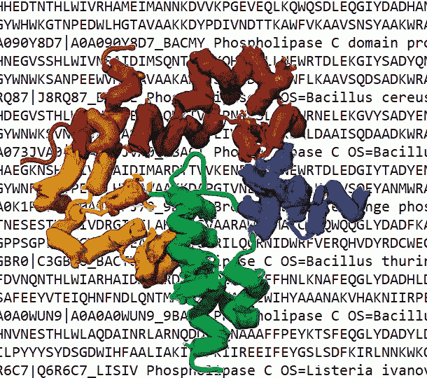
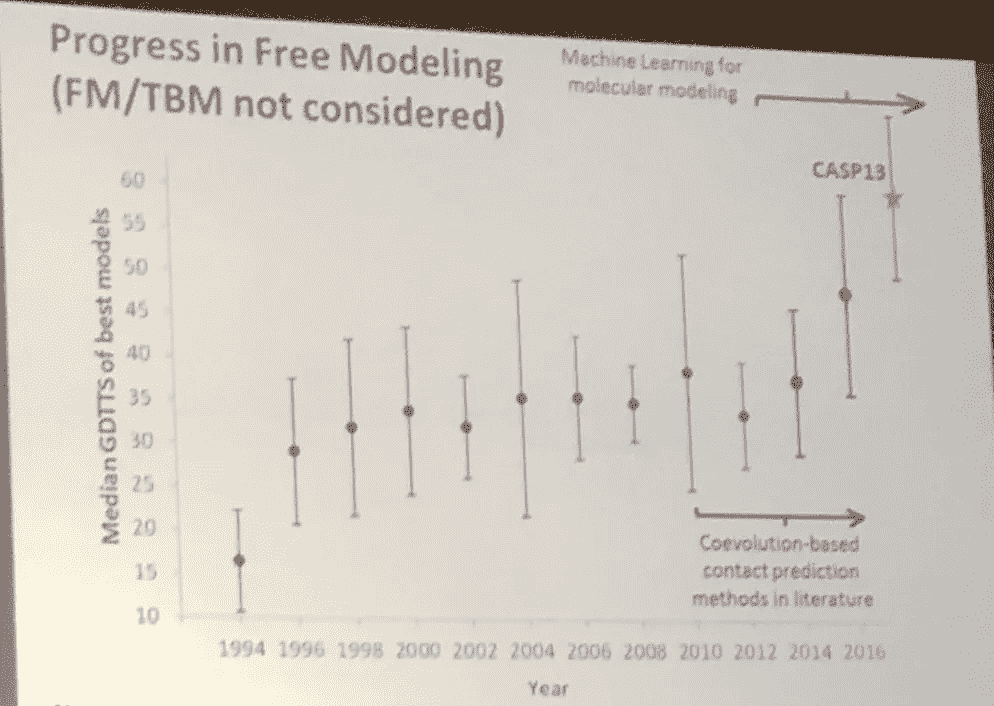
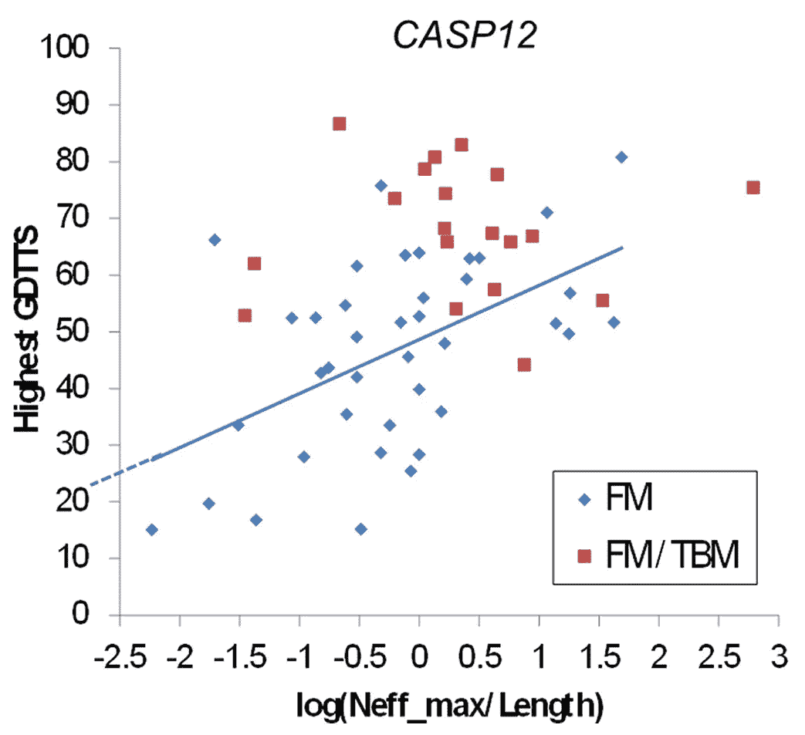
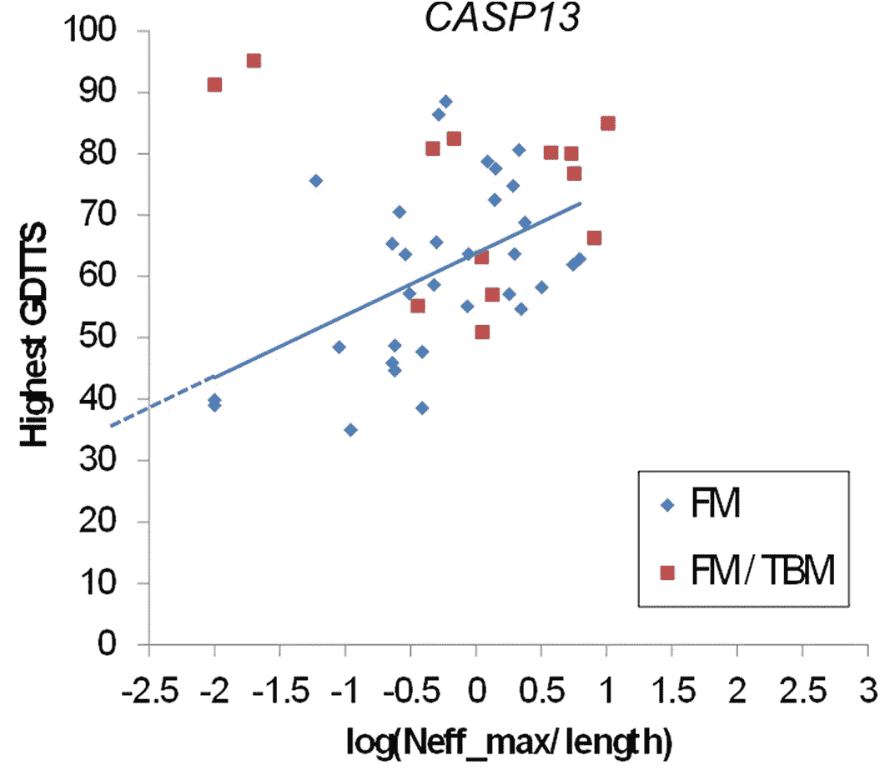
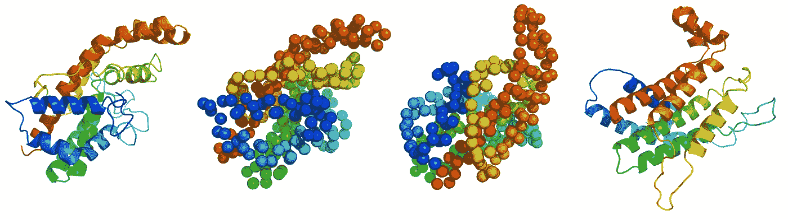

# 使用蛋白质语言模型预测蛋白质结构比 AlphaFold 2 快一百万倍

> 原文：<https://towardsdatascience.com/protein-structure-prediction-a-million-times-faster-than-alphafold-2-using-a-protein-language-model-d71c55e6a4b7>

## 生物学家的梦想即将实现？

## 方法概述及其相关性；试图在 Google Colab 中运行它；测试它是否真的有那么好。

作者和 DallE 两代人的概念艺术。

新一轮的 CASP(蛋白质结构预测竞赛)离公布结果只有一个月了，我们继续看到关于使用 AlphaFold 2 和 AlphaFold 启发的神经网络预测蛋白质结构的论文，甚至更好，更快，或完全开源的程序；也是为了[预测蛋白质与其他生物分子的界面](/new-preprint-describes-a-novel-parameter-free-geometric-transformer-of-atomic-coordinates-to-c6545150855e)，甚至[设计新的蛋白质](/new-deep-learned-tool-designs-novel-proteins-with-high-accuracy-41ae2a7d23d8)。虽然进展太快，我无法涵盖所有这些发展，但我偶尔会选择一些特别相关和令人感兴趣的发展。这里有一个我认为值得特别关注的问题:一个使用语言模型预测蛋白质结构的神经网络，其精度与 AlphaFold 2 相似，但速度快一百万倍，并且对同源序列的缺乏不太敏感。

这一模型和其他使用语言模型进行蛋白质结构预测的新兴模型突出了语言模型在总体上的作用，远远超出了最初使用它们处理自然语言的兴趣，正如 GPT-3 今天掌握的。

让我们看看这是怎么回事。

## 蛋白质结构预测的 AlphaFold 概述

从氨基酸序列预测蛋白质的(3D)结构在现代生物学中非常重要。有鉴于此，大约 30 年前，一项关于蛋白质结构预测的两年一度的竞赛(CASP，more [在此](https://medium.com/@lucianosphere/here-are-all-my-peer-reviewed-and-blog-articles-on-protein-modeling-casp-and-alphafold-2-d78f0a9feb61)和[在此](https://lucianosphere.medium.com/the-critical-assessment-of-structure-prediction-casp-over-a-quarter-century-tracking-the-state-bde0a92b3680))启动了，该竞赛促进了该领域的发展，并伴随着对模型的批判性评估和对进展的分析(如果有的话)。

多年来，CASP 表明蛋白质结构预测只适用于简单的蛋白质，即那些相似序列的结构已知的蛋白质。也就是说，只有同源建模有效，而硬目标(即没有已知结构的同源物的目标)仍然非常具有挑战性——预测者几乎不能掌握整体形状:

这张幻灯片(由作者在 CASP13 会议期间制作和演示)显示了预测硬目标是多么困难，并且在 CASP12-CASP13 之前没有或几乎没有进展。

到了 CASP12(当我自己作为评估员加入时)，一项突破开始改变事情:残基对之间的联系现在可以通过应用“残基协同进化检测”方法(正式的直接信息分析等)来计算与想要建模的序列相关的多个序列的比对。这背后的基本原理是，在蛋白质结构中进行物理接触的残基对必须一起改变；因此，检测多序列比对中的这种同时发生的变化将指向在结构预测过程中必须被强迫在一起的残基对。这很有效，事实上在我的分析中，我观察到可以建立更大比对的蛋白质(因为数据库中有更多类似的序列)被证明是更好的模型:

在 CASP 12 中，针对每个靶产生的最佳模型的最高 GDTTS(用于评估模型的主要 CASP 指标)与通过建模序列的长度标准化的可用序列数的对数。情节中的每个点是一个目标，最难的 FM 或中等难度的 FM/TBM；这条线是 FM 案例的线性回归。图由作者根据免费提供的 CASP 数据制作。

然后在 CASP13 中，一些小组调整了这个想法，导致预测的进一步改进:现在不仅可以预测接触，还可以预测距离，甚至残基之间的相对方向。Deepmind 在这里进入了 CASP，应用了这一招，但并不只有他们。所有使用这种技巧的小组都表现得非常好，当然比 CASP12 好，也比以前的 CASP 版本好得多。Deepmind 将程序推向了最大限度，以微弱优势“赢”了第二名 CASP13。

作为 CASP12 和 CASP13 中的评估者，我可以清楚地看到 CASP13 中仍然存在大序列比对的要求，具有更高的偏移(在更低的序列数下有更好的模型)，但仍然有很大的斜率:

与上图相同，但使用了 CASP13。请注意相似的斜率，但 y 轴上的截距更高，这意味着对于在比对中具有相似序列数的蛋白质，获得了比 CASP12 更好的模型。图由作者根据免费提供的 CASP 数据制作。

理想情况下，人们会希望在完全不需要辅助比对的情况下单独预测序列。也就是说，当上述图中的 Neff_max 为 1，或者 Neff_max/length 非常小时，例如对于 1000 个残基长的蛋白质为 0.001(因此 log = -3)。这是为什么呢？嗯，因为许多蛋白质只是在数据库中缺少相似的序列，而其他的则完全是人类发明的(“设计的”，如这里的[和这里的](https://medium.com/advances-in-biological-science/how-computer-modeling-simulations-and-artificial-intelligence-impact-protein-engineering-in-4d8473bd59ff)所解释的)；因此，对于这些蛋白质，任何预测都必须完全依赖于分离的序列，完全不需要比对的帮助。

今天，即使是 AlphaFold 2，凭借其完全重新设计的协议，并在 CASP14 中击败了所有其他组，也无法从单个序列中产生完美的模型。这是目前蛋白质结构预测中的“圣杯”，在这个问题上，本文讨论的论文通过使用语言模型方法预测蛋白质结构取得了重大进展。

# 使用语言模型和深度学习的单序列蛋白质结构预测

该论文由 Chowdhury 等人在 2022 年 10 月初刚刚出版的*自然生物技术*上发表。正如我们在上面所看到的，目前蛋白质结构预测中的主要挑战是对缺乏已知同源物的序列实现良好到完美的预测，因此不能为它们建立序列比对。这些被称为“孤儿”或“单一”序列，它们比你想象的要常见得多(约占所有已知蛋白质序列的 20%，超过 10%的真核生物和病毒蛋白质)，即使数据库中的蛋白质序列不断增加，新的孤儿序列仍会不断出现。因此，发展预测它们结构的方法是很重要的。

包括 AlphaFold 2 在内的当前方法的另一点，不太关键但也是期望的，是以更快的速度获得精确结构预测的能力。AlphaFold 2 每次预测需要几分钟，这对于低通量需求来说是合理的，但对于处理完整的蛋白质组或探索蛋白质设计的序列空间来说太慢了。

来自 AlQuraishi 小组的 Chowdhury 等人提出的新方法称为 RGN2，该方法建立在他们以前的工作基础上，从比对得到的位置特异性评分矩阵预测蛋白质结构。在以前的模型中，结构被参数化为相邻残基之间的扭转角，以在 3D 空间中顺序放置蛋白质骨架；所有组件都是可微分的，因此可以端到端地优化网络，以最小化预测误差(预测模型与用于训练的实际结构相比的 RMSD)。尽管之前的方法没有明确使用协同进化数据，但它需要比对来计算位置特异性评分矩阵，因此它对序列的可用性很敏感。

新的 RGN2 使用在蛋白质序列上训练的蛋白质语言模型，从单个蛋白质序列预测蛋白质结构，而不需要任何比对。就像语言模型试图从一系列单词中提取信息一样，这里使用的蛋白质语言模型试图捕捉一串氨基酸中的潜在信息——这指定了蛋白质结构。在 RGN2 中，由早期方法中从比对得到的位置特异性评分矩阵提供的信息被语言模型直接从输入序列计算的信息所取代。

RGN2 使用的“蛋白质语言”模型称为 AminoBERT，其灵感来自 Rives 等人的早期工作[，Rives 等人开发了一个通过对蛋白质序列的无监督学习训练的深度上下文语言模型，该模型学习了蛋白质的基本属性，因此能够进行远程同源性检测，预测二级结构和长程残基间联系等。这正是制造蛋白质结构所需要的信息。](https://www.pnas.org/doi/full/10.1073/pnas.2016239118)

通过将在结构上训练的蛋白质语言模型耦合到在旋转和平移不变性的规则下用于结构生成的网络模块，RGN2 可以产生具有呈现真实蛋白质结构特征的骨架几何形状的 Cα轨迹；此外，他们实际上似乎正确地预测了空间中的蛋白质折叠，正如作者所声称的那样。当可以产生比对时，完整的 RGN2 平均不如 AlphaFold 2 好，但可以推测它对不能产生比对的蛋白质更好。即使在前一种情况下，RGN2 也比 AlphaFold 2 快一百万倍。

注意，如果你在前面的段落中错过了这一点，RGN2 的预测只存在于 C𝛼轨迹中，而不是全原子模型中。在作者开发的管道中，剩余的主链和侧链原子最初是用 ModRefiner 在这个轨迹的顶部构建的，得到的结构用作 AlphaFold2 的模板，没有对齐，然后提供最终的模型。

# 作为 Google Colab 笔记本电脑运行

试用这个工具非常简单，因为作者为此创建了一个 Colab 笔记本- [，就像 Deepmind 向公众开放 AlphaFold 2](https://medium.com/towards-data-science/google-colab-notebooks-are-already-running-deepminds-alphafold-v-2-92b4531ec127) 一样，从那以后其他[科学家开始做](https://medium.com/towards-data-science/new-preprint-describes-google-colab-notebook-to-efficiently-run-molecular-dynamics-simulations-of-9b317f0e428c)。

笔记本在这里:

  

我刚刚尝试过。

我观察到的第一点是，加载模型需要相当长的时间。我猜在对多种蛋白质的实际应用中，你实际上会加载模型一次，然后在几秒钟内运行预测。

第二，输出根本不是图形化的，所以不要指望像 [ColabFold 这样的应用程序，它是为简单高效地使用 AlphaFold 2 而开发的](https://medium.com/towards-data-science/google-colab-notebooks-are-already-running-deepminds-alphafold-v-2-92b4531ec127)。

第三，记住主要的输出只是一个 C𝛼轨迹，之后常规的 AlphaFold 2 运行(只是没有比对)来产生最终的模型。

> 那么，效果如何呢？

我尝试了两种相对简单的蛋白质(“简单”是因为在 PDB 中有一些结构，在数据库中有几个相关的序列)，预测与已知的结构相差甚远。在这两种情况下，蛋白质的整体形状都被正确地捕捉到了，但在我看来，对于你能想象的最酷的应用来说，实际结构的 RMSD 仍然太高了。

这里有一个例子，在将产生的 C𝛼轨迹(从左到右第三个)与实际结构的 C𝛼轨迹对齐后，RMSD 几乎是 14 埃，对于由 CA 轨迹预测指导的最终 AlphaFold 2 模型，rmsd 几乎是 18 埃——两者都相当大！

从左到右:预期结构显示为漫画，预期结构只有 CA 原子，从 RGN2 获得 CA trace 模型，使用 RGN2 用 AlphaFold2 获得最终模型。图由作者使用 PyMOL 的免费版本。

从这个例子和其他一些例子中总结，我的结论是它还没有出现。我尝试过的所有蛋白质都在 PDB 中，并且有可用的序列，所以在训练蛋白质语言模型时一定已经看到了关于它们的一些东西。然而，与 AlphaFold 2(及其置信度预测，这里缺乏)让我们习以为常的情况相比，预测的结构与实际结构有些距离。

然而，该模型显然具有潜力，并且它肯定是非常有趣的(I)作为一种新技术，特别是表明语言模型在取代结构信息提取的比对方面做了合理的工作；和(ii)关于主要的实际目标，它提出了合理质量的快速预测。

从全球范围来看，语言模型在处理蛋白质序列问题(已经在 AlphaFold 2 中的一个类似 BERT 的模块中处理序列比对，并且也在化学和生物学的其他一些 ML 模型中使用)和蛋白质结构预测(特别是查看下一篇笔记和我即将发表的文章)方面的成功应用突出了语言模型在总体上的作用，远远超出了最初对使用它们处理自然语言的兴趣，就像今天由 GPT-3 掌握的那样。

  

# 最后请注意:Meta 在这方面与一个巨大的蛋白质语言模型竞争，在准确性和速度上挑战 AlphaFold 2

在 [Meta](https://medium.com/u/4e7a97edbbf7?source=post_page-----d71c55e6a4b7--------------------------------) 研究语言模型预测蛋白质结构的团队刚刚发布了一份[预印本](https://www.biorxiv.org/content/10.1101/2022.07.20.500902v2)，显示他们的模型可以使用大型语言模型高速从一级序列中推断结构。就像 AlphaFold 和 RGN2 一样，该模型可以在谷歌 Colab 笔记本上运行；此外，Meta 提供了一个 API 端点，使得仅仅通过 API 调用就可以运行得更加容易！我的初步测试表明，这个模型可能比 RGN2 更好，事实上，预印本声称，该方法的预测速度比最先进的技术(AlphaFold 2)快 60 倍，同时保持了分辨率和准确性——我补充说，它可能对浅比对不太敏感。我希望很快在一篇文章中带来关于 Meta 对这个问题的看法和方法的消息。这个领域发展极快，也许生物学家的梦想会比预期的更快成为现实。

# 进一步阅读

  

《自然生物技术》的同行评议论文

  

在同一份杂志上，有一篇关于这篇论文的评论:

  

了解更多 AI 驱动的蛋白质结构预测、CASP 等。：

    

www.lucianoabriata.com*我写作并拍摄我广泛兴趣范围内的一切事物:自然、科学、技术、编程等等。* [***成为媒介会员***](https://lucianosphere.medium.com/membership) *访问其所有故事(我免费获得小额收入的平台的附属链接)和* [***订阅获取我的新故事***](https://lucianosphere.medium.com/subscribe) ***通过电子邮件*** *。到* ***咨询关于小职位*** *查看我的* [***服务页面这里***](https://lucianoabriata.altervista.org/services/index.html) *。你可以* [***这里联系我***](https://lucianoabriata.altervista.org/office/contact.html) ***。***