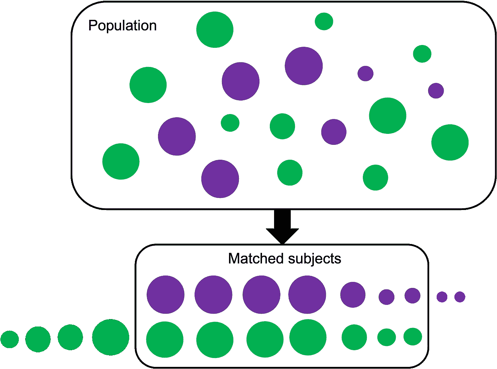
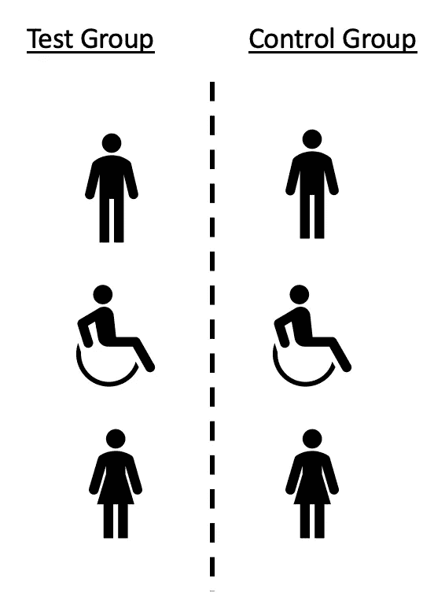
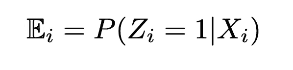
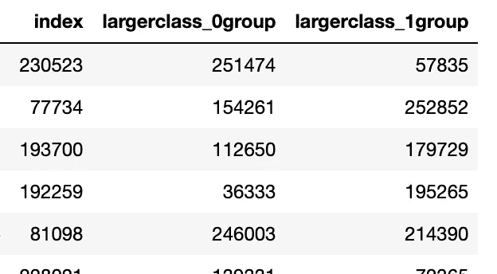
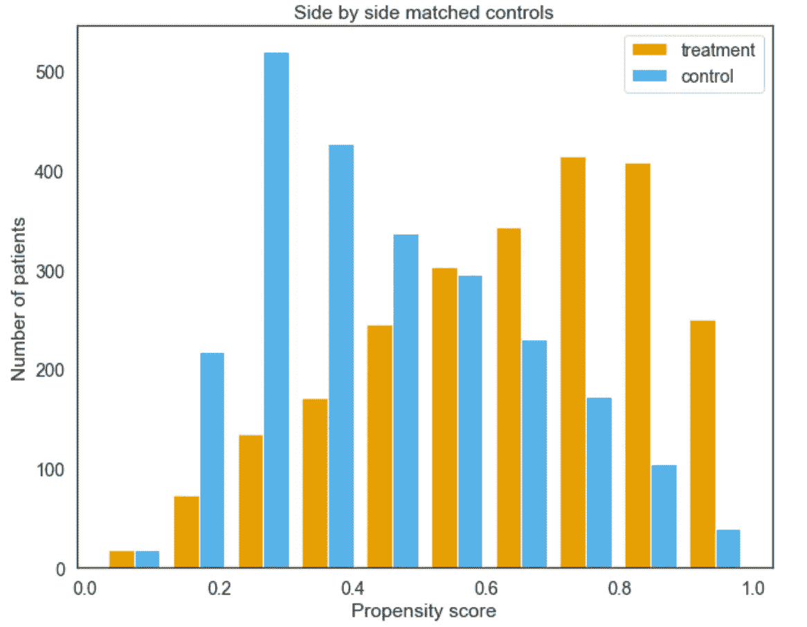
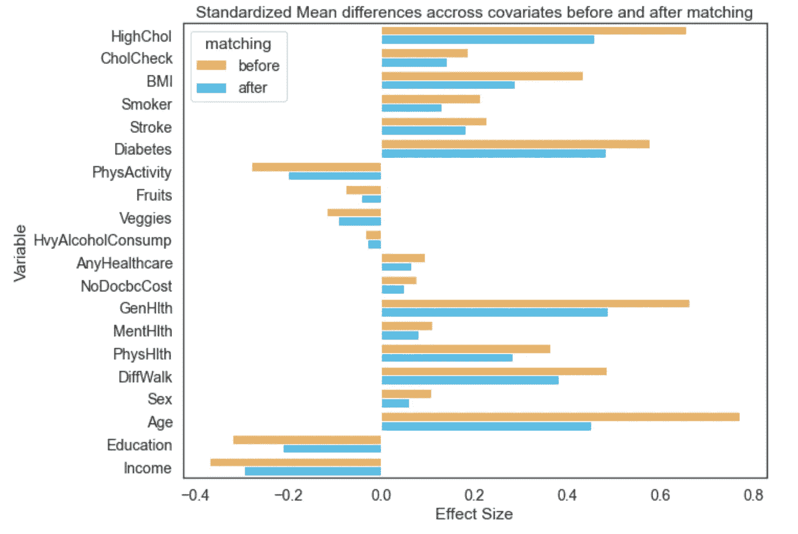
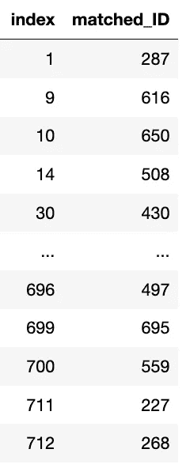
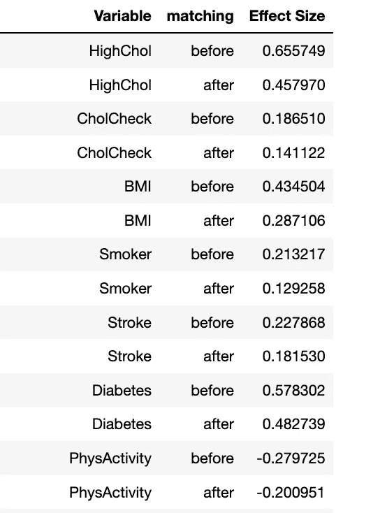

# PSP py:Python 中的倾向评分匹配——以及为什么需要它

> 原文：<https://towardsdatascience.com/psmpy-propensity-score-matching-in-python-a3e0cd4d2631>



作者图片

当我们试图回答这样的问题时:

“服用β受体阻滞剂能降低心脏病发作的风险吗？”

**“吸烟会致癌吗？”**

**“小学的 STEM 项目鼓励更多的学生进入科学领域吗？”**

我们经常尝试使用随机对照试验(RCT)来回答问题，我们用它来进行 A|B 测试。我们试图控制可能影响这一结果的变量的种类和数量，以确定某些干预(或缺乏干预)是否与结果有潜在的因果联系！在上面提出的第三个问题中，你可能想控制社会经济地位(SES)，邻里关系或父母教育。在药物治疗的情况下，我们可能要考虑:年龄、性别、种族、潜在/先存健康状况等。输入 RCTs

RCT 是前瞻性的(计划好的，未来会有结果),患者通常是匹配的(共享相似的特征——SES、年龄等)。)对于我们想要控制的所有变量，1:1，其中 1 接受干预，1 不接受。



作者图片

随机对照试验的问题:

*   昂贵的美元
*   不要扩展(随着我们想要控制的变量数量的增加)
*   患者/参与者退出
*   可能最终不会产生有意义的结果

倾向评分匹配(PSM)是一种使用回顾性数据的统计技术，试图完成通常发生在 RCT 中的任务。它是以观察到的基线协变量为条件的治疗分配概率:



因此，它的工作原理如下:

1.  已经收集的大量患者/参与者数据(历史数据还记得吗？)—年龄、性别、SES、体重。这些是**协变量**。通常我们的协变量是潜在的混杂因素，可能会使我们的结果产生偏差。**干预=服药(是/否)**并跟进我们的**结果=心脏病发作(是/否)**。想象一下电子健康记录数据！
2.  试着找一个与服用药物的 X 夫人“匹配”的人，她有许多与她相同的**协变量**，但没有服用药物【2】。我们需要为尽可能多的人这样做，以建立一个治疗/未治疗的队列。
3.  我们对我们的人口进行了一系列逻辑回归，其中所有的“预测”变量都是我们的协变量(年龄、性别、体重)，我们试图预测我们的**干预**。与大多数机器学习任务不同，我们在这里不计算准确性。我们感兴趣的是预测的可能性。使用索引(参与者 id ),我们知道谁来自哪个干预组、治疗组或对照组。
4.  使用计算出的概率，我们从对立的组中找到最接近的匹配。例如，X 夫人的概率(倾向)得分为 0.4，并接受了药物治疗，而 Y 先生没有接受药物治疗，其概率得分为 0.42。k-最近邻通常用于寻找这些匹配，我们可以进行 1:1 匹配或 1:多匹配(允许重复)。如果概率上的差异被认为太大，匹配可能被排除。
5.  效应大小是我们能够控制所有这些协变量的程度的量度[4]。我们希望它们越小越好，这样结果的任何变化都可以归因于所进行的干预，给我们一个潜在的因果联系。所以我们要计算匹配前后的这些来了解我们的数据！
6.  匹配后，我们确定了研究人群中的一个亚组，我们可以研究我们的干预如何影响我们的结果。虽然干预是二元的，但是**结果**可以是连续的，也可以是二元的，我们只需要正确的统计检验。

PSM 的优势:

*   快的
*   便宜——这是一个数学匹配
*   无患者退出问题(自历史数据以来)
*   尺度——可以有任意多的协变量！
*   轻松地重复这个过程，并随心所欲地改变变量(假设我们有数据支持这一努力)

PSM 的缺点:

*   数学匹配可能不是流行病学匹配

数学匹配意味着接受药物治疗的 68 岁女性 X 夫人不一定与未接受药物治疗的 68 岁女性匹配。使用 PSM，如果模型中具有更大权重的其他协变量相似，她可能与一名 55 岁男性匹配。

虽然不如随机对照试验准确，但随着更多的数据被转移到数字领域，PSM 可以提供对现实世界设置的见解。它可以自动检测有意义的结果，没有自动 RCT 的麻烦或成本。

由于目前 python 中还没有一个广泛适用且性能良好的 PSM 库，所以输入— **PsmPy** ！【https://pypi.org/project/psmpy/ 

该库的功能包括:

*   评估前后平衡的附加绘图功能
*   更加模块化、用户指定的匹配流程
*   能够定义一对一或一对多匹配

# 装置

PsmPy 在 pypi.org 有售，可以通过终端中的 pip 安装:

```
$ pip install psmpy
```

# 数据准备

读入你的数据。

```
# import other relevant libraries (that you want) # set the figure shape and size of outputs (optional)
sns.set(rc={'figure.figsize':(10,8)}, font_scale = 1.3)# read in your data
data = pd.read_csv(path)
```

# 导入 psmpy 类和函数

将 PsmPy 库导入 python 和其他两个支持函数:

CohenD 计算效果大小，并可用于计算匹配前后变量施加的效果大小。这个数字越接近 0，我们就越能有效地控制协变量

```
from psmpy import PsmPy
from psmpy.functions import cohenD
from psmpy.plotting import *
```

# 实例化 PsmPy 类

```
psm = PsmPy(df, treatment='treatment', indx='pat_id', exclude = [])
```

注意:

*   `PsmPy` -上课。它将使用数据集中的所有协变量，除非在`exclude`参数中正式排除。
*   `df` -传递给类的数据帧
*   `exclude` -(可选)参数，将忽略模型拟合过程中传递给它的任何协变量(列)。这将是一个字符串列表。没有必要在这里传递唯一索引列。
*   `indx` -必需参数，引用数据集中每个案例的唯一 ID 号。

# 预测分数

计算逻辑倾向得分/逻辑:

```
psm.logistic_ps(balance = True)
```

注意:

*   `balance` -逻辑回归是否以平衡方式运行，默认值= True。

在数据中经常存在显著的类别不平衡。这将被自动检测。我们通过在调用`psm.logistic_ps()`时设置`balance=True`来说明这一点。这告诉`PsmPy`在拟合逻辑回归模型时创建平衡样本。这将计算每个条目的逻辑倾向得分和 logits。你可以这样想，例如:

较小类别 n=10
较大类别 n=30

`psm.logistic_ps(balance=True)`导致发生 3 次逻辑回归(较小类别的 n=10，较大类别的 n=10)，然后重复 3 次，直到较大类别的所有条目都有分数。它们是主要类别的重复条目的平均值。

`psm.logistic_ps(balance=False)`导致发生符合 n=10 和 n=30(不平衡)的单一回归

要查看数据框架中的概率/逻辑:

```
psm.predicted_data
```

# 匹配算法-版本 1

该方法将创建一系列 1:1 或 1:多的匹配(因为替换是假的，所以它是多的)，因此仍然是 1:1 匹配，但是来自较大类的一些条目被重复。

执行 KNN 匹配

```
psm.knn_matched(matcher='propensity_logit', replacement=False, caliper=None)
```

注意:

*   `matcher` - `propensity_logit`(默认)并且在上一步中生成的替代选项是`propensity_score`，指定匹配将要进行的自变量
*   `replacement` - `False`(默认)，决定替换与否，当替换为假匹配时，1:1 匹配
*   `caliper` - `None`(默认)，用户可以指定相对于标准的卡尺尺寸。对照样本的标准差，限制符合匹配条件的邻居

# 匹配算法-版本 2

此方法将创建一系列 1:1 或 1:n 的匹配，其中“n”是将较小的类与较大的类进行匹配的次数。

执行 KNN 匹配:

```
psm.knn_matched_12n(matcher='propensity_logit', how_many=2)
```

注意:

*   `matcher` - `propensity_logit`(缺省值)，上一步生成的备选项是`propensity_score`，指定匹配将要进行的自变量
*   `how_many` - `1`(默认-1:1 匹配)，确定匹配是以 1:1 还是 1:n 的方式进行，其中“n”是您希望从较小类别(治疗类别)匹配到较大类别的唯一次数



作者图片

# 图形输出

# 绘制倾向得分或倾向对数

并排绘制两组的倾向分数(或对数)分布图。

```
psm.plot_match(Title='Side by side matched controls', Ylabel='Number of patients', Xlabel= 'Propensity logit', names = ['treatment', 'control'], save=True)
```

注意:

*   `title`--"并排匹配控件"(默认)，创建绘图标题
*   `Ylabel`--"患者数量"(默认)，字符串，y 轴标签
*   `Xlabel`--‘倾向逻辑’(默认)，字符串，x 轴标签
*   `names` - ['治疗'，'控制'](默认)，图例字符串列表
*   `save` - False(默认)，如果为 True，则将生成的图形保存到当前工作目录

使用心脏病健康指标数据集[3]证明了这一点。



作者图片

在这里，我们可以看到治疗组和对照组相互对照(匹配后)。这两个分布越相似，我们的匹配就越好。

# 绘制效果尺寸图

```
psm.effect_size_plot(save=False)
```

注意:

*   `save` - False(默认)，如果为 True，则将生成的图形保存到当前工作目录



作者图片

我们可以使用上面的代码绘制效果大小。这里我们可以看到影响大小(使用 Cohen 的 D 计算),这是一个修改的卡方检验。这在群组匹配之前和之后对每个变量执行。

# 额外属性

用户可用的其他属性:

## 原始数据帧

```
psm.df_matched
```

*   `df_matched` -返回数据框架中所有案例的计算倾向得分和倾向逻辑

## 匹配的 id

```
psm.matched_ids
```

*   `matched_ids` -从次要类别返回指数的数据帧，并从主要类别 psm 返回相关的匹配指数。

注意:不是所有的匹配都是唯一的，如果`replacement=True`



作者图片

# 每个变量的效果大小

```
psm.effect_size
```

*   `effect_size` -返回包含“变量”、“匹配”(之前或之后)和“效果大小”列的数据帧

注:Cohen [4]描述了小、中和大效应大小的阈值。其中相对尺寸效应分为:小≤ 0.2，中≤ 0.5，大≤0.8。



作者图片

理想情况下，“匹配后”变量产生的效果大小应该小于匹配前。这些效应大小越接近 0，我们感兴趣的结果就越不依赖于协变量。

目前在 Python 环境中还不存在易于使用的 PSM 技术。R 环境[5]中有 package *MatchIt* 和 SPSS 中的另一个备选项。 *MatchIt* 软件包提供了一些基本的绘图功能，然而，**PSP py**是开源的(与 SPSS 不同),提供了易于使用/定制的视觉愉悦的图形，以确定匹配有多“好”,以及几个类属性，以使最终用户能够获得算法计算的原始数据。

# 引用这部作品！: )

A.Kline，Y. Luo，PSP py:*用 Python 编写的回顾性队列匹配包*，(2022 年接受)[1]

联系预印本！

此外，如果你喜欢看到这样的文章，并希望无限制地访问我的文章和所有由 Medium 提供的文章，请考虑使用下面的我的推荐链接注册。会员费为 5 美元/月；我赚一小笔佣金，这反过来有助于推动更多的内容和文章！

[](https://medium.com/@askline1/membership) [## 通过我的推荐链接加入 Medium-Adrienne Kline

### 作为一个媒体会员，你的会员费的一部分会给你阅读的作家，你可以完全接触到每一个故事…

medium.com](https://medium.com/@askline1/membership) 

# 参考

[1] A. Kline，Y. Luo，PSP py:*Python 中的回顾性队列匹配包*，(2022 年在接受)，doi:10.1109/embc 48229 . 2022 . 9871333 .
【2】[Paul r . Rosenbaum&Donald b . Rubin](https://academic.oup.com/biomet/article/70/1/41/240879)，[“倾向评分在因果效应观察研究中的核心作用”，1983al，“MatchIt:参数化
因果推断的非参数预处理”，《统计软件学报》，第 42 卷第 8 期，2011
doi:10.18637/jss . v 042 . i08](https://academic.oup.com/biomet/article/70/1/41/240879)