# 地球科学中机器学习的公共数据集

> 原文：<https://towardsdatascience.com/public-datasets-for-machine-learning-in-geoscience-cf880862300a>

## 应用数据科学、机器学习和岩石物理技术的最佳开源地球科学数据集

照片由 [imgix](https://unsplash.com/@imgix?utm_source=medium&utm_medium=referral) 在 [Unsplash](https://unsplash.com?utm_source=medium&utm_medium=referral) 上拍摄

多年来，测井和岩石物理数据集一直被锁在石油和天然气公司的服务器或政府服务器上，只有那些有适当访问权限的人才能访问。然而，最近几年出现了明显的向开放数据的转变，这使得大量的测井和现场数据变得公开可用且易于访问。

在实践机器学习、数据科学或岩石物理学时，课程中提供的数据通常会被净化，以使概念教学更容易。然而，当涉及到现实世界时，数据往往是杂乱的，包含错误和价值/特征可能会丢失。当你开始使用真实世界的数据进行练习时，你的技能将会得到检验，你的知识也会得到发展。

本文提供了一个主要网站列表，您可以在这些网站上免费下载测井数据等。数据集可以包含常规岩心分析数据、特殊岩心分析数据、地层压力数据、详细报告、地震数据，甚至完全开发的地质模型。

如果你更喜欢通过视频来了解这些库，请查看我的 YouTube 视频，其中我更详细地介绍了其中的 5 个数据集:

# Equinor Volve 现场数据集

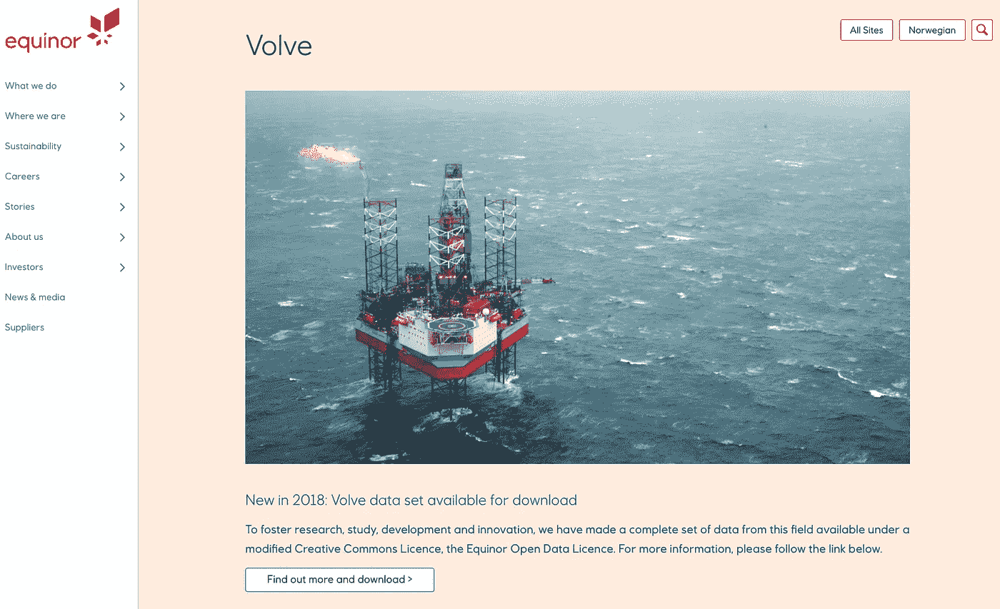

Equinor Volve 数据集网站。作者捕获的图像。

我们拥有的第一个数据集是 Equinor 在 2018 年发布的 Volve 数据集，作为一种通过提供完整和现实的案例研究来促进学习和研究的方式。Volve 油田位于挪威西海岸约 200 公里处，包含 10 年的数据。

该数据集包含大约 40，000 个文件，从测井数据到地质模型，对于任何希望从事岩石物理学、机器学习或数据科学的人来说，都是一座金矿。

一旦进入网站，你必须注册才能访问数据，但是一旦你进入网站，你就可以很容易地下载你需要的数据。

请点击下面的链接查看:

  

# NLOG —荷兰石油和天然气门户网站

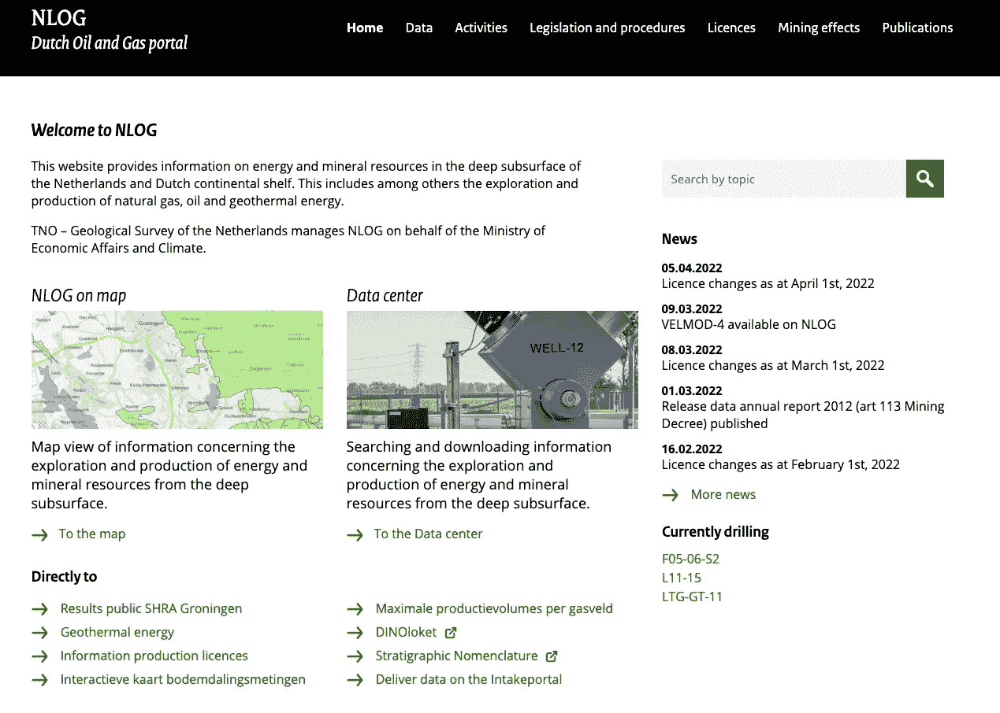

荷兰石油和天然气门户网站。作者捕获的图像。

荷兰有数千口油井的海上和陆上油井数据。dat 包含井眼测井数据、地震数据和生产数据的混合物。但是，找到您需要的数据可能很困难，您可能需要花一些时间在井中搜索。

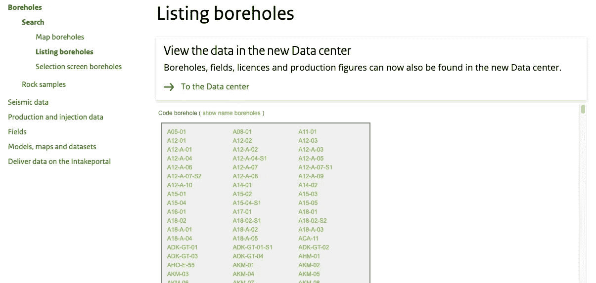

NLOG 网站上显示如何访问测井数据的示例。作者捕获的图像。

无需注册即可通过以下方式访问数据:

*   如果荷兰语不是您的第一语言，点击网页页脚的英语，将语言更改为英语
*   导航到主菜单中的数据
*   选择钻孔
*   在出现的左侧菜单中，单击搜索，然后列出钻孔或选择钻孔地图
*   从这里，您应该能够找到您需要的数据

根据我使用的井，从 L05、L06 和 L07 开始是一个好的起点。

请点击下面的链接查看:

<https://www.nlog.nl/>  

# XEEK —强制机器学习预测岩性

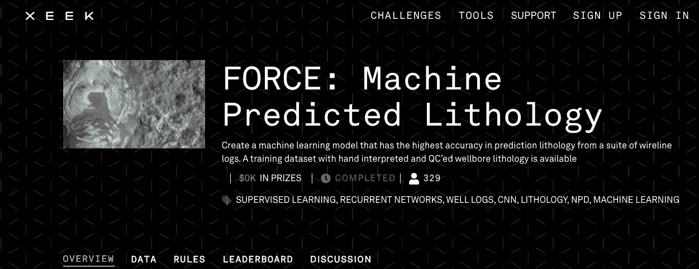

XEEK Force 2020 机器学习竞赛。作者捕获的图像。

2020 年，XEEK 和 Force 举办了一场机器学习比赛，目的是从测井测量中预测岩性数据。该数据集包含 100 多口井，混合了测井测量和地质解释岩性。

这个数据集为理解如何应用基于监督分类的机器学习算法提供了一个很好的机会。

点击以下链接访问:

  

或者您可以通过以下链接直接访问 github 资源库:

<https://github.com/bolgebrygg/Force-2020-Machine-Learning-competition>  

# 国家海洋石油信息管理系统

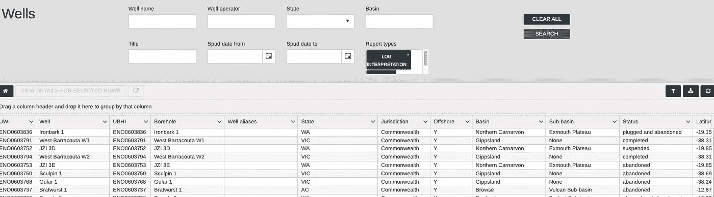

澳大利亚政府国家海洋石油信息管理系统(NOPIMS)的例子。作者捕获的图像。

澳大利亚政府发布了一个极好的数据库，其中包含澳大利亚近海的测井测量数据。这些数据很容易获取和搜索。

当你到达网站时，你会看到搜索框。如果您想浏览整个数据库，请将这些字段留空，然后按搜索。或者，如果您正在查找特定的数据类型，您可以从报告类型中选择它，然后按搜索。

您可以通过单击下面的链接来访问数据库:

<http://www.ga.gov.au/nopims>  

# COASTA 模型——碳酸盐测井和地震数据

COSTA 模型数据库最近由作者(Costa Gomes J、Geiger S 和 Arnold D)和 Heriot Watt 大学向公众发布。该数据库包含与碳酸盐岩层序相关的各种数据，包括测井测量、常规岩心分析和特殊岩心分析数据，以及静态和动态模型。

由于很难找到高质量的碳酸盐数据，这个数据集非常值得点击下面的链接查看。

<https://researchportal.hw.ac.uk/en/datasets/costa-model-hierarchical-carbonate-reservoir-benchmarking-case-st>  

# 堪萨斯地质调查局

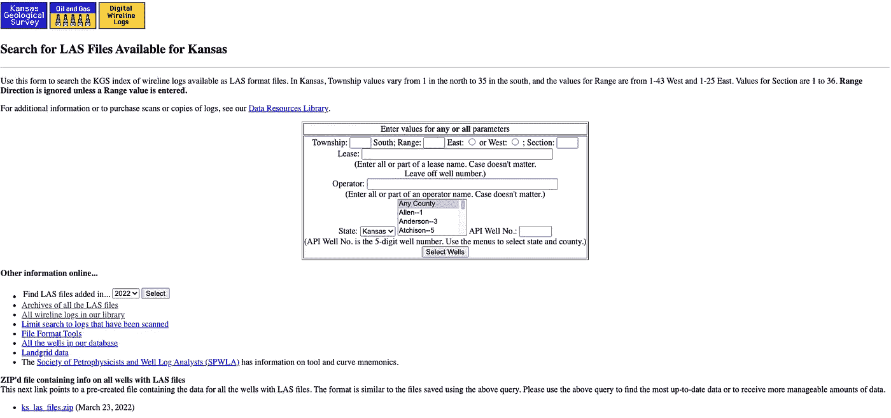

堪萨斯地质调查局网站。作者捕获的图像。

堪萨斯地质调查局公布了大量数据，包括岩心图像、电缆测井(LAS 文件)、顶部和其他相关的油井数据。

如果你熟悉的话，你可以根据县、运营商或租约进行手动搜索。或者您可以通过选择**其他在线信息**下的选项下载测井 ascii (LAS)文件。这将允许您下载特定年份的 LAS 文件、包含测井数据的油井信息等。

你可以点击下面的链接查看:

  

# 1240 口挪威油井的孔隙度、渗透率、岩石类型岩心数据

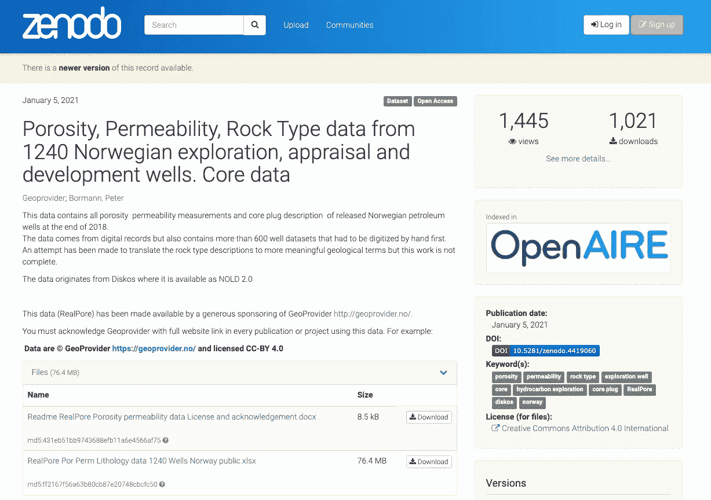

挪威岩心数据库包含 1240 口井的数据。作者捕获的图像。

挪威石油管理局在 2018 年底发布了 1240 口井的岩心测量数据。已经尝试进行有意义的岩石类型描述，但是，这项工作似乎不完整，使用这些数据时应小心谨慎。

您可以通过单击下面的链接来访问它:

<https://zenodo.org/record/4419060#.YiNGFO7P3kp>  

# 格罗宁根气田海燕地质模型

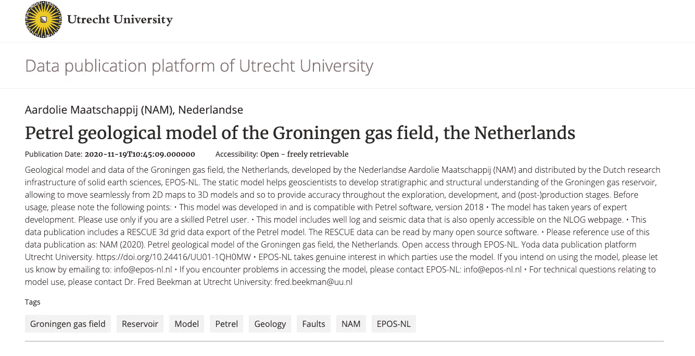

戈尔宁根气田海燕地质模型。

nederlandse Aardolie Maatschappij(NAM)开发并发布了荷兰格罗宁根气田的地质模型。

该模型是在 Petrel 2018 中开发的，包含许多开源软件包可以读取的 RESCUE 3D 网格数据。数据还包括测井数据和地震数据。

请点击下面的链接查看:

  

# 地下数据

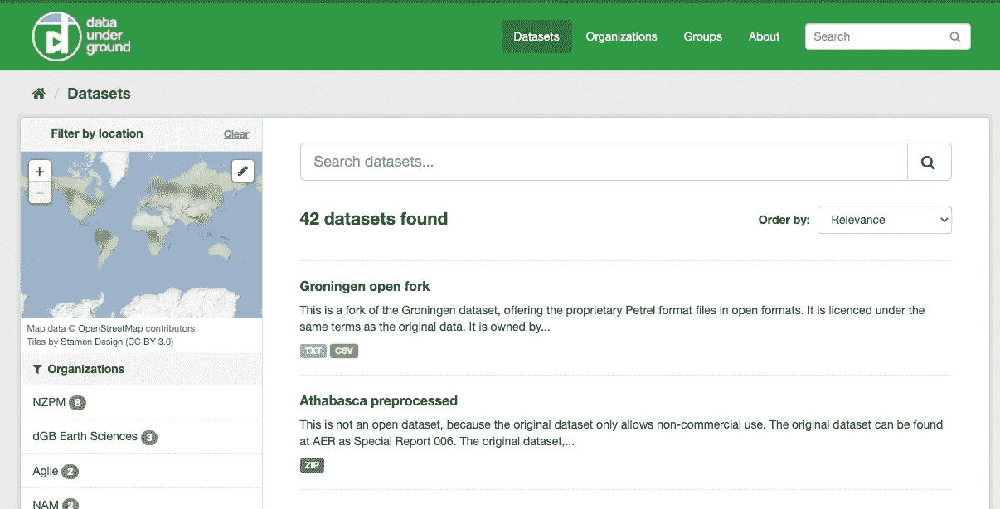

数据地下网站，允许您搜索基于地质和地球科学的数据。作者捕获的图像。

地下数据已经创建了一个可搜索数据库，您可以在其中找到在线地下数据集。这些包括来自全球各地的测井和地震数据。

请点击下面的链接查看:

  

# 国际海洋钻探计划

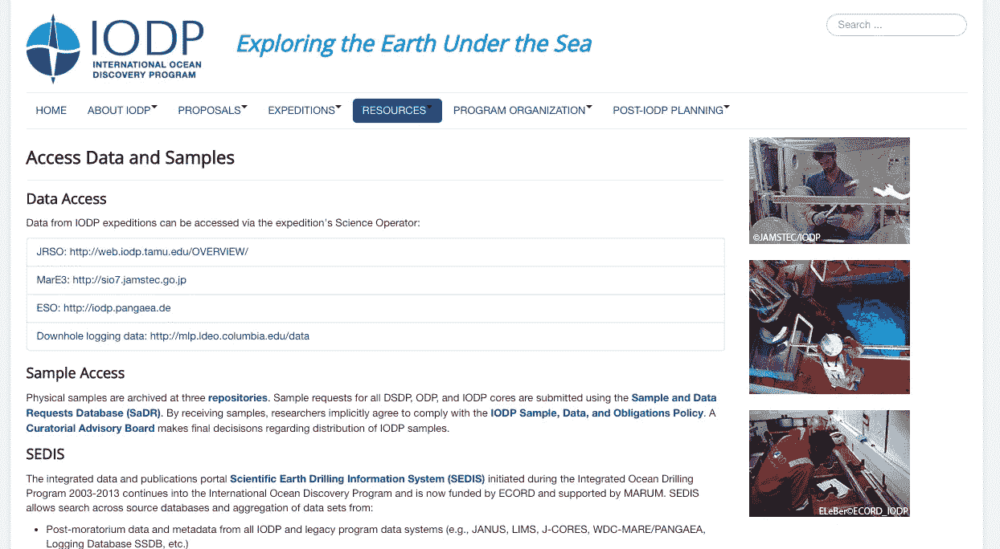

国际钻井计划，开放原始资料获取测井数据。作者捕获的图像。

测井数据不仅是在石油和天然气勘探期间获得的，也是作为科学勘探和研究的一部分获得的。JRSO 数据库包含从科学研究任务中获得的各种测井数据(测井、岩心、高级岩心分析),非常值得查看。

点击下面的链接查看:

<https://www.iodp.org/resources/access-data-and-samples>  

# 勘探地球物理学家协会(SEG)维基开放数据

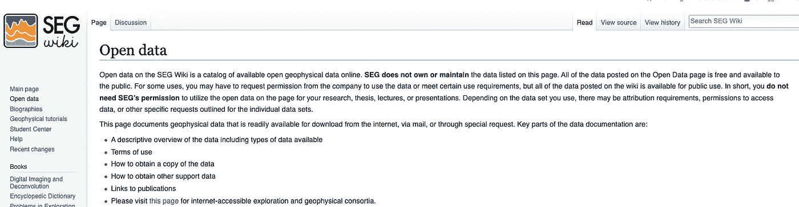

SEG Wiki 包含地球物理数据集的链接。作者捕获的图像。

勘探地球物理学家协会(SEG) Wiki 包含大量地球物理数据集的链接，可以直接下载或请求下载。

您可以通过以下链接访问维基:

<https://wiki.seg.org/wiki/Open_data>  

# *感谢阅读！*

*如果你觉得这篇文章有用，请随时查看我的其他文章，这些文章从不同的角度研究了 Python 和测井数据。你也可以在* [*GitHub*](https://github.com/andymcdgeo) *找到我在这篇文章和其他文章中使用的代码。*

*如果你想联系我，你可以在*[*LinkedIn*](https://www.linkedin.com/in/andymcdonaldgeo/)*或者我的* [*网站*](http://andymcdonald.scot/) *找到我。*

*有兴趣了解更多关于 python 和测井数据或岩石物理学的知识吗？跟我上* [*中*](https://andymcdonaldgeo.medium.com/subscribe) *。*

*如果你喜欢阅读这些教程，并且想支持我这个作家和创作者，那么请考虑报名成为一名 Medium 会员。一个月 5 美元，你就可以无限制地阅读数千篇各种主题的文章。如果您使用* [***我的链接***](https://andymcdonaldgeo.medium.com/membership)**注册，我将为您赚取一小笔佣金，无需额外费用！**

*<https://andymcdonaldgeo.medium.com/membership> *