# 在云中发布您的 Streamlit 应用

> 原文：<https://towardsdatascience.com/publish-your-streamlit-apps-in-the-cloud-3ac5a5fe3d51>

## 使用这些免费工具分享您的 Streamlit 应用程序:Streamlit Cloud、Github 和 VSCode

在 Streamlit Cloud 上运行的示例 Streamlit 应用程序—截图和作者提供的应用程序

您已经使用 Streamlit 创建了一个出色的数据科学应用程序，并且很自然地希望与世界分享它。

这很好，因为 Streamlit Cloud 让你免费发布无限数量的公共应用。如果你愿意，你可以拥有一个完整的应用程序库，并且创建和发布它们所需的所有工具都是免费的。

在本文中，我们将介绍发布首个 Streamlit 应用程序所需的步骤。

但首先你需要三样东西:一个 Streamlit 云账户，一个每个应用的 Github 存储库，为了让你自己轻松，一个可以很好地使用 Github 的编辑器(在本文中我将使用 VSCode)。

发布 Streamlit 应用程序需要四个步骤:

*   *开发您的应用并在本地测试*
*   *为应用程序创建一个 Github 存储库*
*   *将本地 app 推送到 Github*
*   *在 Streamlit Cloud 中创建一个新应用，并将其连接到回购*

在所有工作开始之前，还需要做一些设置，但是一旦完成，发布和更新就很简单了。

## 开源代码库

我们将从 Github 的中间开始。你需要建立一个账户，所以先去 GitHub 网站注册。开始时你会被要求经历一些困难，但没什么太难的——只要按照说明做就行了。

有不同的 Github 帐户，但对于我们的目的，我们需要的是一个基本的免费帐户。

一旦你有一个帐户，你可以创建你的第一个仓库。点击绿色的*创建存储库*按钮或*启动项目*按钮。

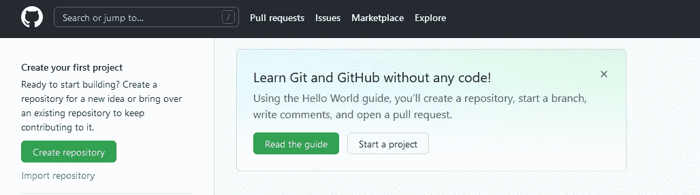

作者截图

这将弹出一个表格供您填写:

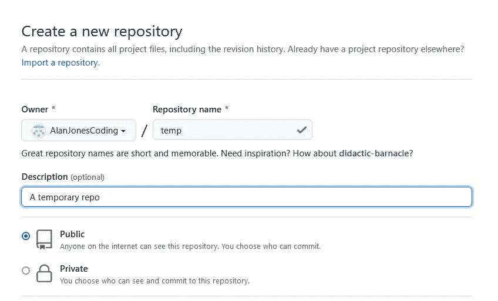

作者截图

给 repo 一个名称(上图中显示为“temp ”)和描述，并确保选择了 *Public* 选项。

然后会要求您指定一些选项。创建一个自述文件是一个好主意，您可以在其中描述回购的目的及其内容，因此选择该文件，它将自动为您创建。

*gitignore* 是一种指示 Git 忽略您不想包含在回购中的特定类型文件的方式——暂时忘掉它，我们不会使用它。

最后，选择一个许可证并点击*创建存储库*。

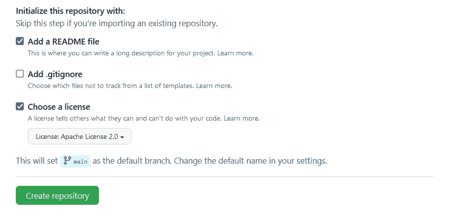

作者截图

你知道有一个地方保存你的 Streamlit 应用程序的代码，任何人都可以阅读，最重要的是通过 Streamlit 云。

现在，您已经有了一个可以下载到本地机器上的基本回购协议。为此，我们克隆了回购协议。单击 code 按钮并复制 url —稍后您将在 VSCode 中使用它。

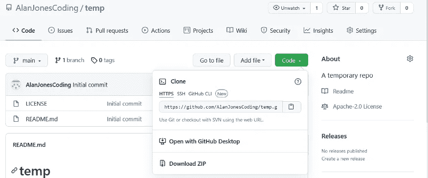

在 GitHub 中克隆存储库—图片由作者提供

## 虚拟代码

现在让我们转向编辑。如果您还没有 VSCode，那么下载并安装它，以及 Python 扩展(我假设您已经有 Python 了)。

打开 VSCode，关闭任何已经打开的文件或文件夹，并选择*源代码控制*图标。这使您可以选择打开一个现有的 Git repo 或克隆一个新的。我们要做的是后者。

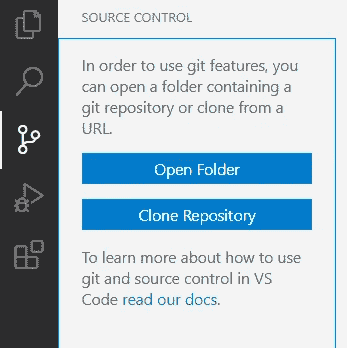

在 VSCode 中创建存储库—按作者排序的图像

点击*克隆库*，你会被要求提供一个 URL——这是我们刚才从 GitHub 网页上复制的，所以把它粘贴进去。

点击回车键，系统会询问你是否想打开回购——你当然想。然后它可能会问你是否信任回购协议的作者——同样，你信任(你信任自己，对吗？).

一两秒钟后，您应该会看到这样的内容:

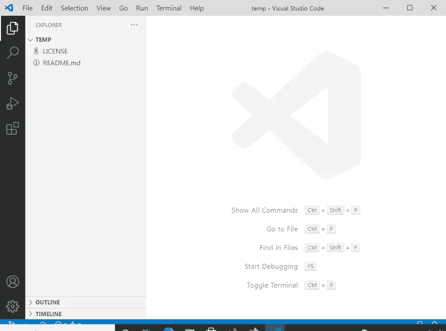

VSCode 中的一个新存储库—作者图片

现在我们准备创建一个新的应用程序。

在这里，我创建了一个简单的 Streamlit 应用程序，并准备从终端窗口运行它。

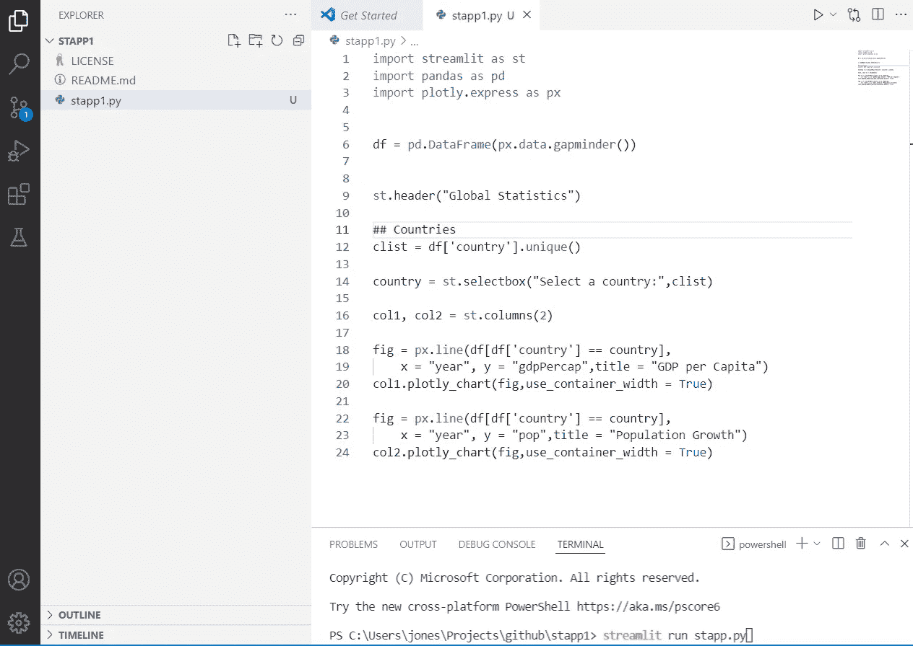

一款新应用——作者截图

它运行正常:

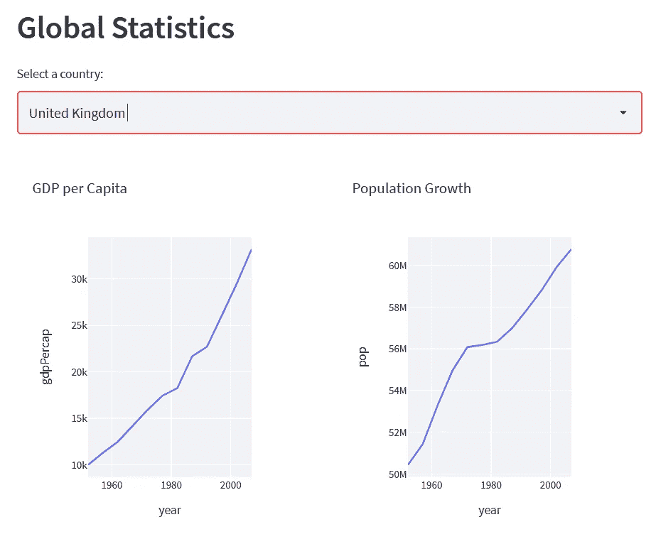

示例应用程序—作者截图

所以现在我们准备把它上传到我们新的 Github repo。

请注意，在 VSCode 中，源代码管理图标现在有了一个通知—这是因为发生了一些变化。再次打开源代码控制图标，您可以看到*改变了*列表 *stapp1.py* 。

## 关于 Git 的简短说明

Git 是 Github 使用的源代码控制系统，

从根本上说，它跟踪你在代码中所做的任何更改——编辑一个文件，Git 就知道了。但是为了更新一个项目，你需要*提交*变更。*提交*有两个部分，首先，您将想要提交的文件添加到提交中——这被称为 staging——然后，您实际上用一条短消息提交更改(通常描述您所做的更改)。通过这种方式，Git 保存了一个代码库，其中包含最新版本的最新文件以及所做更改的历史记录。

一旦你的代码版本*被提交*，它就可以*被推*到一个像 GitHub 这样的远程仓库，并与全世界(或你的团队)共享。

相反，一个版本的代码可以从远程存储库被*拉*到本地机器上进行处理，然后当你完成后被推回远程存储库。

## 回到应用程序

我们现在可以通过输入提交消息并点击`Ctrl+Enter`来提交我们的更改。

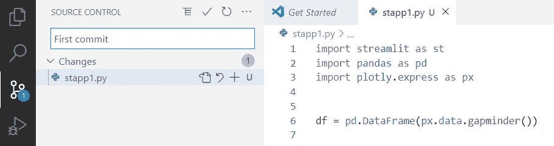

作者截图

现在，由于我们还没有*转移*变更，VSCode 会询问您是否想要自动转移它们，以及您是否应该总是这样做(或者从不这样做)。我从不费心准备事情，因为我总是希望我的所有更改都在提交中——如果你也想这样，那么选择*是*或*总是*。如果您选择*从不*，您将不得不手动进行分段。

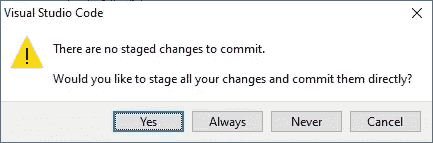

自动暂存—按作者分类的图像

您现在应该注意到通知已经消失了。

现在，我们做这一切的全部目的是将我们的代码保存在 GitHub 上，所以已经做了更改，我们现在需要将它推到那里。

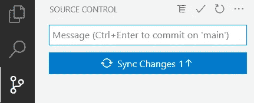

作者截图

只需点击蓝色按钮，更改将被推送到您的 Github repo。

第一次做这个 GitHub 需要知道你被授权推送你的回购。第一步:

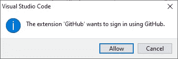

作者截图

这将打开一个浏览器窗口，并要求您以通常的方式登录 GitHub，以确认 VSCode 可以使用您的帐户。

当你完成后，本地回购将被推送到 GitHub。

成功！

我们已经创建了我们的应用程序，并将其推送到 Github，现在我们所要做的就是将它告诉 Streamlit Cloud！

## 流线云

有几个计划你可以报名参加。我们要的是*首发*计划。这是免费的，让你发布无限数量的公共 Streamlit 应用程序(和一个私人应用程序)。

因此，请访问 [Streamlit Cloud 网页](https://streamlit.io/cloud)，向下滚动直到找到注册部分。当我注册时，我不得不使用我的 Google 或 Github 帐户，这对我来说没问题，但我相信其他注册选项也在酝酿中。我注册了 Github，当然，Streamlit Cloud 需要能够访问你的 Github 库才能访问你的应用。

一旦你理清了你的 Streamlit 云账户，剩下的就一帆风顺了。

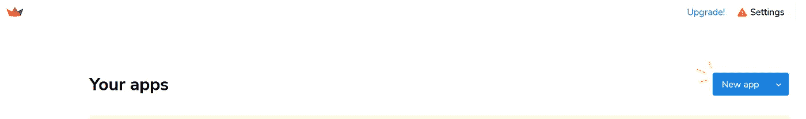

作者截图

点击*新应用*，系统会询问您应用的详细信息:

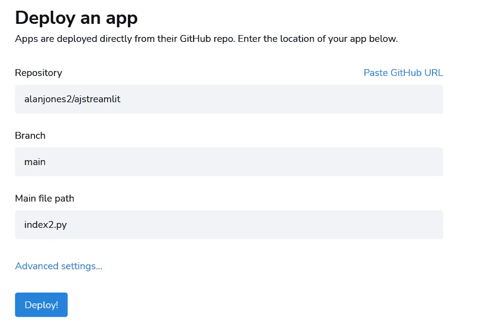

作者截图

键入存储库路径和 Streamlit 应用程序文件的名称，然后单击 *Deploy* (分支保持为“main”)。

Streamlit 现在似乎正在“烘烤”您的应用:

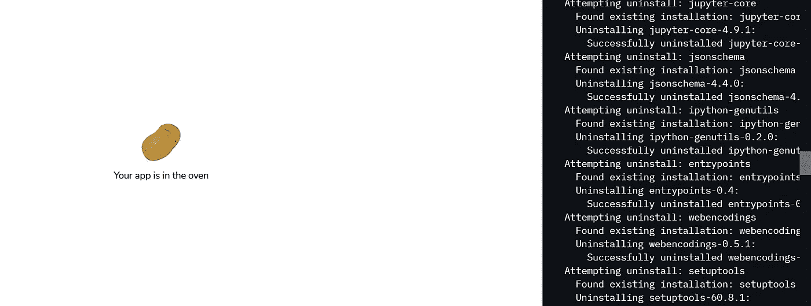

作者截图

右边的面板告诉你实际上正在发生什么，而左边的图标在各种食物之间循环(上面的那个应该是土豆)。

过了一会儿，你会得到一个卡通气球来庆祝你的应用程序已经可以使用了，它会适时地出现在屏幕上。

就是这样。您可以使用任意数量的公共应用程序浏览。唯一真正的限制是，如果你的应用程序没有收到太多流量，Streamlit 会让它休眠，以免浪费资源。当睡眠时，应用程序仍然可用，但在运行之前，它必须再次通过“烘焙”过程。Streamlit 将向你发送一封友好的电子邮件，告诉你他们何时会这样做，并建议你，如果你想，你可以简单地访问你的应用程序，以防止它打瞌睡。

因此，我们已经看到使用完全免费的工具来发布您的 Streamlit 应用程序是多么简单。我希望它是有用的，我将很快在云中看到你的应用程序。如果你这样做了，请在下面留下评论和链接。你可以在这里找到我的一些简单的努力。

一如既往地感谢你的阅读，如果你想知道我何时发表新文章，请考虑注册下面的电子邮件提醒或订阅我在[子栈](https://technofile.substack.com/)上的免费时事通讯。

如果你还不是一个媒体订阅者，那就注册吧，这样你就可以每月花 5 美元阅读尽可能多的文章。在这里注册，我将赚取一小笔佣金。

 [## AlanJones:编码、科学和技术

### 我为数据可视化和类似的主题撰写文章、实践教程和应用程序——大部分是用 Python 写的(参见一些……

alanjones2.github.io](https://alanjones2.github.io)