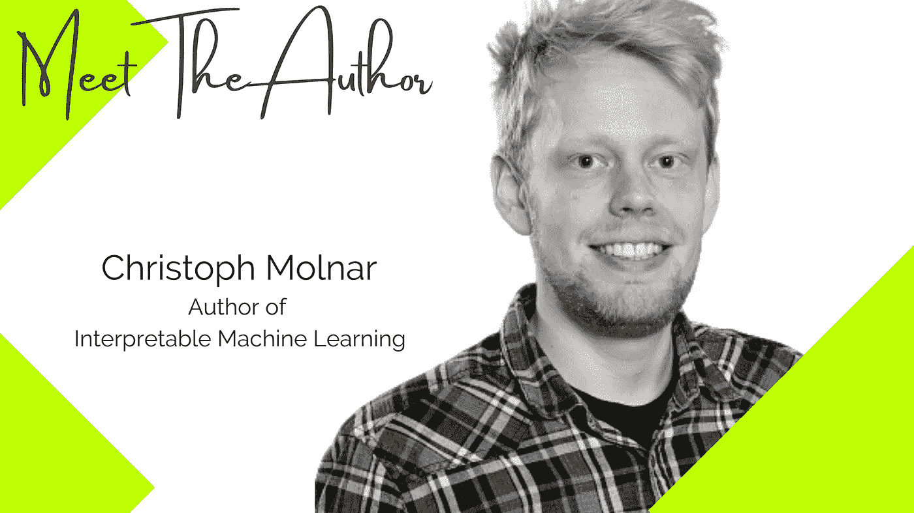
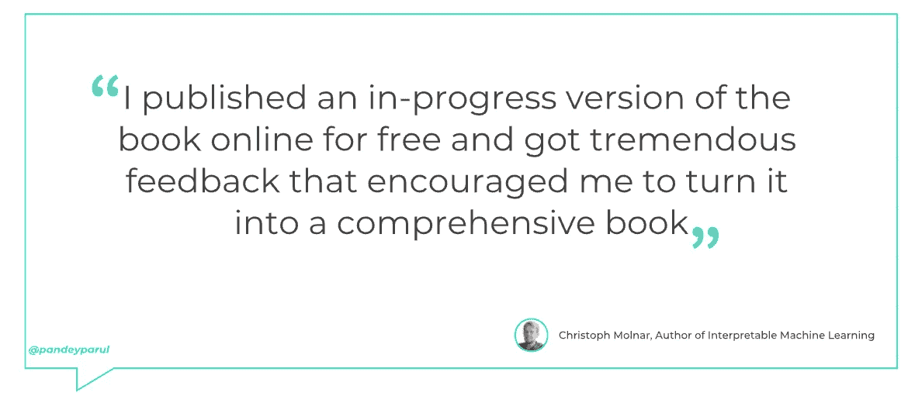
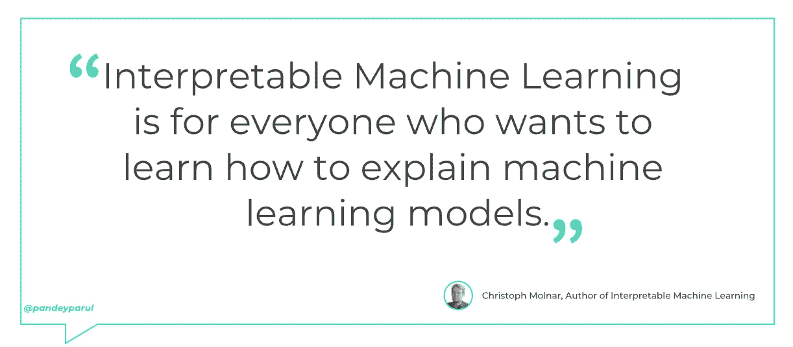

# 出版是强大的，因为它是范围和写作决策的催化剂

> 原文：<https://towardsdatascience.com/publishing-is-powerful-as-it-serves-as-a-catalyst-for-scope-and-writing-decisions-713306e8a0d>

## 《可解释的机器学习》一书的作者 Christoph Molnar 的访谈

*一系列采访强调了作家在数据科学领域的出色工作以及他们的写作之路。*

照片由[克里斯托夫·莫尔纳尔](https://www.slds.stat.uni-muenchen.de/people/molnar/)提供

> “如果你在书架上没有看到你想要的书，那就写出来。”——贝芙莉·克莱瑞

为了将这种引人注目的工作推向前沿，我去年开始了一系列采访。在 [**第一季**](https://github.com/parulnith/What-I-learnt-by-interviewing-numerous-Kaggle-Grandmasters) 中，我展示了来自知名数据科学家和 Kaggle 大师的故事，他们分享了他们的旅程、灵感和成就。第二季，我在采访书籍作者。作为一名作家，我非常尊重写书的人。一篇写得很好的文章需要大量的时间、精力和耐心，而为一本书复制同样的内容绝非易事。因此，本期访谈将揭示数据科学领域一些知名作者的故事。

# 见见作者:Christoph Molnar

Christoph Molnar 是一位机器学习专家，也是一位拥有统计学背景的独立作者。他在慕尼黑获得了学士和硕士学位，目前正在攻读可解释机器学习的博士学位。此前，Christoph 在金融行业的一家初创公司担任数据科学家，从事开发机器学习模型的工作。后来，他担任了一个更传统的角色，在一家风湿病患者登记处担任统计学家，与风湿病学家一起研究某些药物的效果。

如果你曾经想开始可解释的机器学习，你可能会挑选的第一本书是 Christoph 的 [**可解释的机器学习**](https://leanpub.com/interpretable-machine-learning) 。语言的清晰，现实的例子，以及将复杂的理论分解成更简单易懂的部分的艺术是这本书众多 USPs 中的几个。这本书的第二版最近已经发行，如果你想得到它，你可以在这里找到所有的信息。

 [## 可解释的机器学习

### 机器学习在改进产品、流程和研究方面潜力巨大。但是电脑通常不会…

christophm.github.io](https://christophm.github.io/interpretable-ml-book/) 

问:这本书的想法是如何产生的？

***克里斯托夫*** :在苏黎士，我做兼职，每个周五都在学习机器学习的新东西。最初，我上了一门关于深度学习的课程。然后，我开始看研究论文。我设法找到了著名的 LIME paper，它提出了一种解释黑盒机器学习模型预测的方法。因为我的统计学背景，我一直认为机器学习缺乏可解释性，所以我真的很喜欢论文的想法。

我被激励去学习更多，并开始寻找其他的解释方法，比如博客文章和书籍。然而，我没有找到太多关于机器学习可解释性的材料。我决定看论文，把方法总结成一本书。这成了我新的“星期五”计划。我在网上免费发布了这本书的进展版本，并得到了大量的反馈，鼓励我将它变成一本全面的书。

**问:你能为读者总结一下这本书的要点吗？**

***Christoph*** :可解释的机器学习涵盖了解释机器学习模型的各种方法。每章涵盖一种解释模型的方式。我希望这本书在很长一段时间内都是相关的，所以我主要讲述了所谓的模型不可知的方法。这些适用于任何机器学习模型。此类技术的一些著名示例有:置换特征重要性、Shapley 值、LIME、累积效应图等。但由于神经网络在任何地方都被广泛使用，因此一大部分也涵盖了专门解决深度学习的解释方法。

**问:** **你认为这本书的目标读者是谁？**

***Christoph*** :可解释的机器学习是为每一个想学习如何解释机器学习模型的人准备的。我知道许多建立预测模型的数据科学家都是这本书的读者。然后是机器学习的学生和老师，技术经理，还有很多其他人。

问:在你看来，充分利用这本书的最好方法是什么？

克里斯托夫:我曾经认为我的读者会根据他们想学的方法从一章跳到另一章。就像一本参考书。我很惊讶地得知，许多人仍然从头到尾地阅读它。

如果你是机器学习可解释性的新手，阅读可解释性机器学习会给你一个极好的主题概述。如果您目前正在研究一个预测模型，您可以将这本书作为参考。例如，这本书将允许你选择对你的问题有意义的解释方法。但是您也可以回顾每种解释方法的局限性和问题。

**问:** **对于一个刚刚起步的新作家，你有什么建议？**

***克里斯托夫*** :早发表，勤发表。出版是强大的。它是范围和写作决策的催化剂，有助于获得早期读者的反馈，是良好的营销，并使写作过程更像是与读者的对话。

**问:** **(在技术或非技术空间)你最喜欢的作者是谁？**

克里斯托夫:我喜欢布兰登·桑德森的奇幻小说。

👉**你期待与 Christoph 的交流吗？跟着他上** [**推特**](https://twitter.com/ChristophMolnar) **。**

👉**阅读本系列的其他访谈:**

 [## 不要只是做笔记——把它们变成文章并与他人分享

### 《机器学习图书营》一书的作者阿列克谢·格里戈里耶夫的采访。

towardsdatascience.com](/dont-just-take-notes-turn-them-into-articles-and-share-them-with-others-72aa43b83e29)  [## 你不会因为使用花哨的技术而变得更好，而是通过在基础上努力

### 《元学习:如何学习深度学习并在学习中茁壮成长》一书的作者 Radek Osmulski 的访谈

towardsdatascience.com](/you-do-not-become-better-by-employing-fancy-techniques-but-by-working-on-the-fundamentals-17d5c471c69c)