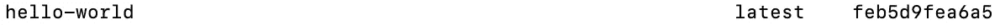
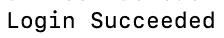
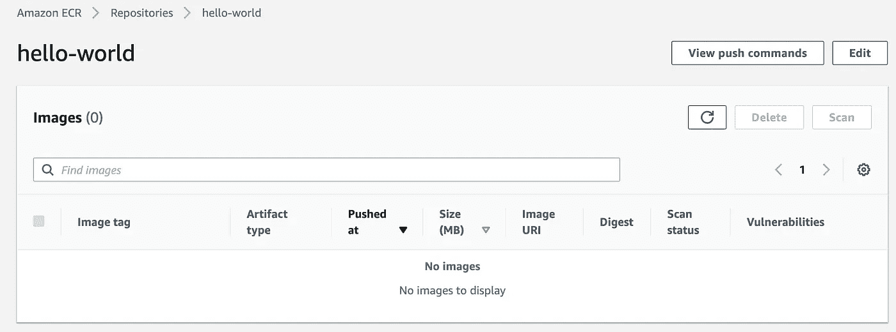
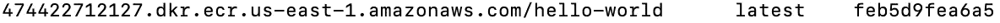
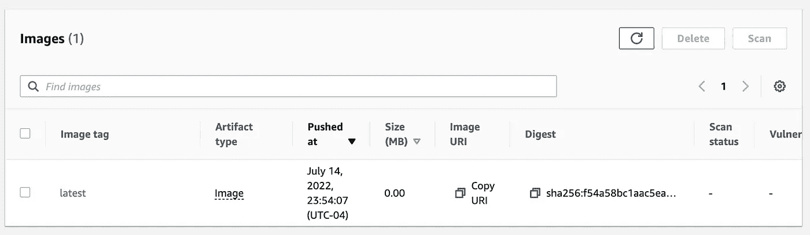

# 将 Docker 图像推送到 Amazon 弹性容器注册中心

> 原文：<https://towardsdatascience.com/pushing-docker-images-to-amazon-elastic-container-registry-830c301b8971>

## 逐步指南

图片来自 [Unsplash](https://unsplash.com/photos/SInhLTQouEk) 作者
张秀坤·吕克曼

[亚马逊弹性容器注册中心(ECR)](https://docs.aws.amazon.com/AmazonECR/latest/userguide/what-is-ecr.html) 是一个容器图像注册中心，我们可以在 AWS 上使用 push Docker 图像。为什么要使用[容器注册表](https://www.aquasec.com/cloud-native-academy/docker-container/docker-registry/#:~:text=A%20Docker%20registry%20is%20a,versions%20of%20a%20specific%20image.)？它有助于轻松管理您的各种图像和单独的项目。例如，当我第一次开始在本地使用 Docker 时，我并没有意识到我已经创建了多少图像。我很难为不同的项目跟踪我的图像，我需要一个中心资源，ECR 是我的首选注册表，因为我经常与 AWS 一起工作。

这就引出了我使用 ECR 的第二个原因。有不同的容器注册中心可用，但是如果您是 AWS 的大用户，ECR 可以直接与平台上的许多其他服务集成。这方面的例子包括为你的 [Lambda 函数](/building-aws-lambda-container-images-5c4a9a15e8a2)提供定制图像，为 [SageMaker 训练和推理](/bring-your-own-container-with-amazon-sagemaker-37211d8412f4)构建你自己的容器。在本文中，我们将快速了解如何将图像推送到 ECR 上的存储库中。

**注意**:对于刚接触 AWS 的人来说，如果你想继续学习，请确保在下面的 [**链接**](https://aws.amazon.com/console/) 中注册账户。本文还假设读者对 Docker、AWS 和使用 [AWS CLI](https://aws.plainenglish.io/an-introduction-to-the-aws-cli-54539f5e5fe7) 有基本的了解。

## 本地提取 Docker 图像

首先，确保你已经安装了[Docker](https://docs.docker.com/get-docker/)并且正在运行。在 AWS 端，确保您安装了[AWS CLI](https://docs.aws.amazon.com/cli/latest/userguide/getting-started-install.html)，以便我们使用 ECR 等服务。

为了简单起见，我们不担心构建我们自己的定制图像，我们可以从 Docker Hub 中为本文抓取一个现有的图像。

拉式 Docker 图像

如果运行以下命令，您应该能够看到 hello-world 图像。

列出 Docker 图像

Hello World Image(作者截图)

现在让我们将此图像推送到 ECR。

## 创建 ECR 存储库

在推送我们的映像之前，我们需要创建一个 ECR 存储库。所有这些与 ECR 的交互都可以通过 AWS CLI 进行管理。要进一步了解 CLI 的设置和配置，请参考这篇[文章](https://aws.plainenglish.io/an-introduction-to-the-aws-cli-54539f5e5fe7)。

在创建存储库之前，我们需要登录到我们的 ECR 注册中心，这可以通过下面的[命令](https://docs.aws.amazon.com/cli/latest/reference/ecr/get-login-password.html)来完成。

登录到 ECR

确保提供正确的帐户 ID，如果你遇到一个错误说“没有认证证书”，这将取决于你所在的地区。

登录到 ECR

登录后，我们可以通过“ [create repository](https://docs.aws.amazon.com/cli/latest/reference/ecr/create-repository.html) ”调用来创建我们的存储库。

创建存储库

成功创建后，您应该会在终端中看到您的存储库元数据，我们也可以在控制台中确认这一点。

hello-world 知识库已创建(作者截图)

接下来是获取我们的本地映像，并将其推送到我们创建的 hello-world 存储库中。

## 将图像推送到 ECR

在推送我们的图像之前，我们需要对其进行标记，以识别我们的存储库。预期格式如下:`*aws_account_id*.dkr.ecr.*region*.amazonaws.com/my-repository:tag`

我们可以将这种格式应用于您的“hello-world”图像，方法是使用以下命令对其进行标记。

标记本地图像

您还可以通过运行另一个“docker images”命令来列出并搜索新标记的图像，从而验证该图像是否已被正确标记。

标签图片(作者截图)

现在，我们可以用下面的命令将这个映像推送到 ECR。

将 Docker 图像推送到 ECR

我们可以通过再次检查控制台来验证 repo 中是否存在该映像。

图片推送(作者截图)

既然您的映像已经在存储库中，您就可以提取它，推送多个版本，就像您在本地使用 Docker 一样。这里的主要好处是你可以用注册表来组织和跟踪所有这些不同的项目和图像。

## 其他资源和结论

<https://github.com/RamVegiraju/AWS-CLI-Cheatsheet/blob/master/ecr.sh>  

您可以通过上面的链接访问所有 ECR AWS CLI 命令，还有用于 Lambda 等其他流行 AWS 服务的 CLI 命令。当您熟悉 Docker 和 CLI 时，使用 ECR 相当简单。如果你对 Docker with AWS 更感兴趣，请点击这里查看你在[上运行 Docker 的其他服务。](https://aws.amazon.com/docker/)

我希望这篇文章是将你的 Docker 图片推送到 ECR 的好入门，你可以在这里参考官方文档[。请随意查看下面的](https://docs.aws.amazon.com/AmazonECR/latest/userguide/docker-push-ecr-image.html)[列表](https://ram-vegiraju.medium.com/list/aws-42b81fcfe143)了解其他 AWS 内容。

*如果你喜欢这篇文章，请在*[*LinkedIn*](https://www.linkedin.com/in/ram-vegiraju-81272b162/)*上与我联系，并订阅我的媒体* [*简讯*](https://ram-vegiraju.medium.com/subscribe) *。如果你是新来的中号，用我的* [*会员推荐*](https://ram-vegiraju.medium.com/membership) *报名吧。*