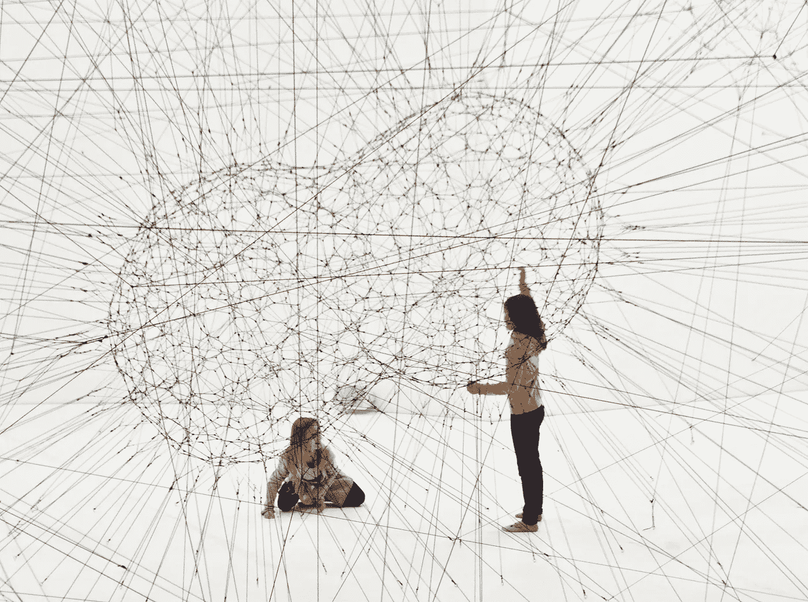
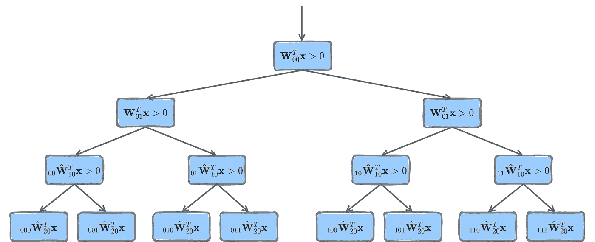

# 推动可解释的人工智能:神经网络是决策树

> 原文：<https://towardsdatascience.com/pushing-towards-the-explainable-ai-era-neural-networks-are-decision-trees-1603ab97eb1b>

## 探索一篇旨在解释 DNN 行为的新论文

最近，来自 AAC Technologies 的一位伟大的研究员卡格拉尔·艾特金发表了一篇题为“神经网络是决策树”的论文我仔细阅读了它，试图理解这篇论文的重大发现到底是什么。许多数据科学家可能会同意，许多转换会将一种算法转换成另一种算法。然而，(深度)神经网络(DNNs)很难解释。那么，艾特金是否发现了一些新的东西，让我们离可解释的人工智能时代更近了一步？

不溅

在这篇文章中，让我们探索这篇论文，并试图理解这是否真的是一个新发现。或者，我们将检查这是否只是任何数据科学家在处理 DNN 可解释性挑战时需要了解和记住的一个重要焦点。

# **简介和背景**

Aytekin 证明了任何具有分段线性激活函数的经典前馈 DNN(如 ReLU)都可以用决策树模型来表示。让我们回顾一下两者之间的主要区别:

> DNN 拟合参数，以**转换**输入，并间接指导其神经元的激活。
> 
> 决策树**明确适合**参数来引导数据流。

这篇论文的动机是**解决 DNN 模型的黑箱性质**并以另一种方式解释 DNN 行为。这项工作处理全连接和卷积网络，并提出了一个直接等价的决策树表示。因此，本质上，它检查了从 DNN 到决策树模型的转换，即在它们之间采用非线性的权重序列，并将其转换为新的权重结构。艾特金讨论的另一个结果是相应的 DNN 在计算复杂性方面的优势(存储内存更少)。

Frosst 和 Hinton 在他们的工作[4]“将神经网络提炼为软决策树”中提出了一种使用决策树来解释 DNNs 的伟大方法。然而，他们的工作不同于 Aytekin 的论文，因为他们结合了 DNN 和决策树的优点。

# **想法的关键部分**

通过计算新的权重来构建生成树:建议的算法采用到达网络的信号，并搜索 ReLUs 被激活和未被激活的信号。最终，算法(转换)替换/放置一个 1(或斜率值)和 0 的向量。

该算法在所有层上运行。对于每一层，它查看来自前一层的输入是什么，并计算每个输入的依赖关系。实际上，在每一层中，一个新的**有效滤波器**被选择，因此它将被应用于网络输入(基于先前的决定)。通过这样做，全连通 DNN 可以被表示为单个决策树，其中通过变换找到的有效矩阵充当分类规则。

您也可以针对卷积层实现它。主要区别在于，许多决策是在部分输入区域上做出的，而不是对图层的整个输入做出的。

关于**维数和计算复杂度:**得到的决策树中类别的数量显得巨大。在一个完全平衡的树中，我们需要 2 的树的深度的幂(难处理)。然而，我们还需要记住提供无损修剪的违反规则和冗余规则。

作者图片

# **总结和注意事项**

*   这个想法适用于分段线性激活函数的 DNN
*   神经网络是决策树这一观点的基础并不新鲜
*   就我个人而言，我发现解释和数学描述非常简单明了[1]，激励我使用它并推进可解释的人工智能领域
*   需要有人在 ResNet 上测试这个想法😊

# 参考

**原文可见:**[**https://arxiv.org/pdf/2210.05189.pdf**](https://arxiv.org/pdf/2210.05189.pdf)

[1]艾特金，卡格拉尔。"神经网络是决策树."arXiv 预印本 arXiv:2210.05189 (2022)。

**如果你想看 30 分钟。关于论文的采访看这里:**

[2]伟大的扬尼克·基尔彻在 YouTube 上就这篇论文采访了亚历山大·马蒂克:[https://www.youtube.com/watch?v=_okxGdHM5b8&ab _ channel =扬尼克·基尔彻](https://www.youtube.com/watch?v=_okxGdHM5b8&ab_channel=YannicKilcher)

**一篇关于将近似理论应用于深度学习以研究 DNN 模型如何以分层方式组织信号的伟大论文:**

[3]兰德尔·巴勒斯特里罗。“深度学习的样条理论。”机器学习国际会议。PMLR，2018。

**结合了决策树和 DNNs 力量的伟大作品:**

[4]弗罗斯特、尼古拉斯和杰弗里·辛顿。"将神经网络提炼为软决策树."arXiv 预印本 arXiv:1711.09784 (2017)。

**你可以在 Medium 上阅读一篇总结这项工作的帖子【4】:**

[5]razor think Inc，Medium，2019，将神经网络提取为软决策树。

# 关于作者

Barak Or 是一位企业家和 AI &导航专家；前高通。Barak 拥有 Technion 的工程学硕士学位、理学学士学位和经济学学士学位。Gemunder 奖的获得者。巴拉克完成了他在人工智能和传感器融合领域的博士学位。多篇论文和专利的作者。他是 ALMA Tech 的创始人兼首席执行官。一家人工智能和高级导航公司。