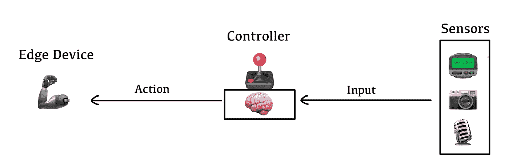
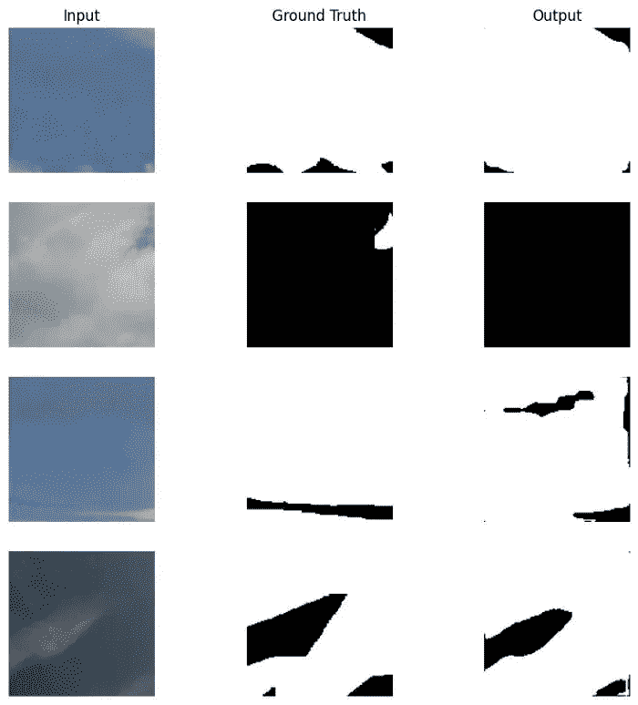
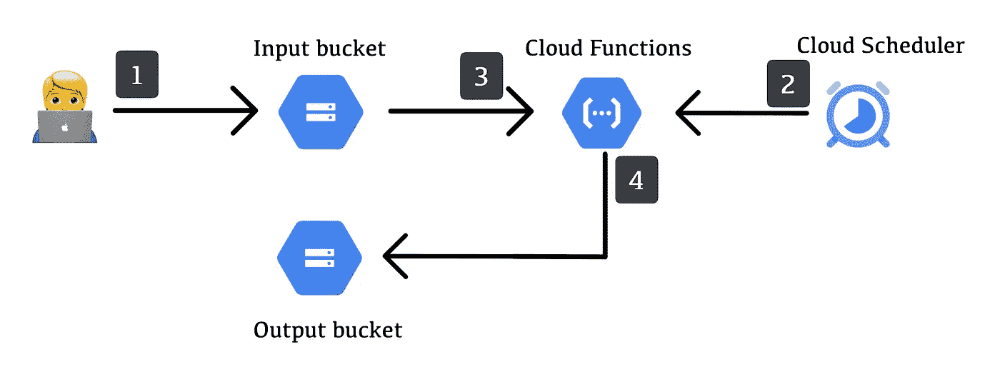
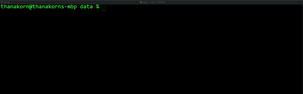
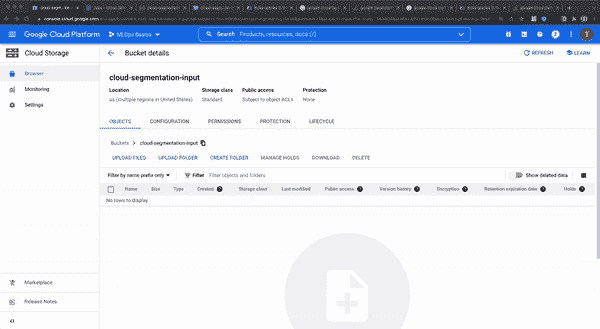

# 利用谷歌云平台和 DVC 将机器学习模型投入生产

> 原文：<https://towardsdatascience.com/putting-machine-learning-model-into-production-with-google-cloud-platform-and-dvc-f6a22cdcf4a5>

# 介绍

机器学习模型作为一个独立的产品没有太大的价值。无论他们的表现有多不可思议，在交付给相关用户之前，他们都没有给企业带来任何实质性的价值。然而，部署方面通常被考虑在 ML 项目的最后，因为它不是数据科学家熟悉的主题。

本文将展示一种简单的方法来将 ML 模型付诸实践，以及用来完成它的工具，这样那些从未部署过模型的人就能更好地了解它的样子。

# 模型部署策略

在我们开始之前，让我们看看有哪些选项可以用来部署我们的模型。将 ML 模型投入生产的方法有多种，大致可分为以下三类:

*   模型即服务(Model-as-a-service)
    模型是软件的一部分，它按照用户的要求实时提供服务。大多数情况下，它以 web 服务或 API 的形式出现，其中模型的输入和输出通过 HTTP 或其他众所周知的协议进行传输。


模型即服务策略(图片由作者提供)。

*   **批量预测** 与实时服务相反，批量预测策略离线进行推理。通过数据管道为模型准备输入，一旦处理完成，结果在交付给用户之前保存在数据库或数据存储器中。处理管道可以由计划的作业或用户请求触发，但输出不会实时提供。


批量预测策略(图片由作者提供)。

*   **边缘模型** 与前两种通过互联网来回传输输入和输出的策略不同，边缘模型策略在传感器收到数据后立即使用 ML 模型进行预测，以便做出实时决策。这些情况通常会在自动化系统、机器人和物联网应用中大量出现。



边缘模型策略(图片由作者提供)。

# 概观

我们将创建一个工作流，从云存储中获取图像，执行图像分割，并将结果放回云存储中。您可能已经猜到了，我们在这里使用的策略是*批量预测*。

## 模型

我们要部署的模型是一个图像分割模型，它可以识别图像中的云。模型的输入和输出如下:



模型输入和输出(图片由作者提供)。

关于模型架构、训练过程和性能的细节超出了本文的范围。我们将假设模型已经过训练，可以使用了。

## 数据管道

批外预测流水线包括如下 3 个阶段:

1.  用户上传图像到云存储桶(*)实际上，这个步骤可能由系统处理，而不是手动上传。然而，这不会影响我们的批量预测管道的工作方式*。
2.  调度的作业向 API 发送 HTTP 请求来触发计算。
3.  计算服务通过
    3.1 开始计算。下载一个训练好的模型
    3.2。下载输入云存储
    3.3 中的所有图片。对所有图像进行推理
4.  所有输出都保存到输出云存储中

下图显示了工作流程:



数据管道(图片作者提供)。

## 模型注册表

模型部署的另一个关键方面是软件组件(无论是应用程序、数据管道等。)访问训练好的模型。一个可能的选择是将训练好的模型存储在远程存储上，然后将文件路径放入配置文件中。这种方法，即使是一个有效的选项，也使得训练和部署模型的过程不连续，这导致了不期望的情况，例如应用程序没有意识到存在模型的较新版本，系统因为文件被重定位到新路径而无法启动，等等。现在更好且更广泛接受的方法是使用*模型注册中心*。

模型注册中心是一个集中的存储库，用于存储、版本化、服务和管理经过训练的 ML 模型。它充当模型开发和模型部署之间的桥梁，前者只需要知道模型应该在哪里注册，而后者只需要知道要使用什么模型。在这篇文章中，我们将使用*数据版本控制* (DVC)从 GitHub 项目中创建一个简单的模型注册表。

# 履行

## 管道组件

我们将使用 *Google 云存储*作为输入和输出桶，使用*云调度器*作为调度作业。下面是使用 Google Cloud SDK 创建 buckets 和计划作业的命令。您也可以通过 GCP 控制台或谷歌云 CLI 来完成这些操作。

对于计算服务，为了简单起见，使用了云函数，因为它只需要 Python 代码及其依赖项。*注意，在现实中，对于图像处理和深度学习等计算密集型任务，使用云运行或计算引擎等服务可能更好。*运行推理的代码如下:

```
def run_inference(request):     
    model = load_model()     
    with torch.no_grad():         
        for blob in input_bucket.list_blobs():             
            obj_name = blob.name             
            img = load_image(obj_name)             
            out = inference(img)             
            save_image(out, obj_name)             
            blob.delete()
```

函数`load_model`负责连接模型注册表并下载训练好的模型，而`load_image`、`save_image`、`inference`分别从指定位置读取/写入图像并进行推理。

## 模型加载

如前所述，我们将使用 DVC 创建一个简单的模型注册中心。简而言之，DVC 是一个用于数据科学项目的工具，它让你以类似于 Git 版本化你的源代码的方式来版本控制你的数据。DVC 的一个便利特性是，它可以让你毫不费力地将你的存储库变成一个数据注册中心。假设您有一个 DVC 项目，其中有一组被跟踪的文件，您可以像这样列出并下载所有被跟踪的文件。



使用 DVC 加载模型(图片由作者提供)。

除了使用 CLI，DVC 还提供 Python API，允许您以编程方式使用这些功能。我们使用这个 API 从存储库中加载训练好的模型，如下所示:

```
import dvc.api  
def load_model():
  with dvc.api.open(path=model_path, repo=url, mode='rb') as f:         
       params = yaml.safe_load(io.BytesIO(f.read()))
       model_params = params['model'] with dvc.api.open(path=model_path, repo=repo_url, mode='rb') as f:
       buffer = io.BytesIO(f.read())
       state_dict = torch.load(buffer) model = Model(n_classes=model_params['n_classes'],
                in_channel=model_params['in_channels'])
  model.load_state_dict(state_dict)

  return model
```

## 部署

即使我们可以手动部署代码，最好是自动化这个过程。我们可以使用 GitHub Actions 通过 google 提供的插件[Google-GitHub-Actions/deploy-Cloud-Functions](https://cloud.google.com/blog/topics/developers-practitioners/deploying-serverless-platforms-github-actions)来自动化云功能部署，如下所示:

```
name: Mergeon:
  push:
    branches:
      - mainjobs:
  deploy_function:
    runs-on: ubuntu-latest
    steps:
      - uses: actions/checkout@v2 - name: "Authenticate GCP"
        id: auth
        uses: google-github-actions/auth@v0
        with:
          credentials_json: ${{ secrets.gcp_credentials }} - name: "Deploy a Cloud Function"
        id: deploy-function
        uses: google-github-actions/deploy-cloud-functions@v0
        with:
          name: cloud-segmentation
          runtime: python37
          entry_point: run_inference
          memory_mb: 2048MB
          deploy_timeout: 600          
          env_vars: INPUT_BUCKET_NAME=cloud-segmentation-input,OUTPUT_BUCKET_NAME=cloud-segmentation-output
```

添加这个之后，每当新的 PR 合并到`main`分支，云功能就会自动部署。GCS bucket 和 scheduler 只创建一次，所以如果需要，我们可以手动创建。

下面的 GIF 显示了当我们将所有组件放在一起时管道的样子。



所有组件组装在一起(图片由作者提供)。

# 结论

正如您所看到的，尽管我们已经有了一个训练好的模型，但是要让它能够提供真正的价值，还有很多工作要做。选择部署策略、挑选模型服务模式、设计基础设施和构建 CI/CD 管道，所有这些对于机器学习项目的成功都至关重要，就像使用正确的算法、确保数据质量和训练模型以实现高精度指标一样重要。