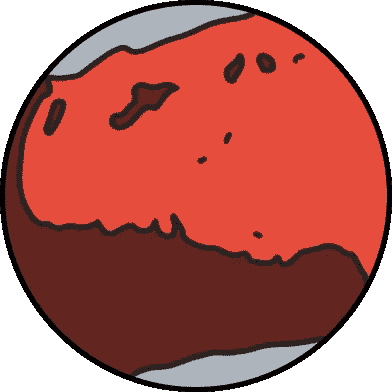
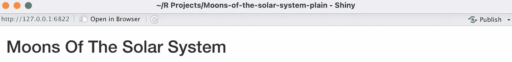
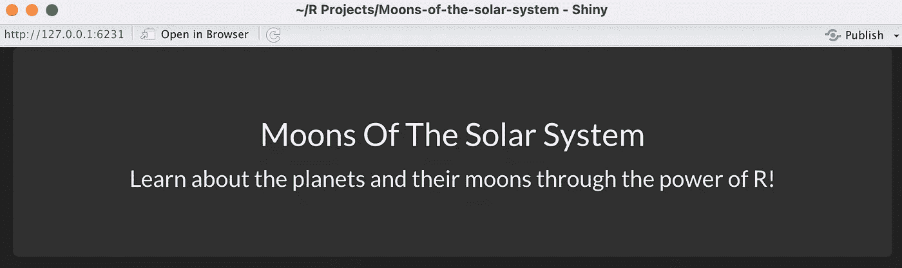
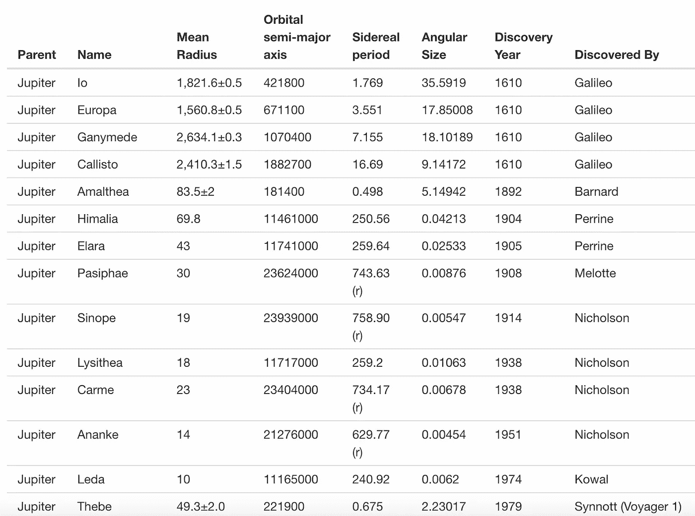
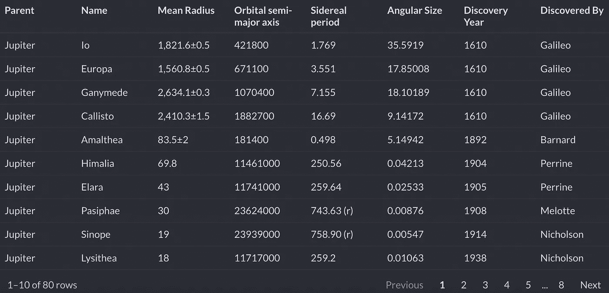
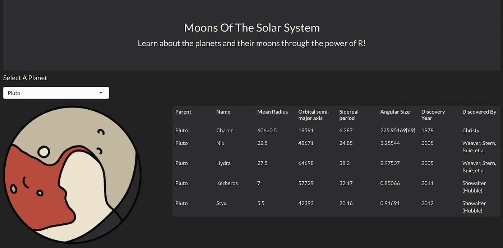

# 让闪亮的应用熠熠生辉

> 原文：<https://towardsdatascience.com/putting-the-shine-in-shiny-apps-e3de370b5661>

## 三个简单的技巧让你的 R 闪亮应用从枯燥变得漂亮



作者图片

闪亮的应用程序不一定很无聊。你可以做一些简单的事情，只用几行代码就能给你的应用程序带来活力！在本教程中，我们将使用一个简单的、信息丰富的关于太阳系卫星的应用程序，并给它一点光亮。

# 逃离地心引力的计划

简而言之，我们将把[这个普通的应用](https://kendondarlington.shinyapps.io/Moons-of-the-solar-system-plain/)变成[这个有趣的应用](https://kendondarlington.shinyapps.io/Moons-of-the-solar-system/)。这两个应用程序有完全相同的数据，但一个比另一个看起来更专业一些。如果你曾经做过一个闪亮的教程，你的应用可能最终看起来像普通的。遵循一些提示，很容易从简单变得有趣。

# 数据

我们的应用将会是关于太阳系的卫星。这些数据只是来自维基百科页面的[自然卫星列表中的一个表格。本页列出了太阳系中所有已知的卫星(219 颗，还在继续，哇哦！).](https://en.wikipedia.org/wiki/List_of_natural_satellites)

# 简单的应用程序

先来看看[素 app](https://kendondarlington.shinyapps.io/Moons-of-the-solar-system-plain/) 。目标很简单，每个行星都有一个下拉列表，这个下拉列表显示了所选行星的卫星和一些相关的统计数据。

你可以从 [GitHub](https://github.com/KendonDarlington/R-moons-of-the-solar-system-plain) 下载 plain 应用的完整项目。只需将文件下载到您的计算机上，然后打开 R 项目。如果你想在本地运行这个程序，打开 Rproj 文件就可以了。

代码如下:

这里没什么可花哨的，显而易见。按照出现的顺序，我们有:

*   titlePanel:这是应用程序顶部的标题
*   选择输入:这让你选择一个星球来改变表格
*   tableOutput('moons '):这是我们的表，由后端(也就是' server '里面的东西)交给我们。
*   df:这是我们月球数据的一个数据框。
*   output$moons:这将获取我们的数据框，并对其应用一个简单的过滤器。在选择输入中选择的行星被传递到这个过滤器中，所以如果你选择“木星”，只有木星的卫星被返回到前端(也就是 ui 中的所有东西)。上面代码中的 tableOutput('moons ')只是等待 output$moons 告诉它该做什么。多好的羊啊。

你可能在读的时候睡着了，因为我在写的时候睡着了。是无聊的代码产生了无聊的 app。但是我们能做些什么来增加这个应用的趣味呢？

有趣的应用程序

现在我们开始有趣的东西，这里是[不那么简单的应用](https://kendondarlington.shinyapps.io/Moons-of-the-solar-system/)。同样的数据，只是显示方式略有不同。你可以下载整个 R 项目，包括我从 [GitHub](https://github.com/KendonDarlington/R-moons-of-the-solar-system) 手绘的行星图片。

这是新应用程序的代码。r:

现在，我们将讨论发生了哪些变化，以及这些变化有何帮助。

# 技巧 1:使用闪亮的主题

闪亮的主题是用一行代码让你的整个应用看起来更好的最简单的方法。如果你不知道，Shiny 默认使用 bootstrap，这是开发网站时广泛使用的 html 和 css 的集合。安装 shinythemes 包的说明可以在[这里](https://rstudio.github.io/shinythemes/)找到。

有相当多的主题可供选择，你可以在这里浏览它们，看看实际的配色方案，以及它们如何设计你可能放入闪亮应用程序的不同类型的对象(例如，下拉菜单、导航栏、按钮、表格等等！).例如，这是我选择添加到我们的应用程序的闪亮主题的完整调色板；[阴暗地](https://bootswatch.com/)。

将这个主题应用到我们的普通应用程序的代码是:

```
fluidPage(theme = shinytheme("darkly"),
```

您可以在 fluidPage 中添加您想要的主题。就是这样。确保将库(shinythemes)添加到文件的顶部。

# 技巧 2:利用引导程序

Bootstrap 是目前最强大的 HTML 可视化库。Bootstrap 有[转盘](https://getbootstrap.com/docs/5.2/components/carousel/)、[旋转器](https://getbootstrap.com/docs/5.2/components/spinners/)、[下拉](https://getbootstrap.com/docs/5.2/components/dropdowns/)等等！他们也有一些标准标题面板的漂亮替代品，比如[大屏幕](https://getbootstrap.com/docs/5.2/examples/jumbotron/)。

下面是实现超大屏幕的代码:

这是怎么回事？

*   标签$div:这创建了一个
*   class = "jumbotron text-center ":这将我们的 div 转换成一个超大屏幕。
*   样式:我在两个不同的地方去掉了 html 元素上面和下面的空白。这是可选的样式，但我更喜欢我的大屏幕稍微小一点。
*   标签$h2:这是大屏幕标题，也就是大文本。这相当于

    ## 元素。

*   p():这是 Shiny 版的

    ，是一个段落元素。这是小文。

“黑暗”闪亮的主题加上自举大屏幕是我们如何把这个标题:



作者图片

变成了这个标题:



作者图片

# 技巧 3:使用可反应表代替表格

所以 R 区的普通桌子有点烂。它们是有用的，但不是特别令人兴奋。r 为我们提供了几个漂亮有用的表选项，但是 Reactable 绝对是我最喜欢的。

Reactable 库是一个优秀的 JavaScript“React Table”库的实现，它充满了很酷的特性。这里的是这个库的一些特性的参考。我们追求的让普通应用看起来更好的主要特性是样式和分页。

我们希望我们的表匹配我们的“黑暗”引导主题，所以我们需要一些黑暗的表(我们的普通应用程序使用的默认表相当明亮)。

我们想要的第二个特性是分页，这意味着我们希望我们的表有一个固定的高度，并允许您“翻页”通过。我们最初的普通应用程序中的表格与我们的黑暗主题形成了过于明亮的对比。

这是我们的旧桌子，滚动了好几天:



作者图片

这是我们新的分页表格:



作者图片

下面是制作这个表格的代码:

那么我们在这里做了什么？

*   renderTable()已被 renderReactable()换出
*   options():这段代码只是用来设计我们的 reactable。如果这段代码不在这里，我们的 reactable 仍然可以很好地工作，只是不符合我们的主题。
*   reactable():这将我们的数据帧转换成一个 reactable 对象。

只是不要忘记在 ui 中将 tableOutput()替换为 reactableOutput！

# 技巧 4:使用图像

我不想这么说，但是数据表看起来可能有点无聊。在你的应用程序、网页或报告中添加相关图片可以更好地表达你的观点，同时让你的头脑看起来不那么无聊。

在我们的应用程序中，我用笔在平板电脑上画出了每个星球的图像。你不必走这么远，网上的普通旧图片就可以了。


作者图片

下面是基于下拉列表交换我们的行星图像的代码:

这段代码是这样工作的:

*   planet:这个变量保存我们选择输入的值。当我们在下拉菜单中选择一个新的行星时，这个动作会使这段代码失效，一个新的图像就会呈现出来
*   picFilePath:我们基于所选的行星构建图像的文件路径(例如，“地球”变成了“Earth.png”)。所有图像都位于 shiny 项目的主文件夹中，并通过相对文件路径进行访问。
*   return(list):这最终将我们的服务器代码变成了一个元素。
*   这些都是通过 imageOutput()在我们的 ui 中获得的

# 技巧 5:使用闪亮的布局

我们不必受限于自上而下读取的应用程序。Shiny 为我们提供了大量放置应用程序的选项。这些选项包括列、行、边栏、导航条等等！

我们采取了一个非常简单的方法，将我们非常垂直的普通应用程序转换成不需要滚动的水平应用程序。

代码如下:

我们只有一行两列。左栏是图像，右栏是可反应的。每列旁边的数字是它的大小。fluidRow 的总大小是 12，所以图像占总宽度的 1/3，表格占另外的 2/3。

这是最终产品:



作者图片

还不错！