# PyCaret 2.3.6 来了！了解新内容？

> 原文：<https://towardsdatascience.com/pycaret-2-3-6-is-here-learn-whats-new-1479c8bab8ad>

## 从 EDA 到部署到 AI 公平性 PyCaret 迄今为止最大的版本


官方文档—[https://py caret . git book . io](https://pycaret.gitbook.io)

# 🚀介绍

PyCaret 是一个用 Python 编写的开源、低代码的机器学习库，可以自动化机器学习工作流。这是一个端到端的机器学习和模型管理工具，可以成倍地加快实验周期，提高您的工作效率。

到目前为止，PyCaret 2.3.6 是新特性和功能方面最大的版本。本文展示了在最近发布的 [PyCaret 2.3.6](https://pycaret.gitbook.io/docs/get-started/release-notes#pycaret-2.3.6) 中添加的新功能的使用。

# 重要链接

📚[官方文件:](https://pycaret.gitbook.io)py caret 的圣经。一切都在这里。
🌐[官网:](https://www.pycaret.org)查看我们的官网
😺 [GitHub](https://www.github.com/pycaret/pycaret) 查看我们的 Git
⭐ [教程](https://pycaret.gitbook.io/docs/get-started/tutorials)py caret 新手？查看我们的官方笔记本！
📋[社区创建的示例笔记本](https://github.com/pycaret/pycaret/tree/master/examples)。
📙[博客](https://pycaret.gitbook.io/docs/learn-pycaret/official-blog)投稿人的教程和文章。❓常见问题解答查看常见问题。
📺[视频教程](https://pycaret.gitbook.io/docs/learn-pycaret/videos)我们的视频教程来自各种事件。
📢[讨论](https://github.com/pycaret/pycaret/discussions)有疑问？与社区和贡献者互动。
🛠️ [变更日志](https://pycaret.gitbook.io/docs/get-started/release-notes)变更和版本历史。
🙌[用户组](https://www.meetup.com/pycaret-user-group/)加入我们的 Meetup 用户组。

# 💻装置

安装很容易，只需几分钟。PyCaret 从 pip 的默认安装只安装在 [requirements.txt](https://github.com/pycaret/pycaret/blob/master/requirements.txt) 文件中列出的硬依赖项。

```
pip install pycaret
```

要安装完整版:

```
pip install pycaret[full]
```

# 📈仪表盘

此功能将为已训练的模型生成交互式仪表板。仪表板是使用[解释器仪表板](http://explainerdashboard.readthedocs.io)实现的。

```
**# load dataset**
from pycaret.datasets import get_data
data = get_data('iris')**# init setup**
from pycaret.classification import *
s = setup(data, target = 'species', session_id = 123)**# train model** lr = create_model('lr')**# generate dashboard** dashboard(lr)
```

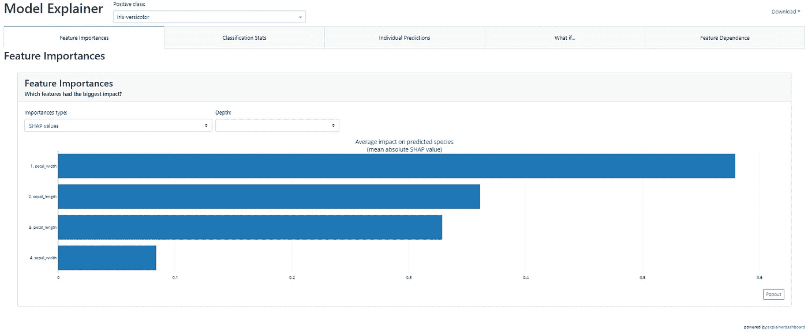

解释器仪表板

**视频演示:**

# 📊探索性数据分析

该功能将使用 [AutoViz](https://github.com/AutoViML/AutoViz) 集成生成自动化 EDA。

```
**# load dataset**
from pycaret.datasets import get_data
data = get_data('iris')**# init setup**
from pycaret.classification import *
s = setup(data, target = 'species', session_id = 123)**# generate EDA** eda()
```

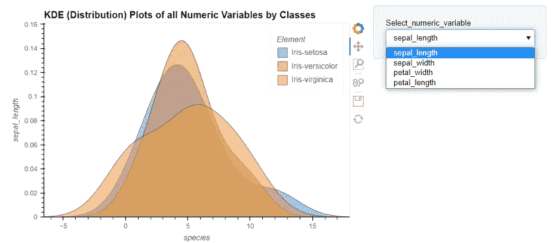

PyCaret 中的探索性数据分析(EDA)

**视频演示:**

# 🚊转换模型

该函数将训练好的机器学习模型转换成不同编程语言(Python，C，Java，Go，JavaScript，Visual Basic，C#，PowerShell，R，PHP，Dart，Haskell，Ruby，F#)的原生推理脚本。如果您想将模型部署到无法安装普通 Python 堆栈来支持模型推理的环境中，那么这个功能非常有用。

```
**# load dataset**
from pycaret.datasets import get_data
data = get_data('iris')**# init setup**
from pycaret.classification import *
s = setup(data, target = 'species', session_id = 123)**# train model** lr = create_model('lr')**# convert model** lr_java = convert_model(lr, language = 'java')
print(lr_java)
```

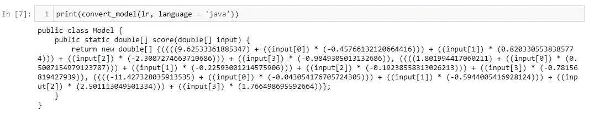

在 PyCaret 中转换模型

**视频演示:**

# ☑️检查公平性

有许多方法来概念化公平。这一新功能遵循了被称为[群体公平](https://github.com/fairlearn/fairlearn)的方法，该方法询问:哪些群体的个体有遭受伤害的风险。该函数提供不同组(也称为子群体)之间的公平性相关指标。

```
**# load dataset**
from pycaret.datasets import get_data
data = get_data('income')**# init setup**
from pycaret.classification import *
s = setup(data, target = 'income >50K', session_id = 123)**# train model** lr = create_model('lr')**# check fairness** check_fairness(lr, sensitive_features = ['race'])
```

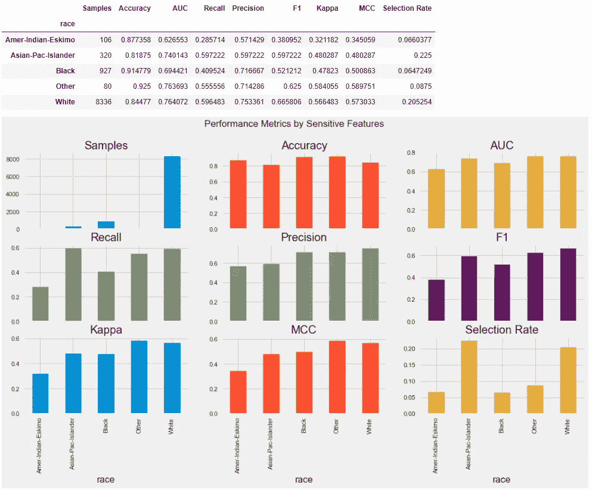

检查 PyCaret 中的公平性

**视频演示:**

# 📩创建 Web API

该函数将为 ML 管道创建一个 POST API，以便使用 [FastAPI](https://github.com/tiangolo/fastapi) 框架进行推理。它只创建 API，并不自动运行它。

```
**# load dataset**
from pycaret.datasets import get_data
data = get_data('iris')**# init setup**
from pycaret.classification import *
s = setup(data, target = 'species', session_id = 123)**# train model** lr = create_model('lr')**# create API** create_api(lr, 'my_first_api')**# Run the API
!python my_first_api.py**
```

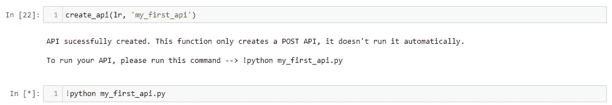

在 PyCaret 中创建 API 函数

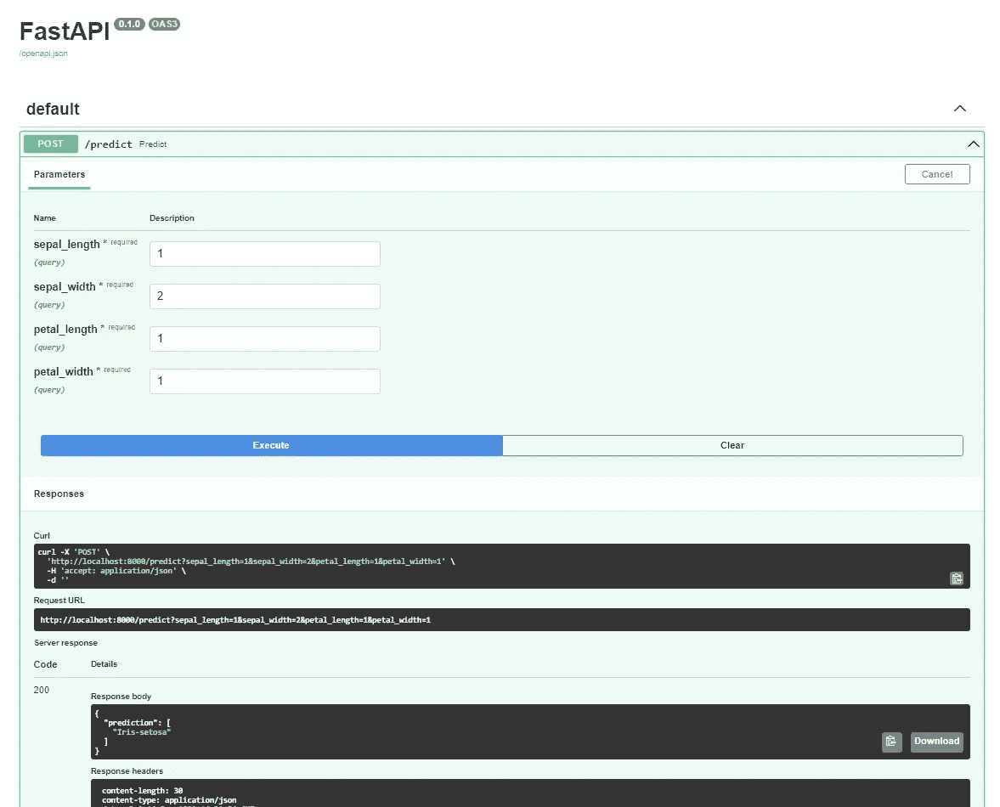

在 PyCaret 中创建 API 函数(在本地主机上测试)

**视频演示:**

# 🚢创建 Docker

这个函数将为您的 API 端点创建一个`Dockerfile`和`requirements`文件。

```
**# load dataset**
from pycaret.datasets import get_data
data = get_data('iris')**# init setup**
from pycaret.classification import *
s = setup(data, target = 'species', session_id = 123)**# train model** lr = create_model('lr')**# create API** create_api(lr, 'my_first_api')**# create Docker** create_docker('my_first_api')
```

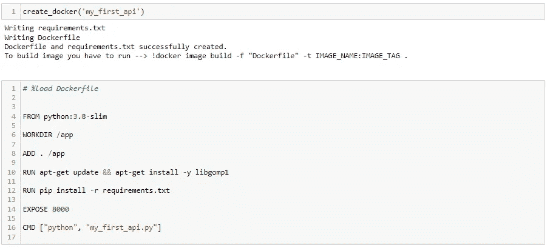

在 PyCaret 中创建 Docker 函数

**视频演示:**

# 💻创建 Web 应用程序

该功能创建一个基本的 [Gradio](https://github.com/gradio-app/gradio) web 应用程序用于推理。它稍后将扩展到其他应用程序类型，如 Streamlit。

```
**# load dataset**
from pycaret.datasets import get_data
data = get_data('iris')**# init setup**
from pycaret.classification import *
s = setup(data, target = 'species', session_id = 123)**# train model** lr = create_model('lr')**# create gradio app** create_app(lr)
```

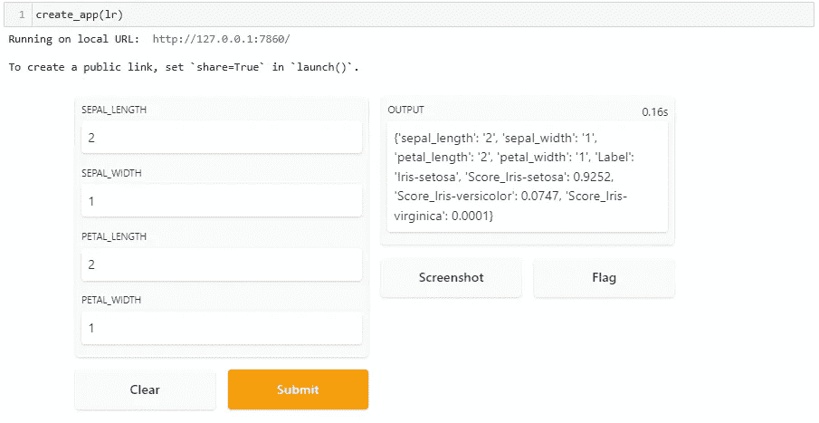

在 PyCaret 中创建应用程序函数

**视频演示:**

# 🎰监控 ML 模型的漂移

一个名为`drift_report`的新参数被添加到`predict_model`函数中，该函数使用[显然是 AI](https://github.com/evidentlyai/evidently?) 框架生成漂移报告。目前，这项功能还处于试验阶段，只能用于测试数据。稍后，它将被扩展用于生产用途。

```
**# load dataset**
from pycaret.datasets import get_data
data = get_data('iris')**# init setup**
from pycaret.classification import *
s = setup(data, target = 'species', session_id = 123)**# train model** lr = create_model('lr')**# generate report** preds = predict_model(lr, drift_report = True)
```

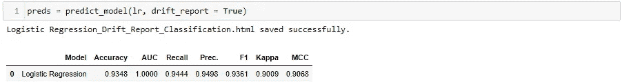

监控 PyCaret 中的漂移

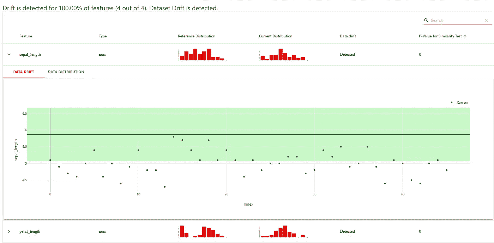

PyCaret 中的漂移报告(显然是使用 AI 生成的)

**视频演示:**

# 🔨地块模型现在更易于配置

函数 PyCaret 现在更具可配置性。例如，以前如果你想在混淆矩阵中看到百分比而不是绝对数字，这是不可能的，或者如果你想改变视觉效果的颜色图，这是不可能的。现在有了`plot_model`函数中的新参数`plot_kwargs`就有可能了。参见示例:

```
**# load dataset**
from pycaret.datasets import get_data
data = get_data('iris')**# init setup**
from pycaret.classification import *
s = setup(data, target = 'species', session_id = 123)**# train model** lr = create_model('lr')**# plot model (without plot kwargs)** plot_model(lr, plot = 'confusion_matrix') **# plot model (with plot kwargs)** plot_model(lr, plot = 'confusion_matrix', plot_kwargs = {'percent' : True})
```

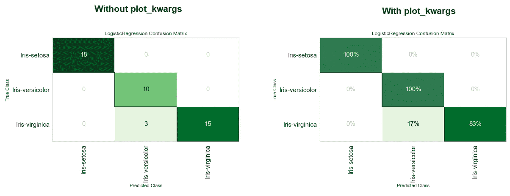

PyCaret 中的 plot_model 函数

# 🏆优化阈值

这不是一个新功能，但是在 2.3.6 中已经完全修改了。该函数用于优化二元分类问题的概率阈值。以前，您必须将成本函数作为`true_positive`、`false_positive`、`true_negative`、`false_negative`传递到这个函数中，现在它会自动选取所有指标，包括来自您的活动实验运行的自定义指标。

```
**# load dataset**
from pycaret.datasets import get_data
data = get_data('blood')**# init setup**
from pycaret.classification import *
s = setup(data, target = 'Class', session_id = 123)**# train model** lr = create_model('lr')**# optimize threshold** optimize_threshold(lr)
```

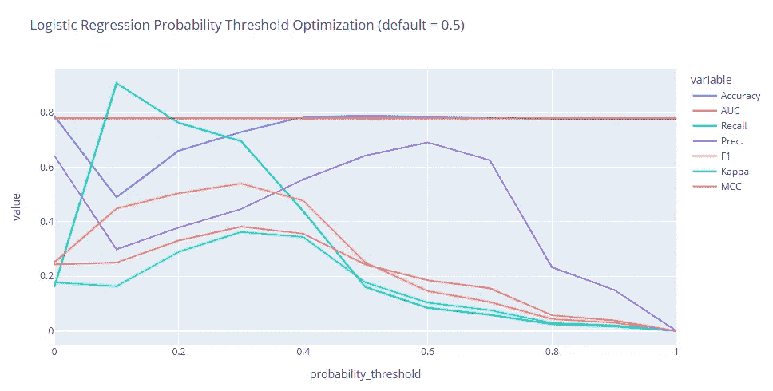

优化 PyCaret 中的阈值函数

# 📚新文档

最大也是最难的是全新的文档。从官方教程到发行说明，从 API 参考到社区贡献，这是 PyCaret 所有相关内容的唯一来源。观看视频:

最后，如果您想浏览 2.3.6 中添加的所有新功能，请观看这段 10 分钟的视频:

要了解 PyCaret 2.3.6 中的所有其他更改、错误修复和微小更新，请查看详细的[发行说明](https://github.com/pycaret/pycaret/releases/tag/2.3.6)。

感谢您的阅读。

# 作者:

我写的是 PyCaret 及其在现实世界中的用例，如果你想自动得到通知，你可以在 [Medium](https://medium.com/@moez-62905) 、 [LinkedIn](https://www.linkedin.com/in/profile-moez/) 和 [Twitter](https://twitter.com/moezpycaretorg1) 上关注我。