# PyCaret 3.0 即将推出-有什么新功能？

> 原文：<https://towardsdatascience.com/pycaret-3-0-is-coming-soon-whats-new-e890e6a69ff5>

## 首个候选版本最早将于 2022 年 5 月推出


安迪·赫尔曼万在 Unsplash[上的照片](https://unsplash.com?utm_source=medium&utm_medium=referral)

# 介绍

我们致力于 PyCaret 3.0 已经有一段时间了。此版本的主要目标是集成一个新的面向对象的 API，包括 PyCaret 的新时序模块，并提高管道性能和效率。这篇文章是对下一个版本的快速回顾。

PyCaret 是一个用 Python 编写的开源、低代码的机器学习库，可以自动化机器学习工作流。这是一个端到端的机器学习和模型管理工具，可以成倍地加快实验周期，提高您的工作效率。

想了解更多关于 PyCaret 的信息，可以查看官方[网站](https://www.pycaret.org/)或者 [GitHub](https://www.github.com/pycaret/pycaret) 。

# 完全兼容最新版本的 scikit-learn

PyCaret 2。x 需要 scikit-learn 0.23.2，这意味着如果您想在同一个 Python 环境中使用最新版本的 scikit-learn 和 PyCaret，您不能。直到现在。PyCaret 3.0 将与最新版本的 scikit-learn 完全兼容。


# 面向对象的 API

PyCaret 很棒，但是它缺少 Python 中最常见的工作方式。通过对象和类。这个变化要求我们重新思考我们在 1.0 发布时所做的许多设计决策。不用说，这是一个重大且具有挑战性的变革。让我们看看这对你意味着什么。

```
# Functional API (Existing)# load dataset
from pycaret.datasets import get_data
data = get_data('juice')# init setup
from pycaret.classification import *
s = setup(data, target = 'Purchase', session_id = 123)# compare models
best = compare_models()
```

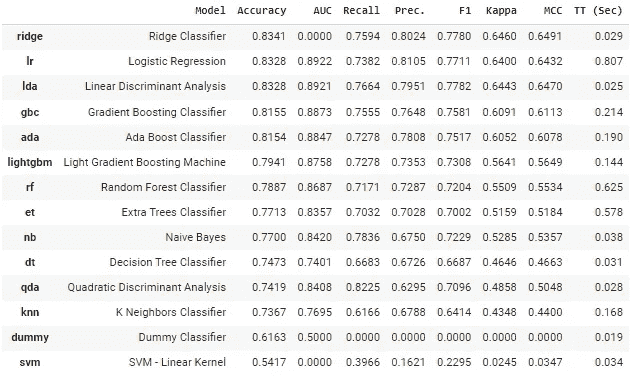

compare_models 的输出

这很好，但是如果现在您想在同一台笔记本电脑上用设置功能中的不同参数运行另一个实验呢？你可以这么做，但这会覆盖第一次实验的设置。使用我们新的面向对象的 API，因为设置与对象相关联，所以您可以在同一个笔记本中运行任意多的实验，并无缝地比较它们，不仅可以跨不同的建模选项，还可以跨不同的预处理设置。

```
**# load dataset**
from pycaret.datasets import get_data
data = get_data('juice')**# init setup 1** from pycaret.classification import ClassificationExperiment
exp1 = ClassificationExperiment()
exp1.setup(data, target = 'Purchase', session_id = 123)**# compare models init 1** best = exp1.compare_models()**# init setup 2** exp2 = ClassificationExperiment()
exp2.setup(data, target = 'Purchase', normalize = True, session_id = 123)**# compare models init 2** best2 = exp2.compare_models()
```

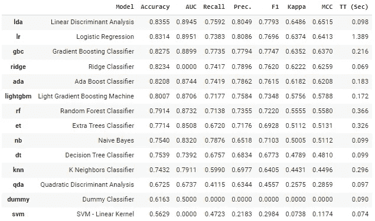

exp1.compare_models()的输出

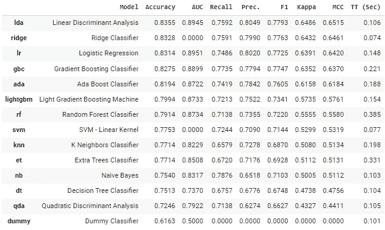

exp2.compare_models()的输出

您还可以使用`get_leaderboard`功能为每个实验生成排行榜，然后进行比较。

```
**# generate leaderboard** leaderboard_exp1 = exp1.get_leaderboard()
leaderboard_exp2 = exp2.get_leaderboard()
lb = pd.concat([leaderboard_exp1, leaderboard_exp2])
```

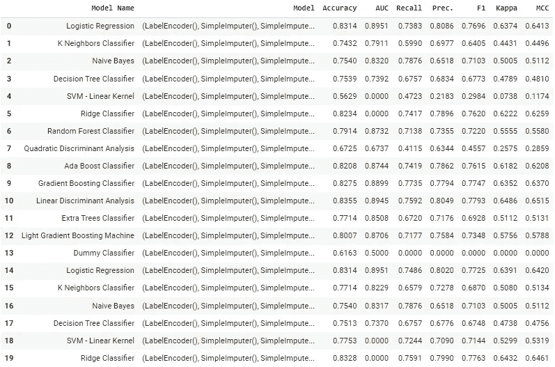

排行榜(为了显示，输出被截断)

```
**# print pipeline steps**
print(exp1.pipeline.steps)
print(exp21.pipeline.steps)
```

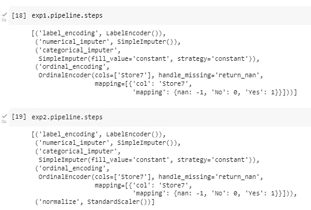

管道支出 1 /支出 2 步骤

您还可以随意在函数式 API 和面向对象 API 之间切换。

```
**# set current experiment to exp1**
from pycaret.classificatiom import set_current_experiment
set_current_experiment(exp1)
```

# 时间序列模块

PyCaret 的时序模块作为一个独立的 [PyPI](https://pypi.org/project/pycaret-ts-alpha/) 库(pycaret-ts-alpha)已经有一段时间了。现在它终于走到了一起，并将在 PyCaret 3.0 中普遍可用。

```
**# load dataset** from pycaret.datasets import get_data
data = get_data('airline')**# init setup**
from pycaret.time_series import *
s = setup(data, fh = 12, session_id = 123)**# compare models** best = compare_models()
```

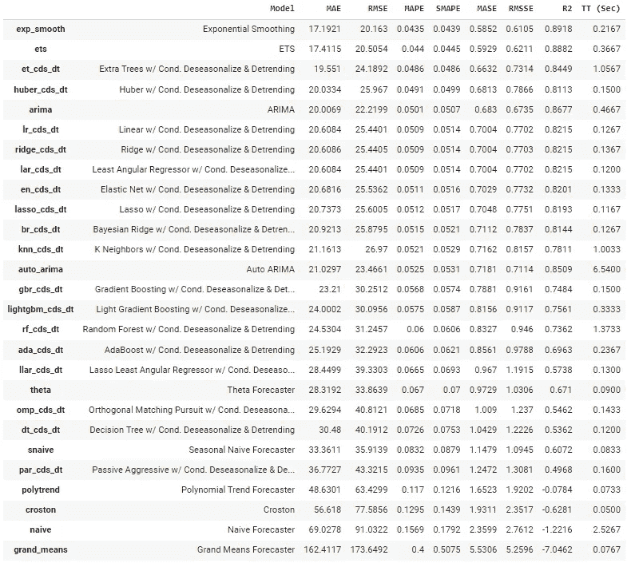

compare_models 的输出

```
**# forecast plot** plot_model(best, plot = 'forecast')
```

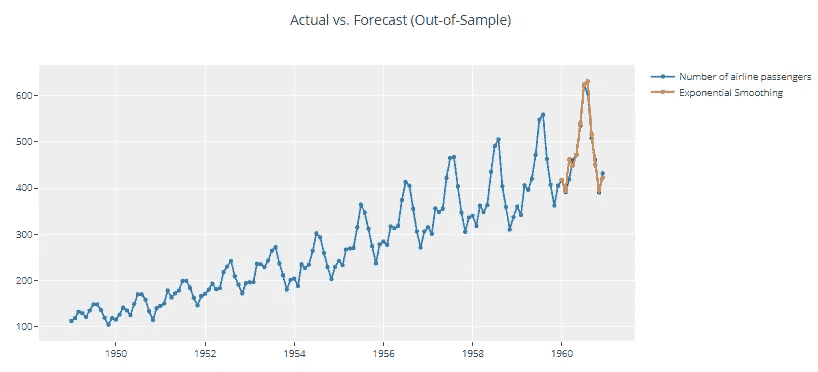

plot_model 的输出(最佳，plot = '预测')

# 改进的管道

预处理模块被完全重写，以实现与 scikit-learn 最新版本的兼容性，并提高效率和性能。3.0 中引入了几个新的预处理功能。x，其中之一是不同类型的分类编码。直到 2 点。x，分类特征仅使用一个热编码进行编码。2 中相同`random_state`的实验快速对比。x 对 3.X。

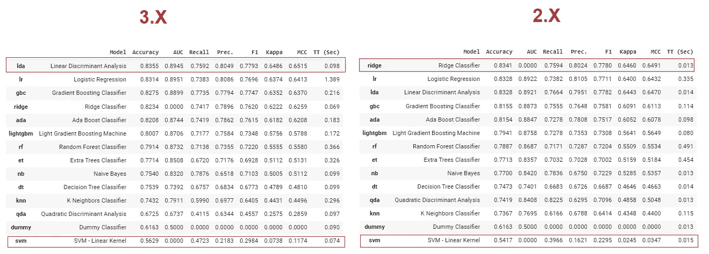

2 的比较。X / 3。收入数据集上的 x

3.0 中的一些新功能包括:

*   新的分类编码技术
*   为机器学习建模处理文本特征
*   检测异常值的新技术
*   特征选择的新技术
*   保证避免目标泄漏

# 模块化和轻量化

我们特别关注模块化和使 PyCaret 3.0 轻量级。如果只是比较 2 的`requirements.txt`。x 对 3。x，它的依赖性减少了 33%,并且在安装时间方面也有显著的改进。也将有一个单独安装模块的选项，如`pip install pycaret[nlp]`将安装 NLP 相关的依赖项。

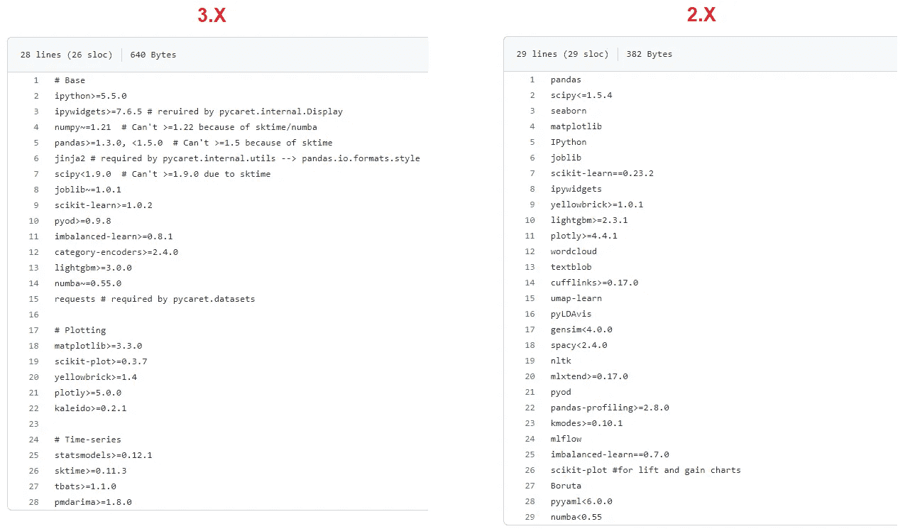

PyCaret 2 的 requirements.txt 比较。x 对 3。X

# 自动化数据类型处理

没有更多数据类型确认。当你在 3 中运行`setup`时。x，它不会出现在这里。然而，您仍然有能力使用`numeric_features`和`categorical_features`参数覆盖数据类型(这不会改变),但是`setup`函数的默认行为现在是静默的。因此`silent`参数将从设置中删除。

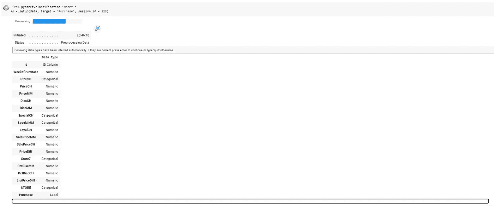

# 文本特征工程

PyCaret 3。x 将能够处理文本输入。如果您的数据集中有一个文本列，没问题，我们将从中提取要素以用于模型训练。`setup`中有两个新参数来解决这个问题。

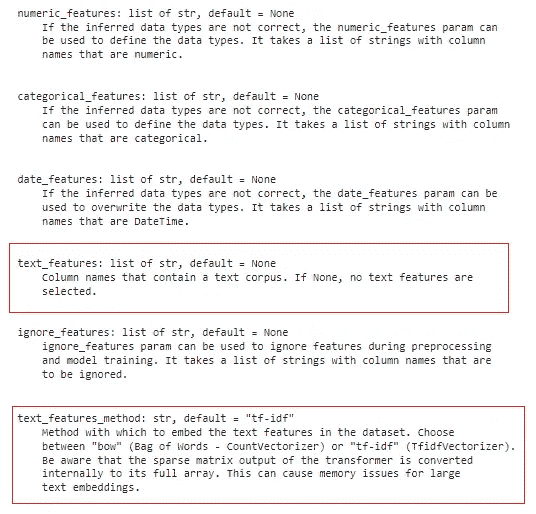

PyCaret 中的文本功能

> 我们正在寻找 3.0-rc 测试人员。请加入我们的[松驰](https://join.slack.com/t/pycaret/shared_invite/zt-row9phbm-BoJdEVPYnGf7_NxNBP307w)帮我们发布。

# 重要链接

📚[文档](https://pycaret.gitbook.io/)py caret 的详细 API 文档
⭐ [教程](https://pycaret.gitbook.io/docs/get-started/tutorials)py caret 新？查看我们的官方笔记本！
📋[社区创建的示例笔记本](https://pycaret.gitbook.io/docs/learn-pycaret/examples)。
📙[博客](https://pycaret.gitbook.io/docs/learn-pycaret/official-blog)投稿人的教程和文章。
📺[视频教程](https://pycaret.gitbook.io/docs/learn-pycaret/videos)我们的视频教程来自各种赛事。
📢[讨论](https://github.com/pycaret/pycaret/discussions)与社区和贡献者互动。
🛠️ [变更日志](https://pycaret.gitbook.io/docs/get-started/release-notes)变更和版本历史。

# 作者:

我写的是 PyCaret 及其在现实世界中的用例，如果你想自动得到通知，你可以在[媒体](https://medium.com/@moez-62905)、 [LinkedIn](https://www.linkedin.com/in/profile-moez/) 和 [Twitter](https://twitter.com/moezpycaretorg1) 上关注我。