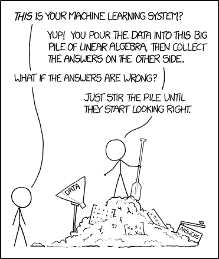
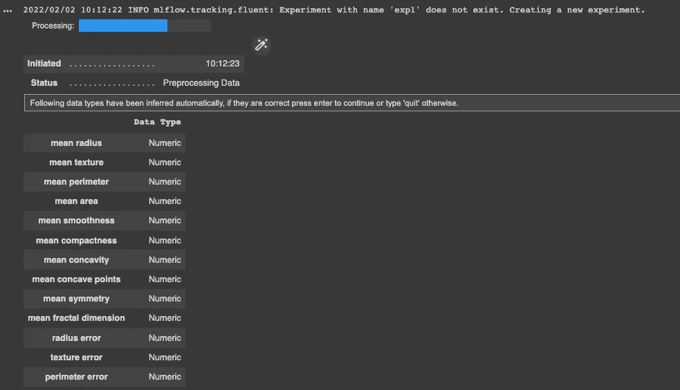
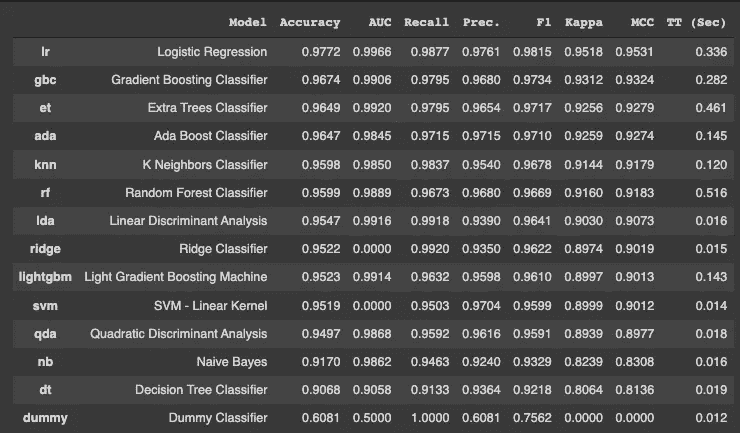
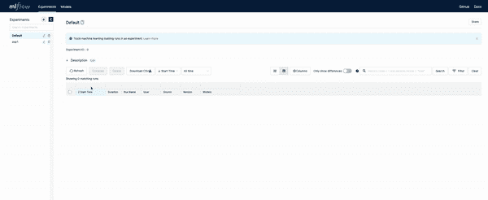
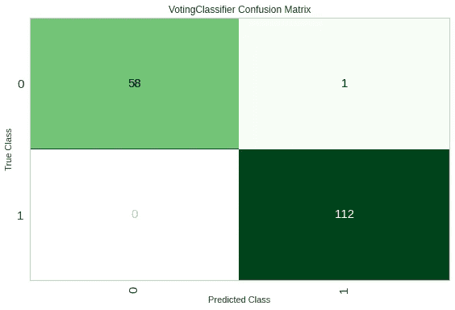
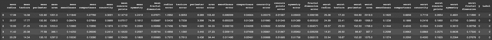
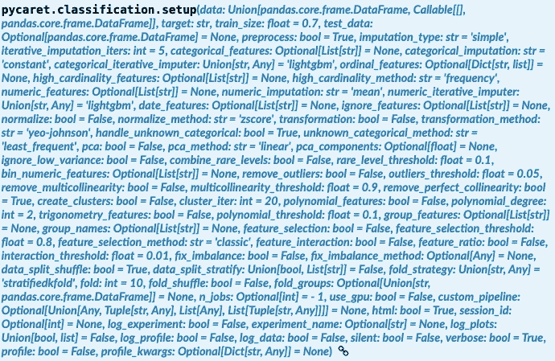

# PyCaret 分类:一个诚实的审查

> 原文：<https://towardsdatascience.com/pycaret-review-65cbe2f663bb>

## Python 的低代码机器学习库

我知道，这是脱字符而不是胡萝卜，但仍然… |照片由 [Miggz](https://unsplash.com/@miggz066?utm_source=unsplash&utm_medium=referral&utm_content=creditCopyText) 在 [Unsplash](https://unsplash.com/s/photos/carrot-bunny?utm_source=unsplash&utm_medium=referral&utm_content=creditCopyText) 上拍摄

又一个 ML 库？为什么？嗯，我不得不做一些快速 ML 工作，想尝试一些相当新的东西。我看到 PyCaret 到处跑，所以我必须试一试。

PyCaret 到底是什么？ **PyCaret 是 Python 的低代码开源机器学习库**。它基本上包装了一堆其他库，如`sklearn`和`xgboost`，并使**超级容易尝试许多不同的模型**，混合它们，堆叠它们，搅拌锅，直到有好的东西出来。从 0 到英雄只需要很少的代码。

> PyCaret 允许您尝试许多不同的模型，并有效地将它们集成为更好的模型。

今天我就来看看 PyCaret 的**分类模块，不过它也可以做回归，NLP，异常检测，聚类。我会告诉你**它有什么好处**，为什么以及何时应该使用它，还有**我不喜欢它的什么地方**。**

> 要获得所有媒体文章的完整信息，包括我的文章，请点击这里订阅。

# 让我们开始建立模型

归功于 [XKCD](https://xkcd.com/1838/)

因为我喜欢例子，所以我通过一个例子来做这个回顾。我们将从[乳腺癌威斯康星(诊断)数据集](https://archive.ics.uci.edu/ml/datasets/Breast+Cancer+Wisconsin+(Diagnostic))中构建一个分类器，我们可以轻松地用`sklearn`加载它:

我在这里导入了`mlfow`，因为 PyCaret 可以很好地使用它。这是分数 1，但是我们会更深入一点。现在，让我们看看准备数据集有多容易:

这个设置呼叫有很多其他选项，我建议你[查看文档](https://pycaret.readthedocs.io/en/latest/api/classification.html#module-pycaret.classification)了解更多细节。这里最重要的是:

*   设置要在其上构建模型的数据框架
*   设置`target`列名
*   将按照您的预期进行操作，并将缩放功能列，以便算法有更轻松的时间
*   `log_experiment`将实验记录到我们的`mlflow`实验中，`experiment_name`指定我们想要跟踪的确切实验

如果你在一个交互式环境中运行这个，比如本地 Jupyter 笔记本或者 Google Colab，那么你会被问一些问题，比如列类型。这相当简单，在这种情况下 PyCaret 在推断列类型方面做得很好，所以除了类型`y`之外，我们不需要做任何事情来确认。

PyCaret 将推断数据类型，并允许您以交互方式更改这些数据类型——作者截图

现在我们真的准备好训练一些模型了。但是是哪些呢？嗯，**为什么不尝试一大堆型号**？

这将尝试相当多的可用分类模型，根据它们的`f1`分数对它们进行排序，并将表现最好的 5 个模型保存到一个列表中。

太简单了，对吧？——gif 来自[期限](https://tenor.com/view/mr-bean-too-easy-easy-haha-mister-gif-13625767)

这是我们的输出:

已训练模型的指标—作者截图

现在告诉我你是否曾经训练过 12 个模型，包括比这更快的虚拟基线分类器？**这太牛逼了！**

# Mlflow 和 PyCaret 是朋友

此时，我想展示如何从 Google Colab 连接到`mlflow` ui，因为我一直在那里运行这段代码。谢天谢地，有人已经发现了这一点，所以我所需要做的就是用`pip`安装`pyngrok`，注册`pyngrok`以获得一个令牌，并运行以下代码:

然后点击印在底部的网址，你就到了天堂👼：

来自 Google Colab 的 mlflow UI 由作者捕获

> 如果你在本地运行，那么你可以直接跳转到本地的`mlflow` UI URL。如果你在 Databricks 上，那么你会在屏幕的右上角自动获得 UI 链接。

# 用一行代码调优模型🤯

现在我们有了这个任务的**前 5 个模型，让我们继续做一些**超参数调整** …在一行代码中！**

是的，这仍然是一行代码。

只需调用`tune_model`并传入我们的模型对象，PyCaret 就会为我们调优所有 5 个模型。所有这些仍然在`mlflow`中跟踪，因此您可以返回到 UI 并查看改进等。

# **在一行代码中混合模型😎**

当你可以融合它们的时候，为什么要满足于单一的模式呢？这是 Kagglers 的一项流行技术，其中一个人将采用多个模型，然后在模型上使用投票分类器——平均分数——以产生更强大的分类器。同样，PyCaret 可以在一行代码中为您做到这一点:

# 使用 PyCaret 绘图📝

一旦我们的模型被训练好了，我们很自然地会想看看它在视觉上的表现。在上面提到的`mlflow` UI 之上， **PyCaret 也可以非常容易地生成诊断图**。你可以绘制 ROC 曲线、混淆矩阵和一大堆其他有用的东西。

作者截图

如您所见，这显然是一个超级干净的数据集，对于今天的工具来说是一个非常简单的问题。

# 超级简单的预测

使用 PyCaret，您也不需要担心产生预测。这再一次变得超级简单，整个数据集以 dataframe 的形式返回，在末尾有一个额外的`Label`列，为您提供预测的类:

不确定你能不能看到这个，但是最后有一个标签栏，相信我！—作者截图

> 设置`raw_scores=True`查看概率。

# 超级棒的医生👏

以上总结了我们对一个简单模型的示例运行。您可以看到 PyCaret 非常容易用于分割训练/测试数据集、训练模型、调整它们、混合它们，甚至使用这些模型进行预测。最重要的是，整个事情可以在`mlflow`中直接跟踪。

**但也许 PyCaret 最好的特性是它的** [**文档**](https://pycaret.readthedocs.io/en/latest/index.html#) 。我发现**很容易阅读**，**组织得很好**，不同的 ML 任务有不同的部分，警告/提示分散在各处。它甚至还附带了一堆 [**教程笔记本**](https://pycaret.readthedocs.io/en/latest/tutorials.html) 。真的很容易上手。

# 坏的和丑的

你已经看到了好的部分，但如果不谈论坏的部分，这将是一个不公平的评论。我遇到了一些烦人的事情。

## 错误消息

尽管文档很好，**错误消息并不多**。举个例子，我试图用 PyCaret 做一些特性工程，创建一个列分组。问题是我的一些列被推断为`str`类型，而另一些列被推断为`int`。现在，PyCaret 不再友好地说“嘿，你有冲突的列类型”，它从不检查它们，而是在堆栈的最底部用失败:“不能比较 int 和 str”。对于一个新人来说，这可能会引起很多麻烦。考虑到 PyCaret 想要低代码，它应该迎合那些没有多少编码经验的人，否则**这些错误消息可能会让新手感到非常困惑**。

## 全球状态混乱

拉尔夫(拉维)凯登在 [Unsplash](https://unsplash.com/s/photos/mess?utm_source=unsplash&utm_medium=referral&utm_content=creditCopyText) 上的照片

您可能已经注意到了这一点，但是我们实际上并没有传递 setup 对象。我们刚刚说了使用此数据框架进行设置，然后给出了前 5 个模型。PyCaret 可以做到这一点，因为**它使用全局作用域来存储关于您的设置和意图的信息**。

出于几个原因，这是一个非常糟糕的编程实践。首先，这会降低**代码的可复制性**，对全局状态的更改会对您的模型产生意想不到的后果。如果您稍后运行另一个安装脚本会怎么样？其次，只是**很难读懂**。当计算出函数的输入时，您如何知道要寻找什么对象或代码行呢？

我知道 PyCaret 希望代码尽可能少，但我认为更严格的设置过程会让它受益。创建一个设置对象并显式地传递它。或者有一个类似`sklearn`和`sparkml`的管道模型。这可以使人们从许多令人头痛的事情中解脱出来，并且会使那些必须阅读 ML 代码的工程师们更加高兴。

## 太多的争论

对于某些函数来说，参数的数量可能会让人不知所措。我是说，看看这个:

[链接到文本](https://pycaret.readthedocs.io/en/latest/api/classification.html#pycaret.classification.setup) —作者截图

里面有很多东西。而且很容易漏掉一些东西。现在，我不得不告诉开发者，这在大多数地方都有非常合理的默认设置，但这仍然是**对单个功能**的大量责任。

更好的方法可能是将数据集分割、插补/清理和特征提取分成不同的类别或功能。然后，这些对象 c **可以被传递到主设置函数**中。

## 太多模型

拥有强大的力量……—来源:[吉菲](https://giphy.com/gifs/spiderman-diarrhea-9SINhrSE6gQsdGmDSK)

PyCaret 支持许多不同的模型，这很好，但不幸的是，其中一些**模型与其他模型不同，不会产生相同的输出**。不要期望我在这里提出一个解决方案，因为模型对象一致性不是一个简单的问题，但是让我给你一个你可能会发现的问题类型的例子。

`GaussianNB`一直以顶级表演者的身份出现，然而`sklearn`的实现并不产生概率，这意味着当混合时间到来时，整个事情都失败了。我可以解决这个问题的唯一方法是手动从最佳表现者中删除模型，或者预先指定一个模型列表。

# ⭐️⭐️⭐️⭐️⭐️总体印象

由 [Towfiqu barbhuiya](https://unsplash.com/@towfiqu999999?utm_source=unsplash&utm_medium=referral&utm_content=creditCopyText) 在 [Unsplash](https://unsplash.com/s/photos/excellent?utm_source=unsplash&utm_medium=referral&utm_content=creditCopyText) 上拍摄的照片

如果你想开始解决一个新问题，PyCaret 是一个很好的起点。不费吹灰之力，你马上就能得到一个工作模型。然后你可以很容易地开始**调整和堆叠**这些模型。一旦你对你的怪物组合满意了，**预测结果**就再简单不过了。这将使您能够专注于特征工程和将您的模型投入生产。

这是一款真正出色的工具，具有:

*   简单易用的界面
*   大量可供选择的型号
*   优秀的文档
*   伟大的`mlflow`整合

我故意没有深入研究 PyCaret 的更多功能，但您应该知道，它也可以用于并行(或在 GPU 上)训练模型，可以处理数据集分割、插补、特征提取和特征创建。它可以做很多事情，所以 [**在深入研究之前一定要阅读文档**](https://pycaret.readthedocs.io/en/latest/api/classification.html#) ！

> 谷歌 Colab 笔记本的链接可以在 [GitHub](https://github.com/niczky12/medium/blob/master/python/pycaret_review.ipynb) 上找到。

现在去做一些模型吧！

> 感谢您花时间阅读本文！我主要写的是数据科学工具和 Julia，所以如果你喜欢这篇文章，请随意订阅！

</end-to-end-bigquery-machine-learning-e7e6e2e83b34>  </reading-csv-files-with-julia-e2623fb62938> 