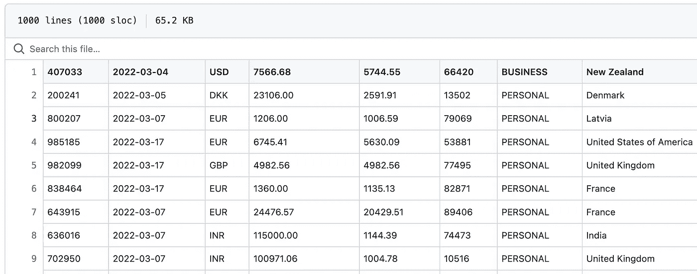
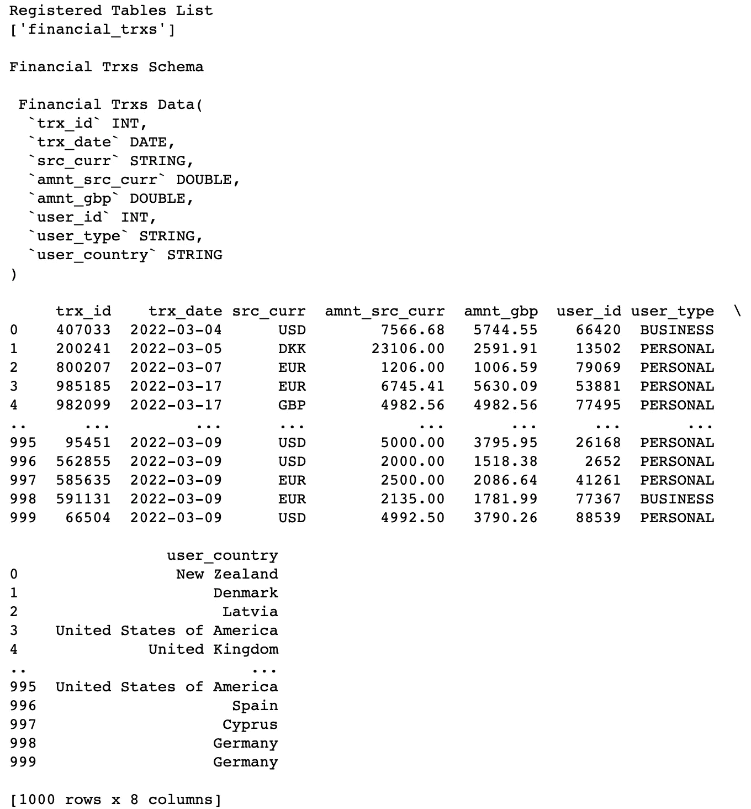
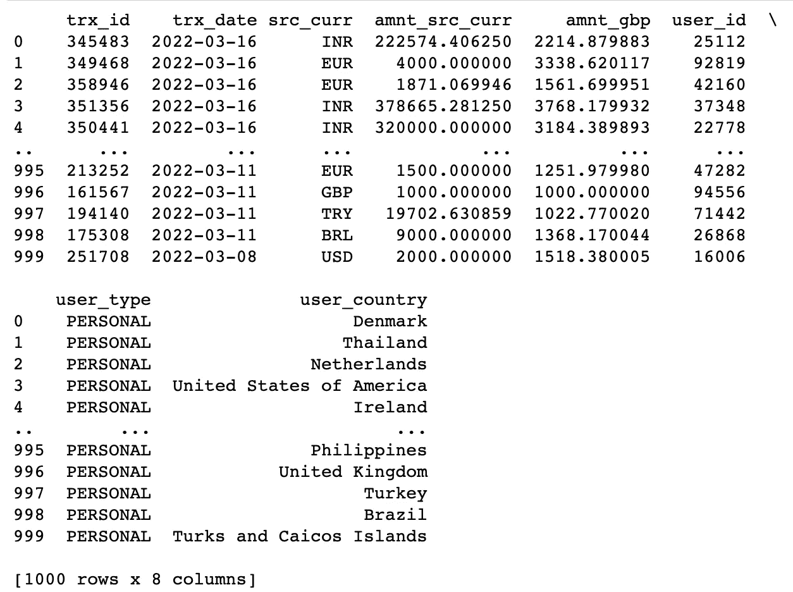
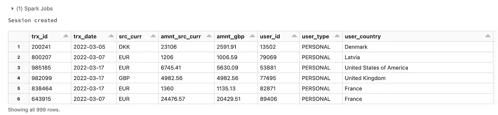

# 如何从一个 CSV 源文件创建一个表格

> 原文：<https://towardsdatascience.com/pyflink-how-to-create-a-table-from-a-csv-source-ca4851a71d0c>

## 在关于 Apache Flink 的第一篇教程中，学习如何使用 Python Table API 将数据从 CSV 源导入到表中。


大卫·塞尔伯特在 Pexels.com 拍摄的照片

## 建议的点播课程

*您是否希望了解更多关于****Apache Flink****，****Apache Spark****及其他* ***数据流*** *技术？以下是一些用 Python 教授的在线课程，强烈推荐:*

*   [**Apache Flink 关系编程使用表 API 和 SQL**](https://click.linksynergy.com/deeplink?id=533LxfDBSaM&mid=47900&murl=https%3A%2F%2Fwww.udemy.com%2Fcourse%2Fapache-flink-relational-programming-using-table-api-and-sql%2F%3FranMID%3D39197%26ranEAID%3D533LxfDBSaM%26ranSiteID%3D533LxfDBSaM-C8L7.VkktnuTmHaetMczNw%26utm_source%3Daff-campaign%26utm_medium%3Dudemyads%26LSNPUBID%3D533LxfDBSaM)
*   [**阿帕奇卡夫卡&阿帕奇火花纳米级**](https://imp.i115008.net/zaX10r) 数据流
*   [**数据工程纳米学位**](https://imp.i115008.net/jWWEGv) **→** *优质课程+编码项目如果你有更多的时间投入。* **→** [***通过此链接获得七折优惠***](https://imp.i115008.net/jWWEGv)

# 介绍

几年前，当我开始熟悉 [Apache Spark 生态系统](https://spark.apache.org/)时，我立即注意到有多少现成的资源可供 Python 开发人员使用。

事实上，考虑到大量的教程、点播课程和技术书籍，我在学习如何使用 PySpark 的 [DataFrame API](https://spark.apache.org/docs/latest/api/python/reference/api/pyspark.sql.DataFrame.html) 时几乎没有遇到任何障碍。

去年，当我学习成为 Apache Spark 3.0 认证开发人员时，我的第一印象得到了加强:材料和考试本身以多种语言提供，包括 Python。文档是清晰的，并且在涵盖新主题的同时，有许多编码示例可供参考。

然而，如果你正在处理大数据量(*也许作为一个软件工程师，数据工程师，或数据科学家？你可能也偶然发现了[阿帕奇·弗林克](https://flink.apache.org/flink-architecture.html)。由于其高吞吐量和可扩展性，这是市场上最有前途的实时数据处理框架之一。*

> 但是，就目前情况来看，Python 开发人员使用 Apache Flink 有多容易？

根据我的个人经验，事情并没有那么简单:JAVA 工程师可以利用的资源很多，但是当涉及到学习[**PyFlink**](https://nightlies.apache.org/flink/flink-docs-master/api/python/)**(***的意思是它的 Python 等价物* **)** 的选择池就大大推脱了。

在这第一篇教程中，我通过展示如何使用 [**PyFlink 表 API**](https://nightlies.apache.org/flink/flink-docs-master/api/python/pyflink.table.html) 从 CSV 源导入(有界)数据来填补空白。

但首先，让我们多了解一下 PyFlink，以及它可以用来做什么。

# 什么是 **PyFlink？**

[文档](https://nightlies.apache.org/flink/flink-docs-master/docs/dev/python/overview/)指出 PyFlink 是一个 Python API，可以构建可扩展的批处理和流工作负载，例如:

*   *实时数据处理管道*，
*   *大规模探索性数据分析*，
*   *机器学习管道，*
*   *ETL 流程。*

在某些方面，它可能被认为是 PySpark 的等价物，但在 Apache Flink 中。根据所需的抽象级别，PyFlink 提供了两种不同的 API:

*   **PyFlink 表 API:** 允许用户编写强大的关系查询，类似于使用 SQL 或在 Python 中处理数据帧。因为数据集可以用类似 SQL 的查询来导入、操作和丰富，这个 API 甚至为 Python 知识有限的个人提供了无限的解决方案。
*   **PyFlink DataStream API:** 提供对 Flink 的核心构建块****的控制，构建更复杂的流处理用例。****

# ****数据集****

****在 Apache 中，Flink 数据可以被处理为 ***有界*** 或 ***无界*** 流。****

****本教程将重点介绍有界的流，因为处理有限的数据是开始学习 PyFlink 最简单的方法。****

****事实上，当一个流是有界的，它有一个定义的开始和结束。这意味着可以在执行任何计算之前获取数据。有界流的处理也称为批处理。****

****具体来说，本教程中使用的`fin_trxs`数据集以 CSV 格式存储，其中包含有关一千笔虚假银行交易的信息，可以在此处下载[。数据集的前 10 行显示如下:](https://github.com/anbento0490/code_tutorials/blob/master/fin_trxs.csv)****

********

****数据故意没有标题，但您可以看到下面八列中每一列的定义:****

```
**column_names = [‘trx_id’, ‘trx_date’, ‘src_curr’, ‘amnt_src_curr’,  ‘amnt_gbp’, ‘user_id’, ‘user_type’, ‘user_country’]**
```

****现在，让我们学习如何用 PyFlink 从这个 CSV 文件创建一个表。****

# ****从 CSV 源创建表格****

****使用 **PyFlink 表 API** ，至少有两种方法可以将数据从源导入到表中。****

## ****方法 1:使用 Python 语法****

****第一种方法使用标准的 **PyFlink** 语法从 CSV 文件导入有界数据。完整代码如下所示:****

****如您所见，代码已经被包装到一个`main()`函数中，因此它可以作为一个应用程序工作。让我们一步一步地看看函数中发生了什么。****

****在使用表格 API 时，最初的步骤是创建一个*表格环境*，所以我首先想到的是从`pyflink.table`模块导入`EnvironmentSettings`和`TableEnvironment`。请注意，我还导入了即将使用的`DataTypes`和`CsvTableSource`:****

****我已经定义了环境设置(`env_settings`)，指定在这个应用程序中数据将被批量处理(`in_batch_mode`)，并将这个对象传递给`TableEnvironment.create()`方法，以生成我将用来导入数据的*表环境*:****

****然后，我将`column_names`和`column_types`(使用`DataTypes`定义数据集*模式*)存储为列表，并将它们传递给`CsvTableSource()`类——连同我的`fin_trxs.csv`文件的本地路径——以创建数据`source`:****

****最后，我在`financial_trxs`名称下注册了 CSV `source`，并通过将源名称传递给`from_path()`方法创建了一个实际的表`tbl`:****

****如果您希望在控制台上可视化`tbl`中的一些记录，我建议您使用以下命令:****

```
**tbl.limit(10).execute().print()**
```

****或者，如果数据集足够小，可以放在内存中，也可以使用方便的`to_pandas()`方法，将`tbl`对象转换为 pandas dataFrame:****

```
**print(tbl.to_pandas())**
```

****这是我通过运行`main()`函数得到的结果:****

********

****main()函数的输出，使用方法 1****

****这个 PyFlink 应用程序确实从一个 CSV 源文件中创建了一个 1000 行 8 列的表！****

## ****方法 2:使用 SQL 语法****

****在前面的方法中描述的一些步骤(*像定义一个模式，创建一个源并注册它*)有点乏味。****

****幸运的是，在 PyFlink 中你还可以通过标准的 SQL *数据定义语言* (DDL)直接创建一个表。完整代码如下所示:****

****如您所见，设置`env_settings`和`tbl_env`的方式与之前完全相同。****

****然而，现在实际的`financial_trxs_2`表已经由 SQL 语句定义，在`with()`子句中传递 CSV `source path`。****

****为了让表存在，需要执行查询并使用`from_path()`方法导入源。****

```
**tbl_env.execute_sql(source_ddl)tbl = tbl_env.from_path('financial_trxs')**
```

****你猜怎么着？执行这段代码会导致相同的结果:****

********

****main()函数的输出，使用方法 2****

# ****奖励:PySpark 中的等效代码****

****在这个奖金部分，我将回答这个问题:****

********PyFlink 表 API*** *和****PySpark data frame API****创建* *一个来自 CSV 源文件的表之间有什么不太冗长的语言？******

*****为了便于比较，下面我分享了 PySpark 中的等价代码:*****

*****等效 PySpark 代码的输出*****

*****有输出:*****

**********

*****从上面的代码中可以得出三个注意事项:*****

*   *****总的来说， **PySpark DataFrame API** 确实减少了输入。特别是，创建一个`SparkSession`比创建一个`TableEnvironment`要简单得多。*****
*   *****然而，使用 **PyFlink 表 API** ，用 *method_1* 定义表模式更简单，用 *method_2 定义更简单。******
*   *****当需要从源中读取实际数据时， **PySpark DataFrame API** 提供了一个更加流畅的语法，不涉及任何初步注册或代码执行。*****

# *****结论*****

*****在本教程中，您学习了如何利用 **PyFlink 表格 API** 从 CSV 源文件创建表格。*****

*****此外，还对 PyFlink 和 PySpark 进行了比较，以了解处理这项任务最简便的语言是什么。*****

*****在下一篇教程中，您将学习如何通过数据流应用程序从 Kafka 主题导入 PyFlink 中的无界数据。敬请期待！*****

# *****给我的读者一个提示*****

******这篇文章包括附属链接，如果你购买的话，我可以免费给你一点佣金。******

# *****来源*****

*****PyFlink 官方文件。*****

*****编码示例是作者对在线课程[Apache Flink Relational Programming Using Table API And SQL](https://click.linksynergy.com/deeplink?id=533LxfDBSaM&mid=39197&murl=https%3A%2F%2Fwww.udemy.com%2Fcourse%2Fapache-flink-relational-programming-using-table-api-and-sql%2F)中介绍的材料的重新解释。*****