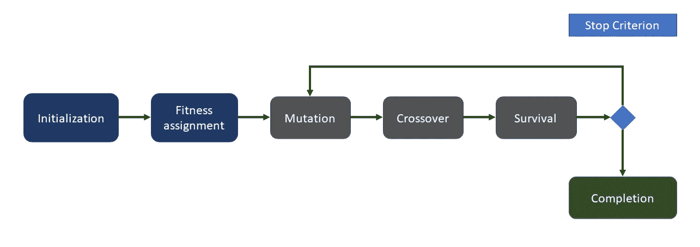
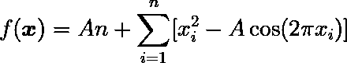
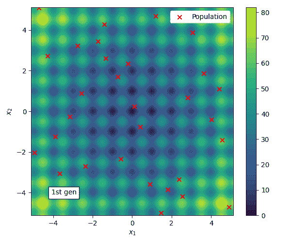
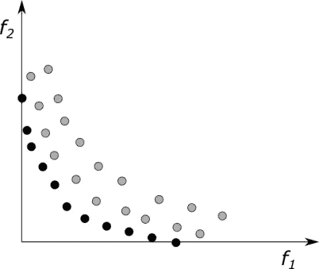
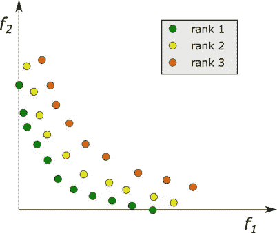
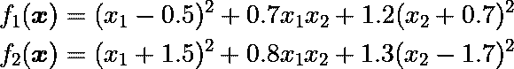
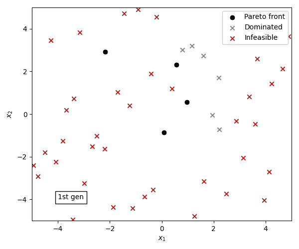
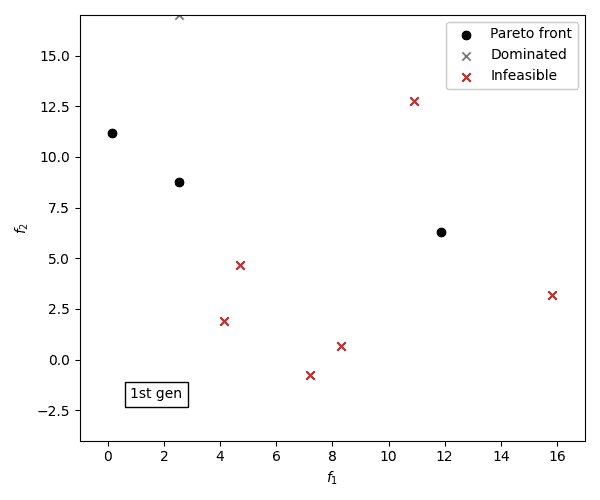
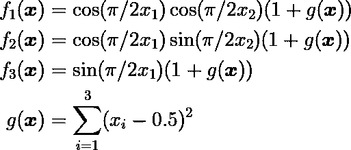
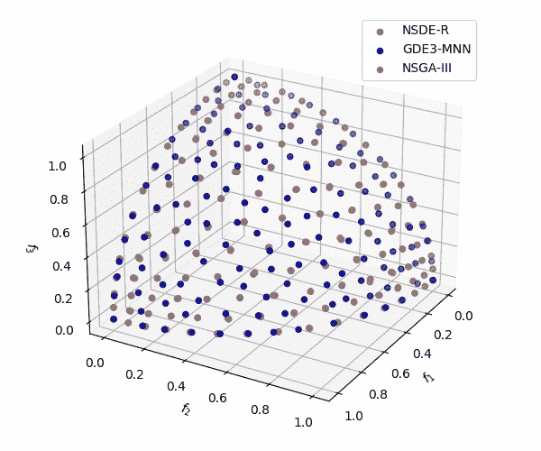

# pymoode:Python 中的差异进化

> 原文：<https://towardsdatascience.com/pymoode-differential-evolution-in-python-78e4221e5cbe>

## 用差分进化算法求解单目标和多目标优化问题


照片由[布伦丹·丘奇](https://unsplash.com/@bdchu614?utm_source=medium&utm_medium=referral)在 [Unsplash](https://unsplash.com?utm_source=medium&utm_medium=referral) 上拍摄

差分进化(DE) (Storn & Price，1997)最初是为标量目标优化而设计的。然而，由于其简单的实现和高效的问题解决质量，DE 已经以不同的方式被修改来解决多目标优化问题。

在整篇文章中，我们将看到 Python 包 [*pymoode*](https://github.com/mooscaliaproject/pymoode) 中可用的算法和操作符，以及对单目标、多目标和多目标优化问题的应用。它在 PyPI 上可用，因此任何 Python 用户都可以用简单的命令行安装它:

```
pip install pymoode
```

该软件包是使用[*pymoo*](https://pymoo.org/)*基本结构(Blank & Deb，2020)编写的，它有效、易用，并在用户希望或需要时给予高度定制的余地。我强烈建议查看它的文档和可用特性。 [Julian Blank](https://medium.com/u/12b065b8160a?source=post_page-----78e4221e5cbe--------------------------------) 也写了这篇关于媒介的[伟大文章](/an-introduction-to-genetic-algorithms-the-concept-of-biological-evolution-in-optimization-fc96e78fa6db)，概述了*遗传算法*，其中他介绍了 *pymoo* 的一些特征。*

*接下来的部分将涵盖以下主题。*

1.  *[*pymoode* :算法和附加运算符](#f054)*
2.  *[DE:概述和控制参数](#f6d9)*
3.  *[在*pymoo*中定义问题](#4a06)*
4.  *[单目标 DE](#6e0d)*
5.  *[多目标优化简介](#ab33)*
6.  *[多目标算法:GDE3 和 NSDE](#2b40)*
7.  *[改进双目标问题的解决方案](#27ba)*
8.  *[多目标算法:NSDE-R 和 GDE3-MNN](#c5da)*
9.  *[应用和前景](#8bf5)*
10.  *[结论](#2cb7)*
11.  *[致谢](#7872)*
12.  *[参考文献](#6c06)*

*我希望你们都能好好阅读，并成功地将 *pymoode* 应用到你们的一些项目中！感兴趣的人可以跟随本 [*示例笔记本*](https://github.com/mooscaliaproject/pymoode/blob/main/notebooks/tutorial.ipynb) 了解所有实施步骤。该软件包也可以在 [GitHub](https://github.com/mooscaliaproject/pymoode) 上获得。*

*如果您不熟悉非线性编程或差分进化，我建议您阅读我以前的文章，以便更好地理解这里介绍的概念。*

*[](/nonlinear-programming-theory-and-applications-cfe127b6060c)  [](/differential-evolution-an-alternative-to-nonlinear-convex-optimization-690a123f3413)  

虽然以前我们追求的是一个单一的目标，但在这篇文章中，我们有许多方向可以同时遵循！

为了给读者提供不同部分的导航，每个部分的末尾都有一个“[返回目录](#929c)”链接，可以将页面滚动回目录列表。

# *pymoode* :算法和附加运算符

*pymoode* 的目的是提供 *pymoo* 中可用算法的扩展，重点关注差分进化变体。因此，这些算法将共享 DE 复制操作符之间的一些共同特征。此外，我还实现了一些 *survival* 操作符，这些操作符在 *pymoo* 中还没有，为用户提供了更多的选择。这些算法和操作符可能会被未来版本的 pymoo 所整合。

该软件包可以通过以下树结构进行总结:

```
pymoode
├───algorithms
│   ├───DE
│   ├───GDE3
│   ├───NSDE
│   └───NSDER
├───survival
│   ├───RankAndCrowding
│   └───ConstrRankAndCrowding
└───performance
    └───SpacingIndicator
```

可用的算法有:

*   **德**:Storn&Price(1997)提出的单目标问题的差分进化。还提供了后来实现的其他功能，如抖动、抖动、选择变量和交叉策略。详情见 Price 等人(2005 年)。
*   **NSDE** :非支配排序差分进化，一种多目标算法，将 DE 变异和交叉算子结合到 NSGA-II (Deb et al .，2002)生存中。
*   **GDE3** :广义差分进化 3，一种多目标算法，将 DE 变异和交叉算子结合到 NSGA-II 生存和混合型生存策略中。在该算法中，在通过多目标生存算子截断种群之前，个体可能在一对一的比较中被移除。它是由 Kukkonen，S. & Lampinen，J. (2005 年)提出的。具有 M-最近邻和 2-最近邻存活的变体也是可用的。
*   **NSDE-R** :基于参考方向的非支配排序差分进化(Reddy & Dulikravich，2019)。这是一种针对多目标问题的算法，是使用 NSGA-III (Deb & Jain，2014)生存策略的 NSDE 的扩展。

其他幸存运算符包括:

*   **RandAndCrowding** :实现 NSGA-II 等级和拥挤生存的灵活结构，具有拥挤度量和个体淘汰的不同选项。
*   **constrankandcrowding**:Kukkonen，s .和 Lampinen，J. (2005)提出的基于等级和拥挤的生存算子，具有特殊的约束处理方法。

可用的拥挤指标有:

*   **拥挤距离(*CD*’)**:由 Deb 等(2002)在 NSGA II 中提出。从 *pymoo* 导入。
*   **修剪拥挤距离(*PCD*)**:由 Kukkonen & Deb (2006a)提出，它递归地重新计算拥挤距离，从种群中移除个体以提高多样性。
*   ***M*-最近邻(*mnn*’)**:由 Kukkonen & Deb (2006b)在 GDE3 对多目标问题的扩展中提出，其中 *M* 对应目标的个数。
*   **2-最近邻( *2nn* ')** :也是 Kukkonen & Deb (2006b)提出的，是邻居个数为 2 的*M*-最近邻的变种。
*   **拥挤熵(*ce*’)**:王等(2009)在 MOSADE 提出。

[返回目录。](#929c)

# DE:概述和控制参数

DE 算法的基本结构如下图所示，接下来将描述在 *pymoode* 中实现的最重要的控制参数。要了解更多的细节，我推荐阅读我在[上一篇关于德的文章](/differential-evolution-an-alternative-to-nonlinear-convex-optimization-690a123f3413)和普莱斯等人的书(2005)。



差分进化算法的基本结构。(图片由作者提供)。

*   **pop_size** (int，可选):人口规模。
*   **采样**(采样，群体，或类数组，可选) *pymoo* 的采样策略。
*   **变体** (str，可选):差分进化策略。必须是格式为“去/选择/n/交叉”的字符串。默认为“DE/rand/1/bin”。
*   **CR** (浮点，可选):交叉参数。在范围[0，1]中定义。要加强突变，请使用更高的值。要控制收敛速度，请使用较低的值。
*   **F** (可迭代的 float 或 float，可选):比例因子或突变参数。在范围(0，2)中定义。为了加强探索，使用更高的值；而对于剥削，使用较低。
*   **gamma** (float，可选):抖动偏差参数。应该在范围(0，2)内。默认为 1e-4。
*   **变异**(变异，可选):交叉后 Pymoo 的变异算子。默认为无。
*   **de_repair** (callable 或 str):对问题边界外的突变载体的修复策略。所采用的策略基于 Price 等人(2005)。默认为“反弹”。
*   **生存**(生存，可选):Pymoo 的生存策略。应该在多目标算法中考虑。

在选择 DE 的控制参数时，我建议优先选择 *pop_size* 、 *variant* 、 *CR* 和 *F* (按先后顺序)。据文献报道，当使用非常小的群体规模时(Price 等人，2005 年)，抖动是有用的，在这种情况下，使用更高的*伽马值*可能是可取的。我发现它对于在帕累托前沿连接线性段的情况也是有用的。参数*突变*是指交叉后可能执行的 *pymoo* 突变。当使用强化剥削和精英主义的变体时，如 DE/best，使用*多项式突变*非常有用。

*de_repair* 参数选择问题边界外突变载体采用的修复策略。它可能作为一个*可调用的*或一个*字符串*被传递。目前的实施使用 Price 等人(2005 年)提出的替代方案。默认*反弹*策略将违反边界的变量设置为 DE 变异对应基向量与变量边界之间的随机值；*中间*，以类似的策略，将数值重置为两者之间的中间点。策略 *rand-init* 随机采样违反决策变量的问题边界之间的新值，这对于增强多样性是有用的，尽管它可能会破坏接近边界的解决方案的进展。

*生存*策略是对多目标变体有效的论点，而单目标 DE 使用经典的一对一替换。考虑到要解决的问题，选择适当的策略是至关重要的。对于双目标问题，推荐使用 *pymoode* 的 *RankAndCrowding* 生存，使用*crowding _ func*=*‘PCD’*，而对于多目标问题，优选使用*crowding _ func*=*‘mnn’*，或者将算法切换到 NSDE-R

在接下来的部分中，让我们动手使用 *pymoo 的*结构来解决问题。

[返回目录。](#929c)

# 在 *pymoo* 中定义问题

在 pymoo，中，有三种不同的方式来定义一个问题。这三者都创建了一个继承自*问题*类的实例。在[文档](https://pymoo.org/problems/definition.html)中对它们进行了如下描述:

*   [问题](https://pymoo.org/problems/definition.html#nb-problem-definition-vectorized):面向对象的定义实现了一个评估一组**解决方案的方法。**
*   [ElementwiseProblem](https://pymoo.org/problems/definition.html#nb-problem-definition-elementwise) :面向对象的定义，实现一次评估一个**单个**解决方案的函数。
*   [功能问题](https://pymoo.org/problems/definition.html#nb-problem-definition-functional):通过对每个目标和约束使用**功能**来定义问题。

```
from pymoo.core.problem import Problem, ElementwiseProblem
from pymoo.problems.functional import FunctionalProblem
```

在这一节中，我将使用三种可用的结构来展示解决同一个优化问题的不同方法。

第一个例子将基于 *Rastrigin* 函数的单目标优化问题。这是非凸优化中常见的单目标测试问题，因为它包含多个局部最优解。它由下面的等式描述。



拉斯特里金问题。(图片由作者提供)。

其中， *A* 是用户指定的参数(通常为 10)，而 *n* 是所使用的决策变量的数量。在我们的实现中，我们将使用两个决策变量。都将以-5.12 和 5.12 为界。

可能，定义问题最直观的方式是*函数*，代码如下。

```
# Defining the objective function
def rastrigin(x):
    return np.sum(x * x - \
        10 * np.cos(2 * np.pi * x)) \
            + 10 * np.size(x)

# Functional
functional_rastrigin = FunctionalProblem(
    n_var=2, objs=rastrigin,
    xl=np.full(2, -5.12), xu=np.full(2, 5.12),
    constr_ieq=[],
)
```

或者，同样的问题可以被定义为*基本问题* …

```
class ElementwiseRastrigin(ElementwiseProblem):

    def __init__(self):
        xl = np.full(2, -5.12)
        xu = np.full(2, 5.12)
        super().__init__(
            n_var=2, n_obj=1, n_constr=0,
            xl=xl, xu=xu)

    def _evaluate(self, x, out, *args, **kwargs):
        out["F"] = rastrigin(x)
```

…或者作为一个*问题*，定义为以矢量化的方式评估一组解决方案。

```
class Rastrigin(Problem):

    def __init__(self):
        xl = np.full(2, -5.12)
        xu = np.full(2, 5.12)
        super().__init__(
            n_var=2, n_obj=1, n_constr=0,
            xl=xl, xu=xu)

    def _evaluate(self, x, out, *args, **kwargs):
        out["F"] = np.sum(x * x - \
            10 * np.cos(2 * np.pi * x), axis=1) \
                + 10 * x.shape[1]
```

注意*问题*结构中的 ***x*** 是一个形状为( *N* ， *m* )的*种群*中决策变量对应的数组，其中 *N* 对应种群大小， *m* 对应决策变量的个数。

在下一节中，让我们使用单目标 de 的 *pymoode* 实现来解决这个问题。

[返回目录。](#929c)

# 单目标差分进化算法

为了解决 Rastrigin 问题，我们将首先导入一些有用的操作符。它们将是算法( *DE* )、*最小化*接口和单目标终止操作符(*defaultsingleobjecttermination*)。

```
from pymoode.algorithms import DE
from pymoo.optimize import minimize
from pymoo.termination.default import DefaultSingleObjectiveTermination
```

我们将如下实例化 DE 的第一个实现。

```
de = DE(pop_size=30, variant="DE/rand/1/bin", F=(0.3, 1.0), CR=0.5)
```

这是一个低维问题，尽管由于存在许多局部最优而具有挑战性。因此，我使用 30 作为种群大小 *N* 以确保全局收敛。选择 *DE* 变量作为最常用的 DE/rand/1/bin， *F* 参数为(0.3，1.0)，使用随机均匀分布抖动， *CR* 参数为 0.5，以加强坐标轴上的搜索并控制收敛。

对于这个问题，我在调整控制参数方面做得不多。因此，其他组合可能更有效。对 *DE* 的工作原理感兴趣的，建议看一下我的[上一篇文章](/differential-evolution-an-alternative-to-nonlinear-convex-optimization-690a123f3413)，里面我有详细的描述。

接下来，让我们根据 *f* ( *f_tol* )、***x***(*x _ tol*)、约束违反( *cv_tol* )和最大代数( *n_max_gen* )的变化来定义终止标准。参数*n _ gen*控制检查标准的频率，参数 *n_last* 控制评估变更时考虑多少个前几代。

```
termination_single = DefaultSingleObjectiveTermination(
    xtol=1e-8,
    cvtol=0.0,
    ftol=1e-8,
    period=20,
    n_max_gen=200
)
```

现在，让我们使用*最小化*接口来解决这个问题。

```
res_de_rastrigin = minimize(
    Rastrigin(),
    de,
    termination=termination_single,
    seed=12,
    save_history=True,
    verbose=False,
)
```

该算法是有效的，并引导我们找到了函数的全局最优解，该函数是一个在 ***x*** 中为零的向量，目标函数也为零。

因为我已经将参数 *save_history* 指定为 True，所以我可以访问各代的人口属性，我们可以创建如下所示的惊人视觉效果。



拉斯特里金问题中种群的世代进化。(作者动画)。

在创建它的时候，我使用了 [*pyrecorder*](https://medium.com/@julian.blank/animations-in-matplotlib-no-need-to-struggle-42130f915c13) 库，也是由 [Julian Blank](https://medium.com/u/12b065b8160a?source=post_page-----78e4221e5cbe--------------------------------) 开发的。

[返回目录。](#929c)

# 多目标优化简介

> 顾名思义，多目标优化涉及同时优化多个目标。当目标相互冲突时，即一个目标函数的最优解不同于另一个目标函数的最优解时，问题变得具有挑战性。在解决此类问题时，无论是否存在约束，这些问题都会产生一组折衷最优解，通常称为 Pareto 最优解。由于解决方案的多样性，建议使用进化算法来适当解决这些问题，该算法在其搜索过程中使用群体方法(Deb，2011)。

使用*支配*的概念可以理解*帕累托最优*解。它们是在给定群体中不受任何其他因素支配的解决方案。

根据 Deb (2001)，如果满足以下条件，一个解 *x1* 优于另一个解 *x2* :

*   *x1* 在所有目标上不比 *x2* 差。
*   *x1* 至少在一个目标上比 *x2* 强。

已经提出了几种处理约束的想法。一种常用的方法是 Deb 等人(2002)在 NSGA II 中采用的方法，其中可行的解决方案总是比不可行的好，不可行的解决方案按照整体约束违反情况进行排序。

双目标最小化问题的帕累托最优解如下所示。



帕累托最优解。(图片由作者提供)。

生存算子必须强调好的解决方案而不是坏的解决方案。在现代多目标算法中，*非支配排序*(或类似操作)几乎总是存在，它根据支配标准将每个解决方案归入一个*等级*。等级从最好到最差的解决方案按升序排列，通常是第一生存标准。



非支配排序和等级。(图片由作者提供)。

当超过种群规模时，具有相同等级的个体通过几种策略进行排序，其中两种常见的策略是 NSGA-II 中的*拥挤距离*(Deb 等人，2002 年)和 NSGA-III 中的*参考方向*(Deb&Jain，2014 年)。

在 *pymoode* 算法中，默认情况下，GDE3 和 NSDE 使用与 NSGA-II 相同的生存策略，而 NSDE-R 使用与 NSGA-III 相同的策略。

在下一节中，我们将使用 GDE3、NSDE 和 NSGA-II 解决一个多目标问题(在 *pymoo* 中实现)。

[返回目录。](#929c)

# 多目标算法:GDE3 和 NSDE

GDE3 和 NSDE 是 DE 的两个多目标变体，在*生存*阶段使用*非支配排序*和*拥挤度量*。它们共享相同的繁殖算子，尽管它们的生存策略不同。

NSDE 使用完全(+ *λ* )生存策略，将双亲群体与后代结合起来，而 GDE3 在将群体截断成原始大小之前，在双亲群体中的每个成员与其相应的试验向量之间进行一对一的比较。在这种*一对一*的比较中，每对个体中的一个可能会在(+ *λ* )存活之前被另一个提前从组合群体中移除。

对于大多数问题，GDE3 和 NSDE 将导致非常相似的结果。NSDE 在某些问题上可能会稍微快一点，而 GDE3 在使用低 *CR* 值时可能会更好地避免过早收敛。

让我们导入本节中使用的操作符。

```
# Algorithms
from pymoode.algorithms import GDE3
from pymoode.algorithms import NSDE
from pymoo.algorithms.moo.nsga2 import NSGA2

# Termination
from pymoo.termination.default import DefaultMultiObjectiveTermination
```

在这个例子中，我将引入两个冲突的凸目标，这些目标由于约束而增加了难度。该问题将被定义在两个决策变量 *x1* 和 *x2* 上，它们都被-5.0 和 5.0 所限制。



多目标示例的目标函数。(图片由作者提供)。


多目标示例的约束函数。(图片由作者提供)。

在 Python 代码中，使用了 *pymoo* 问题*结构。*

```
class TwoObjExample(Problem):

    def __init__(self):
        xl = np.full(2, -5.0)
        xu = np.full(2, 5.0)
        super().__init__(n_var=2, n_obj=2, n_ieq_constr=2, xl=xl, xu=xu)

    def _evaluate(self, x, out, *args, **kwargs):

        F1 = (x[:, 0] - 0.5) ** 2 + 0.7 * x[:, 0] * \
            x[:, 1] + 1.2 * (x[:, 1] + 0.7) ** 2

        F2 = 1.1 * (x[:, 0] + 1.5) ** 2 + 0.8 * x[:, 0] * \
            x[:, 1] + 1.3 * (x[:, 1] - 1.7) ** 2

        out["F"] = np.column_stack([F1, F2])

        G1 = x[:, 0] ** 2 + (x[:, 1] - 1) ** 2 - 9
        G2 = - (x[:, 0] + 0.5) ** 2 - (x[:, 1] - 1) ** 2 + 2
        out["G"] = np.column_stack([G1, G2])
```

然后，让我们定义停止标准。由于这是一个多目标问题，所以 *f* 和**x的区别就不那么直观了。在 *pymoo* 中， *IGD* 度量用于评估两个不同代之间 ***f*** 和 ***x*** 的差异。这个定义只是为了说明*defaultmultiobjectterminationoperator*的工作方式。**

```
termination_multi = DefaultMultiObjectiveTermination(
    xtol=1e-8,
    cvtol=1e-8,
    ftol=1e-8,
    period=50,
    n_max_gen=200
)
```

在解决这个问题时，除了 GDE3 和 NSDE，我们将使用 *pymoo* 中的 NSGA-II 的实现。再说一次，我还没有调整 DE 算法的控制参数。因此，他们可能已经得到改善。在 NSGA-II 中，采用了默认的*模拟二进制交叉*和*多项式变异*的控制参数，隐含为可选的关键字参数。

```
gde3 = GDE3(pop_size=50, variant="DE/rand/1/bin",\
    F=(0.0, 1.0), CR=0.7)

nsde = NSDE(pop_size=50, variant="DE/rand/1/bin",\
    F=(0.0, 1.0), CR=0.7)

nsga2 = NSGA2(pop_size=30)
```

一旦我们定义了算法和问题，让我们使用*最小化*接口来解决它。

```
res_gde3_problem_2 = minimize(
    TwoObjExample(),
    gde3,
    termination_multi,
    seed=12,
    save_history=True,
    verbose=False,
)
```

所有算法的过程都是一样的，只是改变了传递给*的第二个参数，使*最小化。因此，我将省略其他实现。

可以使用几个度量来比较多目标问题中的性能。一些最常见的是*世代距离*、*反向世代距离*和*超级卷*。它们都是在 *pymoo* 中用[例子](https://pymoo.org/misc/indicators.html)实现的。由于在这个问题中*真实波前*是先验未知的，我只使用了*超体积*来比较算法性能。

完整的实施可在 [*示例笔记本*](https://github.com/mooscaliaproject/pymoode/blob/main/notebooks/tutorial.ipynb) 中找到，主要结果总结如下。

```
hv GDE3 0.753470843848252
hv NSDE 0.752272658484699
hv NSGA-II 0.7527205037080124
```

这三种算法表现出非常相似的性能，尽管 GDE3 略胜一筹。或许，在几次独立的运行中，这不会呈现出统计学意义。

为了说明进化的过程，我使用 GDE3 解决方案的 *pyrecorder* 创建了一些简短的动画。前 70 代在决策变量和目标空间中都有说明。



基于 GDE3 的多目标实例在决策空间中的进化过程。(作者动画)。



基于 GDE3 的多目标实例在目标空间中的演化过程。(作者动画)。

[返回目录。](#929c)

# 改进双目标问题的解决方案

虽然前一部分的结果很好，但是 *Pareto 前沿*可以更平滑，元素的分布也可以更均匀。这是由于与 NSGA-II 中提出的原始策略相比，*等级和拥挤*生存的其他变体的优越性能。为了在生存阶段给用户提供更多的选择， *RankAndCrowding* 类已经在 *pymoode* 中实现。

为提高多样性而采用的相关策略是递归地消除个体并重新计算拥挤度量，而不是基于整个前沿的拥挤度量从超过群体大小的最后一个前沿立即消除所有个体。Kukkonen & Deb (2006a)对修改后的策略进行了深入分析。

为了使用 Kukkonen & Deb (2006a)的剪枝策略，我们必须在 RankAndCrowding 算子中选择不同的拥挤函数。在 *pymoode* 中，表示为*【PCD】*，代表“修剪拥挤距离”。由于 Cython 的实施，它的速度与原来的运营商一样快。

就目前而言，可以执行如下。

```
# Import survival operator
from pymoode.survival import RankAndCrowding

# Instantiate it with respective elimination rule and crowding metric
pruning_survival = RankAndCrowding(crowding_func="pcd")

# Pass it in the survival argument of the algorithm
gde3_ps = GDE3(pop_size=50, variant="DE/rand/1/bin", F=(0.0, 1.0),
               CR=0.7, survival=pruning_survival)
```

这产生了比原始拥挤距离算法更均匀的解分布。


GDE3 中修剪拥挤距离与原始拥挤距离的比较。(图片由作者提供)。

为了评估帕累托前沿元素的分布情况，可以使用*间距*指示器，该指示器在 *pymoode* 中实现。该指标的值越小，要素在帕累托前沿的分布越均匀。

```
from pymoode.performance import SpacingIndicator

ideal = np.vstack(
    (res_gde3_problem_2.F, res_gde3_ps_problem_2.F)
).min(axis=0) - 1e-3

nadir= np.vstack(
    (res_gde3_problem_2.F, res_gde3_ps_problem_2.F)
).max(axis=0) + 1e-3

sp_p2 = SpacingIndicator(
    zero_to_one=True, ideal=ideal, nadir=nadir
)

print("SP GDE3", sp_p2.do(res_gde3_problem_2.F))
print("SP GDE3-PS", sp_p2.do(res_gde3_ps_problem_2.F))
```

它返回:

```
SP GDE3 0.012024880243150753
SP GDE3-PS 0.004881671664926163
```

现在提供了一个定量的度量标准来衡量由于采用了修改的剪枝解决方案策略而带来的分布上的改进。

[返回目录。](#929c)

# 多目标算法:NSDE-R 和 GDE3-MNN

由于 GDE3 和 NSDE 最初是使用 NSGA-II 等级和拥挤生存设计的，它们在许多目标问题上表现不佳。然而，从用户的角度来看，简单的修改就可以解决这个问题。

NSDE-R (Reddy & Dulikravich，2019)结合了 NSGA-III 的生存算子和 DE 的繁殖算子，在多目标问题中表现出色。GDE3-MNN 是由 Kukkonen 和 Deb (2006b)提出的 GDE3 的变体，其用具有递归消除和重新计算的基于 *M* 最近邻的拥挤度量代替了*等级和拥挤*生存的原始拥挤距离。它大大提高了 GDE3 在多目标问题上的性能。

特别是在多目标问题中，由于目标空间的稀疏性，当使用相同的生存策略时，NSDE 和 GDE3 会产生比*双目标*问题更加相似的结果。因此，在本节中，将只实现每种方法的一种变体。

除了 DE 算法，我们还将实现 NSGA-III，这是多目标优化中最成功的算法之一。

让我们导入新的运算符。

```
# Algorithms
from pymoode.algorithms import NSDER, GDE3
from pymoo.algorithms.moo.nsga3 import NSGA3

# Interface to obtain reference direction
from pymoo.util.ref_dirs import get_reference_directions
```

在这个例子中，我将使用 *get_problem* 接口导入一个在 *pymoo* 中实现的多目标问题。它将是 [DTLZ2](https://pymoo.org/problems/many/dtlz.html#DTLZ2) ，其中 ***x*** 中的每个组件都被定义在范围[0，1]中，并且没有函数约束。这些目标由下面的等式描述。



DTLZ2 问题的目标函数。(图片由作者提供)。

让我们举例说明本节中使用的算法。注意参考方向是 NSDE-R 和 NSGA-III 的必选项。幸运的是， *pymoo* 有一个接口可以轻松获得通常的方向。此外，请注意，在 GDE3 中， *RankAndCrowding* 运算符与*crowding _ func*=*' mnn '*一起使用，后者使用前面提到的 *M* -NN 策略。或者，我们可以只导入 *GDE3MNN* 类。

```
# Define the reference directions
ref_dirs = get_reference_directions(
    "das-dennis", 3, n_partitions=15)

# Suggestion for NSGA-III
popsize = ref_dirs.shape[0] + ref_dirs.shape[0] % 4

nsder = NSDER(ref_dirs, pop_size=popsize,
    variant="DE/rand/1/bin", F=(0.0, 1.0), CR=0.5)

gde3mnn = GDE3(pop_size=popsize,
    variant="DE/rand/1/bin", F=(0.0, 1.0), CR=0.2,
    survival=RankAndCrowding(crowding_func="mnn"))

nsga3 = NSGA3(ref_dirs, pop_size=popsize)
```

在这一节中，我将采用一个简化的终止准则(' n_gen '，250)，仅基于世代数，这对于多目标问题是常见的。

```
res_nsder_problem_3 = minimize(
    get_problem("dtlz2"),
    nsder,
    ('n_gen', 250),
    seed=SEED,
    save_history=True,
    verbose=True,
)
```

在这个问题上，NSGA-III 比差分进化算法产生了更接近参考点的解，尽管差分进化算法的性能也很好。

通过完成算法获得的帕累托前沿显示在下面的动画中。



在 DTLZ2 中获得的 Pareto 前沿。(作者动画)。

太好了！现在我们已经完成了 pymoode 中的操作符，解决了几个不同的问题。

[返回目录。](#929c)

# 应用和前景

多目标进化算法已经应用于许多不同的领域，包括投资组合优化(赵等，2020)，电厂运行(王等，2014)，供水系统(Monsef 等，2019)，以及网络控制(Gonç alves 等，2022)。此外，工程过程设计和控制有许多应用，作为一名化学工程师，这就是我开始的地方。

我第一次遇到多目标进化算法是在为我的第一篇文章[苯乙烯反应器](https://doi.org/10.1016/j.ces.2021.116805)的模拟和优化做文献综述(Leite 等人，2021)。Yee 等人(2003)使用 Srinivas & Deb (1994)的原始 NSGA 算法对该问题进行了首次应用。它产生了很大的结果，后来激发了 Tarafader 等人(2005)的研究，除了增加问题公式化的复杂性以在目标中加入更多的过程外，还采用了更有效的算法:NSGA-II (Deb 等人，2002)。Babu 等人(2005 年)和 Gujarathi & Babu (2010 年)也提出了一种解决苯乙烯反应器问题的多目标差分进化方法。

我发现看到算法在过去几十年中是如何改进并提供给用户的令人惊讶。包 *pymoode* 开始试图通过进化方法优化复杂的反应堆模拟模型，但现在我相信它已经变得更好，因为它为任何 Python 用户提供了一些迄今为止提出的最有效的差分进化算法和工具。

当我现在更新这篇中型文章时，开发了 *pymoode* 的关于苯乙烯反应器的多目标优化的主要研究论文以标题 [*使用广义差分进化的绝热苯乙烯反应器的多目标优化 3(GD E3)*](https://doi.org/10.1016/j.ces.2022.118196)*(Leite 等人，2023)发表。如果出于学术目的使用 *pymoode* ，请相应引用。*

*[返回目录。](#929c)*

# *结论*

*在本文中，Python 包 [*pymoode*](https://github.com/mooscaliaproject/pymoode) 提供了解决单目标、多目标和多目标问题的教程。该软件包是对专注于差分进化算法的[*pymoo*](https://pymoo.org/)*的扩展，具有各种各样的操作符，可确保出色的性能并允许高度定制。用于生成本文的所有代码都可以在 [Github](https://github.com/mooscaliaproject/pymoode/blob/main/notebooks/tutorial.ipynb) 上获得。*py mood*的新功能可能会在以后被 *pymoo* 整合。**

# **承认**

**朱利安·布兰克，他创造了*皮穆*的惊人结构，使得这样一个项目成为可能。**

**感谢[小埃斯利·费雷拉·达·科斯塔](https://medium.com/u/faa75a9d06fc?source=post_page-----78e4221e5cbe--------------------------------)，是他让这一切成为可能。**

# **参考**

**Babu，B. V .，Chakole，P. G .和 Mubeen，J. H. S .，2005 年。绝热苯乙烯反应器优化的多目标差分进化算法。*化学。英语。Sci。，*第 60 卷，第 4822–4837 页。**

**Blank，j .和 Deb，k .，2020 年。pymoo:Python 中的多目标优化。 *IEEE 访问，*第 8 卷，第 89497–89509 页。**

**k . deb，2001 年。*采用进化算法的多目标优化。*1 版。奇切斯特:约翰·威利的儿子们。**

**k . deb，2004 年。工程优化遗传算法导论。载于:G. C. Onwubolu 和 b .诉 Babu，编辑。模糊性和软计算工程研究中的新优化技术，第 141 卷。海德堡:施普林格出版社，柏林海德堡，第 13-51 页。**

**黛比，k，2011。使用进化算法的多目标优化:导论。产品设计和制造的多目标进化优化。伦敦:施普林格出版社，第 3-34 页。**

**Deb，k .和 Jain，h .，2014 年。使用基于参考点的非支配排序方法的进化多目标优化算法，第一部分:解决带盒约束的问题。 *IEEE 进化计算汇刊，* 18(4)，第 577–601 页。**

**戴布，k，普拉塔普，a，阿加瓦尔，s &梅亚利万，交通运输管理，2002 年。一种快速的精英多目标遗传算法:NSGA-II。 *IEEE 进化计算汇刊，* 6(2)，第 182–197 页。**

**贡萨尔维斯，E. N .，贝洛，M. A. R .和巴蒂斯塔，A. P .，2022。网络控制系统中优化网络使用的具有优先前沿精英策略的自适应多目标差分进化算法。应用软件计算。，第 114 卷，第 108112 页。**

**古吉拉特邦，A. M .和 Babu，B. V .，2010 年。工业苯乙烯反应器的多目标优化:绝热和伪等温操作。*化学。英语。Sci。，*第 65 卷，第 2009–2026 页。**

**Kukkonen，s .和 Deb，k .，2006 年 a。*基于拥挤距离的双目标优化问题非支配解的改进剪枝。温哥华，南北卡罗来纳州，第 1179-1186 页。***

**Kukkonen，s .和 Deb，k .，2006 年 b。一种快速有效的多目标问题非支配解剪枝方法。In: *来自自然的并行问题求解——PPSN 九世。柏林:施普林格出版社，第 553-562 页。***

**Kukkonen，s .和 Lampinen，j .，2005 年。GDE3:广义差分进化的第三步进化。2005 年 IEEE 进化计算大会，第 1 卷，第 443-450 页。**

**莱特，b，科斯塔，A. O. S .和科斯塔少年，E. F .，2021。基于非均相动力学模型的乙苯脱氢轴向流和径向流反应器的模拟与优化。*化学。英语。Sci。，*第 244 卷，第 116805 条。**

**莱特，b，科斯塔，A. O. S .，科斯塔，E. F .，2023。基于广义差分进化算法 3 的绝热苯乙烯反应器多目标优化。化学。英语。Sci。，第 265 卷，第 118196 条。**

**Monsef，h .，Naghashzadegan，m .，Jamali，A. & Farmani，r .，2019 年。给水管网优化设计中进化多目标优化算法的比较。 *Ain Shams 工程杂志，*第 10 卷，第 103–111 页。**

**普莱斯，K. V .，Storn，R. M .和 Lampinen，J. A .，2005 年。差分进化:一种实用的全局优化方法。第一版。柏林。**

**Reddy，S. R .和 Dulikravich，G. S .，2019 年。基于参考点的多目标差分进化优化:NSDE-R. *Struct。多碟。Optim。，*第 60 卷，第 1473—1455 页。**

**斯里尼瓦斯，n .和德布，k .，1994 年。遗传算法中使用非支配排序的多目标优化。*进化计算，* 2(3)，第 221–248 页。**

**storn r .和 Price k .，1997 年。差分进化——连续空间全局优化的简单有效的启发式算法。*全球 j。Optim。，*第 11 卷第 4 期，第 359—341 页。**

**Tarafder，a .，Rangaiah，g .和 Ray，A. K .，2005 年。工业苯乙烯单体生产过程的多目标优化。*化学。英语。Sci。，*第 60 卷第 2 期，第 363—347 页。**

**王等，2014。基于差分进化的燃煤电厂多目标优化。*应用能量，*第 115 卷，第 254–264 页。**

**王燕宁，吴，李良宏，袁晓峰，2010。基于精英保留和拥挤熵多样性测度的多目标自适应差分进化。*软计算。，*第 14 卷第 3 期，第 209—193 页。**

**易，雷，兰盖亚，2003。工业苯乙烯反应器的多目标优化。计算机。化学。英语。，第 27 卷第 1 期，第 130—111 页。**

**赵平，高，杨，倪，2020。基于 MOEA/D 的多目标投资组合优化问题求解 *2020 年第 12 届高级计算智能国际会议(ICACI)*第 30–37 页。***